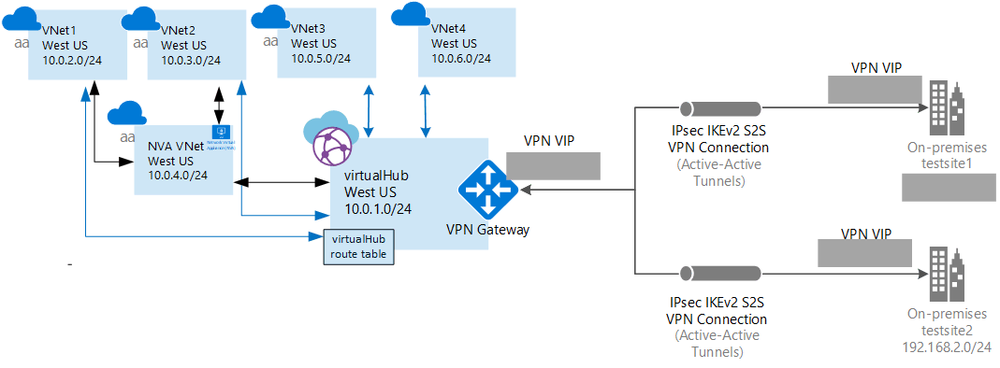

# Tutorial: Create a Virtual Hub Route table to steer traffic to a Network Virtual Appliance

This tutorial shows you how to steer traffic from a Virtual Hub to a Network Virtual Appliance. 

In this tutorial, you learn how to:

> [!div class="checklist"]
> * Create a WAN
> * Create a site
> * Create a hub
> * Connect a hub to a site
> * Connect a VNet to a hub
> * Download and apply the VPN device configuration
> * View your virtual WAN
> * View resource health
> * Monitor a connection

## Before you begin

Verify that you have met the following criteria:

1. A Network Virtual Appliance (NVA) is a third-party software of your choice that is typically provisioned from Azure Marketplace (Link) in a Virtual Network.
2. A private IP assigned to the NVA network interface. 
3. NVA cannot be deployed in the Virtual Hub, so we will expect it to be deployed in a separate VNet. For the purpose of this discussion, lets call this VNet the ‘DMZ VNet’
4. The ‘DMZ VNet’ may have one or many virtual networks connected to it. For the purpose of this discussion, we will call this virtual network as the ‘Indirect spoke VNet’. These VNet can be connected to the DMZ VNet using VNet peering.
5. Ensure there are no Virtual Network Gateways in any VNets.



## <a name="signin"></a>1. Sign in

Make sure you install the latest version of the Resource Manager PowerShell cmdlets. For more information about installing PowerShell cmdlets, see [How to install and configure Azure PowerShell](/powershell/azure/overview). This is important because earlier versions of the cmdlets do not contain the current values that you need for this exercise.

1. Open your PowerShell console with elevated privileges, and sign in to your Azure account. This cmdlet prompts you for the sign in credentials. After signing in, it downloads your account settings so that they are available to Azure PowerShell.

  ```powershell
  Connect-AzureRmAccount
  ```
2. Get a list of your Azure subscriptions.

  ```powershell
  Get-AzureRmSubscription
  ```
3. Specify the subscription that you want to use.

  ```powershell
  Select-AzureRmSubscription -SubscriptionName "Name of subscription"
  ```

## <a name="rg"></a>2. Create resources

1. Create a resource group.

  ```powershell
  New-AzureRmResourceGroup -Location "West US" -Name "testRG"
  ```
2. Create a virtual WAN.

  ```powershell
  $virtualWan = New-AzureRmVirtualWan -ResourceGroupName "testRG" -Name "myVirtualWAN" -Location "West US"
  ```
3. Create a virtual hub.

  ```powershell
  New-AzureRmVirtualHub -VirtualWan $virtualWan -ResourceGroupName "testRG" -Name "westushub" -AddressPrefix "10.0.1.0/24"
  ```

## <a name="connections"></a>3. Create connections

Create Hub Virtual Network Connections from Indirect Spoke VNet and the DMZ VNet to the Virtual Hub.

  ```powershell
  $remoteVirtualNetwork1= Get-AzureRmVirtualNetwork -Name “indirectspoke1” -ResourceGroupName “testRG”
  $remoteVirtualNetwork2= Get-AzureRmVirtualNetwork -Name “indirectspoke2” -ResourceGroupName “testRG”
  $remoteVirtualNetwork3= Get-AzureRmVirtualNetwork -Name “dmzvnet” -ResourceGroupName “testRG”

  New-AzureRmVirtualHubVnetConnection -ResourceGroupName “testRG” -VirtualHubName “westushub” -Name  “testvnetconnection1” -RemoteVirtualNetwork $remoteVirtualNetwork1
  New-AzureRmVirtualHubVnetConnection -ResourceGroupName “testRG” -VirtualHubName “westushub” -Name  “testvnetconnection2” -RemoteVirtualNetwork $remoteVirtualNetwork2
  New-AzureRmVirtualHubVnetConnection -ResourceGroupName “testRG” -VirtualHubName “westushub” -Name  “testvnetconnection3” -RemoteVirtualNetwork $remoteVirtualNetwork3
  ```

## <a name="route"></a>4. Create a virtual hub route

We will assume Indirect Spoke VNet address spaces are 10.0.2.0/24 and 10.0.3.0/24, and the DMZ NVA network interface private IP address is 10.0.4.5.

```powershell
$route1 = New-AzureRmVirtualHubRoute -AddressPrefix @("10.0.2.0/24", "10.0.3.0/24") -NextHopIpAddress "10.0.4.5"
```

## <a name="applyroute"></a>5. Create a virtual hub route table

Create a virtual hub route table and apply the created route to it.
 
```powershell
$routeTable = New-AzureRmVirtualHubRouteTable -Route @($route1)
```

## <a name="commit"></a>6. Commit the changes

Commit the changes into the virtual hub.

```powershell
Set-AzureRmVirtualHub -VirtualWanId $virtualWan.Id -ResourceGroupName "testRG" -Name "westushub” -RouteTable $routeTable
```

## <a name="cleanup"></a>Clean up resources

When you no longer need these resources, you can use [Remove-AzureRmResourceGroup](/powershell/module/azurerm.resources/remove-azurermresourcegroup) to remove the resource group and all of the resources it contains. Replace "myResourceGroup" with the name of your resource group and run the following PowerShell command:

```azurepowershell-interactive
Remove-AzureRmResourceGroup -Name myResourceGroup -Force
```

## Next steps

In this tutorial, you learned how to:

> [!div class="checklist"]
> * Create a WAN
> * Create a site
> * Create a hub
> * Connect a hub to a site
> * Connect a VNet to a hub
> * Download and apply the VPN device configuration
> * View your virtual WAN
> * View resource health
> * Monitor a connection

To learn more about Virtual WAN, see the [Virtual WAN Overview](virtual-wan-about.md) page.
