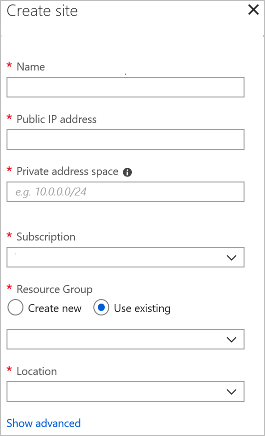
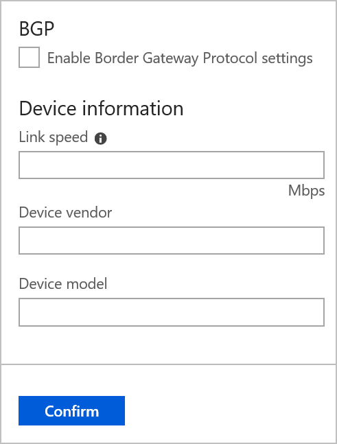

# Tutorial: Create a Site-to-Site connection using Azure Virtual WAN (Preview)

This tutorial shows you how to use Virtual WAN to connect to your resources in Azure over an IPsec/IKE (IKEv2) VPN connection. This type of connection requires a VPN device located on-premises that has an externally facing public IP address assigned to it. For more information about Virtual WAN, see the [Virtual WAN Overview](virtual-wan-about.md)

> [!NOTE]
> If you have many sites, you typically would use a [Virtual WAN partner](https://aka.ms/virtualwan) to create this configuration. However, you can create this configuration yourself if you are comfortable with networking and proficient at configuring your own VPN device.
>


In this tutorial, you learn how to:

> [!div class="checklist"]
> * Create a WAN
> * Create a site
> * Create a hub
> * Connect a hub to a site
> * Connect a VNet to a hub
> * Download and apply the VPN device configuration
> * View your virtual WAN
> * View resource health
> * Monitor a connection

> [!IMPORTANT]
> Azure Virtual WAN is currently a managed public preview. To use Virtual WAN, you must [Enroll in the Preview](#enroll).
>
> This public preview is provided without a service level agreement and should not be used for production workloads. Certain features may not be supported, may have constrained capabilities, or may not be available in all Azure locations. See the [Supplemental Terms of Use for Microsoft Azure Previews](https://azure.microsoft.com/support/legal/preview-supplemental-terms/) for details.

## Before you begin

Verify that you have met the following criteria before beginning your configuration:

* Make sure you have a compatible route-based VPN device that can use IKEv2, and someone who is able to configure it. If you are working with a Virtual WAN partner, the configuration settings are created automatically, and you would not need to worry about knowing how to configure the device manually.
* Verify that you have an externally facing public IPv4 address for your VPN device. This IP address cannot be located behind a NAT.
* If you already have a virtual network that you want to connect to, verify that none of the subnets of your on-premises network overlap with the virtual networks that you want to connect to. Your virtual network does not require a gateway subnet and cannot have any virtual network gateways. If you do not have a virtual network, you can create one using the steps in this article.
* Obtain an IP address range for your hub region. The hub is a virtual network and the address range that you specify for the hub region cannot overlap with any of your existing virtual networks that you connect to. It also cannot overlap with your address ranges that you connect to on premises. If you are unfamiliar with the IP address ranges located in your on-premises network configuration, you need to coordinate with someone who can provide those details for you.
* If you don't have an Azure subscription, create a [free account](https://azure.microsoft.com/free/?WT.mc_id=A261C142F) before you begin.

## <a name="enroll"></a>1. Enroll in the Preview

Before you can configure Virtual WAN, you must first enroll your subscription in the Preview. Otherwise, you will not be able to work with Virtual WAN in the portal. To enroll, send an email to **azurevirtualwan@microsoft.com** with your subscription ID. You will receive an email back once your subscription has been enrolled.

## <a name="vnet"></a>2. Create a virtual network

If you do not already have a VNet, you can quickly create one using PowerShell. You can also create a virtual network using the Azure portal.

* Be sure to verify that the address space for the VNet that you create does not overlap with any of the address ranges for other VNets that you want to connect to, or with your on-premises network address spaces. 
* If you already have a VNet, verify that it meets the required criteria and does not have a virtual network gateway.

You can easily create your VNet by clicking "Try It" in this article to open a PowerShell console. Adjust the values, then copy and paste the commands into the console window.

### Create a resource group

Adjust the PowerShell commands, then create a resource group.

```azurepowershell-interactive
New-AzureRmResourceGroup -ResourceGroupName WANTestRG -Location WestUS
```

### Create a VNet

Adjust the PowerShell commands to create the VNet that is compatible for your environment.

```azurepowershell-interactive
$fesub1 = New-AzureRmVirtualNetworkSubnetConfig -Name FrontEnd -AddressPrefix "10.1.0.0/24"
$vnet   = New-AzureRmVirtualNetwork `
            -Name WANVNet1 `
            -ResourceGroupName WANTestRG `
            -Location WestUS `
            -AddressPrefix "10.1.0.0/16" `
            -Subnet $fesub1
```

## <a name="wan"></a>3. Create a virtual WAN

1. From a browser, navigate to the [Azure portal](https://portal.azure.com) and sign in with your Azure account.
2. At this time, you can find Virtual WAN by navigating to **All services** and searching for Virtual WAN. Or, you can search for Virtual WAN in the search box at the top of the Azure portal. Click **Virtual WAN** to open the page.
3. Click **Create** to open the **Create WAN** page. If the page is not available, you have not yet been approved for this Preview.

  
4. On the Create WAN page, fill in the following fields.

  * **Name** - Select the Name that you want to call your WAN.
  * **Subscription** - Select the subscription that you want to use.
  * **Resource Group** - Create new or use existing.
  * **Resource Location** - Choose a resource location from the dropdown. A WAN is a global resource and does not live in a particular region. However, you must select a region in order to more easily manage and locate the WAN resource that you create.
5. Click **Create** to create the WAN.

## <a name="site"></a>4. Create a site

Create as many sites as you need that correspond to your physical locations. For example, if you have a branch office in NY, a branch office in London, and a branch office and LA, you'd create three separate sites. These sites contain your on-premises VPN device endpoints. At this time, you can specify only one private address space for your site.

1. Navigate to **All resources**.
2. Click the virtual WAN that you created.
3. Click **+Create site** at the top of the page to open the **Create site** page.

  
4. On the **Create site** page, fill in the following fields:

  *  **Name** - This is the name by which you want to refer to your on-premises site.
  *  **Public IP address** - This is the public IP address of the VPN device that resides on your on-premises site.
  *  **Private address space** - This is the IP address space that is located on your on-premises site. Traffic destined for this address space is routed to your local site.
  *  **Subscription** - Verify the subscription.
  *  **Resource Group** - The resource group you want to use.
5. Click **Show advanced** to view additional settings. You can **enable BGP** (optional field, which will enable this functionality on all connections created for this site in Azure. You can also enter **Device information** (optional field). This can help the Azure Team better understand your environment to add additional optimization possibilities in the future, or to help you troubleshoot.

  
6. Click **Confirm** to create the site.
7. Repeat these steps for each site that you want to create.

## <a name="hub"></a>5. Create a hub and connect sites

1. On the page for your virtual WAN, click **Sites**.
2. Under **Unassociated sites**, you see a list of sites that haven't yet been connected to a hub.
3. Select the sites that you want to associate.
4. From the dropdown, select the region that your hub will be associated with. You should associate your hub to the region where the VNets that you want to connect to reside.
5. Click **Confirm**. If you do not yet have a hub in this region, a virtual hub VNet will be automatically created. In this case, the **Create regional hubs** page appears.
6. On the **Create regional hubs** page, input the address range for your hub VNet. This is the VNet that will contain your hub services. The range you enter here must be a private IP address range and cannot overlap any of your on-premises address spaces, or your VNet address spaces. A subsequent VPN end point will be created in the hub VNet. (Automatic hub and gateway creation is only available in the portal.)
7. Click **Create**.

## <a name="vnet"></a>6. Connect your VNet to a hub

In this step, you create the peering connection between your hub and a VNet. Repeat these steps for each VNet that you want to connect.

1. On the page for your virtual WAN, click **Virtual network connection**.
2. On the virtual network connection page, click **+Add connection**.
3. On the **Add connection** page, fill in the following fields:

    * **Connection name** - Name your connection.
    * **Hubs** - Select the hub you want to associate with this connection.
    * **Subscription** - Verify the subscription.
    * **Virtual network** - Select the virtual network you want to connect to this hub. The virtual network cannot have an already existing virtual network gateway.

## <a name="device"></a>7. Download VPN configuration

Use the VPN device configuration to configure your on-premises VPN device.

1. On the page for your virtual WAN, click **Overview**.
2. At the top of the Overview page, click **Download VPN configuration**. Azure creates a storage account in the resource group 'microsoft-network-[location]', where location is the location of the WAN. After you have applied the configuration to your VPN devices, you can delete this storage account.
3. Once the file has finished creating, you can click the link to download it.
4. Apply the configuration to your VPN device.

### Understanding the VPN device configuration file

The device configuration file contains the settings to use when configuring your on-premises VPN device. When you view this file, notice the following information:

* **vpnSiteConfiguration -** This section denotes the device details set up as a site connecting to the virtual WAN. It includes the name and public ip address of the branch device.
* **vpnSiteConnections -** This section provides information about the following:

    * **Address space** of the virtual hub(s) VNet<br>Example:
 
        ```
        "AddressSpace":"10.1.0.0/24"
        ```
    * **Address space** of the VNets that are connected to the hub<br>Example:

         ```
        "ConnectedSubnets":["10.2.0.0/16","10.30.0.0/16"]
         ```
    * **IP addresses** of the virtual hub vpngateway. Because the vpngateway has each connection comprising of 2 tunnels in active-active configuration, you will see both IP addresses listed in this file. In this example, you see "Instance0" and "Instance1" for each site.<br>Example:

        ``` 
        "Instance0":"104.45.18.186"
        "Instance1":"104.45.13.195"
        ```
    * **Vpngateway connection configuration details** such as BGP, pre-shared key etc. The PSK is the pre-shared key that is automatically generated for you. You can always edit the connection in the Overview page for a custom PSK.
  
### Example device configuration file

  ```
  { 
      "configurationVersion":{ 
         "LastUpdatedTime":"2018-07-03T18:29:49.8405161Z",
         "Version":"r403583d-9c82-4cb8-8570-1cbbcd9983b5"
      },
      "vpnSiteConfiguration":{ 
         "Name":"testsite1",
         "IPAddress":"73.239.3.208"
      },
      "vpnSiteConnections":[ 
         { 
            "hubConfiguration":{ 
               "AddressSpace":"10.1.0.0/24",
               "Region":"West Europe",
               "ConnectedSubnets":[ 
                  "10.2.0.0/16",
                  "10.30.0.0/16"
               ]
            },
            "gatewayConfiguration":{ 
               "IpAddresses":{ 
                  "Instance0":"104.45.18.186",
                  "Instance1":"104.45.13.195"
               }
            },
            "connectionConfiguration":{ 
               "IsBgpEnabled":false,
               "PSK":"bkOWe5dPPqkx0DfFE3tyuP7y3oYqAEbI",
               "IPsecParameters":{ 
                  "SADataSizeInKilobytes":102400000,
                  "SALifeTimeInSeconds":3600
               }
            }
         }
      ]
   },
   { 
      "configurationVersion":{ 
         "LastUpdatedTime":"2018-07-03T18:29:49.8405161Z",
         "Version":"1f33f891-e1ab-42b8-8d8c-c024d337bcac"
      },
      "vpnSiteConfiguration":{ 
         "Name":" testsite2",
         "IPAddress":"66.193.205.122"
      },
      "vpnSiteConnections":[ 
         { 
            "hubConfiguration":{ 
               "AddressSpace":"10.1.0.0/24",
               "Region":"West Europe"
            },
            "gatewayConfiguration":{ 
               "IpAddresses":{ 
                  "Instance0":"104.45.18.187",
                  "Instance1":"104.45.13.195"
               }
            },
            "connectionConfiguration":{ 
               "IsBgpEnabled":false,
               "PSK":"XzODPyAYQqFs4ai9WzrJour0qLzeg7Qg",
               "IPsecParameters":{ 
                  "SADataSizeInKilobytes":102400000,
                  "SALifeTimeInSeconds":3600
               }
            }
         }
      ]
   },
   { 
      "configurationVersion":{ 
         "LastUpdatedTime":"2018-07-03T18:29:49.8405161Z",
         "Version":"cd1e4a23-96bd-43a9-93b5-b51c2a945c7"
      },
      "vpnSiteConfiguration":{ 
         "Name":" testsite3",
         "IPAddress":"182.71.123.228"
      },
      "vpnSiteConnections":[ 
         { 
            "hubConfiguration":{ 
               "AddressSpace":"10.1.0.0/24",
               "Region":"West Europe"
            },
            "gatewayConfiguration":{ 
               "IpAddresses":{ 
                  "Instance0":"104.45.18.187",
                  "Instance1":"104.45.13.195"
               }
            },
            "connectionConfiguration":{ 
               "IsBgpEnabled":false,
               "PSK":"YLkSdSYd4wjjEThR3aIxaXaqNdxUwSo9",
               "IPsecParameters":{ 
                  "SADataSizeInKilobytes":102400000,
                  "SALifeTimeInSeconds":3600
               }
            }
         }
      ]
   }
  ```

### Configuring your VPN device

>[!NOTE]
> If you are working with a Virtual WAN partner solution, VPN device configuration automatically happens where the device controller obtains the configuration file from Azure and applies to the device to set up connection to Azure. This means you don't need to know how to manually configure your VPN device.
>

If you need instructions to configure your device, you can use the instructions on the [VPN device configuration scripts page](~/articles/vpn-gateway/vpn-gateway-about-vpn-devices.md#configscripts) with the following caveats:

* The instructions on the VPN devices page are not written for Virtual WAN, but you can use the Virtual WAN values from the configuration file to manually configure your VPN device. 
* The downloadable device configuration scripts that are for VPN Gateway do not work for Virtual WAN, as the configuration is different.
* Virtual WAN can only use IKEv2, not IKEv1.
* Virtual WAN can only use route-based VPN devices and device instructions.

## <a name="viewwan"></a>8. View your virtual WAN

1. Navigate to the virtual WAN.
2. On the Overview page, each point on the map represents a hub. Hover over any point to view the hub health summary.
3. In the Hubs and connections section, you can view hub status, site, region, VPN connection status, and bytes in and out.

## <a name="viewhealth"></a>9. View your resource health

1. Navigate to your WAN.
2. On your WAN page, in the **SUPPORT + Troubleshooting** section, click **Health** and view your resource.

## <a name="connectmon"></a>10. Monitor a connection

Create a connection to monitor communication between an Azure VM and a remote site. For information about how to set up a connection monitor, see [Monitor network communication](~/articles/network-watcher/connection-monitor.md). The source field is the VM IP in Azure, and the destination IP is the Site IP.

## <a name="cleanup"></a>11. Clean up resources

When you no longer need these resources, you can use [Remove-AzureRmResourceGroup](/powershell/module/azurerm.resources/remove-azurermresourcegroup) to remove the resource group and all of the resources it contains. Replace "myResourceGroup" with the name of your resource group and run the following PowerShell command:

```azurepowershell-interactive
Remove-AzureRmResourceGroup -Name myResourceGroup -Force
```

## <a name="feedback"></a>Preview feedback

We would appreciate your feedback. Please send an email to <azurevirtualwan@microsoft.com> to report any issues, or to provide feedback (positive or negative) for Virtual WAN. Include your company name in “[ ]” in the subject line. Also include your subscription ID if you are reporting an issue.

## Next steps

In this tutorial, you learned how to:

> [!div class="checklist"]
> * Create a WAN
> * Create a site
> * Create a hub
> * Connect a hub to a site
> * Connect a VNet to a hub
> * Download and apply the VPN device configuration
> * View your virtual WAN
> * View resource health
> * Monitor a connection

To learn more about Virtual WAN, see the [Virtual WAN Overview](virtual-wan-about.md) page.
