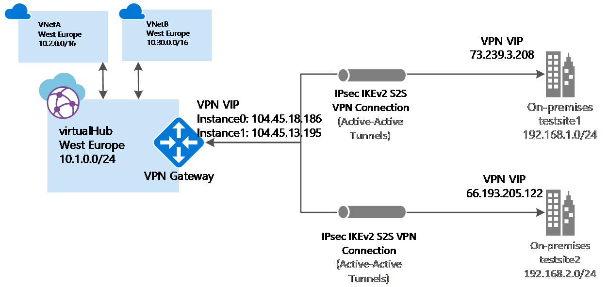

# Tutorial: Create a Site-to-Site connection using Azure Virtual WAN

This tutorial shows you how to use Virtual WAN to connect to your resources in Azure over an IPsec/IKE (IKEv1 and IKEv2) VPN connection. This type of connection requires a VPN device located on-premises that has an externally facing public IP address assigned to it. For more information about Virtual WAN, see the [Virtual WAN Overview](virtual-wan-about.md).

> [!NOTE]
> If you have many sites, you typically would use a [Virtual WAN partner](https://aka.ms/virtualwan) to create this configuration. However, you can create this configuration yourself if you are comfortable with networking and proficient at configuring your own VPN device.
>



In this tutorial, you learn how to:

> [!div class="checklist"]
> * Create a WAN
> * Create a site
> * Create a hub
> * Connect a hub to a site
> * Create a compatible VNet (if you don't already have one)
> * Connect a VNet to a hub
> * Download and apply the VPN device configuration
> * View your virtual WAN
> * View resource health
> * Monitor a connection

## Before you begin

[!INCLUDE [Before you begin](../../includes/virtual-wan-tutorial-vwan-before-include.md)]

## <a name="openvwan"></a>1. Create a virtual WAN

From a browser, navigate to the [Azure portal](https://aka.ms/azurevirtualwanpreviewfeatures) and sign in with your Azure account.

[!INCLUDE [Create a virtual WAN](../../includes/virtual-wan-tutorial-vwan-include.md)]

## <a name="site"></a>2. Create a site

Create as many sites as you need that correspond to your physical locations. For example, if you have a branch office in NY, a branch office in London, and a branch office and LA, you'd create three separate sites. These sites contain your on-premises VPN device endpoints. At this time, you can specify only one private address space for your site.

1. Click the WAN you created. On the WAN page, under **WAN Architecture**, click **VPN sites** to open the VPN sites page.
2. On the **VPN sites** page, click **+Create site**.
3. On the **Create site** page, fill in the following fields:

   * **Name** - The name by which you want to refer to your on-premises site.
   * **Public IP address** - The public IP address of the VPN device that resides on your on-premises site.
   * **Private address space** - This is the IP address space that is located on your on-premises site. Traffic destined for this address space is routed to your local site.
   * **Subscription** - Verify the subscription.
   * **Resource Group** - The resource group you want to use.
   * **Location**
4. Click **Show advanced** to view additional settings. You can select **BGP** to enable BGP, which will enable BGP functionality on all connections created for this site in Azure. You can also enter **Device information** (optional fields). Doing so can help the Azure Team better understand your environment to add additional optimization possibilities in the future, or to help you troubleshoot.
5. Click **Confirm**.
6. After you click **Confirm**, view the status on the VPN sites page. The site will go from **Provisioning** to **Provisioned**.

## <a name="hub"></a>3. Create a hub

[!INCLUDE [Create a hub](../../includes/virtual-wan-tutorial-hub-include.md)]

## <a name="associate"></a>4. Associate the sites with the hub

Hubs should generally be associated to sites that are in the same region that the VNet resides in.

1. On the **VPN sites** page, select the site or sites that you want to associate with the hub, then click **+New hub association**.
2. On the **Associate sites with one or more hubs** page, select a hub from the dropdown. You can associate a site with additional hubs by clicking **+Add an association**.
3. You can also add a specific **PSK** here, or use the default.
4. Click **Confirm**.
5. You can view the connection status on the **VPN sites** page.

## <a name="vnet"></a>5. Create a virtual network

If you do not already have a VNet, you can quickly create one using PowerShell or the Azure portal. If you already have a VNet, verify that it meets the required criteria and does not have a virtual network gateway.

[!INCLUDE [Create a virtual network](../../includes/virtual-wan-tutorial-vnet-include.md)]

## <a name="vnet"></a>6. Connect your VNet to a hub

In this step, you create the peering connection between your hub and a VNet. Repeat these steps for each VNet that you want to connect.

1. On the page for your virtual WAN, click **Virtual network connections**.
2. On the virtual network connection page, click **+Add connection**.
3. On the **Add connection** page, fill in the following fields:

    * **Connection name** - Name your connection.
    * **Hubs** - Select the hub you want to associate with this connection.
    * **Subscription** - Verify the subscription.
    * **Virtual network** - Select the virtual network you want to connect to this hub. The virtual network cannot have an already existing virtual network gateway.
4. Click **OK** to create the peering connection.

## <a name="device"></a>7. Download VPN configuration

Use the VPN device configuration to configure your on-premises VPN device.

1. On the page for your virtual WAN, click **Overview**.
2. At the top of the Overview page, click **Download VPN configuration**. Azure creates a storage account in the resource group 'microsoft-network-[location]', where location is the location of the WAN. After you have applied the configuration to your VPN devices, you can delete this storage account.
3. Once the file has finished creating, you can click the link to download it.
4. Apply the configuration to your VPN device.

### Understanding the VPN device configuration file

The device configuration file contains the settings to use when configuring your on-premises VPN device. When you view this file, notice the following information:

* **vpnSiteConfiguration -** This section denotes the device details set up as a site connecting to the virtual WAN. It includes the name and public ip address of the branch device.
* **vpnSiteConnections -** This section provides information about the following settings:

    * **Address space** of the virtual hub(s) VNet<br>Example:
 
        ```
        "AddressSpace":"10.1.0.0/24"
        ```
    * **Address space** of the VNets that are connected to the hub<br>Example:

         ```
        "ConnectedSubnets":["10.2.0.0/16","10.30.0.0/16"]
         ```
    * **IP addresses** of the virtual hub vpngateway. Because each connection of the  vpngateway is composed of two tunnels in active-active configuration, you'll see both IP addresses listed in this file. In this example, you see "Instance0" and "Instance1" for each site.<br>Example:

        ``` 
        "Instance0":"104.45.18.186"
        "Instance1":"104.45.13.195"
        ```
    * **Vpngateway connection configuration details** such as BGP, pre-shared key etc. The PSK is the pre-shared key that is automatically generated for you. You can always edit the connection in the Overview page for a custom PSK.
  
### Example device configuration file

  ```
  { 
      "configurationVersion":{ 
         "LastUpdatedTime":"2018-07-03T18:29:49.8405161Z",
         "Version":"r403583d-9c82-4cb8-8570-1cbbcd9983b5"
      },
      "vpnSiteConfiguration":{ 
         "Name":"testsite1",
         "IPAddress":"73.239.3.208"
      },
      "vpnSiteConnections":[ 
         { 
            "hubConfiguration":{ 
               "AddressSpace":"10.1.0.0/24",
               "Region":"West Europe",
               "ConnectedSubnets":[ 
                  "10.2.0.0/16",
                  "10.30.0.0/16"
               ]
            },
            "gatewayConfiguration":{ 
               "IpAddresses":{ 
                  "Instance0":"104.45.18.186",
                  "Instance1":"104.45.13.195"
               }
            },
            "connectionConfiguration":{ 
               "IsBgpEnabled":false,
               "PSK":"bkOWe5dPPqkx0DfFE3tyuP7y3oYqAEbI",
               "IPsecParameters":{ 
                  "SADataSizeInKilobytes":102400000,
                  "SALifeTimeInSeconds":3600
               }
            }
         }
      ]
   },
   { 
      "configurationVersion":{ 
         "LastUpdatedTime":"2018-07-03T18:29:49.8405161Z",
         "Version":"1f33f891-e1ab-42b8-8d8c-c024d337bcac"
      },
      "vpnSiteConfiguration":{ 
         "Name":" testsite2",
         "IPAddress":"66.193.205.122"
      },
      "vpnSiteConnections":[ 
         { 
            "hubConfiguration":{ 
               "AddressSpace":"10.1.0.0/24",
               "Region":"West Europe"
            },
            "gatewayConfiguration":{ 
               "IpAddresses":{ 
                  "Instance0":"104.45.18.187",
                  "Instance1":"104.45.13.195"
               }
            },
            "connectionConfiguration":{ 
               "IsBgpEnabled":false,
               "PSK":"XzODPyAYQqFs4ai9WzrJour0qLzeg7Qg",
               "IPsecParameters":{ 
                  "SADataSizeInKilobytes":102400000,
                  "SALifeTimeInSeconds":3600
               }
            }
         }
      ]
   },
   { 
      "configurationVersion":{ 
         "LastUpdatedTime":"2018-07-03T18:29:49.8405161Z",
         "Version":"cd1e4a23-96bd-43a9-93b5-b51c2a945c7"
      },
      "vpnSiteConfiguration":{ 
         "Name":" testsite3",
         "IPAddress":"182.71.123.228"
      },
      "vpnSiteConnections":[ 
         { 
            "hubConfiguration":{ 
               "AddressSpace":"10.1.0.0/24",
               "Region":"West Europe"
            },
            "gatewayConfiguration":{ 
               "IpAddresses":{ 
                  "Instance0":"104.45.18.187",
                  "Instance1":"104.45.13.195"
               }
            },
            "connectionConfiguration":{ 
               "IsBgpEnabled":false,
               "PSK":"YLkSdSYd4wjjEThR3aIxaXaqNdxUwSo9",
               "IPsecParameters":{ 
                  "SADataSizeInKilobytes":102400000,
                  "SALifeTimeInSeconds":3600
               }
            }
         }
      ]
   }
  ```

### Configuring your VPN device

>[!NOTE]
> If you are working with a Virtual WAN partner solution, VPN device configuration automatically happens. The device controller obtains the configuration file from Azure and applies to the device to set up connection to Azure. This means you don't need to know how to manually configure your VPN device.
>

If you need instructions to configure your device, you can use the instructions on the [VPN device configuration scripts page](~/articles/vpn-gateway/vpn-gateway-about-vpn-devices.md#configscripts) with the following caveats:

* The instructions on the VPN devices page are not written for Virtual WAN, but you can use the Virtual WAN values from the configuration file to manually configure your VPN device. 
* The downloadable device configuration scripts that are for VPN Gateway do not work for Virtual WAN, as the configuration is different.
* A New Virtual WAN can support both IKEv1 and IKEv2.
* Virtual WAN can only use route-based VPN devices and device instructions.

## <a name="viewwan"></a>8. View your virtual WAN

1. Navigate to the virtual WAN.
2. On the Overview page, each point on the map represents a hub. Hover over any point to view the hub health summary.
3. In the Hubs and connections section, you can view hub status, site, region, VPN connection status, and bytes in and out.

## <a name="viewhealth"></a>9. View your resource health

1. Navigate to your WAN.
2. On your WAN page, in the **SUPPORT + Troubleshooting** section, click **Health** and view your resource.

## <a name="connectmon"></a>10. Monitor a connection

Create a connection to monitor communication between an Azure VM and a remote site. For information about how to set up a connection monitor, see [Monitor network communication](~/articles/network-watcher/connection-monitor.md). The source field is the VM IP in Azure, and the destination IP is the Site IP.

## <a name="cleanup"></a>11. Clean up resources

When you no longer need these resources, you can use [Remove-AzResourceGroup](/powershell/module/az.resources/remove-azresourcegroup) to remove the resource group and all of the resources it contains. Replace "myResourceGroup" with the name of your resource group and run the following PowerShell command:

```azurepowershell-interactive
Remove-AzResourceGroup -Name myResourceGroup -Force
```

## Next steps

In this tutorial, you learned how to:

> [!div class="checklist"]
> * Create a WAN
> * Create a site
> * Create a hub
> * Connect a hub to a site
> * Connect a VNet to a hub
> * Download and apply the VPN device configuration
> * View your virtual WAN
> * View resource health
> * Monitor a connection

To learn more about Virtual WAN, see the [Virtual WAN Overview](virtual-wan-about.md) page.
