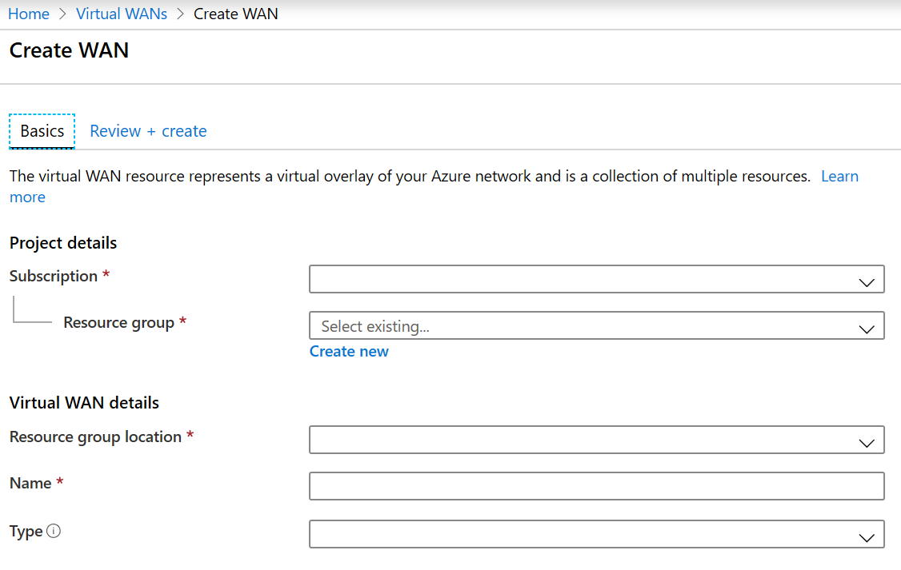

# Tutorial: Create a Site-to-Site connection using Azure Virtual WAN

This tutorial shows you how to use Virtual WAN to connect to your resources in Azure over an IPsec/IKE (IKEv1 and IKEv2) VPN connection. This type of connection requires a VPN device located on-premises that has an externally facing public IP address assigned to it. For more information about Virtual WAN, see the [Virtual WAN Overview](virtual-wan-about.md).

In this tutorial you learn how to:

> [!div class="checklist"]
> * Create a virtual WAN
> * Create a hub
> * Create a site
> * Connect a site to a hub
> * Connect a VPN site to a hub
> * Connect a VNet to a hub
> * Download a configuration file
> * View your virtual WAN

> [!NOTE]
> If you have many sites, you typically would use a [Virtual WAN partner](https://aka.ms/virtualwan) to create this configuration. However, you can create this configuration yourself if you are comfortable with networking and proficient at configuring your own VPN device.
>


## Before you begin

Verify that you have met the following criteria before beginning your configuration:

* You have a virtual network that you want to connect to. Verify that none of the subnets of your on-premises networks overlap with the virtual networks that you want to connect to. To create a virtual network in the Azure portal, see the [Quickstart](../virtual-network/quick-create-portal.md).

* Your virtual network does not have any virtual network gateways. If your virtual network has a gateway (either VPN or ExpressRoute), you must remove all gateways. This configuration requires that virtual networks are connected instead, to the Virtual WAN hub gateway.

* Obtain an IP address range for your hub region. The hub is a virtual network that is created and used by Virtual WAN. The address range that you specify for the hub cannot overlap with any of your existing virtual networks that you connect to. It also cannot overlap with your address ranges that you connect to on premises. If you are unfamiliar with the IP address ranges located in your on-premises network configuration, coordinate with someone who can provide those details for you.

* If you don't have an Azure subscription, create a [free account](https://azure.microsoft.com/free/?WT.mc_id=A261C142F).

## <a name="openvwan"></a>Create a virtual WAN

From a browser, navigate to the Azure portal and sign in with your Azure account.

1. Navigate to the Virtual WAN page. In the portal, click **+Create a resource**. Type **Virtual WAN** into the search box and select Enter.
2. Select **Virtual WAN** from the results. On the Virtual WAN page, click **Create** to open the Create WAN page.
3. On the **Create WAN** page, on the **Basics** tab, fill in the following fields:

   

   * **Subscription** - Select the subscription that you want to use.
   * **Resource group** - Create new or use existing.
   * **Resource group location** - Choose a resource location from the dropdown. A WAN is a global resource and does not live in a particular region. However, you must select a region in order to more easily manage and locate the WAN resource that you create.
   * **Name** - Type the Name that you want to call your WAN.
   * **Type:** Basic or Standard. If you create a Basic WAN, you can create only a Basic hub. Basic hubs are capable of VPN site-to-site connectivity only.
4. After you finish filling out the fields, select **Review +Create**.
5. Once validation passes, select **Create** to create the virtual WAN.

## <a name="hub"></a>Create a hub

A hub is a virtual network that can contain gateways for site-to-site, ExpressRoute, or point-to-site functionality. Once the hub is created, you'll be charged for the hub, even if you don't attach any sites. It takes 30 minutes to create the site-to-site VPN gateway in the virtual hub.

[!INCLUDE [Create a hub](../../includes/virtual-wan-tutorial-s2s-hub-include.md)]

## <a name="site"></a>Create a site

You are now ready to create the sites corresponding to your physical locations. Create as many sites as you need that correspond to your physical locations. For example, if you have a branch office in NY, a branch office in London, and a branch office and LA, you'd create three separate sites. These sites contain your on-premises VPN device endpoints. You can create up to 1000 sites per Virtual Hub in a Virtual WAN. If you had multiple hubs, you can create 1000 per each of those hubs. If you have Virtual WAN partner (link insert) CPE device, check with them to learn about their automation to Azure. Typically automation implies simple click experience to export large-scale branch information into azure and setting up connectivity from the CPE to Azure Virtual WAN VPN gateway. For more information, see [Automation guidance from Azure to CPE partners](virtual-wan-configure-automation-providers.md).

[!INCLUDE [Create a site](../../includes/virtual-wan-tutorial-s2s-site-include.md)]

## <a name="connectsites"></a>Connect the VPN site to the hub

In this step, you connect your VPN site to the hub.

[!INCLUDE [Connect VPN sites](../../includes/virtual-wan-tutorial-s2s-connect-vpn-site-include.md)]

## <a name="vnet"></a>Connect the VNet to the hub

In this step, you create the connection between your hub and a VNet. Repeat these steps for each VNet that you want to connect.

1. On the page for your virtual WAN, click **Virtual network connections**.
2. On the virtual network connection page, click **+Add connection**.
3. On the **Add connection** page, fill in the following fields:

    * **Connection name** - Name your connection.
    * **Hubs** - Select the hub you want to associate with this connection.
    * **Subscription** - Verify the subscription.
    * **Virtual network** - Select the virtual network you want to connect to this hub. The virtual network cannot have an already existing virtual network gateway.
4. Click **OK** to create the virtual network connection.

## <a name="device"></a>Download VPN configuration

Use the VPN device configuration to configure your on-premises VPN device.

1. On the page for your virtual WAN, click **Overview**.
2. At the top of the **Hub ->VPNSite** page, click **Download VPN config**. Azure creates a storage account in the resource group 'microsoft-network-[location]', where location is the location of the WAN. After you have applied the configuration to your VPN devices, you can delete this storage account.
3. Once the file has finished creating, you can click the link to download it.
4. Apply the configuration to your on-premises VPN device.

### Understanding the VPN device configuration file

The device configuration file contains the settings to use when configuring your on-premises VPN device. When you view this file, notice the following information:

* **vpnSiteConfiguration -** This section denotes the device details set up as a site connecting to the virtual WAN. It includes the name and public ip address of the branch device.
* **vpnSiteConnections -** This section provides information about the following settings:

    * **Address space** of the virtual hub(s) VNet<br>Example:
 
        ```
        "AddressSpace":"10.1.0.0/24"
        ```
    * **Address space** of the VNets that are connected to the hub<br>Example:

         ```
        "ConnectedSubnets":["10.2.0.0/16","10.3.0.0/16"]
         ```
    * **IP addresses** of the virtual hub vpngateway. Because each connection of the  vpngateway is composed of two tunnels in active-active configuration, you'll see both IP addresses listed in this file. In this example, you see "Instance0" and "Instance1" for each site.<br>Example:

        ``` 
        "Instance0":"104.45.18.186"
        "Instance1":"104.45.13.195"
        ```
    * **Vpngateway connection configuration details** such as BGP, pre-shared key etc. The PSK is the pre-shared key that is automatically generated for you. You can always edit the connection in the Overview page for a custom PSK.
  
### Example device configuration file

  ```
  { 
      "configurationVersion":{ 
         "LastUpdatedTime":"2018-07-03T18:29:49.8405161Z",
         "Version":"r403583d-9c82-4cb8-8570-1cbbcd9983b5"
      },
      "vpnSiteConfiguration":{ 
         "Name":"testsite1",
         "IPAddress":"73.239.3.208"
      },
      "vpnSiteConnections":[ 
         { 
            "hubConfiguration":{ 
               "AddressSpace":"10.1.0.0/24",
               "Region":"West Europe",
               "ConnectedSubnets":[ 
                  "10.2.0.0/16",
                  "10.3.0.0/16"
               ]
            },
            "gatewayConfiguration":{ 
               "IpAddresses":{ 
                  "Instance0":"104.45.18.186",
                  "Instance1":"104.45.13.195"
               }
            },
            "connectionConfiguration":{ 
               "IsBgpEnabled":false,
               "PSK":"bkOWe5dPPqkx0DfFE3tyuP7y3oYqAEbI",
               "IPsecParameters":{ 
                  "SADataSizeInKilobytes":102400000,
                  "SALifeTimeInSeconds":3600
               }
            }
         }
      ]
   },
   { 
      "configurationVersion":{ 
         "LastUpdatedTime":"2018-07-03T18:29:49.8405161Z",
         "Version":"1f33f891-e1ab-42b8-8d8c-c024d337bcac"
      },
      "vpnSiteConfiguration":{ 
         "Name":" testsite2",
         "IPAddress":"66.193.205.122"
      },
      "vpnSiteConnections":[ 
         { 
            "hubConfiguration":{ 
               "AddressSpace":"10.1.0.0/24",
               "Region":"West Europe"
            },
            "gatewayConfiguration":{ 
               "IpAddresses":{ 
                  "Instance0":"104.45.18.187",
                  "Instance1":"104.45.13.195"
               }
            },
            "connectionConfiguration":{ 
               "IsBgpEnabled":false,
               "PSK":"XzODPyAYQqFs4ai9WzrJour0qLzeg7Qg",
               "IPsecParameters":{ 
                  "SADataSizeInKilobytes":102400000,
                  "SALifeTimeInSeconds":3600
               }
            }
         }
      ]
   },
   { 
      "configurationVersion":{ 
         "LastUpdatedTime":"2018-07-03T18:29:49.8405161Z",
         "Version":"cd1e4a23-96bd-43a9-93b5-b51c2a945c7"
      },
      "vpnSiteConfiguration":{ 
         "Name":" testsite3",
         "IPAddress":"182.71.123.228"
      },
      "vpnSiteConnections":[ 
         { 
            "hubConfiguration":{ 
               "AddressSpace":"10.1.0.0/24",
               "Region":"West Europe"
            },
            "gatewayConfiguration":{ 
               "IpAddresses":{ 
                  "Instance0":"104.45.18.187",
                  "Instance1":"104.45.13.195"
               }
            },
            "connectionConfiguration":{ 
               "IsBgpEnabled":false,
               "PSK":"YLkSdSYd4wjjEThR3aIxaXaqNdxUwSo9",
               "IPsecParameters":{ 
                  "SADataSizeInKilobytes":102400000,
                  "SALifeTimeInSeconds":3600
               }
            }
         }
      ]
   }
  ```

### Configuring your VPN device

>[!NOTE]
> If you are working with a Virtual WAN partner solution, VPN device configuration automatically happens. The device controller obtains the configuration file from Azure and applies to the device to set up connection to Azure. This means you don't need to know how to manually configure your VPN device.
>

If you need instructions to configure your device, you can use the instructions on the [VPN device configuration scripts page](~/articles/vpn-gateway/vpn-gateway-about-vpn-devices.md#configscripts) with the following caveats:

* The instructions on the VPN devices page are not written for Virtual WAN, but you can use the Virtual WAN values from the configuration file to manually configure your VPN device. 
* The downloadable device configuration scripts that are for VPN Gateway do not work for Virtual WAN, as the configuration is different.
* A new Virtual WAN can support both IKEv1 and IKEv2.
* Virtual WAN can use both policy based and route-based VPN devices and device instructions.

## <a name="viewwan"></a>View your virtual WAN

1. Navigate to the virtual WAN.
2. On the **Overview** page, each point on the map represents a hub. Hover over any point to view the hub health summary, connection status, and bytes in and out.
3. In the Hubs and connections section, you can view hub status, VPN sites, etc. You can click on a specific hub name and navigate to the VPN Site for additional details.

## Next steps

To learn more about Virtual WAN, see the [Virtual WAN Overview](virtual-wan-about.md) page.
