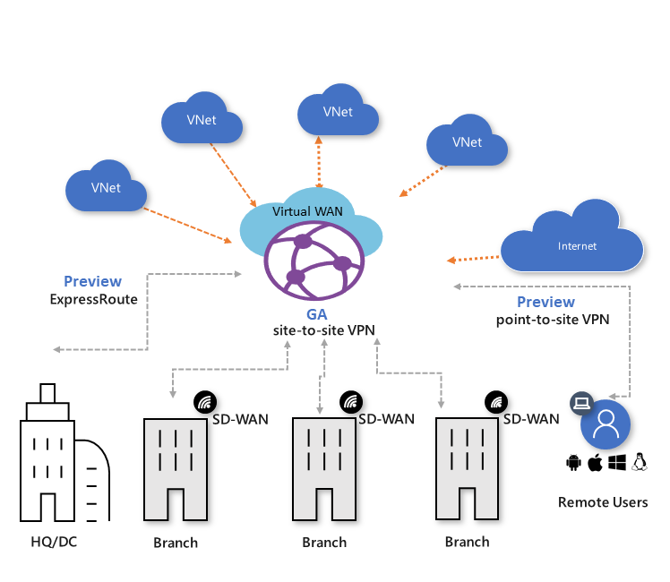

# Azure Virtual WAN and supporting remote work

>[!NOTE]
>This article describes how you can leverage Azure Virtual WAN, Azure, Microsoft network, and the Azure partner ecosystem to work remotely and  mitigate network issues that you are facing because of COVID-19 crisis.
>

Are you scrambling to provide connectivity for remote users?
Do you suddenly see a need to support a surge of users beyond what you had planned for?
Do you need the user to connect from home and not only access the cloud but also be able to reach on-premises?
Do you need your remote users to be able to reach resources behind a private WAN?
Do you have a need for users to access intra cloud resources without having the need to set up connectivity between regions?
As this global pandemic creates unprecedented changes around us, the Azure Virtual WAN team is here for you to cater to your connectivity needs.

Azure Virtual WAN is a networking service that brings many networking, security, and routing functionalities together to provide a single operational interface. These functionalities include Branch connectivity (via connectivity automation from Virtual WAN Partner devices such as SD-WAN or VPN CPE), Site-to-site VPN connectivity, Remote User VPN (Point-to-site) connectivity, Private (ExpressRoute) connectivity, Intra cloud connectivity (Transitive connectivity for Virtual Networks), VPN ExpressRoute Interconnectivity, Routing, Azure firewall, Encryption for private connectivity etc. You don't have to have all of these use cases to start using Virtual WAN. You can get started with just one use case and adjust your network as it evolves.

Now talking about remote users, lets look at what you need to get your network up and running:

## Set up remote user connectivity

You can connect to your resources in Azure over an IPsec/IKE (IKEv2) or OpenVPN connection. This type of connection requires a VPN client to be configured for the remote user. This client can be the [Azure VPN client](https://go.microsoft.com/fwlink/?linkid=2117554) or OpenVPN Client or any client that supports IKEv2. For more information, see [Create a point-to-site connection](virtual-wan-point-to-site-portal.md).

## Connectivity from the remote user to on-premises

You have two options here:

* Set up Site-to-site connectivity with any existing VPN device. When you connect the IPsec VPN device to Azure Virtual WAN hub, interconnectivity between the Point-to-site User VPN (Remote user) and Site-to-site VPN is automatic. For more information on how to set up Site-to-site VPN from your on-premise VPN device to Azure Virtual WAN, see [Create a site-to-site connection using Virtual WAN](virtual-wan-site-to-site-portal.md).

* Connect your ExpressRoute circuit to the Virtual WAN hub. Connecting an ExpressRoute circuit requires deploying an ExpressRoute gateway in Virtual WAN. As soon as you have deployed one, interconnectivity between the Point-to-site User VPN and ExpressRoute user is automatic. To create the ExpressRoute connection, see [Create an ExpressRoute connection using Virtual WAN](virtual-wan-expressroute-portal.md). You can use an existing ExpressRoute circuit to connect to Azure Virtual WAN.

## Existing basic Virtual WAN customer

Basic Virtual WAN provides Site-to-site VPN only. In order for remote users to connect, you will need to upgrade the virtual WAN to Standard Virtual WAN. For steps to upgrade a virtual WAN, see [Upgrade a virtual WAN from Basic to Standard](upgrade-virtual-wan.md)

## Additional information

Virtual WAN supports one hub per region/location. For location information, see the [Virtual WAN partners and locations](virtual-wan-locations-partners.md) article. Each hub supports up to 10,000 remote user connections, 1,000 branch connection, four ExpressRoute circuits and up to 500 Virtual Network connections. As you scale up the remote users, if you have any questions, don't hesitate to seek help by sending an email to azurevirtualwan@microsoft.com. If you require technical support, be sure to open a support ticket from the Azure portal and help will be on the way.

## FAQ

[!INCLUDE [Virtual WAN FAQ](../../includes/virtual-wan-faq-include.md)]

## Next Steps

For more information about Virtual WAN, see [Virtual WAN overview](virtual-wan-about.md)