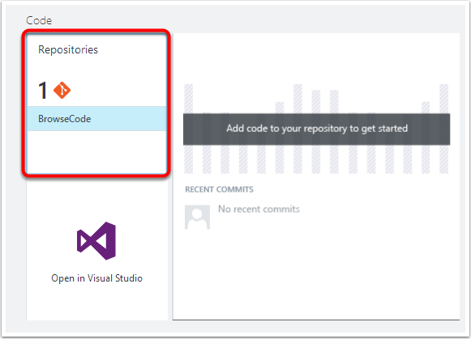
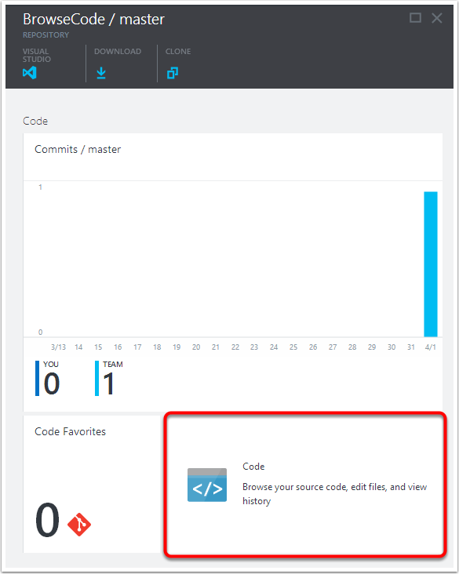
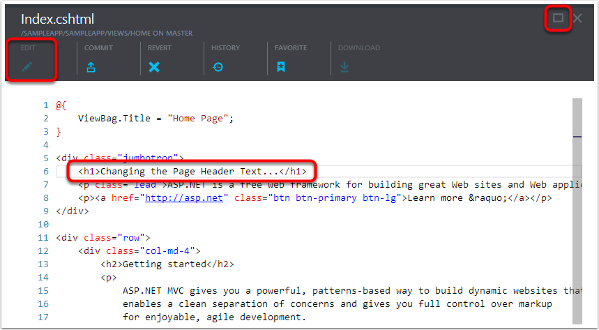
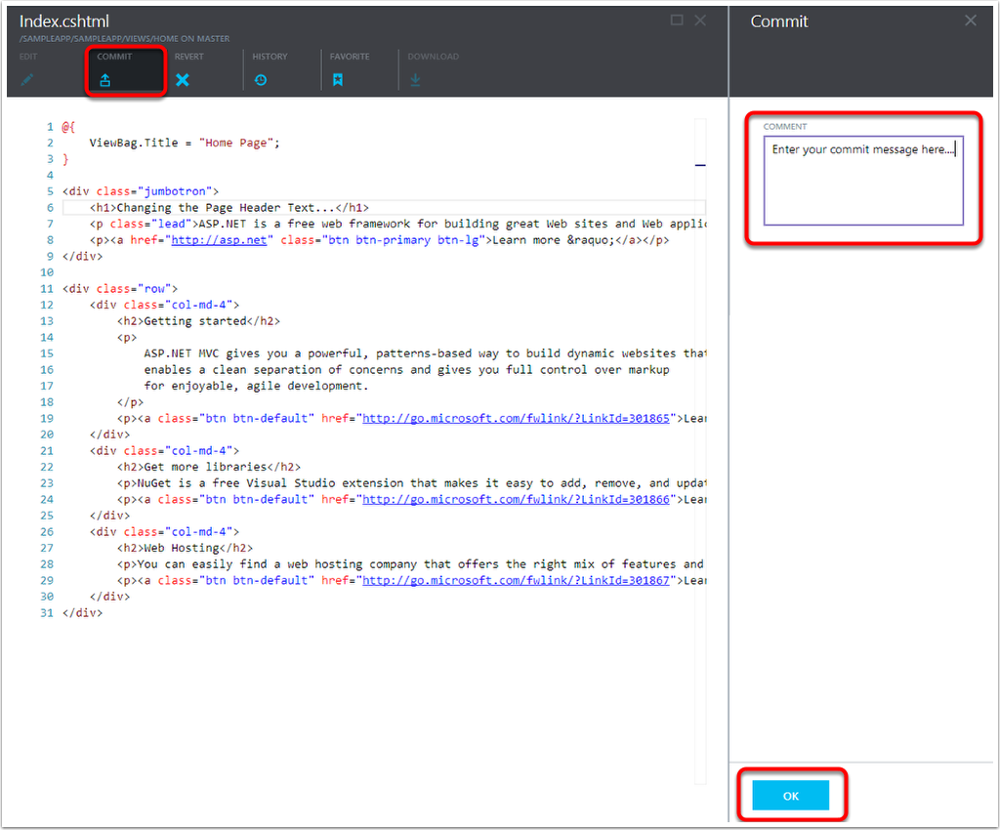
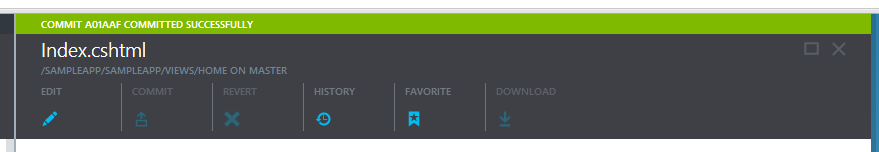

<properties linkid="" urlDisplayName="Browse and Edit Your Source Code" pageTitle="Browse and Edit Your Source Code | Azure" metaKeywords="Visual Studio Online, VSO, git, tfvc, edit, code, commit" description="Learn how to edit your source code." metaCanonical="" services="visual-studio-online" documentationCenter="" title="Browse and Edit Your Source Code" authors="ehollow" solutions="" manager="" editor="" />

# Browse and Edit Your Source Code

In Microsoft Azure Portal Preview it is easy to browse and edit your Visual Studio Online Team Project source code.

Once you have created a Team Project in the Portal, and either checked in ( Team Foundation version control) or committed ( git ) code, you can easily access and browse the code via the portal.

1. First, open up your Team project blade, and then locate the code lens.  Then on the source part click the name of the repository you'd like to browse (in this case it is called 'BrowseCode').  Note: if you have more that two repositories, you can click on the repository number (1 in this case) to view the full list.

2. Now that your repository blade is open, you may click on the Code part to start browsing your source code.

3. A standard tree view navigation blade will appear that has your entire project available.  You can click on the nodes to open folder, or click a specific file (Index.cshtml in this case) to view or edit the file.

4. To edit a file simple click the Edit button in the command bar.  The file contents will then go into edit mode, and you can make your changes. Tip: Click the maximize button in the upper right to have a full screen editing experience.

5. When you are done making your file edits, click the commit (or Check In) button in the command bar.  This will launch a new blade where you can enter your commit message.  Click OK, when you are done, and the file will be committed to the repository.

6. The top of the blade will show a flash message indicating the success of the commit to the repository.

