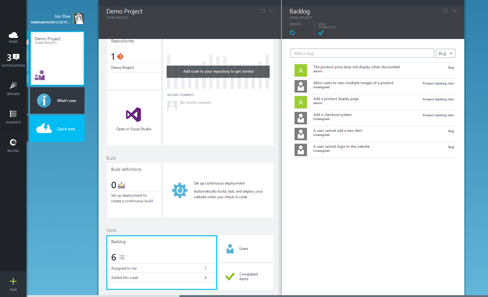
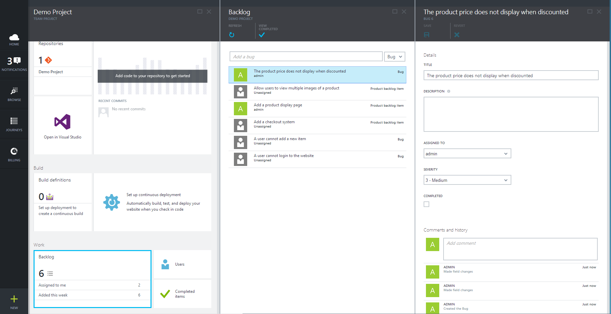
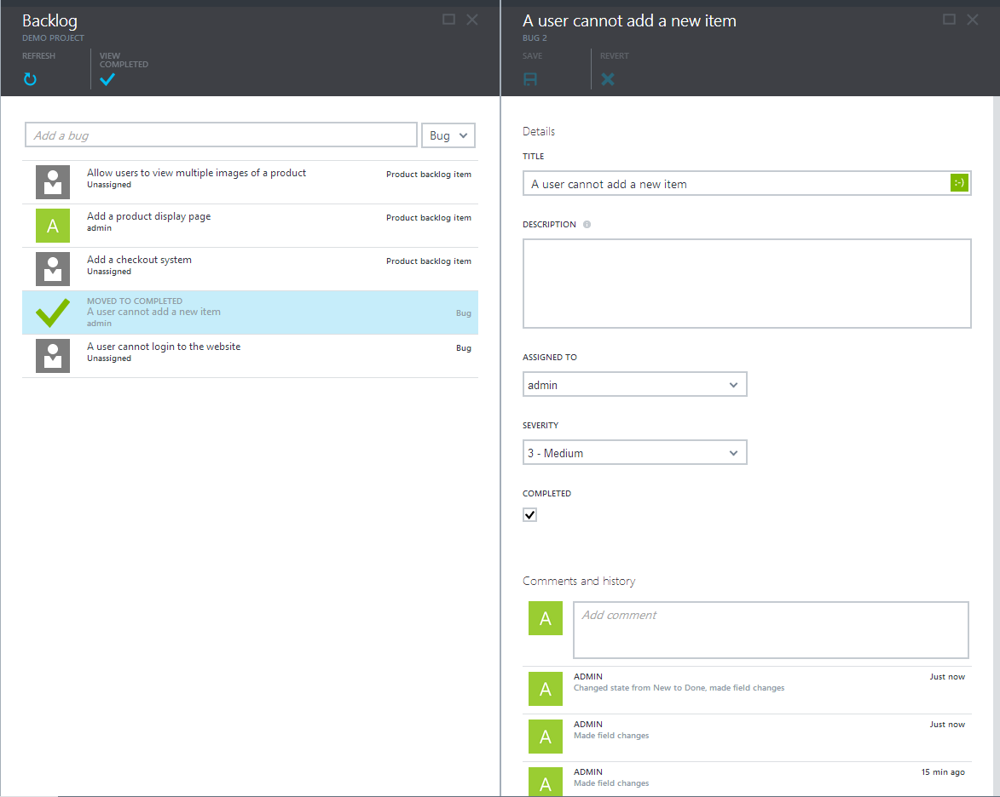
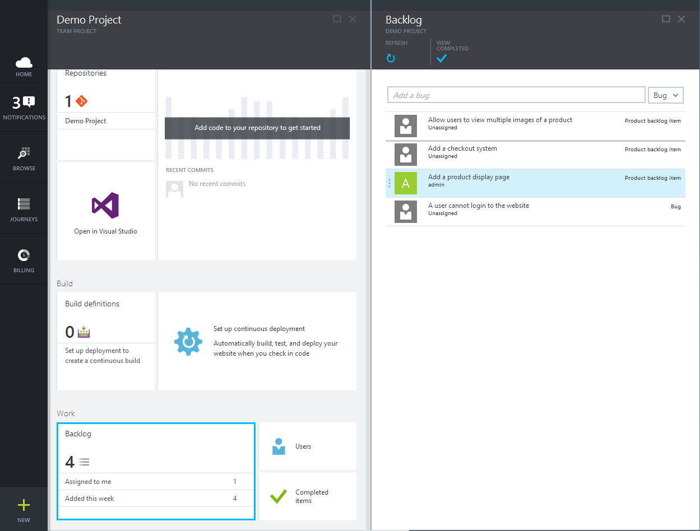
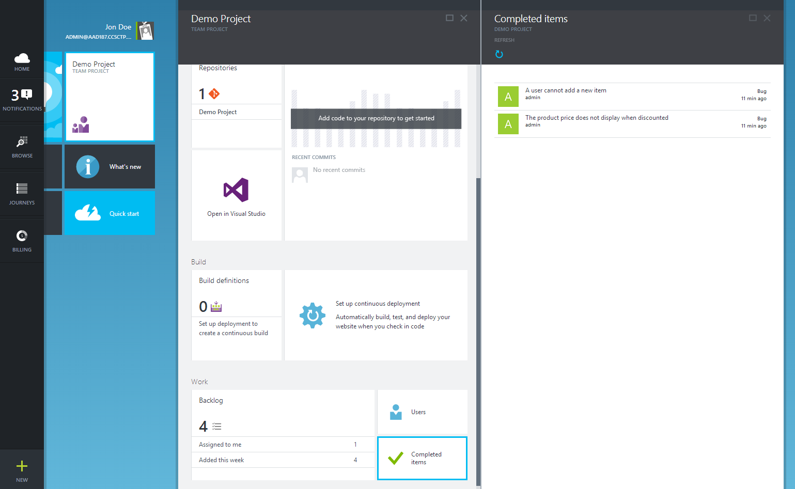

<properties linkid="" urlDisplayName="Tracking work for your website" pageTitle="Tracking work for your website | Azure" metaKeywords="Visual Studio Online, VSO, work, items, backlog" description="Learn how to track and manage work for your website." metaCanonical="" services="visual-studio-online" documentationCenter="" title="Tracking work for your website" authors="rmarron" solutions="" manager="" editor="" />

# Tracking work for your website
In this topic, you'll learn how to use the work item tracking tools to manage work for your website.

## Table of Contents
* <a href="#how-to-add-work-items-to-your-backlog">How to: Add work items to your backlog</a>
* <a href="#how-to-manage-your-backlog">How to: Manage your backlog</a>
* <a href="#how-to-view-recently-completed-work">How to: View recently completed work</a>

## How to: Add work items to your backlog
1. Navigate to your team project blade.

2. Inside of the "work" lens at the bottom, click on the backlog part. 
 
	The backlog blade will launch. Your backlog contains a prioritized list of work for your website. 

	

3. Add an item by typing the title in the text box at the top and hitting enter.
	
	If you are using a Scrum process template, you can choose to add a bug or a product backlog item by selecting it from the drop down on the right.


4. Click on the work item to open it and add more details.

	

5. On the work item form, you can edit the title, add a description, assign the work item to a user, and mark it as complete.

6. At the bottom of the work item form, you can add a comment to the work item and view its history.
	
	To dig into the work item's history, you can click on a change, and a blade will open with more details about what happened.

## How to: Manage your backlog

Keeping a well prioritized backlog is key to successfully managing work for your website. There are two pieces to this:

###Removing work when it is completed

1. Open the work item you would like to mark complete.
2. Check the check box labeled "completed."
3. Save the work item.
4. A stub for this item will remain on the backlog until you refresh the backlog or close and open it again.



###Keeping your backlog in priority order

1. Hover over the work item whose priority you would like to change.
2. Click the gripper bar on the left side of the work item.
3. Drag and drop the work item to its new position on the backlog.



## How to: View recently completed work

1. On the team project blade, click on the completed items blade.
2. View the list of recently completed work. 




