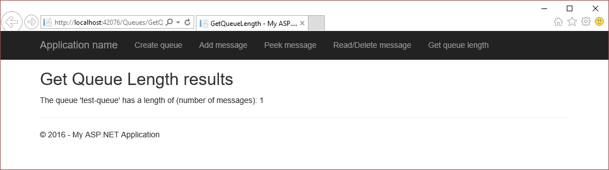

# Get started with Azure queue storage and Visual Studio Connected Services (ASP.NET)

[!INCLUDE [storage-try-azure-tools-queues](../../includes/storage-try-azure-tools-queues.md)]

## Overview

Azure queue storage provides cloud messaging between application components. In designing applications for scale, application components are often decoupled, so that they can scale independently. Queue storage delivers asynchronous messaging for communication between application components, whether they are running in the cloud, on the desktop, on an on-premises server, or on a mobile device. Queue storage also supports managing asynchronous tasks and building process work flows.

This tutorial shows how to write ASP.NET code for some common scenarios using Azure queue storage entities. These scenarios include common tasks such as creating an Azure queue, and adding, modifying, reading, and removing queue messages.

## Prerequisites

* [Microsoft Visual Studio](https://www.visualstudio.com/downloads/)
* [Azure storage account](../storage/common/storage-quickstart-create-account.md)

[!INCLUDE [storage-queue-concepts-include](../../includes/storage-queue-concepts-include.md)]

[!INCLUDE [storage-create-account-include](../../includes/vs-storage-aspnet-getting-started-create-azure-account.md)]

[!INCLUDE [storage-development-environment-include](../../includes/vs-storage-aspnet-getting-started-setup-dev-env.md)]

### Create an MVC controller 

1. In the **Solution Explorer**, right-click **Controllers**, and, from the context menu, select **Add->Controller**.

	

1. On the **Add Scaffold** dialog, select **MVC 5 Controller - Empty**, and select **Add**.

	

1. On the **Add Controller** dialog, name the controller *QueuesController*, and select **Add**.

	

1. Add the following *using* directives to the `QueuesController.cs` file:

    ```csharp
	using Microsoft.Azure;
    using Microsoft.WindowsAzure.Storage;
    using Microsoft.WindowsAzure.Storage.Auth;
    using Microsoft.WindowsAzure.Storage.Queue;
	```
## Create a queue

The following steps illustrate how to create a queue:

> [!NOTE]
> 
> This section assumes you have completed the steps [Set up the development environment](#set-up-the-development-environment). 

1. Open the `QueuesController.cs` file. 

1. Add a method called **CreateQueue** that returns an **ActionResult**.

    ```csharp
    public ActionResult CreateQueue()
    {
		// The code in this section goes here.

        return View();
    }
    ```

1. Within the **CreateQueue** method, get a **CloudStorageAccount** object that represents your storage account information. Use the following code to get the storage connection string and storage account information from the Azure service configuration: (Change *&lt;storage-account-name>* to the name of the Azure storage account you're accessing.)
   
    ```csharp
    CloudStorageAccount storageAccount = CloudStorageAccount.Parse(
       CloudConfigurationManager.GetSetting("<storage-account-name>_AzureStorageConnectionString"));
    ```

1. Get a **CloudQueueClient** object represents a queue service client.
   
    ```csharp
    CloudQueueClient queueClient = storageAccount.CreateCloudQueueClient();
    ```
1. Get a **CloudQueue** object that represents a reference to the desired queue name. The **CloudQueueClient.GetQueueReference** method does not make a request against queue storage. The reference is returned whether or not the queue exists. 
   
    ```csharp
    CloudQueue queue = queueClient.GetQueueReference("test-queue");
    ```

1. Call the **CloudQueue.CreateIfNotExists** method to create the queue if it does not yet exist. The **CloudQueue.CreateIfNotExists** method returns **true** if the queue does not exist, and is successfully created. Otherwise, **false** is returned.    

    ```csharp
	ViewBag.Success = queue.CreateIfNotExists();
    ```

1. Update the **ViewBag** with the name of the queue.

    ```csharp
	ViewBag.QueueName = queue.Name;
    ```

1. In the **Solution Explorer**, expand the **Views** folder, right-click **Queues**, and from the context menu, select **Add->View**.

1. On the **Add View** dialog, enter **CreateQueue** for the view name, and select **Add**.

1. Open `CreateQueue.cshtml`, and modify it so that it looks like the following code snippet:

    ```csharp
	@{
	    ViewBag.Title = "Create Queue";
	}
	
	<h2>Create Queue results</h2>

	Creation of @ViewBag.QueueName @(ViewBag.Success == true ? "succeeded" : "failed")
    ```

1. In the **Solution Explorer**, expand the **Views->Shared** folder, and open `_Layout.cshtml`.

1. After the last **Html.ActionLink**, add the following **Html.ActionLink**:

    ```html
	<li>@Html.ActionLink("Create queue", "CreateQueue", "Queues")</li>
    ```

1. Run the application, and select **Create queue** to see results similar to the following screen shot:
  
	

	As mentioned previously, the **CloudQueue.CreateIfNotExists** method returns **true** only when the queue doesn't exist and is created. Therefore, if you run the app when the queue exists, the method returns **false**. To run the app multiple times, you must delete the queue before running the app again. Deleting the queue can be done via the **CloudQueue.Delete** method. You can also delete the queue using the [Azure portal](http://go.microsoft.com/fwlink/p/?LinkID=525040) or the [Microsoft Azure Storage Explorer](../vs-azure-tools-storage-manage-with-storage-explorer.md).  

## Add a message to a queue

Once you've [created a queue](#create-a-queue), you can add messages to that queue. This section walks you through adding a message to a queue *test-queue*. 

> [!NOTE]
> 
> This section assumes you have completed the steps [Set up the development environment](#set-up-the-development-environment). 

1. Open the `QueuesController.cs` file.

1. Add a method called **AddMessage** that returns an **ActionResult**.

    ```csharp
    public ActionResult AddMessage()
    {
		// The code in this section goes here.

        return View();
    }
    ```
 
1. Within the **AddMessage** method, get a **CloudStorageAccount** object that represents your storage account information. Use the following code to get the storage connection string and storage account information from the Azure service configuration: (Change *&lt;storage-account-name>* to the name of the Azure storage account you're accessing.)
   
    ```csharp
    CloudStorageAccount storageAccount = CloudStorageAccount.Parse(
       CloudConfigurationManager.GetSetting("<storage-account-name>_AzureStorageConnectionString"));
    ```
   
1. Get a **CloudQueueClient** object represents a queue service client.
   
    ```csharp
    CloudQueueClient queueClient = storageAccount.CreateCloudQueueClient();
    ```

1. Get a **CloudQueueContainer** object that represents a reference to the queue. 
   
    ```csharp
    CloudQueue queue = queueClient.GetQueueReference("test-queue");
    ```

1. Create the **CloudQueueMessage** object representing the message you want to add to the queue. A **CloudQueueMessage** object can be created from either a string (in UTF-8 format) or a byte array.

    ```csharp
	CloudQueueMessage message = new CloudQueueMessage("Hello, Azure Queue Storage");
    ```

1. Call the **CloudQueue.AddMessage** method to add the messaged to the queue.

    ```csharp
	queue.AddMessage(message);
    ```

1. Create and set a couple of **ViewBag** properties for display in the view.

    ```csharp
    ViewBag.QueueName = queue.Name;
    ViewBag.Message = message.AsString;
    ```

1. In the **Solution Explorer**, expand the **Views** folder, right-click **Queues**, and from the context menu, select **Add->View**.

1. On the **Add View** dialog, enter **AddMessage** for the view name, and select **Add**.

1. Open `AddMessage.cshtml`, and modify it so that it looks like the following code snippet:

    ```csharp
	@{
	    ViewBag.Title = "Add Message";
	}
	
	<h2>Add Message results</h2>
	
	The message '@ViewBag.Message' was added to the queue '@ViewBag.QueueName'.
	```

1. In the **Solution Explorer**, expand the **Views->Shared** folder, and open `_Layout.cshtml`.

1. After the last **Html.ActionLink**, add the following **Html.ActionLink**:

    ```html
	<li>@Html.ActionLink("Add message", "AddMessage", "Queues")</li>
    ```

1. Run the application, and select **Add message** to see results similar to the following screen shot:
  
	

The two sections - [Read a message from a queue without removing it](#read-a-message-from-a-queue-without-removing-it) and [Read and remove a message from a queue](#read-and-remove-a-message-from-a-queue) - illustrate how to read messages from a queue. 	

## Read a message from a queue without removing it

This section illustrates how to peek at a queued message (read the first message without removing it).  

> [!NOTE]
> 
> This section assumes you have completed the steps [Set up the development environment](#set-up-the-development-environment). 

1. Open the `QueuesController.cs` file.

1. Add a method called **PeekMessage** that returns an **ActionResult**.

    ```csharp
    public ActionResult PeekMessage()
    {
		// The code in this section goes here.

        return View();
    }
    ```
 
1. Within the **PeekMessage** method, get a **CloudStorageAccount** object that represents your storage account information. Use the following code to get the storage connection string and storage account information from the Azure service configuration: (Change *&lt;storage-account-name>* to the name of the Azure storage account you're accessing.)
   
    ```csharp
    CloudStorageAccount storageAccount = CloudStorageAccount.Parse(
       CloudConfigurationManager.GetSetting("<storage-account-name>_AzureStorageConnectionString"));
    ```
   
1. Get a **CloudQueueClient** object represents a queue service client.
   
    ```csharp
    CloudQueueClient queueClient = storageAccount.CreateCloudQueueClient();
    ```

1. Get a **CloudQueueContainer** object that represents a reference to the queue. 
   
    ```csharp
    CloudQueue queue = queueClient.GetQueueReference("test-queue");
    ```

1. Call the **CloudQueue.PeekMessage** method to read the first message in the queue without removing it from the queue. 

    ```csharp
	CloudQueueMessage message = queue.PeekMessage();
    ```

1. Update the **ViewBag** with two values: the queue name and the message that was read. The **CloudQueueMessage** object exposes two properties for getting the object's value: **CloudQueueMessage.AsBytes** and **CloudQueueMessage.AsString**. **AsString** (used in this example) returns a string, while **AsBytes** returns a byte array.

    ```csharp
    ViewBag.QueueName = queue.Name;	
	ViewBag.Message = (message != null ? message.AsString : "");
    ```

1. In the **Solution Explorer**, expand the **Views** folder, right-click **Queues**, and from the context menu, select **Add->View**.

1. On the **Add View** dialog, enter **PeekMessage** for the view name, and select **Add**.

1. Open `PeekMessage.cshtml`, and modify it so that it looks like the following code snippet:

    ```csharp
	@{
	    ViewBag.Title = "PeekMessage";
	}
	
	<h2>Peek Message results</h2>
	
	<table border="1">
	    <tr><th>Queue</th><th>Peeked Message</th></tr>
	    <tr><td>@ViewBag.QueueName</td><td>@ViewBag.Message</td></tr>
	</table>	
	```

1. In the **Solution Explorer**, expand the **Views->Shared** folder, and open `_Layout.cshtml`.

1. After the last **Html.ActionLink**, add the following **Html.ActionLink**:

    ```html
	<li>@Html.ActionLink("Peek message", "PeekMessage", "Queues")</li>
    ```

1. Run the application, and select **Peek message** to see results similar to the following screen shot:
  
	

## Read and remove a message from a queue

In this section, you learn how to read and remove a message from a queue. 	

> [!NOTE]
> 
> This section assumes you have completed the steps [Set up the development environment](#set-up-the-development-environment). 

1. Open the `QueuesController.cs` file.

1. Add a method called **ReadMessage** that returns an **ActionResult**.

    ```csharp
    public ActionResult ReadMessage()
    {
		// The code in this section goes here.

        return View();
    }
    ```
 
1. Within the **ReadMessage** method, get a **CloudStorageAccount** object that represents your storage account information. Use the following code to get the storage connection string and storage account information from the Azure service configuration: (Change *&lt;storage-account-name>* to the name of the Azure storage account you're accessing.)
   
    ```csharp
    CloudStorageAccount storageAccount = CloudStorageAccount.Parse(
       CloudConfigurationManager.GetSetting("<storage-account-name>_AzureStorageConnectionString"));
    ```
   
1. Get a **CloudQueueClient** object represents a queue service client.
   
    ```csharp
    CloudQueueClient queueClient = storageAccount.CreateCloudQueueClient();
    ```

1. Get a **CloudQueueContainer** object that represents a reference to the queue. 
   
    ```csharp
    CloudQueue queue = queueClient.GetQueueReference("test-queue");
    ```

1. Call the **CloudQueue.GetMessage** method to read the first message in the queue. The **CloudQueue.GetMessage** method makes the message invisible for 30 seconds (by default) to any other code reading messages so that no other code can modify or delete the message while your processing it. To change the amount of time the message is invisible, modify the **visibilityTimeout** parameter being passed to the **CloudQueue.GetMessage** method.

    ```csharp
	// This message will be invisible to other code for 30 seconds.
	CloudQueueMessage message = queue.GetMessage();     
    ```

1. Call the **CloudQueueMessage.Delete** method to delete the message from the queue.

    ```csharp
    queue.DeleteMessage(message);
    ```

1. Update the **ViewBag** with the message deleted, and the name of the queue.

    ```csharp
    ViewBag.QueueName = queue.Name;
    ViewBag.Message = message.AsString;
    ```
 
1. In the **Solution Explorer**, expand the **Views** folder, right-click **Queues**, and from the context menu, select **Add->View**.

1. On the **Add View** dialog, enter **ReadMessage** for the view name, and select **Add**.

1. Open `ReadMessage.cshtml`, and modify it so that it looks like the following code snippet:

    ```csharp
	@{
	    ViewBag.Title = "ReadMessage";
	}
	
	<h2>Read Message results</h2>
	
	<table border="1">
	    <tr><th>Queue</th><th>Read (and Deleted) Message</th></tr>
	    <tr><td>@ViewBag.QueueName</td><td>@ViewBag.Message</td></tr>
	</table>
	```

1. In the **Solution Explorer**, expand the **Views->Shared** folder, and open `_Layout.cshtml`.

1. After the last **Html.ActionLink**, add the following **Html.ActionLink**:

    ```html
	<li>@Html.ActionLink("Read/Delete message", "ReadMessage", "Queues")</li>
    ```

1. Run the application, and select **Read/Delete message** to see results similar to the following screen shot:
  
	

## Get the queue length

This section illustrates how to get the queue length (number of messages). 

> [!NOTE]
> 
> This section assumes you have completed the steps [Set up the development environment](#set-up-the-development-environment). 

1. Open the `QueuesController.cs` file.

1. Add a method called **GetQueueLength** that returns an **ActionResult**.

    ```csharp
    public ActionResult GetQueueLength()
    {
		// The code in this section goes here.

        return View();
    }
    ```
 
1. Within the **ReadMessage** method, get a **CloudStorageAccount** object that represents your storage account information. Use the following code to get the storage connection string and storage account information from the Azure service configuration: (Change *&lt;storage-account-name>* to the name of the Azure storage account you're accessing.)
   
    ```csharp
    CloudStorageAccount storageAccount = CloudStorageAccount.Parse(
       CloudConfigurationManager.GetSetting("<storage-account-name>_AzureStorageConnectionString"));
    ```
   
1. Get a **CloudQueueClient** object represents a queue service client.
   
    ```csharp
    CloudQueueClient queueClient = storageAccount.CreateCloudQueueClient();
    ```

1. Get a **CloudQueueContainer** object that represents a reference to the queue. 
   
    ```csharp
    CloudQueue queue = queueClient.GetQueueReference("test-queue");
    ```

1. Call the **CloudQueue.FetchAttributes** method to retrieve the queue's attributes (including its length). 

    ```csharp
	queue.FetchAttributes();
    ```

1. Access the **CloudQueue.ApproximateMessageCount** property to get the queue's length.
 
    ```csharp
	int? nMessages = queue.ApproximateMessageCount;
    ```

1. Update the **ViewBag** with the name of the queue, and its length.

    ```csharp
    ViewBag.QueueName = queue.Name;
    ViewBag.Length = nMessages;
    ```
 
1. In the **Solution Explorer**, expand the **Views** folder, right-click **Queues**, and from the context menu, select **Add->View**.

1. On the **Add View** dialog, enter **GetQueueLength** for the view name, and select **Add**.

1. Open `GetQueueLengthMessage.cshtml`, and modify it so that it looks like the following code snippet:

    ```csharp
	@{
	    ViewBag.Title = "GetQueueLength";
	}
	
	<h2>Get Queue Length results</h2>
	
	The queue '@ViewBag.QueueName' has a length of (number of messages): @ViewBag.Length
	```

1. In the **Solution Explorer**, expand the **Views->Shared** folder, and open `_Layout.cshtml`.

1. After the last **Html.ActionLink**, add the following **Html.ActionLink**:

    ```html
	<li>@Html.ActionLink("Get queue length", "GetQueueLength", "Queues")</li>
    ```

1. Run the application, and select **Get queue length** to see results similar to the following screen shot:
  
	


## Delete a queue
This section illustrates how to delete a queue. 

> [!NOTE]
> 
> This section assumes you have completed the steps [Set up the development environment](#set-up-the-development-environment). 

1. Open the `QueuesController.cs` file.

1. Add a method called **DeleteQueue** that returns an **ActionResult**.

    ```csharp
    public ActionResult DeleteQueue()
    {
		// The code in this section goes here.

        return View();
    }
    ```
 
1. Within the **DeleteQueue** method, get a **CloudStorageAccount** object that represents your storage account information. Use the following code to get the storage connection string and storage account information from the Azure service configuration: (Change *&lt;storage-account-name>* to the name of the Azure storage account you're accessing.)
   
    ```csharp
    CloudStorageAccount storageAccount = CloudStorageAccount.Parse(
       CloudConfigurationManager.GetSetting("<storage-account-name>_AzureStorageConnectionString"));
    ```
   
1. Get a **CloudQueueClient** object represents a queue service client.
   
    ```csharp
    CloudQueueClient queueClient = storageAccount.CreateCloudQueueClient();
    ```

1. Get a **CloudQueueContainer** object that represents a reference to the queue. 
   
    ```csharp
    CloudQueue queue = queueClient.GetQueueReference("test-queue");
    ```

1. Call the **CloudQueue.Delete** method to delete the queue represented by the **CloudQueue** object.

    ```csharp
    queue.Delete();
    ```

1. Update the **ViewBag** with the name of the queue, and its length.

    ```csharp
    ViewBag.QueueName = queue.Name;
    ```
 
1. In the **Solution Explorer**, expand the **Views** folder, right-click **Queues**, and from the context menu, select **Add->View**.

1. On the **Add View** dialog, enter **DeleteQueue** for the view name, and select **Add**.

1. Open `DeleteQueue.cshtml`, and modify it so that it looks like the following code snippet:

    ```csharp
	@{
	    ViewBag.Title = "DeleteQueue";
	}
	
	<h2>Delete Queue results</h2>
	
	@ViewBag.QueueName deleted.
	```

1. In the **Solution Explorer**, expand the **Views->Shared** folder, and open `_Layout.cshtml`.

1. After the last **Html.ActionLink**, add the following **Html.ActionLink**:

    ```html
	<li>@Html.ActionLink("Delete queue", "DeleteQueue", "Queues")</li>
    ```

1. Run the application, and select **Get queue length** to see results similar to the following screen shot:
  
	

## Next steps
View more feature guides to learn about additional options for storing data in Azure.

  * [Get started with Azure blob storage and Visual Studio Connected Services (ASP.NET)](../storage/vs-storage-aspnet-getting-started-blobs.md)
  * [Get started with Azure table storage and Visual Studio Connected Services (ASP.NET)](vs-storage-aspnet-getting-started-tables.md)
