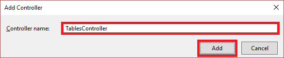
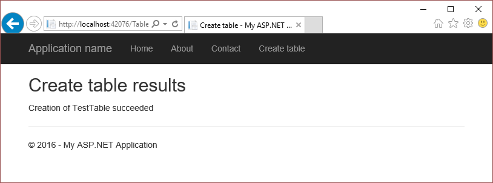
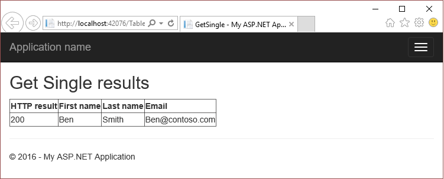
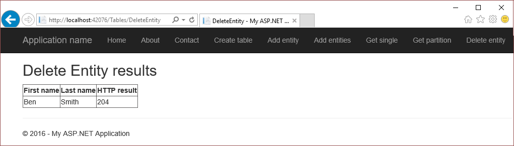

# Get started with Azure table storage and Visual Studio Connected Services (ASP.NET)
[!INCLUDE [storage-try-azure-tools-tables](../../includes/storage-try-azure-tools-tables.md)]

## Overview

Azure Table storage enables you to store large amounts of structured data. The service is a NoSQL datastore that accepts authenticated calls from inside and outside the Azure cloud. Azure tables are ideal for storing structured, non-relational data.

This tutorial shows how to write ASP.NET code for some common scenarios using Azure table storage entities. These scenarios include creating a table, and adding, querying, and deleting table entities. 

## Prerequisites

* [Microsoft Visual Studio](https://www.visualstudio.com/downloads/)
* [Azure storage account](../storage/common/storage-account-create.md)

[!INCLUDE [storage-table-concepts-include](../../includes/storage-table-concepts-include.md)]

[!INCLUDE [storage-create-account-include](../../includes/vs-storage-aspnet-getting-started-create-azure-account.md)]

[!INCLUDE [storage-development-environment-include](../../includes/vs-storage-aspnet-getting-started-setup-dev-env.md)]

### Create an MVC controller 

1. In the **Solution Explorer**, right-click **Controllers**, and, from the context menu, select **Add->Controller**.

	

1. On the **Add Scaffold** dialog, select **MVC 5 Controller - Empty**, and select **Add**.

	

1. On the **Add Controller** dialog, name the controller *TablesController*, and select **Add**.

	

1. Add the following *using* directives to the `TablesController.cs` file:

    ```csharp
	using Microsoft.Azure;
    using Microsoft.WindowsAzure.Storage;
    using Microsoft.WindowsAzure.Storage.Auth;
    using Microsoft.WindowsAzure.Storage.Table;
	```

### Create a model class

Many of the examples in this article use a **TableEntity**-derived class called **CustomerEntity**. The following steps guide you through declaring this class as a model class:

1. In the **Solution Explorer**, right-click **Models**, and, from the context menu, select **Add->Class**.

1. On the **Add New Item** dialog, name the class, **CustomerEntity**.

1. Open the `CustomerEntity.cs` file, and add the following **using** directive:

    ```csharp
	using Microsoft.WindowsAzure.Storage.Table;
    ```

1. Modify the class so that, when finished, the class is declared as in the following code. The class declares an entity class called **CustomerEntity** that uses the customer's first name as the row key and last name as the partition key.

    ```csharp
    public class CustomerEntity : TableEntity
    {
        public CustomerEntity(string lastName, string firstName)
        {
            this.PartitionKey = lastName;
            this.RowKey = firstName;
        }

        public CustomerEntity() { }

        public string Email { get; set; }
    }
    ```

## Create a table

The following steps illustrate how to create a table:

> [!NOTE]
> 
> This section assumes you have completed the steps in [Set up the development environment](#set-up-the-development-environment). 

1. Open the `TablesController.cs` file.

1. Add a method called **CreateTable** that returns an **ActionResult**.

    ```csharp
    public ActionResult CreateTable()
    {
		// The code in this section goes here.

        return View();
    }
    ```

1. Within the **CreateTable** method, get a **CloudStorageAccount** object that represents your storage account information. Use the following code to get the storage connection string and storage account information from the Azure service configuration: (Change *&lt;storage-account-name>* to the name of the Azure storage account you're accessing.)
   
    ```csharp
    CloudStorageAccount storageAccount = CloudStorageAccount.Parse(
       CloudConfigurationManager.GetSetting("<storage-account-name>_AzureStorageConnectionString"));
    ```

1. Get a **CloudTableClient** object represents a table service client.
   
    ```csharp
    CloudTableClient tableClient = storageAccount.CreateCloudTableClient();
    ```

1. Get a **CloudTable** object that represents a reference to the desired table name. The **CloudTableClient.GetTableReference** method does not make a request against table storage. The reference is returned whether or not the table exists. 
   
    ```csharp
    CloudTable table = tableClient.GetTableReference("TestTable");
    ```

1. Call the **CloudTable.CreateIfNotExists** method to create the table if it does not yet exist. The **CloudTable.CreateIfNotExists** method returns **true** if the table does not exist, and is successfully created. Otherwise, **false** is returned.    

    ```csharp
	ViewBag.Success = table.CreateIfNotExists();
    ```

1. Update the **ViewBag** with the name of the table.

    ```csharp
	ViewBag.TableName = table.Name;
    ```

1. In the **Solution Explorer**, expand the **Views** folder, right-click **Tables**, and from the context menu, select **Add->View**.

1. On the **Add View** dialog, enter **CreateTable** for the view name, and select **Add**.

1. Open `CreateTable.cshtml`, and modify it so that it looks like the following code snippet:

    ```csharp
	@{
	    ViewBag.Title = "Create Table";
	}
	
	<h2>Create Table results</h2>

	Creation of @ViewBag.TableName @(ViewBag.Success == true ? "succeeded" : "failed")
    ```

1. In the **Solution Explorer**, expand the **Views->Shared** folder, and open `_Layout.cshtml`.

1. After the last **Html.ActionLink**, add the following **Html.ActionLink**:

    ```html
	<li>@Html.ActionLink("Create table", "CreateTable", "Tables")</li>
    ```

1. Run the application, and select **Create table** to see results similar to the following screenshot:
  
	

	As mentioned previously, the **CloudTable.CreateIfNotExists** method returns **true** only when the table doesn't exist and is created. Therefore, if you run the app when the table exists, the method returns **false**. To run the app multiple times, you must delete the table before running the app again. Deleting the table can be done via the **CloudTable.Delete** method. You can also delete the table using the [Azure portal](https://go.microsoft.com/fwlink/p/?LinkID=525040) or the [Microsoft Azure Storage Explorer](../vs-azure-tools-storage-manage-with-storage-explorer.md).  

## Add an entity to a table

*Entities* map to C\# objects by using a custom class derived from
**TableEntity**. To add an entity to a table, create a
class that defines the properties of your entity. In this section, you'll 
see how to define an entity class that uses the customer's first name as the row
key and last name as the partition key. Together, an entity's partition
and row key uniquely identify the entity in the table. Entities with the
same partition key can be queried faster than entities with different
partition keys, but using diverse partition keys allows for greater scalability of parallel operations. For any property that should be stored in the table service,
the property must be a public property of a supported type that exposes both setting and retrieving values.
The entity class *must* declare a public parameter-less constructor.

> [!NOTE]
> 
> This section assumes you have completed the steps in [Set up the development environment](#set-up-the-development-environment).

1. Open the `TablesController.cs` file.

1. Add the following directive so that the code in the `TablesController.cs` file can access the **CustomerEntity** class:

    ```csharp
	using StorageAspnet.Models;
    ```

1. Add a method called **AddEntity** that returns an **ActionResult**.

    ```csharp
    public ActionResult AddEntity()
    {
		// The code in this section goes here.

        return View();
    }
    ```

1. Within the **AddEntity** method, get a **CloudStorageAccount** object that represents your storage account information. Use the following code to get the storage connection string and storage account information from the Azure service configuration: (Change *&lt;storage-account-name>* to the name of the Azure storage account you're accessing.)
   
    ```csharp
    CloudStorageAccount storageAccount = CloudStorageAccount.Parse(
       CloudConfigurationManager.GetSetting("<storage-account-name>_AzureStorageConnectionString"));
    ```

1. Get a **CloudTableClient** object represents a table service client.
   
    ```csharp
    CloudTableClient tableClient = storageAccount.CreateCloudTableClient();
    ```

1. Get a **CloudTable** object that represents a reference to the table to which you are going to add the new entity. 
   
    ```csharp
    CloudTable table = tableClient.GetTableReference("TestTable");
    ```

1. Instantiate and initialize the **CustomerEntity** class.

    ```csharp
    CustomerEntity customer1 = new CustomerEntity("Harp", "Walter");
    customer1.Email = "Walter@contoso.com";
    ```

1. Create a **TableOperation** object that inserts the customer entity.

    ```csharp
    TableOperation insertOperation = TableOperation.Insert(customer1);
    ```

1. Execute the insert operation by calling the **CloudTable.Execute** method. You can verify the result of the operation by inspecting the **TableResult.HttpStatusCode** property. A status code of 2xx indicates the action requested by the client was processed successfully. For example, successful insertions of new entities results in an HTTP status code of 204, meaning that the operation was successfully processed and the server did not return any content.

    ```csharp
	TableResult result = table.Execute(insertOperation);
    ```

1. Update the **ViewBag** with the table name, and the results of the insert operation.

    ```csharp
	ViewBag.TableName = table.Name;
	ViewBag.Result = result.HttpStatusCode;
    ```

1. In the **Solution Explorer**, expand the **Views** folder, right-click **Tables**, and from the context menu, select **Add->View**.

1. On the **Add View** dialog, enter **AddEntity** for the view name, and select **Add**.

1. Open `AddEntity.cshtml`, and modify it so that it looks like the following code snippet:

    ```csharp
	@{
	    ViewBag.Title = "Add entity";
	}
	
	<h2>Add entity results</h2>

	Insert of entity into @ViewBag.TableName @(ViewBag.Result == 204 ? "succeeded" : "failed")
    ```
1. In the **Solution Explorer**, expand the **Views->Shared** folder, and open `_Layout.cshtml`.

1. After the last **Html.ActionLink**, add the following **Html.ActionLink**:

    ```html
	<li>@Html.ActionLink("Add entity", "AddEntity", "Tables")</li>
    ```

1. Run the application, and select **Add entity** to see results similar to the following screenshot:
  
	

	You can verify that the entity was added by following the steps in the section, [Get a single entity](#get-a-single-entity). You can also use the [Microsoft Azure Storage Explorer](../vs-azure-tools-storage-manage-with-storage-explorer.md) to view all the entities for your tables.

## Add a batch of entities to a table

In addition to being able to [add an entity to a table one at a time](#add-an-entity-to-a-table), you can also add entities in batch. Adding entities in batch reduces the number of round-trips between your code and the Azure table service. The following steps illustrate how to add multiple entities to a table with a single insert operation:

> [!NOTE]
> 
> This section assumes you have completed the steps in [Set up the development environment](#set-up-the-development-environment).

1. Open the `TablesController.cs` file.

1. Add a method called **AddEntities** that returns an **ActionResult**.

    ```csharp
    public ActionResult AddEntities()
    {
		// The code in this section goes here.

        return View();
    }
    ```

1. Within the **AddEntities** method, get a **CloudStorageAccount** object that represents your storage account information. Use the following code to get the storage connection string and storage account information from the Azure service configuration: (Change *&lt;storage-account-name>* to the name of the Azure storage account you're accessing.)
   
    ```csharp
    CloudStorageAccount storageAccount = CloudStorageAccount.Parse(
       CloudConfigurationManager.GetSetting("<storage-account-name>_AzureStorageConnectionString"));
    ```

1. Get a **CloudTableClient** object represents a table service client.
   
    ```csharp
    CloudTableClient tableClient = storageAccount.CreateCloudTableClient();
    ```

1. Get a **CloudTable** object that represents a reference to the table to which you are going to add the new entities. 
   
    ```csharp
    CloudTable table = tableClient.GetTableReference("TestTable");
    ```

1. Instantiate some customer objects based on the **CustomerEntity** model class presented in the section, [Add an entity to a table](#add-an-entity-to-a-table).

    ```csharp
    CustomerEntity customer1 = new CustomerEntity("Smith", "Jeff");
    customer1.Email = "Jeff@contoso.com";

    CustomerEntity customer2 = new CustomerEntity("Smith", "Ben");
    customer2.Email = "Ben@contoso.com";
    ```

1. Get a **TableBatchOperation** object.

    ```csharp
    TableBatchOperation batchOperation = new TableBatchOperation();
    ```

1. Add entities to the batch insert operation object.

    ```csharp
    batchOperation.Insert(customer1);
    batchOperation.Insert(customer2);
    ```

1. Execute the batch insert operation by calling the **CloudTable.ExecuteBatch** method.   

    ```csharp
	IList<TableResult> results = table.ExecuteBatch(batchOperation);
    ```

1. The **CloudTable.ExecuteBatch** method returns a list of **TableResult** objects where each **TableResult** object can be examined to determine the success or failure of each individual operation. For this example, pass the list to a view and let the view display the results of each operation. 
 
    ```csharp
	return View(results);
    ```

1. In the **Solution Explorer**, expand the **Views** folder, right-click **Tables**, and from the context menu, select **Add->View**.

1. On the **Add View** dialog, enter **AddEntities** for the view name, and select **Add**.

1. Open `AddEntities.cshtml`, and modify it so that it looks like the following.

    ```csharp
	@model IEnumerable<Microsoft.WindowsAzure.Storage.Table.TableResult>
	@{
	    ViewBag.Title = "AddEntities";
	}
	
	<h2>Add-entities results</h2>
	
	<table border="1">
	    <tr>
	        <th>First name</th>
	        <th>Last name</th>
	        <th>HTTP result</th>
	    </tr>
	    @foreach (var result in Model)
	    {
	    <tr>
	        <td>@((result.Result as StorageAspnet.Models.CustomerEntity).RowKey)</td>
	        <td>@((result.Result as StorageAspnet.Models.CustomerEntity).PartitionKey)</td>
	        <td>@result.HttpStatusCode</td>
	    </tr>
	    }
	</table>
    ```

1. In the **Solution Explorer**, expand the **Views->Shared** folder, and open `_Layout.cshtml`.

1. After the last **Html.ActionLink**, add the following **Html.ActionLink**:

    ```html
	<li>@Html.ActionLink("Add entities", "AddEntities", "Tables")</li>
    ```

1. Run the application, and select **Add entities** to see results similar to the following screenshot:
  
	

	You can verify that the entity was added by following the steps in the section, [Get a single entity](#get-a-single-entity). You can also use the [Microsoft Azure Storage Explorer](../vs-azure-tools-storage-manage-with-storage-explorer.md) to view all the entities for your tables.

## Get a single entity

This section illustrates how to get a single entity from a table using the entity's row key and partition key. 

> [!NOTE]
> 
> This section assumes you have completed the steps in [Set up the development environment](#set-up-the-development-environment), and uses data from [Add a batch of entities to a table](#add-a-batch-of-entities-to-a-table). 

1. Open the `TablesController.cs` file.

1. Add a method called **GetSingle** that returns an **ActionResult**.

    ```csharp
    public ActionResult GetSingle()
    {
		// The code in this section goes here.

        return View();
    }
    ```

1. Within the **GetSingle** method, get a **CloudStorageAccount** object that represents your storage account information. Use the following code to get the storage connection string and storage account information from the Azure service configuration: (Change *&lt;storage-account-name>* to the name of the Azure storage account you're accessing.)
   
    ```csharp
    CloudStorageAccount storageAccount = CloudStorageAccount.Parse(
       CloudConfigurationManager.GetSetting("<storage-account-name>_AzureStorageConnectionString"));
    ```

1. Get a **CloudTableClient** object represents a table service client.
   
    ```csharp
    CloudTableClient tableClient = storageAccount.CreateCloudTableClient();
    ```

1. Get a **CloudTable** object that represents a reference to the table from which you are retrieving the entity. 
   
    ```csharp
    CloudTable table = tableClient.GetTableReference("TestTable");
    ```

1. Create a retrieve operation object that takes an entity object derived from **TableEntity**. The first parameter is the *partitionKey*, and the second parameter is the *rowKey*. Using the **CustomerEntity** class and data presented in the section [Add a batch of entities to a table](#add-a-batch-of-entities-to-a-table), the following code snippet queries the table for a **CustomerEntity** entity with a *partitionKey* value of "Smith" and a *rowKey* value of "Ben":

    ```csharp
    TableOperation retrieveOperation = TableOperation.Retrieve<CustomerEntity>("Smith", "Ben");
    ```

1. Execute the retrieve operation.   

    ```csharp
    TableResult result = table.Execute(retrieveOperation);
    ```

1. Pass the result to the view for display.

    ```csharp
    return View(result);
    ```

1. In the **Solution Explorer**, expand the **Views** folder, right-click **Tables**, and from the context menu, select **Add->View**.

1. On the **Add View** dialog, enter **GetSingle** for the view name, and select **Add**.

1. Open `GetSingle.cshtml`, and modify it so that it looks like the following code snippet:

    ```csharp
	@model Microsoft.WindowsAzure.Storage.Table.TableResult
	@{
	    ViewBag.Title = "GetSingle";
	}
	
	<h2>Get Single results</h2>
	
	<table border="1">
	    <tr>
	        <th>HTTP result</th>
	        <th>First name</th>
	        <th>Last name</th>
	        <th>Email</th>
	    </tr>
	    <tr>
	        <td>@Model.HttpStatusCode</td>
	        <td>@((Model.Result as StorageAspnet.Models.CustomerEntity).RowKey)</td>
	        <td>@((Model.Result as StorageAspnet.Models.CustomerEntity).PartitionKey)</td>
	        <td>@((Model.Result as StorageAspnet.Models.CustomerEntity).Email)</td>
	    </tr>
	</table>
	```

1. In the **Solution Explorer**, expand the **Views->Shared** folder, and open `_Layout.cshtml`.

1. After the last **Html.ActionLink**, add the following **Html.ActionLink**:

    ```html
	<li>@Html.ActionLink("Get single", "GetSingle", "Tables")</li>
    ```

1. Run the application, and select **Get Single** to see results similar to the following screenshot:
  
	

## Get all entities in a partition

As mentioned in the section, [Add an entity to a table](#add-an-entity-to-a-table), the 
combination of a partition and a row key uniquely identify an entity in a table. Entities with the
same partition key can be queried faster than entities with different
partition keys. This section illustrates how to query a table for all the entities from a 
specified partition.  

> [!NOTE]
> 
> This section assumes you have completed the steps in [Set up the development environment](#set-up-the-development-environment), and uses data from [Add a batch of entities to a table](#add-a-batch-of-entities-to-a-table). 

1. Open the `TablesController.cs` file.

1. Add a method called **GetPartition** that returns an **ActionResult**.

    ```csharp
    public ActionResult GetPartition()
    {
		// The code in this section goes here.

        return View();
    }
    ```

1. Within the **GetPartition** method, get a **CloudStorageAccount** object that represents your storage account information. Use the following code to get the storage connection string and storage account information from the Azure service configuration: (Change *&lt;storage-account-name>* to the name of the Azure storage account you're accessing.)
   
    ```csharp
    CloudStorageAccount storageAccount = CloudStorageAccount.Parse(
       CloudConfigurationManager.GetSetting("<storage-account-name>_AzureStorageConnectionString"));
    ```

1. Get a **CloudTableClient** object represents a table service client.
   
    ```csharp
    CloudTableClient tableClient = storageAccount.CreateCloudTableClient();
    ```

1. Get a **CloudTable** object that represents a reference to the table from which you are retrieving the entities. 
   
    ```csharp
    CloudTable table = tableClient.GetTableReference("TestTable");
    ```

1. Instantiate a **TableQuery** object specifying the query in the **Where** clause. Using the **CustomerEntity** class and data presented in the section [Add a batch of entities to a table](#add-a-batch-of-entities-to-a-table), the following code snippet queries the table for all entities where the **PartitionKey** (customer's last name) has a value of "Smith":

    ```csharp
    TableQuery<CustomerEntity> query = 
		new TableQuery<CustomerEntity>()
		.Where(TableQuery.GenerateFilterCondition("PartitionKey", QueryComparisons.Equal, "Smith"));
    ```

1. Within a loop, call the **CloudTable.ExecuteQuerySegmented** method passing the query object you instantiated in the previous step.  The **CloudTable.ExecuteQuerySegmented** method returns a **TableContinuationToken** object that - when **null** - indicates that there are no more entities to retrieve. Within the loop, use another loop to iterate over the returned entities. In the following code example, each returned entity is added to a list. Once the loop ends, the list is passed to a view for display: 

    ```csharp
    List<CustomerEntity> customers = new List<CustomerEntity>();
    TableContinuationToken token = null;
    do
    {
        TableQuerySegment<CustomerEntity> resultSegment = table.ExecuteQuerySegmented(query, token);
        token = resultSegment.ContinuationToken;

        foreach (CustomerEntity customer in resultSegment.Results)
        {
            customers.Add(customer);
        }
    } while (token != null);

    return View(customers);
    ```

1. In the **Solution Explorer**, expand the **Views** folder, right-click **Tables**, and from the context menu, select **Add->View**.

1. On the **Add View** dialog, enter **GetPartition** for the view name, and select **Add**.

1. Open `GetPartition.cshtml`, and modify it so that it looks like the following code snippet:

    ```csharp
	@model IEnumerable<StorageAspnet.Models.CustomerEntity>
	@{
	    ViewBag.Title = "GetPartition";
	}
	
	<h2>Get Partition results</h2>
	
	<table border="1">
	    <tr>
	        <th>First name</th>
	        <th>Last name</th>
	        <th>Email</th>
	    </tr>
	    @foreach (var customer in Model)
	    {
	    <tr>
	        <td>@(customer.RowKey)</td>
	        <td>@(customer.PartitionKey)</td>
	        <td>@(customer.Email)</td>
	    </tr>
	    }
	</table>
	```

1. In the **Solution Explorer**, expand the **Views->Shared** folder, and open `_Layout.cshtml`.

1. After the last **Html.ActionLink**, add the following **Html.ActionLink**:

    ```html
	<li>@Html.ActionLink("Get partition", "GetPartition", "Tables")</li>
    ```

1. Run the application, and select **Get Partition** to see results similar to the following screenshot:
  
	

## Delete an entity

This section illustrates how to delete an entity from a table.

> [!NOTE]
> 
> This section assumes you have completed the steps in [Set up the development environment](#set-up-the-development-environment), and uses data from [Add a batch of entities to a table](#add-a-batch-of-entities-to-a-table). 

1. Open the `TablesController.cs` file.

1. Add a method called **DeleteEntity** that returns an **ActionResult**.

    ```csharp
    public ActionResult DeleteEntity()
    {
		// The code in this section goes here.

        return View();
    }
    ```

1. Within the **DeleteEntity** method, get a **CloudStorageAccount** object that represents your storage account information. Use the following code to get the storage connection string and storage account information from the Azure service configuration: (Change *&lt;storage-account-name>* to the name of the Azure storage account you're accessing.)
   
    ```csharp
    CloudStorageAccount storageAccount = CloudStorageAccount.Parse(
       CloudConfigurationManager.GetSetting("<storage-account-name>_AzureStorageConnectionString"));
    ```

1. Get a **CloudTableClient** object represents a table service client.
   
    ```csharp
    CloudTableClient tableClient = storageAccount.CreateCloudTableClient();
    ```

1. Get a **CloudTable** object that represents a reference to the table from which you are deleting the entity. 
   
    ```csharp
    CloudTable table = tableClient.GetTableReference("TestTable");
    ```

1. Create a delete operation object that takes an entity object derived from **TableEntity**. In this case, we use the **CustomerEntity** class and data presented in the section [Add a batch of entities to a table](#add-a-batch-of-entities-to-a-table). The entity's **ETag** must be set to a valid value.  

    ```csharp
    TableOperation deleteOperation = 
	    TableOperation.Delete(new CustomerEntity("Smith", "Ben") { ETag = "*" } );
    ```

1. Execute the delete operation.   

    ```csharp
    TableResult result = table.Execute(deleteOperation);
    ```

1. Pass the result to the view for display.

    ```csharp
    return View(result);
    ```

1. In the **Solution Explorer**, expand the **Views** folder, right-click **Tables**, and from the context menu, select **Add->View**.

1. On the **Add View** dialog, enter **DeleteEntity** for the view name, and select **Add**.

1. Open `DeleteEntity.cshtml`, and modify it so that it looks like the following code snippet:

    ```csharp
	@model Microsoft.WindowsAzure.Storage.Table.TableResult
	@{
	    ViewBag.Title = "DeleteEntity";
	}
	
	<h2>Delete Entity results</h2>
	
	<table border="1">
	    <tr>
	        <th>First name</th>
	        <th>Last name</th>
	        <th>HTTP result</th>
	    </tr>
	    <tr>
	        <td>@((Model.Result as StorageAspnet.Models.CustomerEntity).RowKey)</td>
	        <td>@((Model.Result as StorageAspnet.Models.CustomerEntity).PartitionKey)</td>
	        <td>@Model.HttpStatusCode</td>
	    </tr>
	</table>

	```

1. In the **Solution Explorer**, expand the **Views->Shared** folder, and open `_Layout.cshtml`.

1. After the last **Html.ActionLink**, add the following **Html.ActionLink**:

    ```html
	<li>@Html.ActionLink("Delete entity", "DeleteEntity", "Tables")</li>
    ```

1. Run the application, and select **Delete entity** to see results similar to the following screenshot:
  
	

## Next steps
View more feature guides to learn about additional options for storing data in Azure.

  * [Get started with Azure blob storage and Visual Studio Connected Services (ASP.NET)](../storage/vs-storage-aspnet-getting-started-blobs.md)
  * [Get started with Azure queue storage and Visual Studio Connected Services (ASP.NET)](../storage/vs-storage-aspnet-getting-started-queues.md)
