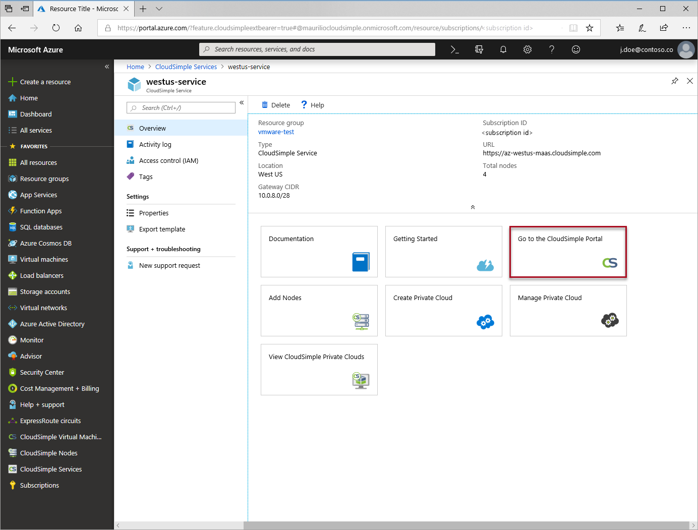
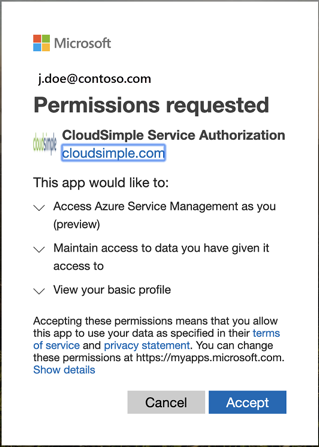
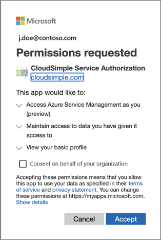
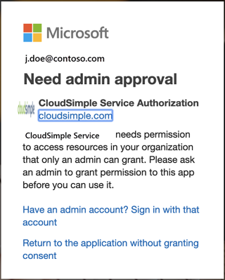

--- 
title: Access Azure VMware Solution by CloudSimple - Portal 
description: Describes how to access VMware Solution by CloudSimple portal from Azure portal
author: sharaths-cs 
ms.author: b-shsury 
ms.date: 06/04/2019 
ms.topic: article 
ms.service: azure-vmware-cloudsimple 
ms.reviewer: cynthn 
manager: dikamath 
---

# Access the VMware Solution by CloudSimple portal from the Azure portal

Single sign-on is supported for access to the CloudSimple portal. After you sign in to the Azure portal, you can access the CloudSimple portal without signing in again. The first time you access the CloudSimple portal you're prompted to authorize the [CloudSimple Service Authorization](#consent-to-cloudsimple-service-authorization-application) application.  Authorization is a one-time action.

## Before you begin

Users with builtin **Owner** and **Contributor** roles can access CloudSimple portal.  The roles must be configured on the resource group where CloudSimple service is deployed.  The roles can also be configured on the CloudSimple service object.  For more information on checking your role, see [View role assignments](https://docs.microsoft.com/azure/role-based-access-control/check-access) article. Only users with built-in **Owner** and **Contributor** roles can access the CloudSimple portal.  The roles must be configured on the subscription.  For more information on checking your role, see [View role assignments](https://docs.microsoft.com/azure/role-based-access-control/check-access) article.

If you are using custom roles, the role should have any of the following operations under ```Actions```.  For more information on custom roles, see [Custom roles for Azure resources](https://docs.microsoft.com/azure/role-based-access-control/custom-roles).  If any of the operations is a part of ```NotActions```, the user cannot access CloudSimple portal.

```
Microsoft.VMwareCloudSimple/*
Microsoft.VMwareCloudSimple/*/write
Microsoft.VMwareCloudSimple/dedicatedCloudServices/*
Microsoft.VMwareCloudSimple/dedicatedCloudServices/*/write
```

## Sign in to Azure

Sign in to the Azure portal at [https://portal.azure.com](https://portal.azure.com).

## Access the CloudSimple portal

1. Select **All services**.

2. Search for **CloudSimple Services**.

3. Select the CloudSimple service on which you want to create your Private Cloud.

4. On the **Overview** page, click **Go to the CloudSimple portal**.  If you're accessing the CloudSimple portal from the Azure portal for the first time, you'll be prompted to authorize the [CloudSimple Service Authorization](#consent-to-cloudsimple-service-authorization-application) application. 

    

> [!NOTE]
> If you select a Private Cloud operation (such as creating or expanding a Private Cloud) directly from the Azure portal, the CloudSimple portal opens to the indicated page.

In the CloudSimple portal, select **Home** on the side menu to display summary information about your Private Clouds. The resources and capacity of your Private Clouds are shown, along with alerts and tasks that require attention. For common tasks, click the named icons at the top of the page.


## Consent to CloudSimple Service Authorization application

Launching the CloudSimple portal from the Azure portal for the first time requires your consent for the CloudSimple Service Authorization application.  Select **Accept** to grant requested permissions and access the CloudSimple portal.



If you have global administrator privilege, you can consent for your organization.  Select **Consent on behalf of your organization**.



If your permissions don't permit access to the CloudSimple portal, contact the global administrator of your tenant to grant required permissions.  A global administrator can consent on behalf of your organization.



## Next steps

* Learn how to [Create a private cloud](https://docs.microsoft.com/azure/vmware-cloudsimple/create-private-cloud/)
* Learn how to [Configure a private cloud environment](quickstart-create-private-cloud.md)
