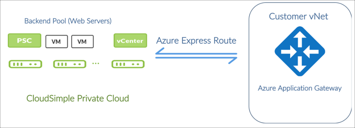

--- 
title: Use Azure Application Gateway with VMware virtual machines
description: Describes how to use the Azure application gateway to manage incoming web traffic for web servers running in VMware virtual machines win the CloudSimple Private Cloud environment
author: sharaths-cs
ms.author: b-shsury 
ms.date: 08/16/2019 
ms.topic: article 
ms.service: azure-vmware-cloudsimple 
ms.reviewer: cynthn 
manager: dikamath 
---

# Use Azure Application Gateway with VMware virtual machines in the CloudSimple Private Cloud environment

You can use the Azure Application Gateway to manage incoming web traffic for your web servers running in VMware virtual machines within your CloudSimple Private Cloud environment.

By leveraging Azure Application Gateway in a public-private hybrid deployment, you can manage web traffic to your applications, provide a secure front-end, and offload TLS processing for their services running in VMware environment. Azure Application Gateway routes incoming web traffic to backend pool instances residing in VMware environments according to configured rules and health probes.

This Azure Application Gateway solution requires you to:

* Have an Azure subscription.
* Create and configure an Azure virtual network, and a subnet within the virtual network.
* Create and configure NSG rules and peer your vNet using ExpressRoute to your CloudSimple Private Cloud.
* Create & Configure your Private Cloud.
* Create & Configure your Azure Application Gateway.

## Azure Application Gateway deployment scenario

In this scenario, the Azure Application Gateway runs in your Azure virtual network. The virtual network is connected to your Private Cloud over an ExpressRoute circuit. All the subnets in the Private Cloud are IP reachable from the virtual network subnets.

## How to deploy the solution

The deployment process consists of the following tasks:

1. [Verify that prerequisites are met](#1-verify-prerequisites)
2. [Connect your Azure virtual connection to the Private Cloud](#2-connect-your-azure-virtual-network-to-your-private-cloud)
3. [Deploy an Azure application gateway](#3-deploy-an-azure-application-gateway)
4. [Create and Configure Web Server VM pool in your Private Cloud](#4-create-and-configure-a-web-server-vm-pool-in-your-private-cloud)

## 1. Verify prerequisites

Verify that these prerequisites are met:

* An Azure Resource Manager and a virtual network is already created.
* A dedicated subnet (for Application Gateway) within your Azure virtual network is already created.
* A CloudSimple Private Cloud is already created.
* There is no IP conflict between IP subnets in the virtual network and subnets in the Private Cloud.

## 2. Connect your Azure virtual network to your Private Cloud

To connect your Azure virtual network to your Private Cloud, follow this process.

1. [In the CloudSimple portal, copy the ExpressRoute peering information](virtual-network-connection.md).

2. [Configure a virtual network gateway for your Azure virtual network](../expressroute/expressroute-howto-add-gateway-portal-resource-manager.md).

3. [Link your virtual network to the CloudSimple ExpressRoute circuit](../expressroute/expressroute-howto-linkvnet-portal-resource-manager.md#connect-a-vnet-to-a-circuit---different-subscription).

4. [Use the peering information that you copied to link your virtual network to the ExpressRoute circuit](virtual-network-connection.md).

## 3. Deploy an Azure application gateway

The detailed instructions for this are available in [Create an application gateway with path-based routing rules using the Azure portal](../application-gateway/create-url-route-portal.md). Here is a summary of the required steps:

1. Create a virtual network in your subscription and resource group.
2. Create a subnet (to be used as the dedicated subnet) within your virtual network.
3. Create a standard Application Gateway (optionally enable WAF):  From the Azure portal homepage, click  **Resource** > **Networking** > **Application Gateway** from the top left side of the page. Select the standard SKU and size and provide Azure subscription, resource group and location information. If required, create a new public IP for this application gateway and provide details on the virtual network and the dedicated subnet for the application gateway.
4. Add a backend pool with virtual machines and add it to your application gateway.

## 4. Create and configure a web server VM pool in your Private Cloud

In vCenter, create VMs with the OS and web server of your choice (such as Windows/IIS or Linux/Apache). Choose a subnet/VLAN that is designated for the web tier in your Private Cloud. Verify that at least one vNIC of the web server VMs is on the web tier subnet.
