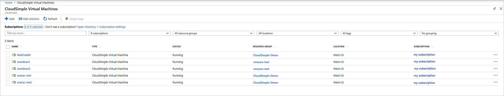

--- 
title: Azure VMware Solution by CloudSimple - Create a virtual machine in Azure with VM templates
description: Describes how to create virtual machines in Azure using VM templates on the VMware infrastructure for your CloudSimple Private Cloud
author: shortpatti
ms.author: v-patsho
ms.date: 08/16/2019 
ms.topic: article 
ms.service: azure-vmware-cloudsimple 
ms.reviewer: cynthn 
manager: dikamath 
---

# Create a virtual machine in Azure using VM templates on the VMware infrastructure

You can create a virtual machine in the Azure portal by using VM templates on the VMware infrastructure that your CloudSimple administrator has enabled for your subscription.

## Sign in to Azure

Sign in to the [Azure portal](https://portal.azure.com).

## Create CloudSimple virtual machine

1. Select **All services**.

2. Search for **CloudSimple Virtual Machines**.

3. Click **Add**.

    

4. Enter basic information click **Next:Size**.

    > [!NOTE]
    > CloudSimple virtual machine creation on Azure requires a VM template.  This VM template should exist on your Private Cloud vCenter.  Create a virtual machine on your Private Cloud from vCenter UI with desired operating system and configurations.  Using instructions in [Clone a Virtual Machine to a Template in the vSphere Web Client](https://docs.vmware.com/en/VMware-vSphere/6.5/com.vmware.vsphere.vm_admin.doc/GUID-FE6DE4DF-FAD0-4BB0-A1FD-AFE9A40F4BFE_copy.html), create a template.

    

    | Field | Description |
    | ------------ | ------------- |
    | Subscription | Azure subscription associated with your Private Cloud.  |
    | Resource Group | Resource group to which the VM will be assigned. You can select an existing group or create a new one. |
    | Name | Name to identify the VM.  |
    | Location | Azure region in which this VM is hosted.  |
    | Private Cloud | CloudSimple Private Cloud where you want to create the virtual machine. |
    | Resource Pool | Mapped resource pool for the VM. Select from the available resource pools. |
    | vSphere Template | vSphere template for the VM.  |
    | User name | User name of the VM administrator (for Windows templates)|
    | Password  Confirm password | Password for the VM administrator (for Windows templates).  |

5. Select the number of cores and memory capacity for the VM and click **Next:Configurations**. Select the checkbox if you want to expose full CPU virtualization to the guest operating system so that applications that require hardware virtualization can run on virtual machines without binary translation or paravirtualization. For more information, see the VMware article [Expose VMware Hardware Assisted Virtualization](https://docs.vmware.com/en/VMware-vSphere/6.5/com.vmware.vsphere.vm_admin.doc/GUID-2A98801C-68E8-47AF-99ED-00C63E4857F6.html).

    

6. Configure network interfaces and disks as described in the following tables and click **Review + create**.

    

    For network interfaces, click **Add network interface** and configure the following settings.

    | Control | Description |
    | ------------ | ------------- |
    | Name | Enter a name to identify the interface.  |
    | Network | Select from the list of configured distributed port group in your Private Cloud vSphere.  |
    | Adapter | Select a vSphere adaptor from the list of available types configured for the VM. For more information, see the VMware knowledge base article [Choosing a network adapter for your virtual machine](https://kb.vmware.com/s/article/1001805). |
    | Power on at Boot | Choose whether to enable the NIC hardware when the VM is booted. The default is **Enable**. |

    For disks, click **Add disk** and configure the following settings.

    | Item | Description |
    | ------------ | ------------- |
    | Name | Enter a name to identify the disk.  |
    | Size | Select one of the available sizes.  |
    | SCSI Controller | Select a SCSI controller for the disk.  |
    | Mode | Determines how the disk participates in snapshots. Choose one of these options:   - Independent persistent: All data written to the disk is written permanently.  - Independent non-persistent: Changes written to the disk are discarded when you power off or reset the virtual machine.  Independent non-persistent mode allows you to always restart the VM in the same state. For more information, see the [VMware documentation](https://docs.vmware.com/en/VMware-vSphere/6.5/com.vmware.vsphere.vm_admin.doc/GUID-8B6174E6-36A8-42DA-ACF7-0DA4D8C5B084.html).

7. Once validation completes, review the settings and click **Create**. To make any changes, click the tabs at the top or click.

    

## View list of CloudSimple virtual machines

1. Select **All services**.

2. Search for **CloudSimple Virtual Machines**.

3. Select the on which your Private Cloud was created.

    

List of CloudSimple virtual machines includes virtual machines created from Azure portal.  Virtual machines created on Private Cloud vCenter in the mapped vCenter resource pool will be shown in the list.  
