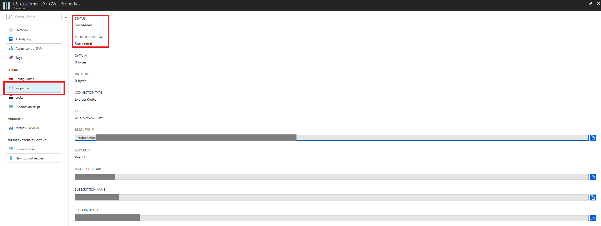

--- 
title: Azure VMware Solution by CloudSimple - Connect Private Cloud to Azure network using ExpressRoute
description: Describes how to connect your CloudSimple Private Cloud environment to the Azure virtual network using ExpressRoute
author: shortpatti
ms.author: v-patsho
ms.date: 08/14/2019 
ms.topic: article 
ms.service: azure-vmware-cloudsimple 
ms.reviewer: cynthn 
manager: dikamath 
---

# Connect your CloudSimple Private Cloud environment to the Azure virtual network using ExpressRoute

Your CloudSimple Private Cloud can be connected to your Azure virtual network using Azure ExpressRoute.  This high bandwidth, low latency connection allows you to access services running in your Azure subscription from your Private Cloud environment.

Virtual network connection allows you to:

* Use Azure as a backup target for virtual machines on your Private Cloud.
* Deploy KMS servers in your Azure subscription to encrypt your Private Cloud vSAN datastore.
* Use hybrid applications where the web tier of the application runs in the public cloud while the application and database tiers run in your Private Cloud.

## Set up a virtual network connection

To set up the virtual network connection to your Private Cloud, you need your authorization key, peer circuit URI, and access to your Azure subscription. This information is available on the Virtual Network Connection page in the CloudSimple portal. For instructions, see [Obtain peering information for Azure virtual network to CloudSimple connection](virtual-network-connection.md). If you have any trouble obtaining the information, submit a <a href="https://portal.azure.com/#blade/Microsoft_Azure_Support/HelpAndSupportBlade/newsupportrequest" target="_blank">support request</a>.

> [!TIP]
> If you already have a Azure virtual network, gateway subnet, and virtual network gateway, you can skip to step 4.

1. Create a virtual network on your Azure subscription and verify that the address space you select is different from the address space of your Private Cloud.  If you already have an Azure virtual network, you can use the existing one.  For details, see [Create a virtual network using the Azure portal](../virtual-network/quick-create-portal.md).
2. Create the gateway subnet on your Azure virtual network.  If you already have a gateway subnet in your Azure virtual network, you can use the existing one. For details, see [Create the gateway subnet](../expressroute/expressroute-howto-add-gateway-portal-resource-manager.md#create-the-gateway-subnet).
3. Create the virtual network gateway on your virtual network.  If you have an existing virtual network gateway, you can use the existing one. For details, see [Create the virtual network gateway](../expressroute/expressroute-howto-add-gateway-portal-resource-manager.md#create-the-virtual-network-gateway).
4. Create the connection between your virtual network and your Private Cloud by redeeming the authorization key as described in [Connect a virtual network to a circuit - different subscription](../expressroute/expressroute-howto-linkvnet-portal-resource-manager.md#connect-a-vnet-to-a-circuit---different-subscription).

> [!WARNING]
> If you are using an existing virtual network gateway and it has an ExpressRoute connection to the same location as the CloudSimple ExpressRoute circuit, the connection will not be established.  Create a new virtual network and follow the previous steps.

## Test the virtual network connection

After the connection is created, you can check the status of the connection by selecting **Properties** under **Settings**.  Status and Provisioning State should show **Succeeded**.

To test the virtual network connection:

1. Create a virtual machine in your Azure subscription.
2. Find the IP address of your Private Cloud vCenter (refer to your welcome email).
3. Ping your Cloud vCenter from the virtual machine created in your Azure virtual network.
4. Ping your Azure virtual machine from a virtual machine running in your Private Cloud vCenter.

If you have any issues establishing the connection, submit a <a href="https://portal.azure.com/#blade/Microsoft_Azure_Support/HelpAndSupportBlade/newsupportrequest" target="_blank">support request</a>.
