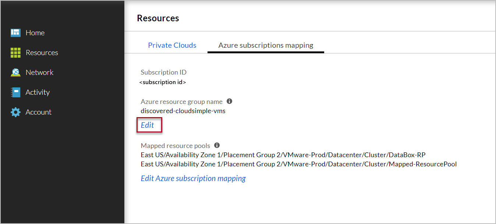
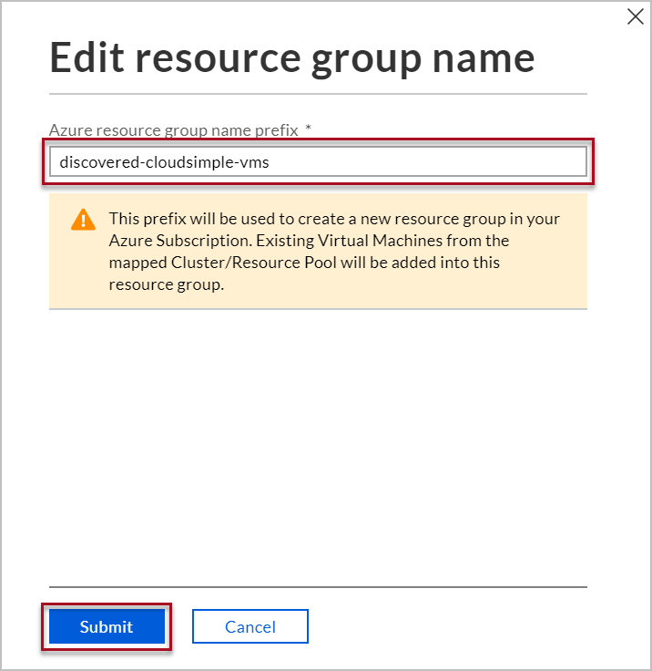

--- 
title: Map Azure subscription to resource pools on Azure VMware Solution by CloudSimple
description: Describes how to map a resource pool on Azure VMware Solution by CloudSimple to your Azure subscription
author: sharaths-cs
ms.author: b-shsury
ms.date: 06/05/2019
ms.topic: article
ms.service: vmware
ms.reviewer: cynthn
manager: dikamath
---

# Map resource pools from your Private Cloud to your Azure subscription

Azure subscription mapping allows you to map resource pools from your Private Cloud vCenter to your Azure subscription. You can map only the subscription where you've created the CloudSimple service.  Creating a VMware virtual machine from the Azure portal deploys the virtual machine in the mapped resource pool.  In the CloudSimple portal, you can view and manage the Azure subscription for your Private Clouds.

A subscription can be mapped to multiple vCenter resource pools of a private cloud.  You have to map resource pools of each private cloud.  Only the mapped resource pools will be available for creating a VMware virtual machine from the Azure portal.

> [!IMPORTANT]
> Mapping a resource pool also  maps any child resource pools. A parent resource pool cannot be mapped if any child resource pools are already mapped.

## Before you begin

This article assumes you have a CloudSimple service and private cloud in your subscription.  To create a CloudSimple service, see [Quickstart - Create service](quickstart-create-cloudsimple-service.md).  If you need to create a private cloud, see [Quickstart - Configure a private cloud environment](quickstart-create-private-cloud.md).

You can map the vCenter cluster (root resource pool) to your subscription.  If you want to create a new resource pool, see [Create a Resource Pool](https://docs.vmware.com/en/VMware-vSphere/6.7/com.vmware.vsphere.resmgmt.doc/GUID-0F6C6709-A5DA-4D38-BE08-6CB1002DD13D.html) article on VMware documentation site.

## Default resource group

Creating a new CloudSimple virtual machine from Azure portal allows you to select the resource group.  A virtual machine created on private cloud vCenter in a mapped resource pool will be visible on Azure portal.  The discovered virtual machine will be placed in the default Azure resource group.  You can change the name of the default resource group.

## Map Azure subscription

1. Access the [CloudSimple portal](access-cloudsimple-portal.md).

2. Open the **Resources** page and select the private cloud that you want to map.

3. Select **Azure subscriptions mapping**.

4. Click **Edit Azure subscription mapping**.

5. To map available resource pools, select them on the left and click the right-facing arrow.

6. To remove mappings, select them on the right and click the left-facing arrow.

    

7. Click **OK**.

## Change default resource group name

1. Access the [CloudSimple portal](access-cloudsimple-portal.md).

2. Open the **Resources** page and select the private cloud that you want to map.

3. Select **Azure subscriptions mapping**.

4. Click **Edit** under Azure resource group name.

    

5. Enter a new name for the resource group and click **Submit**.

    

## Next steps

* [Consume VMware VMs on Azure](quickstart-create-vmware-virtual-machine.md)
* Learn more about [CloudSimple virtual machines](cloudsimple-virtual-machines.md)