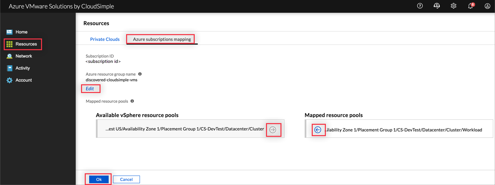

--- 
title: Create resource pools with Azure subscription mapping
titleSuffix: Azure VMware Solution by CloudSimple
description: Describes how to create resource pools for your Private Cloud through Azure subscription mapping
author: sharaths-cs 
ms.author: b-shsury 
ms.date: 08/14/2019 
ms.topic: article 
ms.service: azure-vmware-cloudsimple 
ms.reviewer: cynthn 
manager: dikamath 
---

# Create resource pools for your Private Cloud with Azure subscription mapping
Azure subscription mapping allows you to create resource pools for your Private Cloud from the available vSphere resource pools. In the CloudSimple portal, you can view and manage the Azure subscription for your Private Clouds.

> [!NOTE]
> Mapping a resource pool also maps any child resource pools. A parent resource pool cannot be mapped if any child resource pools are already mapped.

1. [Access the CloudSimple portal](access-cloudsimple-portal.md).
2. Open the **Resources** page and select **Azure subscriptions mapping**.  
3. Click **Edit Azure subscription mapping**.  
4. To map available resource pools, select them on the left and click the right-facing arrow. 
5. To remove mappings, select them on the right and click the left-facing arrow. 

    

6. Click **OK**.
