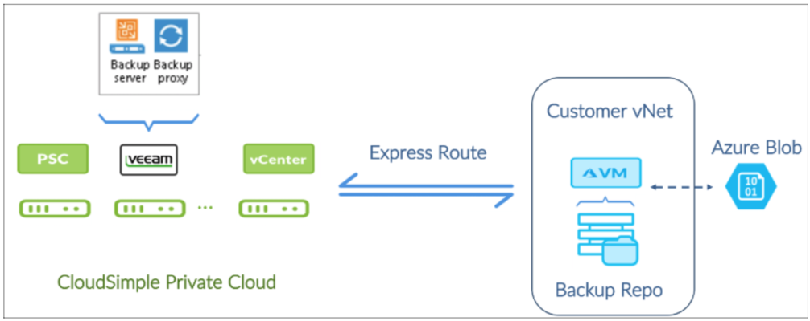
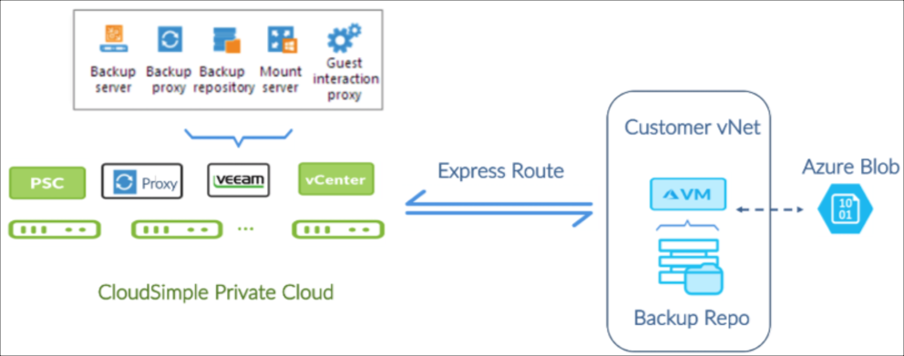
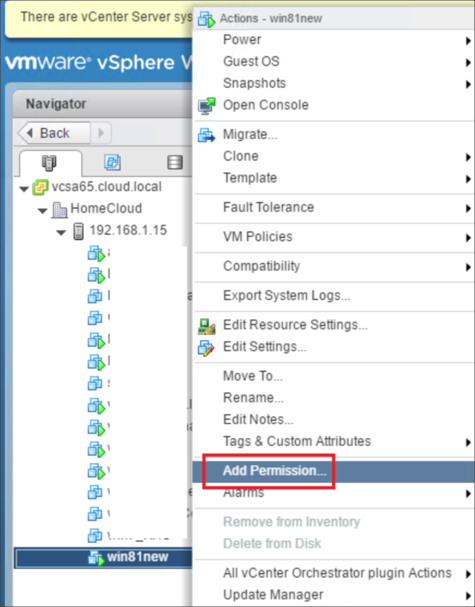

--- 
title: Azure VMware Solution by CloudSimple - Back up workload virtual machines on Private Cloud using Veeam
description: Describes how you can back up your virtual machines that are running in an Azure-based CloudSimple Private Cloud using Veeam B&R 9.5
author: sharaths-cs
ms.author: b-shsury 
ms.date: 08/16/2019 
ms.topic: article 
ms.service: azure-vmware-cloudsimple 
ms.reviewer: cynthn 
manager: dikamath 
---

# Back up workload VMs on CloudSimple Private Cloud using Veeam B&R

This guide describes how you can back up your virtual machines that are running in an Azure-based CloudSimple Private Cloud by using Veeam B&R 9.5.

## About the Veeam back up and recovery solution

The Veeam solution includes the following components.

**Backup Server**

The backup server is a Windows server (VM) that serves as the control center for Veeam and performs these functions: 

* Coordinates backup, replication, recovery verification, and restore tasks
* Controls job scheduling and resource allocation
* Allows you to set up and manage backup infrastructure components and specify global settings for the backup infrastructure

**Proxy Servers**

Proxy servers are installed between the backup server and other components of the backup infrastructure. They manage the following functions:

* Retrieval of VM data from the production storage
* Compression
* Deduplication
* Encryption
* Transmission of data to the backup repository

**Backup repository**

The backup repository is the storage location where Veeam keeps backup files, VM copies, and metadata for replicated VMs.  The repository can be a Windows or Linux server with local disks (or mounted NFS/SMB) or a hardware storage deduplication appliance.

### Veeam deployment scenarios
You can leverage Azure to provide a backup repository and a storage target for long term backup and archiving. All the backup network traffic between VMs in the Private Cloud and the backup repository in Azure travels over a high bandwidth, low latency link. Replication traffic across regions travels over the internal Azure backplane network, which lowers bandwidth costs for users.

**Basic deployment**

For environments with less than 30 TB to back up, CloudSimple recommends the following configuration:

* Veeam backup server and proxy server installed on the same VM in the Private Cloud.
* A Linux based primary backup repository in Azure configured as a target for backup jobs.
* `azcopy` used to copy the data from the primary backup repository to an Azure blob container that is replicated to another region.



**Advanced deployment**

For environments with more than 30 TB to back up, CloudSimple recommends the following configuration:

* One proxy server per node in the vSAN cluster, as recommended by Veeam.
* Windows based primary backup repository in the Private Cloud to cache five days of data for fast restores.
* Linux backup repository in Azure as a target for backup copy jobs for longer duration retention. This repository should be configured as a scale-out backup repository.
* `azcopy` used to copy the data from the primary backup repository to an Azure blob container that is replicated to another region.



In the previous figure, notice that the backup proxy is a VM with Hot Add access to workload VM disks on the vSAN datastore. Veeam uses Virtual Appliance backup proxy transport mode for vSAN.

## Requirements for Veeam solution on CloudSimple

The Veeam solution requires you to do the following:

* Provide your own Veeam licenses.
* Deploy and manage Veeam to backup the workloads running in the CloudSimple Private Cloud.

This solution provides you with full control over the Veeam backup tool and offers the choice to use the native Veeam interface or the Veeam vCenter plug-in to manage VM backup jobs.

If you are an existing Veeam user, you can skip the section on Veeam Solution Components and directly proceed to [Veeam Deployment Scenarios](#veeam-deployment-scenarios).

## Install and configure Veeam backups in your CloudSimple Private Cloud

The following sections describe how to install and configure a Veeam backup solution for your CloudSimple Private Cloud.

The deployment process consists of these steps:

1. [vCenter UI: Set up infrastructure services in your Private Cloud](#vcenter-ui-set-up-infrastructure-services-in-your-private-cloud)
2. [CloudSimple portal: Set up Private Cloud networking for Veeam](#cloudsimple-private-cloud-set-up-private-cloud-networking-for-veeam)
3. [CloudSimple portal: Escalate Privileges](#cloudsimple-private-cloud-escalate-privileges-for-cloudowner)
4. [Azure portal: Connect your virtual network to the Private Cloud](#azure-portal-connect-your-virtual-network-to-the-private-cloud)
5. [Azure portal: Create a backup repository in Azure](#azure-portal-connect-your-virtual-network-to-the-private-cloud)
6. [Azure portal: Configure Azure blob storage for long term data retention](#configure-azure-blob-storage-for-long-term-data-retention)
7. [vCenter UI of Private Cloud: Install Veeam B&R](#vcenter-console-of-private-cloud-install-veeam-br)
8. [Veeam Console: Configure Veeam Backup & Recovery software](#veeam-console-install-veeam-backup-and-recovery-software)
9. [CloudSimple portal: Set up Veeam access and de-escalate privileges](#cloudsimple-portal-set-up-veeam-access-and-de-escalate-privileges)

### Before you begin

The following are required before you begin Veeam deployment:

* An Azure subscription owned by you
* A pre-created Azure resource group
* An Azure virtual network in your subscription
* An Azure storage account
* A [Private Cloud](create-private-cloud.md) created using the CloudSimple portal.  

The following items are needed during the implementation phase:

* VMware templates for Windows to install Veeam (such as Windows Server 2012 R2 - 64 bit image)
* One available VLAN identified for the backup network
* CIDR of the subnet to be assigned to the backup network
* Veeam 9.5 u3 installable media (ISO) uploaded to the vSAN datastore of the Private Cloud

### vCenter UI: Set up infrastructure services in your Private Cloud

Configure infrastructure services in the Private Cloud to make it easy to manage your workloads and tools.

* You can add an external identity provider as described in [Set up vCenter identity sources to use Active Directory](set-vcenter-identity.md) if any of the following apply:

  * You want to identify users from your on-premises Active Directory (AD) in your Private Cloud.
  * You want to set up an AD in your Private Cloud for all users.
  * You want to use Azure AD.
* To provide IP address lookup, IP address management, and name resolution services for your workloads in the Private Cloud, set up a DHCP and DNS server as described in [Set up DNS and DHCP applications and workloads in your CloudSimple Private Cloud](dns-dhcp-setup.md).

### CloudSimple Private Cloud: Set up Private Cloud networking for Veeam

Access the CloudSimple portal to set up Private Cloud networking for the Veeam solution.

Create a VLAN for the backup network and assign it a subnet CIDR. For instructions, see [Create and manage VLANs/Subnets](create-vlan-subnet.md).

Create firewall rules between the management subnet and the backup network to allow network traffic on ports used by Veeam. See the Veeam topic [Used Ports](https://helpcenter.veeam.com/docs/backup/vsphere/used_ports.html?ver=95). For instructions on firewall rule creation, see [Set up firewall tables and rules](firewall.md).

The following table provides a port list.

| Icon | Description | Icon | Description |
| ------------ | ------------- | ------------ | ------------- |
| Backup Server  | vCenter  | HTTPS / TCP  | 443 |
| Backup Server <br> *Required for deploying Veeam Backup & Replication components* | Backup Proxy  | TCP/UDP  | 135, 137 to 139 and 445 |
    | Backup Server   | DNS  | UDP  | 53  | 
    | Backup Server   | Veeam Update Notification Server  | TCP  | 80  | 
    | Backup Server   | Veeam License Update Server  | TCP  | 443  | 
    | Backup Proxy   | vCenter |   |   | 
    | Backup Proxy  | Linux Backup Repository   | TCP  | 22  | 
    | Backup Proxy  | Windows Backup Repository  | TCP  | 49152 - 65535   | 
    | Backup Repository  | Backup Proxy  | TCP  | 2500 -5000  | 
    | Source Backup Repository<br> *Used for backup copy jobs*  | Target Backup Repository  | TCP  | 2500 - 5000  | 

Create firewall rules between the workload subnet and the backup network as described in [Set up firewall tables and rules](firewall.md).  For application aware backup and restore, [additional ports](https://helpcenter.veeam.com/docs/backup/vsphere/used_ports.html?ver=95) must be opened on the workload VMs that host specific applications.

By default, CloudSimple provides a 1Gbps ExpressRoute link. For larger environment sizes, a higher bandwidth link may be required. Contact Azure support for more information about higher bandwidth links.

To continue the setup, you need the authorization key and peer circuit URI and access to your Azure Subscription.  This information is available on the Virtual Network Connection page in the CloudSimple portal. For instructions, see [Obtain peering information for Azure virtual network to CloudSimple connection](virtual-network-connection.md). If you have any trouble obtaining the information, [contact support](https://portal.azure.com/#blade/Microsoft_Azure_Support/HelpAndSupportBlade/newsupportrequest).

### CloudSimple Private Cloud: Escalate privileges for cloudowner

The default 'cloudowner' user doesn't have sufficient privileges in the Private Cloud vCenter to install VEEAM, so the user's vCenter privileges must be escalated. For more information, see [Escalate privileges](escalate-private-cloud-privileges.md).

### Azure portal: Connect your virtual network to the Private Cloud

Connect your virtual network to the Private Cloud by following the instructions in [Azure Virtual Network Connection using ExpressRoute](azure-expressroute-connection.md).

### Azure portal: Create a backup repository VM

1. Create a standard D2 v3 VM with (2 vCPUs and 8 GB memory).
2. Select the CentOS 7.4 based image.
3. Configure a network security group (NSG) for the VM. Verify that the VM does not have a public IP address and is not reachable from the public internet.
4. Create a username and password based user account for the new VM. For instructions, see [Create a Linux virtual machine in the Azure portal](../virtual-machines/linux/quick-create-portal.md).
5. Create 1x512 GiB standard HDD and attach it to the repository VM.  For instructions, see [How to attach a managed data disk to a Windows VM in the Azure portal](../virtual-machines/windows/attach-managed-disk-portal.md).
6. [Create an XFS volume on the managed disk](https://www.digitalocean.com/docs/volumes/how-to/). Log in to the VM using the previously mentioned credentials. Execute the following script to create a logical volume, add the disk to it, create an XFS filesystem [partition](https://www.digitalocean.com/docs/volumes/how-to/partition/) and [mount](https://www.digitalocean.com/docs/volumes/how-to/mount/) the partition under the /backup1 path.

    Example script:

    ```
    sudo pvcreate /dev/sdc
    sudo vgcreate backup1 /dev/sdc
    sudo lvcreate -n backup1 -l 100%FREE backup1
    sudo mkdir -p /backup1
    sudo chown veeamadmin /backup1
    sudo chmod 775 /backup1
    sudo mkfs.xfs -d su=64k -d sw=1 -f /dev/mapper/backup1-backup1
    sudo mount -t xfs /dev/mapper/backup1-backup1 /backup1
    ```

7. Expose /backup1 as an NFS mount point to the Veeam backup server that is running in the Private Cloud. For instructions, see the Digital Ocean article [How To Set Up an NFS Mount on CentOS 6](https://www.digitalocean.com/community/tutorials/how-to-set-up-an-nfs-mount-on-centos-6). Use this NFS share name when you configure the backup repository in the Veeam backup server.

8. Configure filtering rules in the NSG for the backup repository VM to explicitly allow all network traffic to and from the VM.

> [!NOTE]
> Veeam Backup & Replication uses the SSH protocol to communicate with Linux backup repositories and requires the SCP utility on Linux repositories. Verify that the SSH daemon is properly configured and that SCP is available on the Linux host.

### Configure Azure blob storage for long term data retention

1. Create a general purpose storage account (GPv2) of standard type and a blob container as described in the Microsoft video [Getting Started with Azure Storage](https://azure.microsoft.com/resources/videos/get-started-with-azure-storage).
2. Create an Azure storage container, as described in the [Create Container](https://docs.microsoft.com/rest/api/storageservices/create-container) reference.
2. Download the `azcopy` command line utility for Linux from Microsoft. You can use the following commands in the bash shell in CentOS 7.5.

    ```
    wget -O azcopy.tar.gz https://aka.ms/downloadazcopylinux64
    tar -xf azcopy.tar.gz
    sudo ./install.sh
    sudo yum -y install libunwind.x86_64
    sudo yum -y install icu
    ```

3. Use the `azcopy` command to copy backup files to and from the blob container.  See [Transfer data with AzCopy on Linux](../storage/common/storage-use-azcopy-linux.md) for detailed commands.

### vCenter console of Private Cloud: Install Veeam B&R

Access vCenter from your Private Cloud to create a Veeam service account, install Veeam B&R 9.5, and configure Veeam using the service account.

1. Create a new role named ‘Veeam Backup Role’ and assign it necessary permissions as recommended by Veeam. For details see the Veeam topic [Required Permissions](https://helpcenter.veeam.com/docs/backup/vsphere/required_permissions.html?ver=95).
2. Create a new ‘Veeam User Group’ group in vCenter and assign it the ‘Veeam Backup Role’.
3. Create a new ‘Veeam Service Account’ user and add it to the ‘Veeam User Group’.

    

4. Create a distributed port group in vCenter using the backup network VLAN. For details, view the VMware video [Creating a Distributed Port Group in the vSphere Web Client](https://www.youtube.com/watch?v=wpCd5ZbPOpA).
5. Create the VMs for the Veeam backup and proxy servers in vCenter as per the [Veeam system requirements](https://helpcenter.veeam.com/docs/backup/vsphere/system_requirements.html?ver=95). You can use Windows 2012 R2 or Linux. For more information see [Requirements for using Linux backup repositories](https://www.veeam.com/kb2216).
6. Mount the installable Veeam ISO as a CDROM device in the Veeam backup server VM.
7. Using an RDP session to the Windows 2012 R2 machine (the target for the Veeam installation), [install Veeam B&R 9.5u3](https://helpcenter.veeam.com/docs/backup/vsphere/install_vbr.html?ver=95) in a Windows 2012 R2 VM.
8. Find the internal IP address of the Veeam backup server VM and configure the IP address to be static in the DHCP server. The exact steps required to do this depend on the DHCP server. As an example, the Netgate article <a href="https://www.netgate.com/docs/pfsense/dhcp/dhcp-server.html" target="_blank">static DHCP mappings</a> explains how to configure a DHCP server using a pfSense router.

### Veeam console: Install Veeam backup and recovery software

Using the Veeam console, configure Veeam backup and recovery software. For details, see [Veeam Backup & Replication v9 - Installation and Deployment](https://www.youtube.com/watch?v=b4BqC_WXARk).

1. Add VMware vSphere as a managed server environment. When prompted, provide  the credentials of the Veeam Service Account that you created at the beginning of [vCenter Console of Private Cloud: Install Veeam B&R](#vcenter-console-of-private-cloud-install-veeam-br).

    * Use default settings for load control and default advanced settings.
    * Set the mount server location  to be the backup server.
    * Change the configuration backup location for the Veeam server to the remote repository.

2. Add the Linux server in Azure as the backup repository.

    * Use default settings for load control and for the advanced settings. 
    * Set the mount server location to be the backup server.
    * Change the configuration backup location for the Veeam server to the remote repository.

3. Enable encryption of configuration backup using **Home> Configuration Backup Settings**.

4. Add a Windows server VM as a proxy server for VMware environment. Using ‘Traffic Rules’ for a proxy, encrypt backup data over the wire.

5. Configure backup jobs.
    * To configure backup jobs, follow the instructions in [Creating a Backup Job](https://www.youtube.com/watch?v=YHxcUFEss4M).
    * Enable encryption of backup files under **Advanced Settings > Storage**.

6. Configure backup copy jobs.

    * To configure backup copy jobs, follow the instructions in the video [Creating a Backup Copy Job](https://www.youtube.com/watch?v=LvEHV0_WDWI&t=2s).
    * Enable encryption of backup files under **Advanced Settings > Storage**.

### CloudSimple portal: Set up Veeam access and de-escalate privileges
Create a public IP address for the Veeam backup and recovery server. For instructions, see [Allocate public IP addresses](public-ips.md).

Create a firewall rule using to allow the Veeam backup server to create an outbound connection to Veeam website for downloading updates/patches on TCP port 80. For instructions, see [Set up firewall tables and rules](firewall.md).

To de-escalate privileges, see [De-escalate privileges](escalate-private-cloud-privileges.md#de-escalate-privileges).

## References

### CloudSimple references

* [Create a Private Cloud](create-private-cloud.md)
* [Create and manage VLANs/Subnets](create-vlan-subnet.md)
* [vCenter Identity Sources](set-vcenter-identity.md)
* [Workload DNS and DHCP Setup](dns-dhcp-setup.md)
* [Escalate privileges](escalate-privileges.md)
* [Set up firewall tables and rules](firewall.md)
* [Private Cloud permissions](learn-private-cloud-permissions.md)
* [Allocate public IP Addresses](public-ips.md)

### Veeam References

* [Used Ports](https://helpcenter.veeam.com/docs/backup/vsphere/used_ports.html?ver=95)
* [Required Permissions](https://helpcenter.veeam.com/docs/backup/vsphere/required_permissions.html?ver=95)
* [System Requirements](https://helpcenter.veeam.com/docs/backup/vsphere/system_requirements.html?ver=95)
* [Installing Veeam Backup & Replication](https://helpcenter.veeam.com/docs/backup/vsphere/install_vbr.html?ver=95)
* [Required modules and permissions for Multi-OS FLR and Repository support for Linux](https://www.veeam.com/kb2216)
* [Veeam Backup & Replication v9 - Installation and Deployment - Video](https://www.youtube.com/watch?v=b4BqC_WXARk)
* [Veeam v9 Creating a Backup Job - Video](https://www.youtube.com/watch?v=YHxcUFEss4M)
* [Veeam v9 Creating a Backup Copy Job - Video](https://www.youtube.com/watch?v=LvEHV0_WDWI&t=2s)

### Azure references

* [Configure a virtual network gateway for ExpressRoute using the Azure portal](../expressroute/expressroute-howto-add-gateway-portal-resource-manager.md)
* [Connect a VNet to a circuit - different subscription](../expressroute/expressroute-howto-linkvnet-portal-resource-manager.md#connect-a-vnet-to-a-circuit---different-subscription)
* [Create a Linux virtual machine in the Azure portal](../virtual-machines/linux/quick-create-portal.md)
* [How to attach a managed data disk to a Windows VM in the Azure portal](../virtual-machines/windows/attach-managed-disk-portal.md)
* [Getting Started with Azure Storage - Video](https://azure.microsoft.com/resources/videos/get-started-with-azure-storage)
* [Create Container](https://docs.microsoft.com/rest/api/storageservices/create-container)
* [Transfer data with AzCopy on Linux](../storage/common/storage-use-azcopy-linux.md)

### VMware references

* [Creating a Distributed Port Group in the vSphere Web Client - Video](https://www.youtube.com/watch?v=wpCd5ZbPOpA)

### Other references

* [Create an XFS volume on the managed disk - RedHat](https://access.redhat.com/documentation/en-us/red_hat_enterprise_linux/7/html/storage_administration_guide/ch-xfs)
* [How To Set Up an NFS Mount on CentOS 7 - HowToForge](https://www.howtoforge.com/nfs-server-and-client-on-centos-7)
* [Configuring the DHCP Server - Netgate](https://www.netgate.com/docs/pfsense/dhcp/dhcp-server.html)
