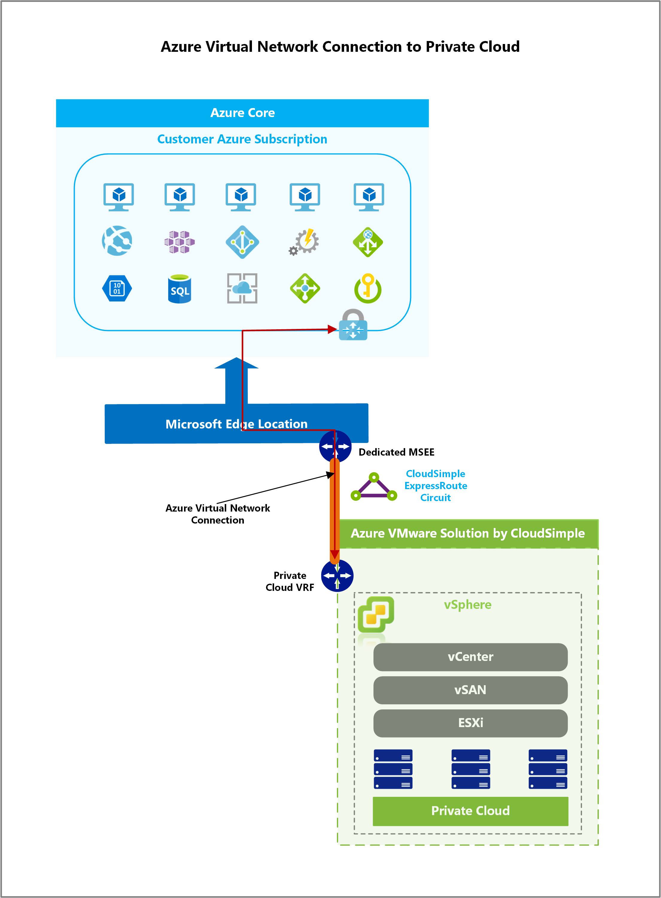
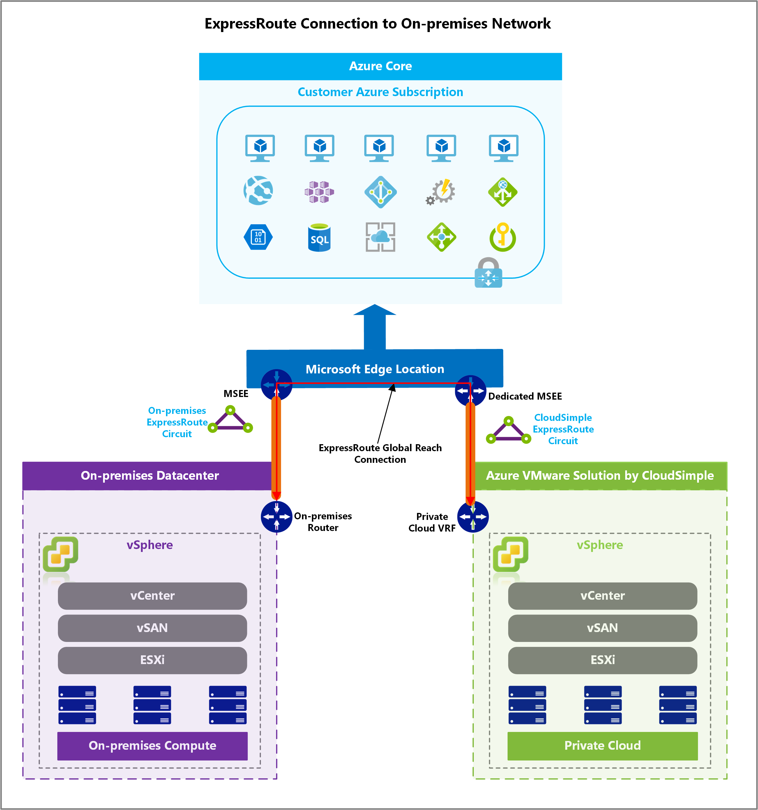

# Azure network connections overview

When you create a CloudSimple service in a region, it:

* Creates an Azure ExpressRoute circuit and attaches it to the service in that region
* Allows connection from your CloudSimple region network to your Azure virtual network or your on-premises network using Azure ExpressRoute
* Provides access services running in your Azure subscription, or your on-premises network, from your Private Cloud environment

The connection is:

* Secure
* Private
* High bandwidth
* Low latency

## Benefits

Azure network connection allows you to:

* Use Azure as a backup target for virtual machines on your Private Cloud.
* Deploy KMS servers in your Azure subscription to encrypt your Private Cloud vSAN datastore.
* Use hybrid applications where the web tier of the application runs in the public cloud while the application and database tiers run in your Private Cloud.

## Azure virtual network connection

Private Clouds can be connected to your Azure resources using ExpressRoute.  You can use this connection to access different resources running in your Azure subscription from your Private Cloud.  This connection allows you to extend you Private Cloud network to your Azure virtual network.

## ExpressRoute connection to on-premises network

You can connect your existing Azure ExpressRoute circuit to your CloudSimple region. ExpressRoute Global Reach feature is used to connect the two circuits with each other.  A connection is established between the on-premises and CloudSimple ExpressRoute circuits.  This connection allows you to extend your on-premises networks to Private Cloud network.

## Next steps

* [Obtain peering information for Azure virtual network to CloudSimple connection](https://docs.azure.cloudsimple.com/virtual-network-connection)
* [Connect from on-premises to CloudSimple using ExpressRoute](https://docs.azure.cloudsimple.com/on-premises-connection)
