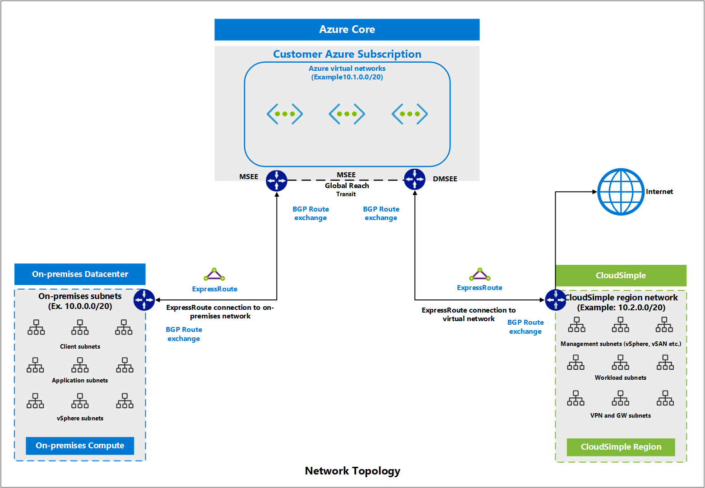

# VLANs and subnets overview

CloudSimple provides a network per region where your CloudSimple service is deployed.  The network is a single TCP Layer 3 address space with routing enabled by default.  All Private Clouds and subnets created in this region can communicate with each other without any additional configuration.  You can create distributed port groups on the vCenter using the VLANs.

## VLANs

A VLAN (Layer 2 network) is created for each Private Cloud.  The Layer 2 traffic stays within the boundary of a Private Cloud, allowing you to isolate the local traffic within the Private Cloud.  A VLAN created on the Private Cloud can be used to create distributed port groups only in that Private Cloud.  A VLAN created on a Private Cloud is automatically configured on all the switches connected to the hosts of a Private Cloud.

## Subnets

You can create a subnet when you create a VLAN by defining the address space of the subnet. An IP address from the address space is assigned as a subnet gateway. A single private Layer 3 address space is assigned per customer and region. You can configure any RFC 1918 non-overlapping address space, with your on-premises network or Azure virtual network, in your network region.

All subnets can communicate with each other by default, reducing the configuration overhead for routing between Private Clouds. East-west data across PCs in the same region stays in the same Layer 3 network and transfers over the local network infrastructure within the region. No egress is required for communication between Private Clouds in a region. This approach eliminates any WAN/egress performance penalty in deploying different workloads in different Private Clouds.

## vSphere/vSAN subnets CIDR range

A Private Cloud is created as an isolated VMware stack (ESXi hosts, vCenter, vSAN, and NSX) environment managed by a vCenter server.  Management components are deployed in the network selected for vSphere/vSAN subnets CIDR.  The network CIDR range is divided into different subnets during the deployment.

* Minimum vSphere/vSAN subnets CIDR range prefix: **/24**
* Maximum vSphere/vSAN subnets CIDR range prefix: **/21**

> [!CAUTION]
> IP addresses in the vSphere/vSAN CIDR range are reserved for use by the Private Cloud infrastructure.  Don't use the IP address in this range on any virtual machine.

### vSphere/vSAN subnets CIDR range limits

Selecting the vSphere/vSAN subnets CIDR range size has an impact on the size of your Private Cloud.  The following table shows the maximum number of nodes you can have based on the size of vSphere/vSAN subnets CIDR.

| Specified vSphere/vSAN subnets CIDR prefix length | Maximum number of nodes |
|---------------------------------------------------|-------------------------|
| /24 | 26 |
| /23 | 58 |
| /22 | 118 |
| /21 | 220 |

### Management subnets created on a Private Cloud

The following management subnets are created when you create a Private Cloud.

* **System management**. VLAN and subnet for ESXi hosts' management network, DNS server, vCenter server.
* **VMotion**. VLAN and subnet for ESXi hosts' vMotion network.
* **VSAN**. VLAN and subnet for ESXi hosts' vSAN network.
* **NsxtEdgeUplink1**. VLAN and subnet for VLAN uplinks to an external network.
* **NsxtEdgeUplink2**. VLAN and subnet for VLAN uplinks to an external network.
* **NsxtEdgeTransport**. VLAN and subnet for transport zones control the reach of Layer 2 networks in NSX-T.
* **NsxtHostTransport**. VLAN and subnet for host transport zone.

### Management network CIDR range breakdown

vSphere/vSAN subnets CIDR range specified is divided into multiple subnets.  The following table shows an example of the breakdown for allowed prefixes.  The example uses 192.168.0.0 as the CIDR range.

Example:

| Specified vSphere/vSAN subnets CIDR/prefix | 192.168.0.0/21 | 192.168.0.0/22 | 192.168.0.0/23 | 192.168.0.0/24 |
|---------------------------------|----------------|----------------|----------------|----------------|
| System management | 192.168.0.0/24 | 192.168.0.0/24 | 192.168.0.0/25 | 192.168.0.0/26 |
| vMotion | 192.168.1.0/24 | 192.168.1.0/25 | 192.168.0.128/26 | 192.168.0.64/27 |
| vSAN | 192.168.2.0/24 | 192.168.1.128/25 | 192.168.0.192/26 | 192.168.0.96/27 |
| NSX-T Host Transport | 192.168.4.0/23 | 192.168.2.0/24 | 192.168.1.0/25 | 192.168.0.128/26 |
| NSX-T Edge Transport | 192.168.7.208/28 | 192.168.3.208/28 | 192.168.1.208/28 | 192.168.0.208/28 |
| NSX-T Edge Uplink1 | 192.168.7.224/28 | 192.168.3.224/28 | 192.168.1.224/28 | 192.168.0.224/28 |
| NSX-T Edge uplink2 | 192.168.7.240/28 | 192.168.3.240/28 | 192.168.1.240/28 | 192.168.0.240/28 |

## Next steps

* [Create and manage VLANs and subnets](create-vlan-subnet.md)
