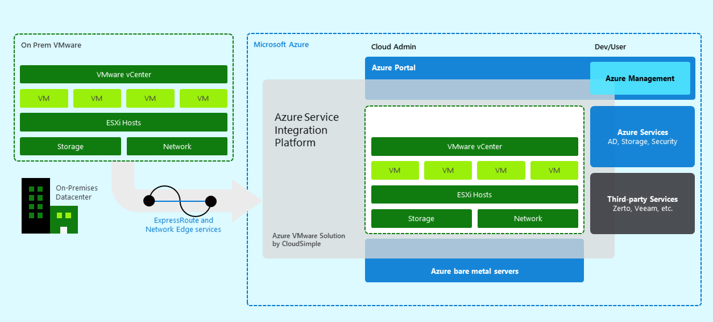
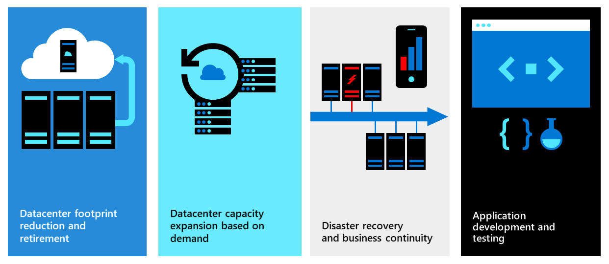

# What is VMware Solution on Azure by CloudSimple

**VMware Solution on Azure by CloudSimple** is a fully managed service that lets you run the VMware platform in Azure. This solution includes vSphere, vCenter, vSAN, NSX-T, and corresponding tools.
Your VMware environment runs natively on Azure Bare Metal infrastructure, on Azure cloud locations. The service includes all the features required to consume the VMware platforms efficiently and securely.

## Features

* On-demand self-service provisioning of VMware cloud environments. Ability to add and remove capacity on demand
* VMware platform deployment, upgrade, management plane backup, health/capacity monitoring, alerting, troubleshooting, and remediation.
* Underlay networking services required to enable VMware, including L2/L3 services and firewall rule management.
* Edge-type networking services, including VPN, Public IP, and Internet Gateways. These edge services run on Azure and carry the corresponding security and DDoS protection of Azure.
* Capacity reservation to lower costs.
* High-speed, low-latency connectivity to Azure and on-premises.
* Solution architectures for customers to consume Azure services in an integrated fashion, take advantage of this unique "VMware cloud in a public cloud” architecture. These Azure services include Azure AD, storage, application gateways, and others.
* Infrastructure is fully dedicated to you and is physically isolated from infrastructure of other customers.
* Management features such activity management, usage, billing/metering, and user management.
* 24x7 customer support.

## Benefits

* **Operational Continuity:** CloudSimple offers native access to VMware platforms. The CloudSimple architecture is compatible with your existing:
  * Applications
  * Operations
  * Networking
  * Security
  * Backup
  * Disaster recovery
  * Audit
  * Compliance tools
  * Processes
* **No Retraining:** VMware platform compatibility allows you to use existing skills and knowledge.
* **Infrastructure agility:** You no longer have to predict all your capacity needs and then end up with wasted capacity or infrastructure shortages. CloudSimple is delivered as a cloud service, and you can add or reduce capacity at any time
* **Security:** Access to the CloudSimple environment through Azure provides built-in DDoS protection and security monitoring.
* **Lower cost:** The CloudSimple platform is highly engineered, and provides high levels of automation, operational efficiency, and economies of scale. Further, CloudSimple publishes solution architectures that take advantage of the presence of VMware in a public cloud to lower costs. Examples include Azure AD, backup to Azure storage, application gateway, load balancer, and others.
* **A New Hybrid Platform:** The service enables high-speed, low latency access to the rest of Azure. Further, CloudSimple management enables unified management of VMware Virtual Machines and the rest of Azure using the same UI and API. Your development teams can take advantage of both public and private platforms in an integrated, consistent fashion.
* **Infrastructure monitoring, troubleshooting, and support:** CloudSimple operates your underlying infrastructure as a service. Fail hardware is automatically replaced. You can focus on consumption while CloudSimple ensures that the environment runs smoothly.
* **Policy compatibility:** Keep your VMware-based tools, security procedures, audit practices, and compliance certifications.

## Scenarios

* **Data Center Retirement or Migration:** Get additional capacity when you reach limits of your existing datacenter or refresh hardware. It's easy for you to add needed capacity in the cloud, and eliminate the headaches of managing hardware refreshes. Reduce the risk and cost of cloud migrations compared to time-consuming conversions or rearchitecture. Use familiar VMware tools and skills to accelerate cloud migrations. Once in the cloud, use Azure services to modernize your applications at your pace.
* **Expand on Demand:** Expand to the cloud to meet unanticipated needs, such as new development environments or seasonal capacity bursts. You can easily create new capacity on demand, and keep it only as long as you need it. Reduce your up-front investment, accelerate speed of provisioning, and reduce complexity with the same architecture and policies across both on-premises and the cloud.
* **Disaster Recovery and Virtual Desktops in the Azure Cloud:** Establish remote access to data, apps, and desktops in the Azure Cloud. With high-bandwidth connections, you upload / download data fast to recover from incidents. Low-latency networks give you fast response times that users expect from a desktop app. With CloudSimple, it's easy to replicate all your policies and networking in the Cloud using the CloudSimple portal and familiar VMware tools. The ease of recovery and replication greatly reduces the effort and risk of creating and managing DR and VDI implementations.
* **High-Performance Applications and Databases:** CloudSimple provides a hyperconverged architecture designed to run your most demanding VMware workloads. Run Oracle, Microsoft SQL server, middleware systems, and high-performance no-SQL databases. Experience the cloud as your own data center with high speed 25-Gbps network connections that let you run hybrid apps that span on-premises, VMware on Azure and Azure private workloads without compromising performance.
* **True Hybrid:** Unify DevOps across VMware and Azure. Optimize VMware administration for Azure services and solutions that can be applied across all your workloads. Access public cloud services without having to expand your data center or rearchitect your applications. Centralize identities, access control policies, logging and monitoring for VMware applications on Azure.

## Next steps

* [Create CloudSimple service](quickstart-create-cloudsimple-service.md)
* [Create Private Cloud](quickstart-create-private-cloud.md)