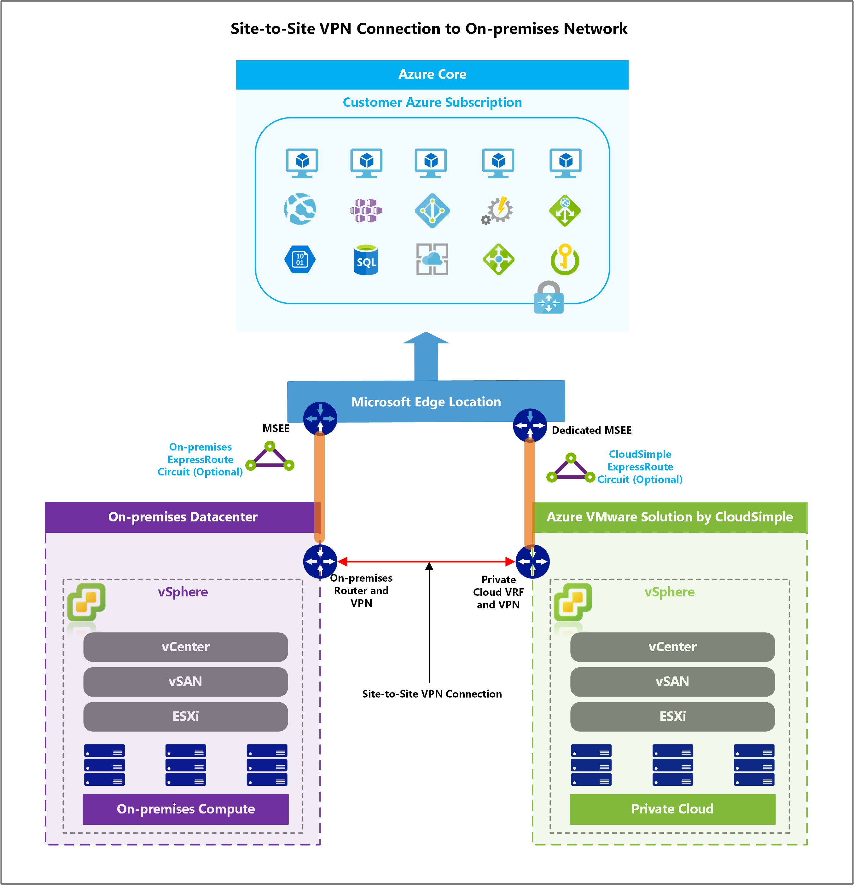

# VPN gateways overview

A VPN gateway is used to send encrypted traffic between a CloudSimple region network at an on-premises location, or a computer over the public Internet.  Each region can have only one VPN gateway. However, you can create multiple connections to the same VPN gateway. When you create multiple connections to the same VPN gateway, all VPN tunnels share the available gateway bandwidth.

CloudSimple provides two kinds of VPN gateways:

* Site-to-site VPN Gateway
* Point-to-site VPN Gateway

## Site-to-site VPN gateway

A site-to-site VPN gateway is used to send encrypted traffic between a CloudSimple region network and an on-premises datacenter. Use this connection to define the subnets/CIDR range, for communication between your on-premises network and the CloudSimple region network.

The VPN gateway allows you to consume services from on-premises on your private cloud, and services on your private cloud, from the on-premises network.  CloudSimple provides a policy-based VPN server for establishing connection from your on-premises network.

Use cases for site-to-site VPN include:

* Accessibility of your private cloud vCenter from any workstation in your on-premises network.
* Use of your on-premises Active Directory as a vCenter identity source.
* Convenient transfer of VM templates, ISOs, and other files from your on-premises resources to your private cloud vCenter.
* Accessibility of workloads running on your private cloud from your on-premises network.

> [!IMPORTANT]
> You must clamp TCP MSS at 1078 bytes or lower. Or if your VPN devices do not support MSS clamping, you can alternatively set the MTU on the tunnel interface to 1118 bytes instead. 

### Cryptographic parameters

A site-to-site VPN connection uses the following default cryptographic parameters to establish a secure connection.  When you create a connection from on-premises VPN device, use any of the following parameters supported by your on-premises VPN gateway.

#### Phase 1 proposals

| Parameter | Proposal 1 | Proposal 2 | Proposal 3 |
|-----------|------------|------------|------------|
| IKE Version | IKEv1 | IKEv1 | IKEv1 |
| Encryption | AES 128 | AES 256 | AES 256 |
| Hash Algorithm| SHA 256 | SHA 256 | SHA 1 |
| Diffie Hellman Group (DH Group) | 2 | 2 | 2 |
| Life Time | 28,800 seconds | 28,800 seconds | 28,800 seconds |
| Data Size | 4 GB | 4 GB | 4 GB |

#### Phase 2 proposals 

| Parameter | Proposal 1 | Proposal 2 | Proposal 3 |
|-----------|------------|------------|------------|
| Encryption | AES 128 | AES 256 | AES 256 |
| Hash Algorithm| SHA 256 | SHA 256 | SHA 1 |
| Perfect Forward Secrecy Group (PFS Group) | None | None | None |
| Life Time | 1,800 seconds | 1,800 seconds | 1,800 seconds |
| Data Size | 4 GB | 4 GB | 4 GB |

## Point-to-site VPN gateway

A point-to-site VPN is used to send encrypted traffic between a CloudSimple region network and a client computer.  Point-to-site VPN is the easiest way to access your private cloud network, including your private cloud vCenter and workload VMs.  Use point-to-site VPN connectivity if you're connecting to the private cloud remotely.

## Next steps

* [Set up VPN gateway](https://docs.azure.cloudsimple.com/vpn-gateway/)