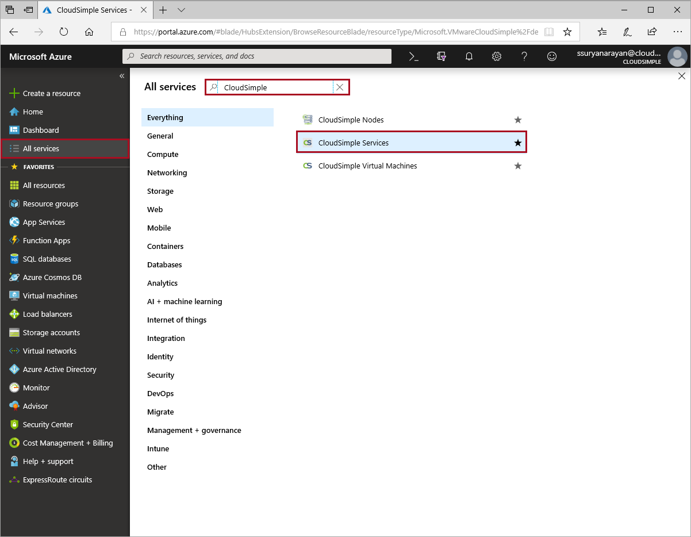
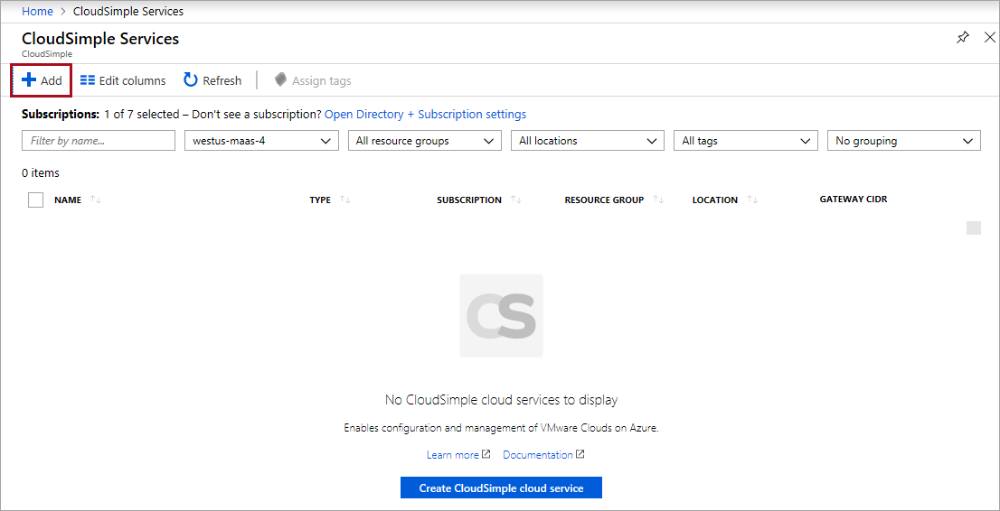
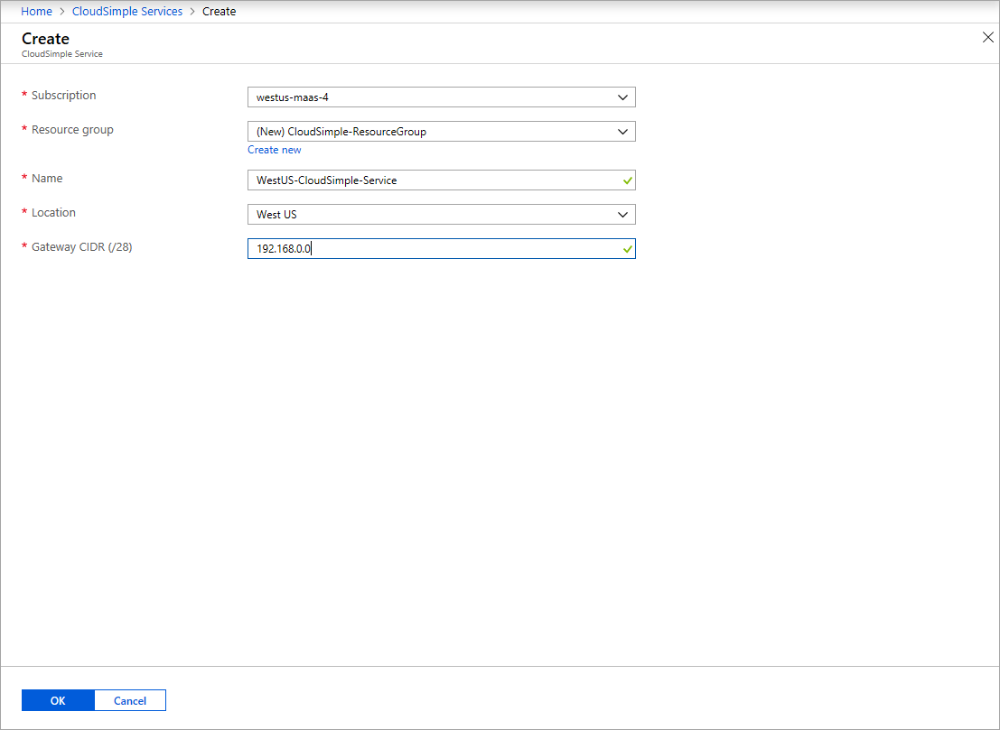

# Create Azure VMware Solution by CloudSimple - Service

To get started with Azure VMware Solution by CloudSimple, create the Azure VMware Solution by CloudSimple service in the Azure portal.

> [!NOTE]
> Before you create the CloudSimple service, you must register the Microsoft.VMwareCloudSimple resource provider on your Azure subscription. Follow the steps in [Enable the Microsoft.VMwareCloudSimple resource provider on your Azure subscription](enable-cloudsimple-service.md).

## Sign in to Azure

Sign in to the Azure portal at [https://portal.azure.com](https://portal.azure.com).

## Create the service

1. Select **All services**.

2. Search for **CloudSimple Services**.

    

3. Select **CloudSimple Services**.

4. Click **Add** to create a new service.

    

5. Select the subscription where you want to create the CloudSimple service.

6. Select the resource group for the service. To add a new resource group, click **Create New**.

7. Enter name to identify the service.

8. Enter the CIDR for the service gateway. Specify a /28 subnet that doesn’t overlap with any of your  existing subnets.  These include on-premises subnets, Azure subnets, or any planned CloudSimple subnets. You can't change the CIDR after the service is created.

    

9. Click **OK**.

The service is created and added to the list of services.

## Next steps

* Learn how to [Create a private cloud](https://docs.azure.cloudsimple.com/create-private-cloud/)
* Learn how to [Configure a private cloud environment](quickstart-create-private-cloud.md)
