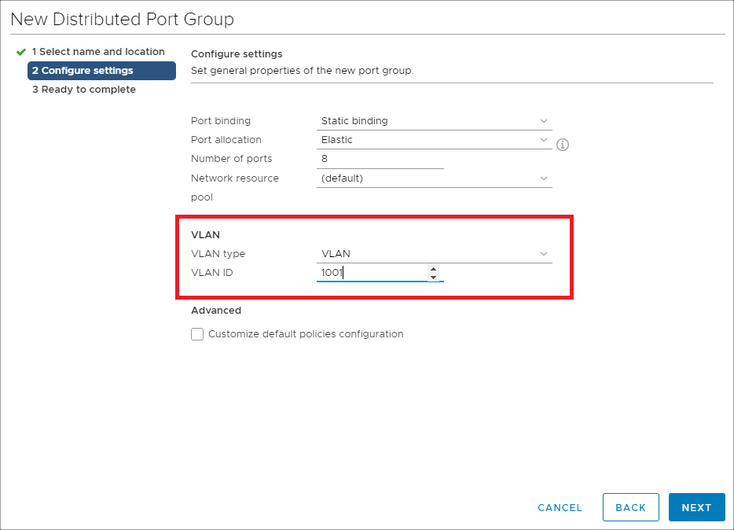
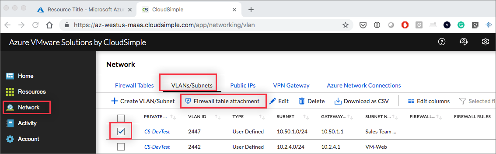

--- 
title: Create VLANs/subnets - Azure VMware Solution by CloudSimple
description: Azure VMware Solutions by CloudSimple - Describes how to create and manage VLANs/subnets for your Private Clouds and then apply firewall rules.
author: sharaths-cs 
ms.author: b-shsury 
ms.date: 08/15/2019 
ms.topic: article 
ms.service: azure-vmware-cloudsimple 
ms.reviewer: cynthn 
manager: dikamath 
---

# Create and manage VLANs/subnets for your Private Clouds

Open the VLANs/Subnets tab on the Network page to create and manage VLANs/subnets for your Private Clouds. After you create a VLAN/subnet, you can apply firewall rules.

## Create a VLAN/subnet

1. [Access the CloudSimple portal](access-cloudsimple-portal.md) and select **Network** on the side menu.
2. Select **VLANs/subnets**.
3. Click **Create VLAN/Subnet**.

    

4. Select the Private Cloud for the new VLAN/subnet.
5. Enter a VLAN ID.
6. Enter the subnet name.
7. To enable routing on the VLAN (subnet), specify the subnet CIDR range. Make sure that the CIDR range doesn't overlap with any of your on-premises subnets, Azure subnets, or gateway subnet.
8. Click **Submit**.

    

> [!IMPORTANT]
> There is a quota of 30 VLANs per private cloud. These limits can be increased by [contacting support](https://portal.azure.com/#blade/Microsoft_Azure_Support/HelpAndSupportBlade/newsupportrequest).

## Use VLAN information to set up a distributed port group in vSphere

To create a distributed port group in vSphere, follow the instructions in the VMware topic 'Add a distributed port group' in the <a href="https://docs.vmware.com/en/VMware-vSphere/6.5/vsphere-esxi-vcenter-server-65-networking-guide.pdf" target="_blank">vSphere Networking Guide</a>. When setting up the distributed port group, provide the VLAN information from the CloudSimple configuration.

## Select a firewall table

Firewall tables and associated rules are defined on the **Network > Firewall tables** page. To select the firewall table to apply to the VLAN/subnet for a Private Cloud, select the VLAN/subnet click **Firewall table attachment** on the **VLANs/Subnets** page. See [Firewall Tables](firewall.md) for instructions on setting up firewall tables and defining rules.

> [!NOTE]
> A subnet can be associated with one firewall table. A firewall table can be associated with multiple subnets.

## Edit a VLAN/subnet

To edit the settings for a VLAN/Subnet, select it on the **VLANs/Subnets** page and click the **Edit** icon. Make changes and click **Submet**.

## Delete a VLAN/subnet

To delete a VLAN/Subnet, select it on the **VLANs/Subnets** page and click the **Delete** icon. Click **Delete** to confirm.
