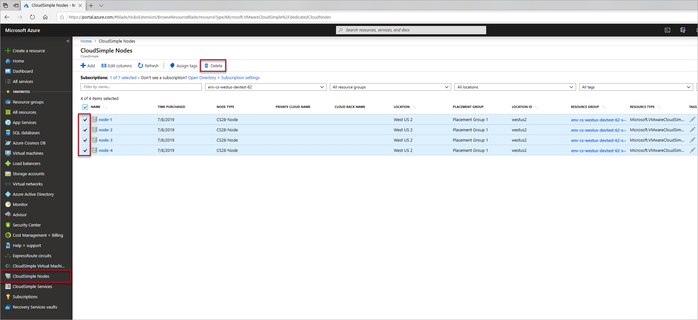

# Delete nodes from Azure VMware Solution by CloudSimple

CloudSimple nodes are metered once they are created.  Nodes must be deleted to stop metering of the nodes.  You delete the nodes that are not used from Azure portal.

## Before you begin

A node can be deleted only under following conditions:

* A Private Cloud created with the nodes is deleted.  To delete a Private Cloud, see [Delete an Azure VMware Solution by CloudSimple Private Cloud](delete-private-cloud.md).
* The node has been removed from the Private Cloud by shrinking the Private Cloud.  To shrink a Private Cloud, see [Shrink Azure VMware Solution by CloudSimple Private Cloud](shrink-private-cloud.md).

## Sign in to Azure

Sign in to the Azure portal at [https://portal.azure.com](https://portal.azure.com).

## Delete CloudSimple node

1. Select **All services**.

2. Search for **CloudSimple Nodes**.

   

3. Select **CloudSimple Nodes**.

4. Select nodes that don't belong to a Private Cloud to delete.  **PRIVATE CLOUD NAME** column shows the Private Cloud name to which a node belongs to.  If a node is not used by a Private Cloud, the value will be empty. 

    

> [!NOTE]
> Only nodes which are not a part of the Private Cloud can be deleted.

## Next steps

* Learn about [Private Cloud](cloudsimple-private-cloud.md)
