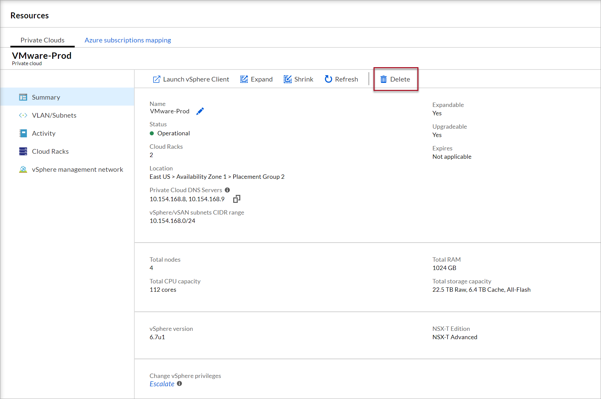
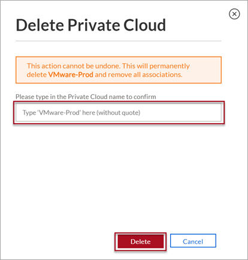

--- 
title: Delete an Azure VMware Solution by CloudSimple Private Cloud
description: Learn how to delete a CloudSimple Private Cloud. When you delete a Private Cloud, all clusters will be deleted.
author: shortpatti 
ms.author: v-patsho
ms.date: 08/06/2019 
ms.topic: article 
ms.service: azure-vmware-cloudsimple 
ms.reviewer: cynthn 
manager: dikamath 
---

# Delete a CloudSimple Private Cloud

CloudSimple provides the flexibility to delete a Private Cloud.  A Private Cloud consists of one or more vSphere clusters. Each cluster can have 3 to 16 nodes. When you delete a Private Cloud, all clusters will be deleted.

## Before you begin

Deletion of a Private Cloud deletes the entire Private Cloud.  All components of the Private Cloud will be deleted.  If you want to keep any of the data, ensure you've backed up the data to on-premises storage or Azure storage.

The components of a Private Cloud include:

* CloudSimple Nodes
* Virtual machines
* VLANs/Subnets
* All user data stored on the Private Cloud
* All firewall rule attachments to a VLAN/Subnet

## Sign in to Azure

Sign in to the Azure portal at [https://portal.azure.com](https://portal.azure.com).

## Delete a Private Cloud

1. [Access the CloudSimple portal](access-cloudsimple-portal.md).

2. Open the **Resources** page.

3. Click on the Private Cloud you want to delete

4. On the summary page, click **Delete**.

    

5. On the confirmation page, enter the name of the Private Cloud and click **Delete**. 

    

The Private Cloud is marked for deletion.  The deletion process starts after three hours and deletes the Private Cloud.

> [!CAUTION]
> Nodes must be deleted after deletion of the Private Cloud.  Metering of nodes will continue till nodes are deleted from your subscription.

## Next steps

* [Delete nodes](delete-nodes.md)
