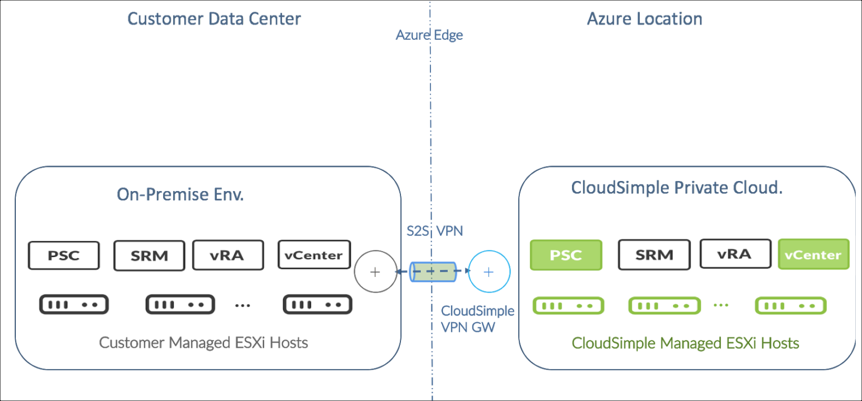
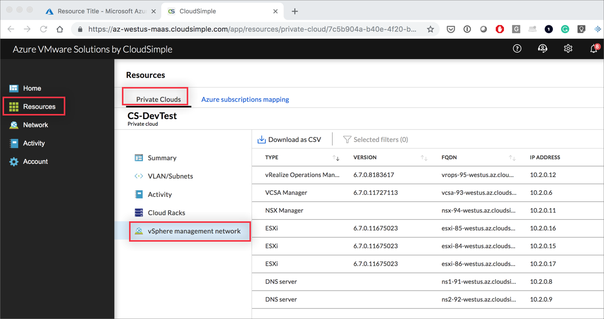

--- 
title: Azure VMware Solutions (AVS) - Set up AVS Private Cloud as a disaster recovery site by using VMware Site Recovery Manager
description: Describes how to set up your AVS Private Cloud as a disaster recovery site for on-premises VMware workloads
author: sharaths-cs
ms.author: b-shsury 
ms.date: 08/20/2019 
ms.topic: article 
ms.service: azure-vmware-cloudsimple 
ms.reviewer: cynthn 
manager: dikamath 
---

# Set up AVS Private Cloud as a disaster recovery target with VMware Site Recovery Manager

You can use your AVS Private Cloud as a disaster recovery (DR) site for on-premises VMware workloads.

The DR solution is based on vSphere Replication and VMware Site Recovery Manager (SRM). A similar approach can be followed to enable your AVS Private Cloud as a primary site that is protected by your on-premises recovery site.

The AVS solution:

* Eliminates the need to set up a datacenter specifically for DR.
* Allows you to leverage the Azure locations where AVS is deployed for worldwide geographic resilience.
* Gives you an option to reduce deployment costs and total cost of ownership for establishing DR.

The AVS solution requires you to do the following:

* Install, configure, and manage vSphere Replication and SRM in your AVS Private Cloud.
* Provide your own licenses for SRM when the AVS Private Cloud is the protected site. You do not need any additional SRM licenses for the AVS site when it is used as the recovery site.

With this solution, you have full control over vSphere replication and SRM. The familiar UI, API, and CLI interfaces enable use of your existing scripts and tools.

You can use any versions of vRA and SRM that are compatible with your AVS Private Cloud and on-premises environments. The examples in this guide use vRA 6.5 and SRM 6.5. These versions are compatible with vSphere 6.5, which is supported by AVS.

## Deploy the solution

The following sections describe how to deploy a DR solution using SRM in your AVS Private Cloud.

1. [Verify that VMware product versions are compatible](#verify-that-vmware-product-versions-are-compatible)
2. [Estimate the size of your DR environment](#estimate-the-size-of-your-dr-environment)
3. [Create an AVS Private Cloud for your environment](#create-an-avs-private-cloud-for-your-environment)
4. [Set up AVS Private Cloud networking for the SRM solution](#set-up-avs-private-cloud-networking-for-the-srm-solution)
5. [Set up a Site-to-Site VPN connection between your on-premises network and the AVS Private Cloud and open required ports](#set-up-a-site-to-site-vpn-connection-between-your-on-premises-network-and-the-avs-private-cloud-and-open-required-ports)
6. [Set up infrastructure services in your AVS Private Cloud](#set-up-infrastructure-services-in-your-avs-private-cloud)
7. [Install vSphere Replication appliance in your on-premises environment](#install-vsphere-replication-appliance-in-your-on-premises-environment)
8. [Install vSphere Replication appliance in your AVS Private Cloud environment](#install-vsphere-replication-appliance-in-your-avs-private-cloud-environment)
9. [Install SRM server in your on-premises environment](#install-srm-server-in-your-on-premises-environment)
10. [Install SRM server in your AVS Private Cloud](#install-srm-server-in-your-avs-private-cloud)

### Verify that VMware product versions are compatible

The configurations in this guide are subject to the following compatibility requirements:

* The same version of SRM must be deployed in your AVS Private Cloud and your on-premises environment.
* The same version of vSphere Replication must be deployed in your AVS Private Cloud and your on-premises environment.
* The versions of Platform Services Controller (PSC) in your AVS Private Cloud and your on-premises environment must be compatible.
* The versions of vCenter in your AVS Private Cloud and your on-premises environment must be compatible.
* The versions of SRM and vSphere replication must be compatible with each other and with the versions of PSC and vCenter.

For links to the relevant VMware documentation and compatibility information, go to [VMware Site Recovery Manager](https://docs.vmware.com/en/Site-Recovery-Manager/index.html) documentation.

To find out the versions of vCenter and PSC in your AVS Private Cloud, open the AVS portal. Go to **Resources**, select your AVS Private Cloud, and click the **vSphere Management Network** tab.

### Estimate the size of your DR environment

1. Verify that your identified on-premises configuration is within supported limits. For SRM 6.5, the limits are documented in the VMware knowledge base article on [operational limits for Site Recovery Manager 6.5](https://kb.vmware.com/s/article/2147110).
2. Ensure that you have sufficient network bandwidth to meet your workload size and RPO requirements. The VMware knowledge base article on [calculating bandwidth requirements for vSphere Replication](https://docs.vmware.com/en/vSphere-Replication/6.5/com.vmware.vsphere.replication-admin.doc/GUID-4A34D0C9-8CC1-46C4-96FF-3BF7583D3C4F.html) provides guidance on bandwidth limits.
3. Use the AVS sizer tool to estimate the resources that are needed in your DR site to protect your on-premises environment.

### Create an AVS Private Cloud for your environment

Create an AVS Private Cloud from the AVS portal by following the instructions and sizing recommendations in [Create an AVS Private Cloud](create-private-cloud.md).

### Set up AVS Private Cloud networking for the SRM solution

Access the AVS portal to set up AVS Private Cloud networking for the SRM solution.

Create a VLAN for the SRM solution network and assign it a subnet CIDR. For instructions, see [Create and manage VLANs/Subnets](create-vlan-subnet.md).

### Set up a Site-to-Site VPN connection between your on-premises network and the AVS Private Cloud and open required ports

To set up Site-to-Site connectivity between your on-premises network and your AVS Private Cloud. For instructions, see [Configure a VPN connection to your AVS Private Cloud](set-up-vpn.md).

### Set up infrastructure services in your AVS Private Cloud

Configure infrastructure services in the AVS Private Cloud to make it easy to manage your workloads and tools.

You can add an external identity provider as described in [Use Azure AD as an identity provider for vCenter on AVS Private Cloud](azure-ad.md) if you want to do any of the following:

* Identify users from your on-premises Active Directory (AD) in your AVS Private Cloud.
* Set up an AD in your AVS Private Cloud for all users.
* Use Azure AD.

To provide IP address lookup, IP address management, and name resolution services for your workloads in the AVS Private Cloud, set up a DHCP and DNS server as described in [Set up DNS and DHCP applications and workloads in your AVS Private Cloud](dns-dhcp-setup.md).

The *.avs.io domain is used by management VMs and hosts in your AVS Private Cloud. To resolve requests to this domain, configure DNS forwarding on the DNS server as described in [Create a Conditional Forwarder](on-premises-dns-setup.md#create-a-conditional-forwarder).

### Install vSphere Replication Appliance in your on-premises environment

Install vSphere  Replication Appliance (vRA) in your on-premises environment by following the VMware documentation. The installation consists of these high-level steps:

1. Prepare your on-premises environment for vRA installation.

2. Deploy vRA in your on-premises environment using the OVF in the VR ISO from vmware.com. For vRA 6.5, [this VMware blog](https://blogs.vmware.com/virtualblocks/2017/01/20/vr-65-ovf-choices) has the relevant information.

3. Register your on-premises vRA with vCenter Single Sign-On at the on-premises site. For detailed instructions for vSphere Replication 6.5, see the VMware document [VMware vSphere Replication 6.5 Installation and Configuration](https://docs.vmware.com/en/vSphere-Replication/6.5/vsphere-replication-65-install.pdf).

## Install vSphere Replication appliance in your AVS Private Cloud environment

Before you begin, verify that you have the following:

* IP reachability from subnets in your on-premises environment to the management subnet of your AVS Private Cloud
* IP reachability from replication subnet in your on-premises vSphere environment to the SRM solution subnet of your AVS Private Cloud

For instructions, see [Configure a VPN connection to your AVS Private Cloud](set-up-vpn.md). The steps are similar to those for the on-premises installation.

AVS recommends using FQDNs instead of IP addresses during the vRA and SRM installation. To find out the FQDN of vCenter and PSC in your AVS Private Cloud, open the AVS portal. Go to **Resources**, select your AVS Private Cloud, and click the **vSphere Management Network** tab.

AVS requires that you don't install vRA and SRM using the default ‘cloudowner’ user, but instead create a new user. This is done to help ensure high uptime and availability for your AVS Private Cloud vCenter environment. However, the default cloudowner user in the AVS Private Cloud vCenter doesn't have sufficient privileges to create a new user with administrative privileges.

Before installing vRA and SRM, you must escalate the vCenter privileges of the cloudowner user and then create a user with Administrative privileges in vCenter SSO domain. For details on the default AVS Private Cloud user and permission model, see [Learn the AVS Private Cloud permission model](learn-private-cloud-permissions.md).

The installation consists of these high-level steps:

1. [Escalate privileges](escalate-private-cloud-privileges.md).
2. Create a user in your AVS Private Cloud for vSphere Replication and SRM installation. Explained below in [vCenter UI: Create a user in the AVS Private Cloud for vRA & SRM installation](#vcenter-ui-create-a-user-in-the-avs-private-cloud-for-vra-and-srm-installation).
3. Prepare your AVS Private Cloud environment for vRA installation.
4. Deploy vRA in your AVS Private Cloud using the OVF in the VR ISO from vmware.com. For vRA 6.5, [this VMware blog](https://blogs.vmware.com/virtualblocks/2017/01/20/vr-65-ovf-choices) has relevant information.
5. Configure firewall rules for vRA. Explained below in [AVS portal: Configure Firewall rules for vRA](#avs-portal-configure-firewall-rules-for-vra).
6. Register AVS Private Cloud vRA with vCenter Single Sign-On at the AVS Private Cloud site.
7. Configure vSphere Replication connections between the two appliances. Ensure that the required ports are opened across the firewalls. See [this VMware knowledge base article](https://kb.vmware.com/s/article/2087769) for a list of port numbers that must be open for vSphere Replication 6.5.

For detailed installation instructions for vSphere Replication 6.5, see the VMware document [VMware vSphere Replication 6.5 Installation and Configuration](https://docs.vmware.com/en/vSphere-Replication/6.5/vsphere-replication-65-install.pdf).

#### vCenter UI: Create a user in the AVS Private Cloud for vRA and SRM installation

Sign in to vCenter using cloudowner user credentials after escalating privileges from the AVS portal.

Create a new user, `srm-soln-admin`, in vCenter and add it to the administrators group in vCenter.
Sign out of vCenter as the cloudowner user and sign in as the *srm-soln-admin* user.

#### AVS portal: Configure firewall rules for vRA

Configure firewall rules as described in [Set up firewall tables and rules](firewall.md) to open ports to enable communication between:

* vRA in the SRM solution network and vCenter and ESXi hosts in the management network.
* vRA appliances at the two sites.

See this [VMware knowledge base article](https://kb.vmware.com/s/article/2087769) for a list of port numbers that must be open for vSphere Replication 6.5.

### Install SRM server in your on-premises environment

Before you begin, verify the following:

* vSphere Replication Appliance is installed in your on-premises and AVS Private Cloud environments.
* The vSphere Replication Appliances at both sites are connected to each other.
* You have reviewed the VMware information on prerequisites and best practices. For SRM 6.5, you can refer to the VMware document [Prerequisites and Best Practices for SRM 6.5](https://docs.vmware.com/en/Site-Recovery-Manager/6.5/com.vmware.srm.install_config.doc/GUID-BB0C03E4-72BE-4C74-96C3-97AC6911B6B8.html).

Follow VMware documentation to perform SRM server installation in the deployment model ‘Two-Site Topology with One vCenter Instance per Platform Services Controller’ as described in this [VMWare document](https://docs.vmware.com/en/Site-Recovery-Manager/6.5/com.vmware.srm.install_config.doc/GUID-F474543A-88C5-4030-BB86-F7CC51DADE22.html). The installation instructions for SRM 6.5 are available in the VMware document [Installing Site Recovery Manager](https://docs.vmware.com/en/Site-Recovery-Manager/6.5/com.vmware.srm.install_config.doc/GUID-437E1B65-A17B-4B4B-BA5B-C667C90FA418.html).

### Install SRM server in your AVS Private Cloud

Before you begin, verify the following:

* vSphere Replication Appliance is installed in your on-premises and AVS Private Cloud environments.
* The vSphere Replication Appliances at both sites are connected to each other.
* You have reviewed the VMware information on prerequisites and best practices. For SRM 6.5, you can refer to [Prerequisites and Best Practices for Site Recovery Manager 6.5 Server Installation](https://docs.vmware.com/en/Site-Recovery-Manager/6.5/com.vmware.srm.install_config.doc/GUID-BB0C03E4-72BE-4C74-96C3-97AC6911B6B8.html).

The following steps describe the AVS Private Cloud SRM installation.

1. [vCenter UI: Install SRM](#vcenter-ui-install-srm)
2. [AVS portal: Configure firewall rules for SRM](#avs-portal-configure-firewall-rules-for-srm)
3. [vCenter UI: Configure SRM](#vcenter-ui-configure-srm)
4. [AVS portal: de-escalate privileges](#avs-portal-de-escalate-privileges)

#### vCenter UI: Install SRM

After logging to vCenter using srm-soln-admin credentials, follow VMware documentation to perform SRM server installation in the deployment model ‘Two-Site Topology with One vCenter Instance per Platform Services Controller’ as described in this [VMWare document](https://docs.vmware.com/en/Site-Recovery-Manager/6.5/com.vmware.srm.install_config.doc/GUID-F474543A-88C5-4030-BB86-F7CC51DADE22.html). The installation instructions for SRM 6.5 are available in the VMware document [Installing Site Recovery Manager](https://docs.vmware.com/en/Site-Recovery-Manager/6.5/com.vmware.srm.install_config.doc/GUID-437E1B65-A17B-4B4B-BA5B-C667C90FA418.html).

#### AVS portal: Configure firewall rules for SRM

Configure firewall rules as described in [Set up firewall tables and rules](firewall.md) to allow communication between:

The SRM server and vCenter / PSC in the AVS Private Cloud.
The SRM servers at both sites

See [this VMware knowledge base article](https://kb.vmware.com/s/article/2087769) for a list of port numbers that must be open for vSphere Replication 6.5.

#### vCenter UI: Configure SRM

After SRM is installed in the AVS Private Cloud, perform the following tasks as described in the sections of the VMware Site Recovery Manager Installation and Configuration Guide. For SRM 6.5, the instructions are available in the VMware document [Installing Site Recovery Manager](https://docs.vmware.com/en/Site-Recovery-Manager/6.5/com.vmware.srm.install_config.doc/GUID-437E1B65-A17B-4B4B-BA5B-C667C90FA418.html).

1. Connect the Site Recovery Manager Server Instances on the Protected and Recovery Sites.
2. Establish a Client Connection to the Remote Site Recovery Manager Server Instance.
3. Install the Site Recovery Manager License Key.

#### AVS portal: De-escalate privileges

To de-escalate privileges, see [De-escalate privileges](escalate-private-cloud-privileges.md#de-escalate-privileges).

## Ongoing management of your SRM solution

You have full control over vSphere Replication and SRM software in your AVS Private Cloud environment and are expected to perform the necessary software lifecycle management. Ensure that any new version of software is compatible with the AVS Private Cloud vCenter and PSC before updating or upgrading vSphere Replication or SRM.

> [!NOTE]
> AVS is currently exploring options for offering a managed DR service. 

## Multiple replication configuration

 [Both array-based replication and vSphere replication technologies can be used together with SRM](https://blogs.vmware.com/virtualblocks/2017/06/22/srm-array-based-replication-vs-vsphere-replication) at the same time. However, they must be applied to separate set of VMs (a given VM can be protected either by array-based replication or vSphere replication, but not both). Furthermore, the AVS site can be configured as a recovery site for multiple protected sites. See [SRM Multi-Site Options](https://blogs.vmware.com/virtualblocks/2016/07/28/srm-multisite/) for information on multi-site configurations.

## References

* [VMware Site Recovery Manager Documentation](https://docs.vmware.com/en/Site-Recovery-Manager/index.html)
* [Operational limits for Site Recovery Manager 6.5](https://kb.vmware.com/s/article/2147110)
* [Calculating bandwidth requirements for vSphere Replication](https://kb.vmware.com/s/article/2037268)
* [OVF Choices When Deploying vSphere Replication 6.5](https://blogs.vmware.com/virtualblocks/2017/01/20/vr-65-ovf-choices/)
* [VMware vSphere Replication 6.5 Installation and Configuration](https://docs.vmware.com/en/vSphere-Replication/6.5/vsphere-replication-65-install.pdf)
* [Prerequisites and Best Practices for SRM 6.5](https://docs.vmware.com/en/Site-Recovery-Manager/6.5/com.vmware.srm.install_config.doc/GUID-BB0C03E4-72BE-4C74-96C3-97AC6911B6B8.html)
* [Site Recovery Manager in a Two-Site Topology with One vCenter Server Instance per Platform Services Controller](https://docs.vmware.com/en/Site-Recovery-Manager/6.5/com.vmware.srm.install_config.doc/GUID-F474543A-88C5-4030-BB86-F7CC51DADE22.html)
* [VMware Site Recovery Manager 6.5 Installation and Configuration Guide](https://docs.vmware.com/en/Site-Recovery-Manager/6.5/com.vmware.srm.install_config.doc/GUID-437E1B65-A17B-4B4B-BA5B-C667C90FA418.html)
* [VMware Blog on SRM with array based replication vs. vSphere replication](https://blogs.vmware.com/virtualblocks/2017/06/22/srm-array-based-replication-vs-vsphere-replication)
* [VMware Blog on SRM Multi-site options](https://blogs.vmware.com/virtualblocks/2016/07/28/srm-multisite)
* [Port numbers that must be open for vSphere Replication 5.8.x, 6.x, and 8](https://kb.vmware.com/s/article/2147112)
