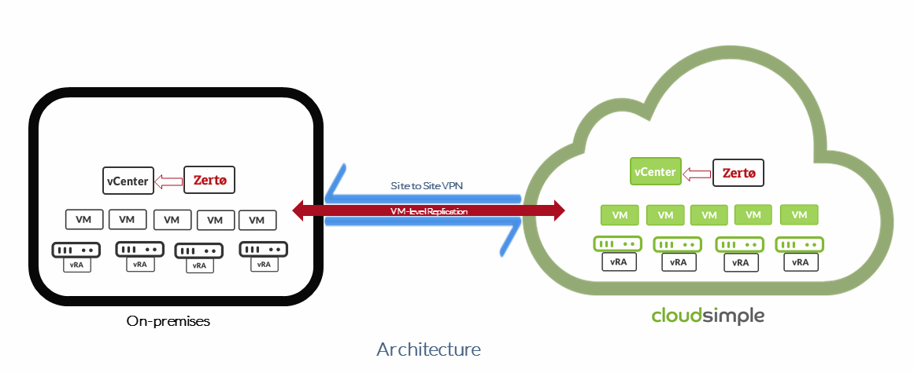
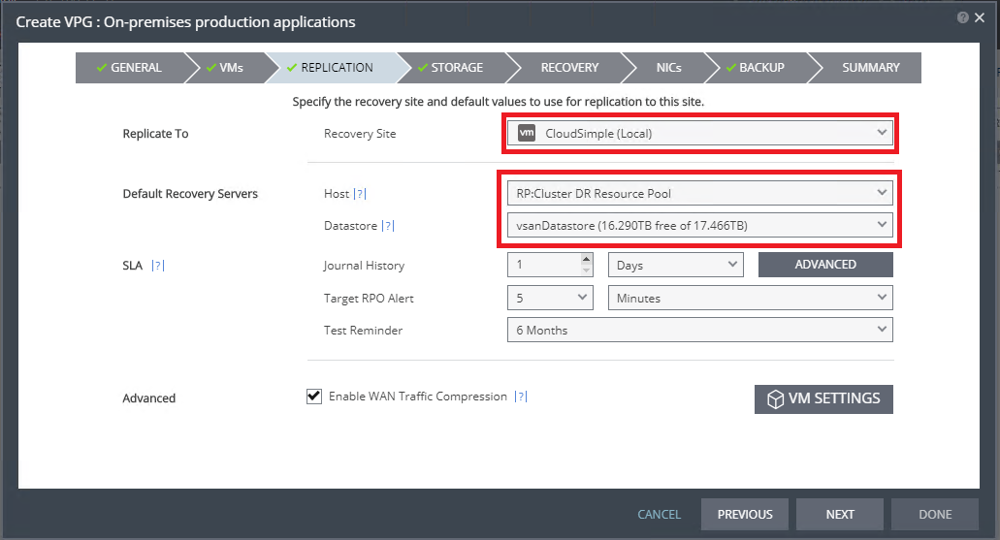

--- 
title: Azure VMware Solutions (AVS) - Use AVS Private Cloud as disaster site for on-premises workloads
description: Describes how to set up your AVS Private Cloud as a disaster recovery site for on-premises VMware workloads
author: sharaths-cs
ms.author: b-shsury 
ms.date: 08/20/2019 
ms.topic: article 
ms.service: azure-vmware-cloudsimple 
ms.reviewer: cynthn 
manager: dikamath 
---

# Set up AVS Private Cloud as a disaster recovery site for on-premises VMware workloads

Your AVS Private Cloud can be set up as a recovery site for on-premises applications to provide business continuity in case of a disaster. The recovery solution is based on Zerto Virtual Replication as the replication and orchestration platform. Critical infrastructure and application virtual machines can be replicated continuously from your on-premises vCenter to your AVS Private Cloud. You can use your AVS Private Cloud for failover testing and to ensure the availability of your application during a disaster. A similar approach can be followed to set up the AVS Private Cloud as a primary site that is protected by a recovery site at a different location.

> [!NOTE]
> Refer to the Zerto document [Sizing Considerations For Zerto Virtual Replication](https://s3.amazonaws.com/zertodownload_docs/5.5U3/Zerto%20Virtual%20Replication%20Sizing.pdf) for guidelines on sizing your disaster recovery environment.

The AVS solution:

* Eliminates the need to set up a datacenter specifically for disaster recovery (DR).
* Allows you to leverage the Azure locations where AVS is deployed for worldwide geographic resilience.
* Gives you an option to reduce deployment costs and total cost of ownership for DR.

The solution requires you to:

* Install, configure, and manage Zerto in your AVS Private Cloud.
* Provide your own licenses for Zerto when the AVS Private Cloud is the protected site. You can pair Zerto running on the AVS site with your on-premises site for licensing.

The following figure shows the architecture for the Zerto solution.

## How to deploy the solution

The following sections describe how to deploy a DR solution using Zerto Virtual Replication in your AVS Private Cloud.

1. [Prerequisites](#prerequisites)
2. [Optional configuration on your AVS Private Cloud](#optional-configuration-on-your-avs-private-cloud)
3. [Set up ZVM and VRA on your AVS Private Cloud](#set-up-zvm-and-vra-on-your-avs-private-cloud)
4. [Set up Zerto Virtual Protection Group](#set-up-zerto-virtual-protection-group)

### Prerequisites

To enable Zerto Virtual Replication from your on-premises environment to your AVS Private Cloud, complete the following prerequisites.

1. [Set up a Site-to-Site VPN connection between your on-premises network and your AVS Private Cloud](set-up-vpn.md).
2. [Set up DNS lookup so that your AVS Private Cloud management components are forwarded to AVS Private Cloud DNS servers](on-premises-dns-setup.md). To enable forwarding of DNS lookup, create a forwarding zone entry in your on-premises DNS server for `*.cloudsimple.io` to AVS DNS servers.
3. Set up DNS lookup so that on-premises vCenter components are forwarded to on-premises DNS servers. The DNS servers must be reachable from your AVS Private Cloud over Site-to-Site VPN. For assistance, submit a [support request](https://portal.azure.com/#blade/Microsoft_Azure_Support/HelpAndSupportBlade/newsupportrequest), providing the following information. 

    * On-premises DNS domain name
    * On-premises DNS server IP addresses

4. Install a Windows server on your AVS Private Cloud. The server is used to install Zerto Virtual Manager.
5. [Escalate your AVS privileges](escalate-private-cloud-privileges.md).
6. Create a new user on your AVS Private Cloud vCenter with the administrative role to use as the service account for Zerto Virtual Manager.

### Optional configuration on your AVS Private Cloud

1. Create one or more resource pools on your AVS Private Cloud vCenter to use as target resource pools for VMs from your on-premises environment.
2. Create one or more folders on your AVS Private Cloud vCenter to use as target folders for VMs from your on-premises environment.
3. Create VLANs for failover network and set up firewall rules. Open a [support request](https://portal.azure.com/#blade/Microsoft_Azure_Support/HelpAndSupportBlade/newsupportrequest) for assistance.
4. Create distributed port groups for failover network and test network for testing failover of VMs.
5. Install [DHCP and DNS servers](dns-dhcp-setup.md) or use an Active Directory domain controller in your AVS Private Cloud environment.

### Set up ZVM and VRA on your AVS Private Cloud

1. Install Zerto Virtual Manager (ZVM) on the Windows server in your AVS Private Cloud.
2. Sign in to ZVM using the service account created in previous steps.
3. Set up licensing for Zerto Virtual Manager.
4. Install Zerto Virtual Replication Appliance (VRA) on the ESXi hosts of your AVS Private Cloud.
5. Pair your AVS Private Cloud ZVM with your on-premises ZVM.

### Set up Zerto Virtual Protection Group

1. Create a new Virtual Protection Group (VPG) and specify the priority for the VPG.
2. Select the virtual machines that require protection for business continuity and customize the boot order if needed.
3. Select the recovery site as your AVS Private Cloud and the default recovery server as the AVS Private Cloud cluster or the resource group you created. Select **vsanDatastore** for the recovery datastore on your AVS Private Cloud.

    

    > [!NOTE]
    > You can customize the host option for individual VMs under the VM Settings option.

4. Customize storage options as required.
5. Specify the recovery networks to use for failover network and failover test network as the distributed port groups created earlier and customize the recovery scripts as required.
6. Customize the network settings for individual VMs if necessary and create the VPG.
7. Test failover once the replication completes.

## Reference

[Zerto Documentation](https://www.zerto.com/myzerto/technical-documentation/)
