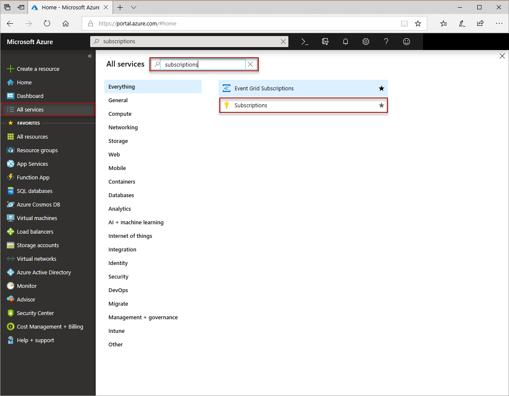
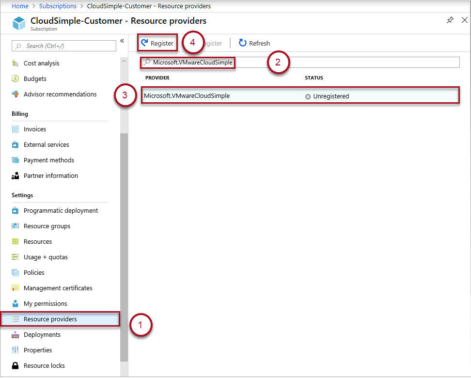

# Register the Microsoft.VMwareCloudSimple resource provider on your Azure subscription

The CloudSimple service allows you to consume Azure VMware Solution by CloudSimple. You can register the Microsoft.VMwareCloudSimple service as your resource provider.

## Register the resource provider

1. Sign in to the [Azure portal](https://portal.azure.com).

2. Select **All services**.

3. Search for and select **subscriptions**.

    

4. Select the subscription on which you want to enable CloudSimple service.

5. Click **Resource providers** for the subscription.

6. Use **Microsoft.VMwareCloudSimple** to filter the resource provider.

7. Select the resource provider and click **Register**.

    

## Next steps

* Learn how to [Create a CloudSimple service](create-cloudsimple-service.md)
* Learn how to [Configure a private cloud environment](quickstart-create-private-cloud.md)
