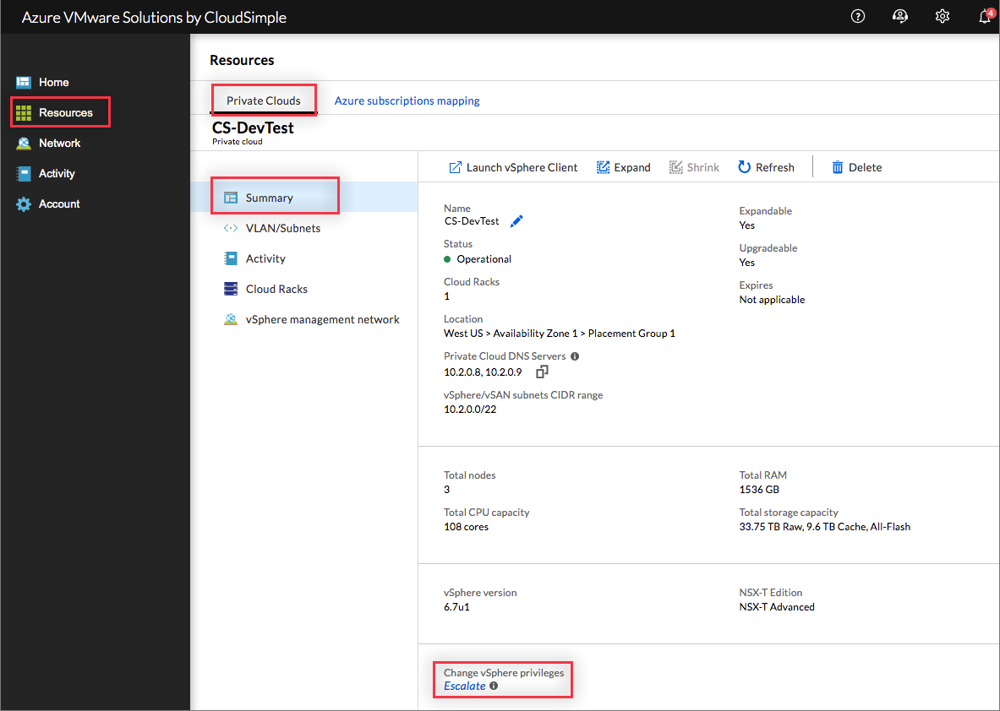
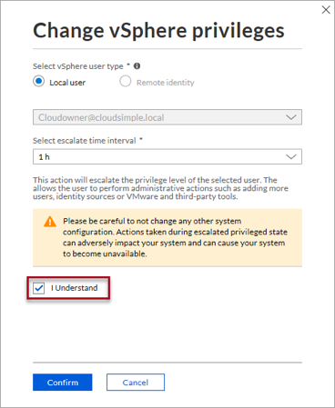
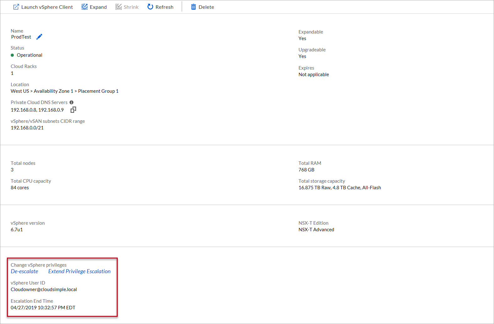

--- 
title: Escalate private cloud privileges
titleSuffix: Azure VMware Solution by CloudSimple
description: Describes how to escalate privileges on your private cloud for administrative functions in vCenter
author: sharaths-cs
ms.author: b-shsury
ms.date: 06/05/2019
ms.topic: article
ms.service: azure-vmware-cloudsimple
ms.reviewer: cynthn
manager: dikamath
---

# Escalate Private Cloud vCenter privileges from the CloudSimple portal

For administrative access to your Private Cloud vCenter, you can temporarily escalate your CloudSimple privileges.  Using elevated privileges, you can install VMware solutions, add identity sources, and manage users.

New users can be created on the vCenter SSO domain and given access to vCenter.  When you create new users, add them to the CloudSimple builtin groups for accessing vCenter.  For more information, see [CloudSimple Private Cloud permission model of VMware vCenter](https://docs.azure.cloudsimple.com/learn-private-cloud-permissions/).

> [!CAUTION]
> Don’t make any configuration changes for management components. Actions taken during the escalated privileged state can adversely impact your system or can cause your system to become unavailable.

## Sign in to Azure

Sign in to the Azure portal at [https://portal.azure.com](https://portal.azure.com).

## Escalate privileges

1. Access the [CloudSimple portal](access-cloudsimple-portal.md).

2. Open the **Resources** page, select the Private Cloud for which you want to escalate privileges.

3. Near the bottom of the Summary page under **Change vSphere privileges**, click **Escalate**.

    

4. Select the vSphere user type.  Only `CloudOwner@cloudsimple.local` local user can be escalated.

5. Select the escalate time interval from the drop-down. Choose the shortest period that will allow you to complete the task.

6. Select the checkbox to confirm that you understand the risks.

    

7. Click **OK**.

8. The escalation process can take a couple of minutes. When complete, click **OK**.

The privilege escalation begins and lasts until the end of the selected interval.  You can sign in to your private cloud vCenter to do administrative tasks.

> [!IMPORTANT]
> Only one user can have escalated privileges.  You must de-escalate the user's privileges before you can escalate another user's privileges.

> [!CAUTION]
> New users must be added only to *Cloud-Owner-Group*, *Cloud-Global-Cluster-Admin-Group*, *Cloud-Global-Storage-Admin-Group*, *Cloud-Global-Network-Admin-Group* or, *Cloud-Global-VM-Admin-Group*.  Users added to *Administrators* group will be removed automatically.  Only service accounts must be added to *Administrators* group and service accounts must not be used to sign in to vSphere web UI.

## Extend privilege escalation

If you require additional time to complete your tasks, you can extend the privilege escalation period.  Choose the additional escalate time interval that allows you to complete the administrative tasks.

1. On the **Resources** > **Private Clouds** in the CloudSimple portal, select the Private Cloud for which you want to extend privilege escalation.

2. Near the bottom of the Summary tab, click **Extend privilege escalation**.

    

3. Select an escalate time interval from the drop-down. Review the new escalation end time.

4. Click **Save** to extend the interval.

## De-escalate privileges

Once your administrative tasks are complete, you should de-escalate your privileges.  

1. On the **Resources** > **Private Clouds** in the CloudSimple portal, select the Private Cloud for which you want to de-escalate privileges.

2. Click **De-escalate**.

3. Click **OK**.

> [!IMPORTANT]
> To avoid any errors, sign out of vCenter and sign in again after de-escalating privileges.

## Next steps

* [Set up vCenter identity sources to use Active Directory](https://docs.azure.cloudsimple.com/set-vcenter-identity/)
* Install backup solution to [backup workload virtual machines](https://docs.azure.cloudsimple.com/backup-workloads-veeam/)