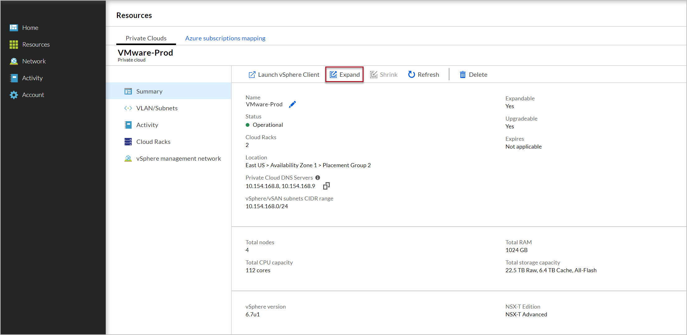
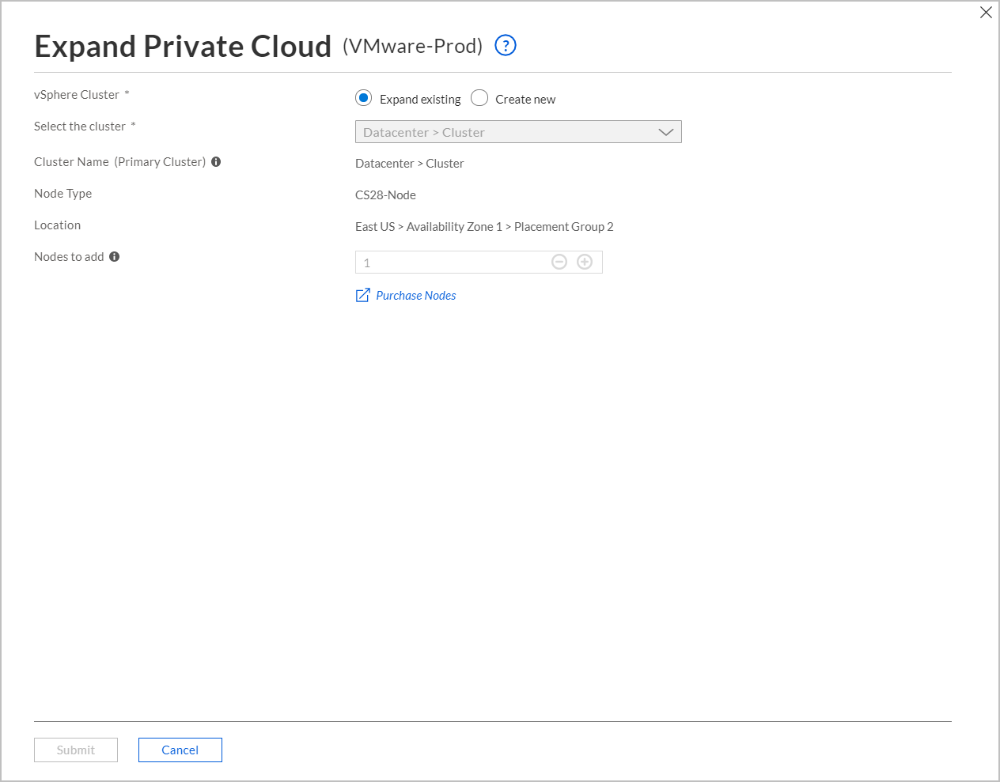

--- 
title: Expand Azure VMware Solution by CloudSimple Private Cloud
description: Describes how to expand an existing CloudSimple Private Cloud to add capacity in an existing or new cluster
author: sharaths-cs
ms.author: b-shsury 
ms.date: 06/06/2019 
ms.topic: article 
ms.service: vmware 
ms.reviewer: cynthn 
manager: dikamath 
---

# Expand a CloudSimple Private Cloud

CloudSimple provides the flexibility to dynamically expand a Private Cloud. You can begin with a smaller configuration and then expand as you need higher capacity. Or you can create a Private Cloud based on current needs and then expand as consumption grows.

A Private Cloud consists of one or more vSphere clusters. Each cluster can have 3 to 16 nodes.  When expanding a Private Cloud, you add nodes to the existing cluster or create a new cluster. To expand an existing cluster, additional nodes must be the same type (SKU) as the existing nodes. For creating a new cluster, the nodes can be of a different type. For more information on Private Cloud limits, see limits section in [CloudSimple private cloud overview](cloudsimple-private-cloud.md) article.

A private cloud is created with a default **Datacenter** on vCenter.  Each datacenter serves as a top-level management entity.  For a new cluster, CloudSimple provides the choice of adding to the existing datacenter or creating a new datacenter.

As part of the new cluster configuration, CloudSimple configures the VMware infrastructure.  The settings include storage settings for vSAN disk groups, VMware High Availability, and Distributed Resource Scheduler (DRS).

A Private Cloud can be expanded multiple times. Expansion can be done only when you stay within the overall node limits. Each time you expand a Private Cloud you add to the existing cluster or create a new one.

## Before you begin

Nodes must be provisioned before you can expand your Private Cloud.  For more information on provisioning nodes, see [Provision nodes for VMware Solution by CloudSimple - Azure](create-nodes.md) article.  For creating a new cluster, you must have at least three available nodes of the same SKU.

## Sign in to Azure

Sign in to the Azure portal at [https://portal.azure.com](https://portal.azure.com).

## Expand a Private Cloud

1. [Access the CloudSimple portal](access-cloudsimple-portal.md).

2. Open the **Resources** page and select the Private Cloud for which you want to expand.

3. In summary section, click **Expand**.

    

4. Choose whether to expand your existing cluster or create a new vSphere cluster. As you make changes, the summary information on the page is updated.

    * To expand your existing cluster, click **Expand existing cluster**. Select the cluster you want to expand and enter the number of nodes to add. Each cluster can have a maximum of 16 nodes.
    * To add a new cluster, click **Create new cluster**. Enter a name for the cluster. Select an existing datacenter, or enter a name to create a new datacenter. Choose the node type. You can choose a different node type when creating a new vSphere cluster, but not when expanding an existing vSphere cluster. Select the number of nodes. Each new cluster must have at least three nodes.

    

5. Click **Submit** to expand the private cloud.

## Next steps

* [Consume VMware VMs on Azure](quickstart-create-vmware-virtual-machine.md)
* Learn more about [Private Clouds](cloudsimple-private-cloud.md)