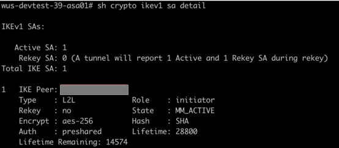
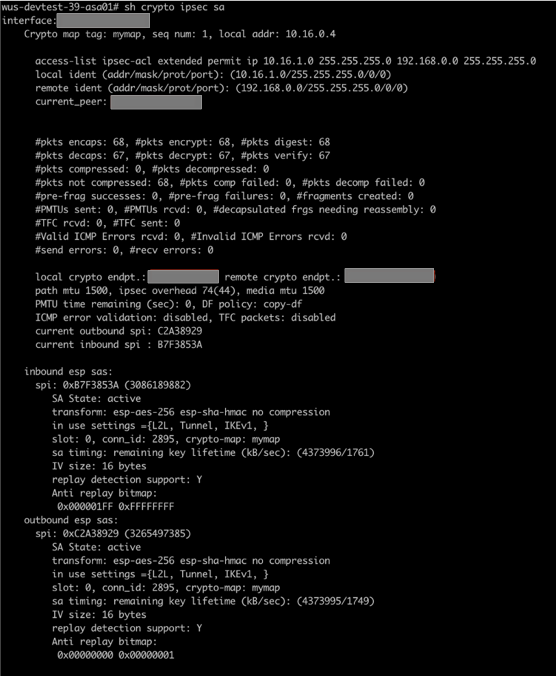

--- 
title: Azure VMware Solution by CloudSimple - Configure high availability from on-premises to CloudSimple VPN gateway
description: Describes how to configure a high availability connection from your on-premises environment to a CloudSimple VPN gateway enabled for high availability
author: sharaths-cs
ms.author: b-shsury 
ms.date: 08/14/2019 
ms.topic: article 
ms.service: azure-vmware-cloudsimple 
ms.reviewer: cynthn 
manager: dikamath 
---

# Configure a high availability connection from on-premises to CloudSimple VPN gateway

Network administrators can configure a high availability IPsec Site-to-Site VPN connection from their on-premises environment to a CloudSimple VPN gateway.

This guide presents steps to configure an on-premises firewall for an IPsec Site-to-Site VPN high availability connection. The detailed steps are specific to the type of on-premises firewall. As examples, this guide presents steps for two types of firewalls: Cisco ASA and Palo Alto Networks.

## Before you begin

Complete the following tasks before you configure the on-premises firewall.

1. Verify that your organization has [provisioned](create-nodes.md) the required nodes and created at least one CloudSimple Private Cloud.
2. [Configure a Site-to-Site VPN gateway](vpn-gateway.md#set-up-a-site-to-site-vpn-gateway) between your on-premises network and your CloudSimple Private Cloud.

See [VPN gateways overview](cloudsimple-vpn-gateways.md) for supported phase 1 and phase 2 proposals.

## Configure on-premises Cisco ASA firewall

The instructions in this section apply to Cisco ASA version 8.4 and later. In the configuration example, Cisco Adaptive Security Appliance Software Version 9.10 is deployed and configured in IKEv1 mode.

For the Site-to-Site VPN to work, you must allow UDP 500/4500 and ESP (IP protocol 50) from the CloudSimple primary and secondary public IP (peer IP) on the outside interface of the on-premises Cisco ASA VPN gateway.

### 1. Configure phase 1 (IKEv1)

To enable phase 1 (IKEv1) on the outside interface, enter the following CLI command in the Cisco ASA firewall.

```crypto ikev1 enable outside```

### 2. Create an IKEv1 policy

Create an IKEv1 policy that defines the algorithms and methods to be used for hashing, authentication, Diffie-Hellman group, lifetime, and encryption.

```
crypto ikev1 policy 1
authentication pre-share
encryption aes-256
hash sha
group 2
lifetime 28800
```

### 3. Create a tunnel group

Create a tunnel group under the IPsec attributes. Configure the peer IP address and the tunnel pre-shared key, which you set when [configuring your Site-to-Site VPN gateway](vpn-gateway.md#set-up-a-site-to-site-vpn-gateway).

```
tunnel-group <primary peer ip> type ipsec-l2l
tunnel-group <primary peer ip> ipsec-attributes
ikev1 pre-shared-key *****

tunnel-group <secondary peer ip> type ipsec-l2l
tunnel-group <secondary peer ip> ipsec-attributes
ikev1 pre-shared-key *****
```

### 4. Configure phase 2 (IPsec)

To configure phase 2 (IPsec), create an access control list (ACL) that defines the traffic to be encrypted and tunneled. In the following example, the traffic of interest is from the tunnel that is sourced from the on-premises local subnet (10.16.1.0/24) to the Private Cloud remote subnet (192.168.0.0/24). The ACL can contain multiple entries if there are multiple subnets between the sites.

In Cisco ASA versions 8.4 and later, objects or object groups can be created that serve as containers for the networks, subnets, host IP addresses, or multiple objects. Create an object for the local and an object for the remote subnets and use them for the crypto ACL and the NAT statements.

#### Define an on-premises local subnet as an object

```
object network AZ_inside
subnet 10.16.1.0 255.255.255.0
```

#### Define the CloudSimple remote subnet as an object

```
object network CS_inside
subnet 192.168.0.0 255.255.255.0
```

#### Configure an access list for the traffic of interest

```
access-list ipsec-acl extended permit ip object AZ_inside object CS_inside
```

### 5. Configure the transform set

Configure the transform set (TS), which must involve the keyword ```ikev1```. The encryption and hash attributes specified in the TS must match with the parameters listed in [Default configuration for CloudSimple VPN gateways](cloudsimple-vpn-gateways.md).

```
crypto ipsec ikev1 transform-set devtest39 esp-aes-256 esp-sha-hmac 
```

### 6. Configure the crypto map

Configure the crypto map, which contains these components:

* Peer IP address
* Defined ACL that contains the traffic of interest
* Transform Set

```
crypto map mymap 1 set peer <primary peer ip> <secondary peer ip>
crypto map mymap 1 match address ipsec-acl
crypto map mymap 1 set ikev1 transform-set devtest39
```

### 7. Apply the crypto map

Apply the crypto map on the outside interface:

```crypto map mymap interface outside```

### 8. Confirm applicable NAT rules

The following is the NAT rule that is used. Ensure that the VPN traffic is not subjected to any other NAT rule.

```nat (inside,outside) source static AZ_inside AZ_inside destination static CS_inside CS_inside```

### Sample IPsec Site-to-Site VPN established output from Cisco ASA

Phase 1 output:



Phase 2 output:



## Configure on-premises Palo Alto Networks firewall

The instructions in this section apply to Palo Alto Networks version 7.1 and later. In this configuration example, Palo Alto Networks VM-Series Software Version 8.1.0 is deployed and configured in IKEv1 mode.

For the Site-to-Site VPN to work, you must allow UDP 500/4500 and ESP (IP protocol 50) from the CloudSimple primary and secondary public IP (peer IP) on the outside interface of the on-premises Palo Alto Networks gateway.

### 1. Create primary and secondary tunnel interfaces

Sign in to the Palo Alto firewall, select **Network** > **Interfaces** > **Tunnel** > **Add**, configure the following fields, and click **OK**.

* Interface Name. The first field is autopopulated with keyword 'tunnel'. In the adjacent field, enter any number between from 1 to 9999. This interface will be used as a primary tunnel interface to carry Site-to-Site traffic between the on-premises datacenter and the Private Cloud.
* Comment. Enter comments for easy identification of the purpose of the tunnel
* Netflow Profile. Leave default.
* Config.
    Assign Interface To:
        Virtual Router: Select **default**. 
        Security Zone: Select the zone for trusted LAN traffic. In this example, the name of the zone for LAN traffic is 'Trust'.
* IPv4. Click **Add** and add any non-overlapping unused /32 ip address in your environment, which will be assigned to the primary tunnel interface and will be used for monitoring the tunnels (explained later).

Because this configuration is for a high availability VPN, two tunnel interfaces are required: One primary and one secondary. Repeat the previous steps to create the secondary tunnel interface. Select a different tunnel ID and a different unused /32 ip address.

### 2. Set up static routes for Private Cloud subnets to be reached over the Site-to-Site VPN

Routes are necessary for the on-premises subnets to reach CloudSimple private cloud subnets.

Select **Network** > **Virtual Routers** > *default* > **Static Routes** > **Add**, configure the following fields, and click **OK**.

* Name. Enter any name for easy identification of the purpose of the route.
* Destination. Specify the CloudSimple private cloud subnets to be reached over S2S tunnel interfaces from on-premises
* Interface. Select the primary tunnel interface created in step-1(Section-2) from the dropdown. In this example, it is tunnel.20.
* Next Hop. Select **None**.
* Admin Distance. Leave default.
* Metric. Enter any value from 1 to 65535. The key is to enter lower metric for the route corresponding to primary tunnel interface compared to the route corresponding secondary tunnel interface making the former route preferred. If tunnel.20 has metric value of 20 as opposed to a metric value of 30 for tunnel.30, tunnel.20 is preferred.
* Route Table. Leave default.
* BFD Profile. Leave default.
* Path monitoring. Leave unchecked.

Repeat the previous steps to create another route for Private Cloud subnets to use as a secondary/backup route via secondary tunnel interface. This time, select different tunnel ID and a higher metric than for the primary route.

### 3. Define the cryptographic profile

Define a cryptographic profile that specifies the protocols and algorithms for identification, authentication, and encryption to be used for setting up VPN tunnels in IKEv1 Phase 1.

Select **Network** > **Expand Network Profiles** > **IKE Crypto** > **Add**, configure the following fields, and click **OK**.

* Name. Enter any name of the IKE crypto profile.
* DH Group. Click **Add** and select the appropriate DH group.
* Encryption. Click **Add** and select the appropriate encryption method.
* Authentication. Click **Add** and select the appropriate authentication method.
* Key lifetime. Leave default.
* IKEv2 Authentication Multiple. Leave default.

### 4. Define IKE gateways

Define IKE gateways to establish communication between the peers across each end of the VPN tunnel.

Select **Network** > **Expand Network Profiles** > **IKE Gateways** > **Add**, configure the following fields, and click **OK**.

General tab:

* Name. Enter the name for the IKE gateway to be peered with the primary CloudSimple VPN peer.
* Version. Select **IKEv1 only mode**.
* Address Type. Select **IPv4**.
* Interface. Select the public facing or outside interface.
* Local IP Address. Leave default.
* Peer IP Address Type. Select **IP**.
* Peer Address. Enter the primary CloudSimple VPN peer IP address.
* Authentication. Select **Pre-Shared Key**.
* Pre-shared Key / Confirm Pre-shared Key. Enter the pre-shared key to match the CloudSimple VPN gateway key.
* Local Identification. Enter the public IP address of the on-premises Palo Alto firewall.
* Peer Identification. Enter the primary CloudSimple VPN peer IP address.

Advanced Options tab:

* Enable Passive Mode. Leave unchecked.
* Enable NAT Traversal. Leave unchecked if the on-premises Palo Alto firewall is not behind any NAT device. Otherwise, select the checkbox.

IKEv1:

* Exchange Mode. Select **main**.
* IKE Crypto Profile. Select the IKE Crypto profile that you created earlier. Leave the Enable Fragmentation box unchecked.
* Dead Peer Detection. Leave the box unchecked.

Repeat the previous steps to create the secondary IKE gateway.

### 5. Define IPSEC Crypto profiles

Select **Network** > **Expand Network Profiles** > **IPSEC Crypto** > **Add**, configure the following fields, and click **OK**.

* Name. Enter a name for the IPsec crypto profile.
* IPsec Protocol. Select **ESP**.
* Encryption. Click **Add** and select the appropriate encryption method.
* Authentication. Click **Add** and select the appropriate authentication method.
* DH Group. Select **no-pfs**.
* Lifetime. Set as 30 minutes.
* Enable. Leave the box unchecked.

Repeat the previous steps to create another IPsec crypto profile, which will be used for as the secondary CloudSimple VPN peer. The same IPSEC Crypto profile can also be used for both the primary and secondary IPsec tunnels (see the following procedure).

### 6. Define monitor profiles for tunnel monitoring

Select **Network** > **Expand Network Profiles** > **Monitor** > **Add**, configure the following fields, and click **OK**.

* Name. Enter any name of the Monitor profile to be used for tunnel monitoring for proactive reaction to the failure.
* Action. Select **Fail Over**.
* Interval. Enter the value **3**.
* Threshold. Enter the value **7**.

### 7. Set up primary and secondary IPsec tunnels.

Select **Network** > **IPsec Tunnels** > **Add**, configure the following fields, and click **OK**.

General tab:

* Name. Enter any name for the primary IPSEC tunnel to be peered with primary CloudSimple VPN peer.
* Tunnel Interface. Select the primary tunnel interface.
* Type. Leave default.
* Address Type. Select **IPv4**.
* IKE Gateway. Select the primary IKE gateway.
* IPsec Crypto Profile. Select the primary IPsec profile. Select **Show Advanced options**.
* Enable Replay Protection. Leave default.
* Copy TOS Header. Leave the box unchecked.
* Tunnel Monitor. Check the box.
* Destination IP. Enter any IP address belonging to the CloudSimple Private Cloud subnet that is allowed over the Site-to-Site connection. Make sure that the tunnel interfaces (such as tunnel.20 - 10.64.5.2/32 and tunnel.30 - 10.64.6.2/32) on Palo Alto are allowed to reach the CloudSimple Private Cloud IP address over the Site-to-Site VPN. See the following configuration for proxy IDs.
* Profile. Select the monitor profile.

Proxy IDs tab:
Click **IPv4** > **Add** and configure the following:

* Proxy ID. Enter any name for the interesting traffic. There could be multiple Proxy IDs carried inside one IPsec tunnel.
* Local. Specify the on-premises local subnets that are allowed to communicate with Private Cloud subnets over the Site-to-Site VPN.
* Remote. Specify the Private Cloud remote subnets that are allowed to communicate with the local subnets.
* Protocol. Select **any**.

Repeat the previous steps to create another IPsec tunnel to use for the secondary CloudSimple VPN peer.

## References

Configuring NAT on Cisco ASA:

<a href="https://www.cisco.com/c/en/us/td/docs/security/asa/asa84/configuration/guide/asa_84_cli_config/nat_objects.html" target="_blank">Cisco ASA 5500 Series Configuration Guide</a>

Supported IKEv1 and IKEv2 attributes on Cisco ASA:

<a href="https://www.cisco.com/c/en/us/td/docs/security/asa/asa90/configuration/guide/asa_90_cli_config/vpn_ike.html#21661" target="_blank">Cisco ASA Series CLI Configuration Guide</a>

Configuring IPsec Site-to-Site VPN on Cisco ASA with version 8.4 and later:

<a href="https://www.cisco.com/c/en/us/support/docs/security/asa-5500-x-series-next-generation-firewalls/119141-configure-asa-00.html#anc8" target="_blank">Configure IKEv1 IPsec Site-to-Site Tunnels with the ASDM or CLI on the ASA</a>

Configuring Cisco Adaptive Security Appliance virtual (ASAv) on Azure:

<a href="https://www.cisco.com/c/en/us/td/docs/security/asa/asa96/asav/quick-start-book/asav-96-qsg/asav-azure.html" target="_blank">Cisco Adaptive Security Virtual Appliance (ASAv) quickstart Guide</a>

Configuring Site-to-Site VPN with Proxy IDs on Palo Alto:

[Set Up Site-to-Site VPN](https://docs.paloaltonetworks.com/pan-os/9-0/pan-os-admin/vpns/set-up-site-to-site-vpn#)

Setting up tunnel monitor:

[Set Up Tunnel Monitoring](https://docs.paloaltonetworks.com/pan-os/7-1/pan-os-admin/vpns/set-up-tunnel-monitoring.html)

IKE gateway or IPsec tunnel operations:

<a href="https://docs.paloaltonetworks.com/pan-os/9-0/pan-os-admin/vpns/set-up-site-to-site-vpn/enabledisable-refresh-or-restart-an-ike-gateway-or-ipsec-tunnel#" target="_blank">Enable/Disable, Refresh, or Restart an IKE Gateway or IPsec Tunnel</a>
