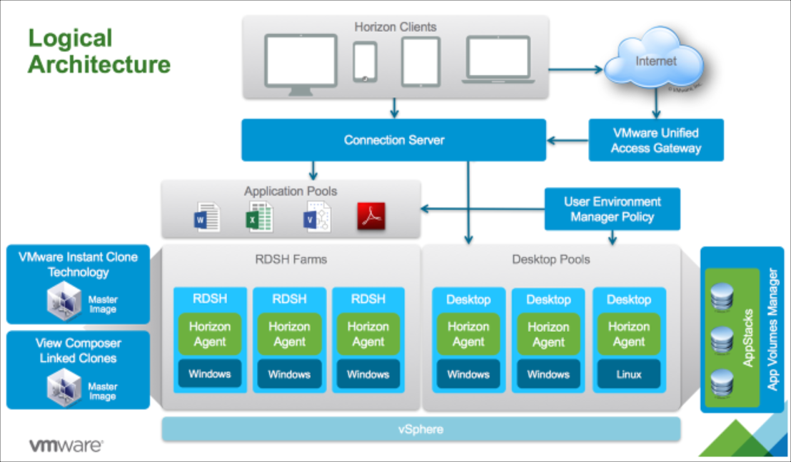
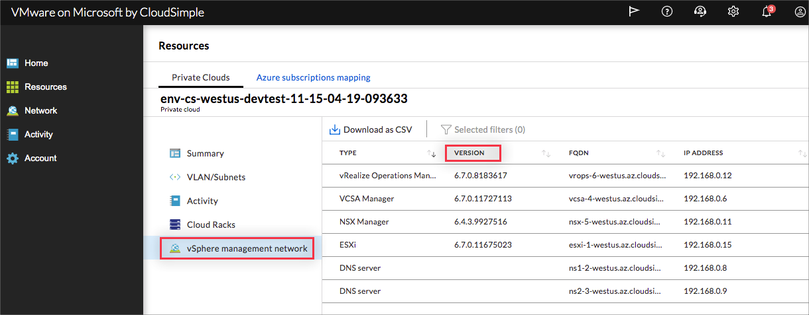
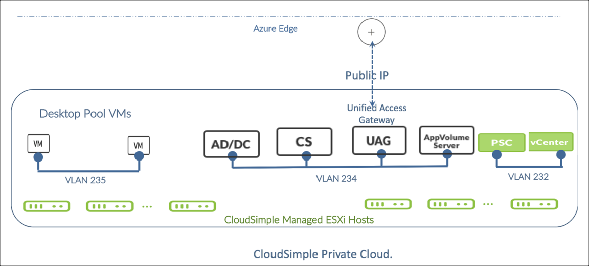

--- 
title: Azure VMware Solution by CloudSimple - Use Private Cloud site to host a virtual desktop infrastructure using VMware Horizon
description: Describes how you can use your CloudSimple Private Cloud site to host a virtual desktop infrastructure using VMware Horizon
author: sharaths-cs
ms.author: b-shsury 
ms.date: 08/20/2019 
ms.topic: article 
ms.service: azure-vmware-cloudsimple 
ms.reviewer: cynthn 
manager: dikamath 
---

# Use CloudSimple Private Cloud site to host a virtual desktop infrastructure using VMware Horizon

You can use your CloudSimple Private Cloud site to host a virtual desktop infrastructure (VDI) using VMware Horizon 7.x. The following figure shows the logical solution architecture for the VDI.

With this solution, you have full control over Horizon View Manager and App Volume. The familiar UI, API, and CLI interfaces enable use of your existing scripts and tools.

The CloudSimple solution requires you to do the following:

* Install, configure, and manage VMware Horizon 7.x in your Private Cloud.
* Provide your own Horizon licenses.

## Deploy the solution

The following sections describe how to deploy a VDI solution using Horizon in your Private Cloud.

1. [Verify that VMware product versions are compatible](#verify-that-vmware-product-versions-are-compatible)
2. [Estimate the size of your desktop environment](#estimate-the-size-of-your-desktop-environment)
3. [Create a Private Cloud for your environment](#create-a-private-cloud-for-your-environment)
4. [Install VMware Horizon in your Private Cloud](#install-vmware-horizon-in-your-private-cloud)

### Verify that VMware product versions are compatible

* Verify that your current and planned versions of Horizon, App Volumes, Unified Access Gateway, and User Environment Manager are compatible with each other and with vCenter and PSC in the Private Cloud. For compatibility information, see [VMware Compatibility Matrix for Horizon 7.5](https://www.vmware.com/resources/compatibility/sim/interop_matrix.php#interop&260=2877&0=).
* To find out the current versions of vCenter and PSC in your Private Cloud, go to **Resources** in the [CloudSimple portal](access-cloudsimple-portal.md), select your Private Cloud, and click the **vSphere Management Network** tab.

### Estimate the size of your desktop environment

* Verify that your identified configuration is within VMware operational limits.
* Estimate the resources that are needed for all your desktops and your Horizon management components.

### Create a Private Cloud for your environment

1. Create a Private Cloud from the CloudSimple portal by following the instructions in [Configure a Private Cloud environment](quickstart-create-private-cloud.md).  CloudSimple creates a default vCenter user named 'cloudowner' in every newly created Private Cloud. For details on the default Private Cloud user and permission model, see [Learn the Private Cloud permissions model](learn-private-cloud-permissions.md).
2. Create a VLAN in your Private Cloud for the Horizon management plane and assign it a subnet CIDR. For instructions, see [Create and manage VLANs/Subnets](create-vlan-subnet.md). This is the network where all the solution components (Unified Access Gateway, Connection Server, App Volume Server, and User Environment Manager servers) will be installed.
3. Decide if you want to use an external identity provider with your Private Cloud vCenter. If yes, choose one of these options:
    * Use your on-premises Active Directory as the external identity provider. For instructions, see [vCenter Identity Sources](set-vcenter-identity.md).
    * Set up an Active Directory server in the Private Cloud in Horizon management plane VLAN to use as your external identity provider. For instructions, see [vCenter Identity Sources](set-vcenter-identity.md).
    * Set up a DHCP and DNS server in Horizon management plane VLAN in the Private Cloud. For instructions, see [Set up DNS and DHCP applications and workloads in your CloudSimple Private Cloud](dns-dhcp-setup.md).
4. Configure DNS forwarding on the DNS server installed in the Private Cloud. For instructions, see [Create a Conditional Forwarder](on-premises-dns-setup.md#create-a-conditional-forwarder).

### Install VMware Horizon in your Private Cloud

The following deployment diagram depicts a Horizon solution deployed in a Private Cloud. Unified Access Gateway, AD/DC, View, and App Volume Server are installed in user-created VLAN 234. Unified Access Gateway has an assigned public IP address that is reachable from the Internet. Horizon desktop pool VMs are deployed in VLAN 235 to provide additional isolation and security.

The following sections outline the instructions to set up a deployment similar to the one that is depicted in the figure. Before you begin, verify that you have the following:

* A Private Cloud created using the CloudSimple portal with sufficient capacity to run your desktop pools.
* Sufficient bandwidth between your on-premises environment and the Private Cloud environment to support the network traffic for your desktops.
* A Site-to-Site VPN tunnel set up between your on-premises datacenter and the Private Cloud.
* IP reachability from end-user subnets in your on-premises environment to the CloudSimple Private Cloud subnets.
* AD/DHCP/DNS installed for your Private Cloud.

#### CloudSimple portal: Create a dedicated VLAN/subnet for desktop pools

Create a VLAN for the Horizon desktop pools and assign it a subnet CIDR. For instructions, see [Create and manage VLANs/Subnets](create-vlan-subnet.md). This is the network where all the desktop virtual machines will run.

Follow standard security best practices to secure your Horizon deployment:

* Allow only desktop RDP traffic / SSH traffic to your desktop VMs.
* Allow only management traffic between Horizon management plane VLAN and desktop pool VLAN.
* Allow only management traffic from on-premises network.

You can enforce these best practices by configuring [firewall rules](firewall.md) from the CloudSimple portal.

#### CloudSimple portal: Configure firewall rules to secure Horizon management plane

Set up the following rules in the CloudSimple portal. For instructions, see [Set up firewall tables and rules](firewall.md).

1. Configure firewall rules in the CloudSimple N-S firewall to allow communication between on-premises subnets and Horizon management VLAN so that only the network ports listed in the VMware document [Horizon port list](https://docs.vmware.com/en/VMware-Horizon-7/7.1/com.vmware.horizon-client-agent.security.doc/GUID-52807839-6BB0-4727-A9C7-EA73DE61ADAB.html) are allowed.

2. Create E-W firewall rules between the Horizon management VLAN and desktop pool VLAN in the Private Cloud.

#### CloudSimple portal: Create a public IP address for Unified Access Gateway

Create a public IP address for the Unified Access Gateway appliance to enable desktop client connections from the internet. For instructions, see [Allocate public IP addresses](public-ips.md).

When the setup is complete, the public IP address is assigned and listed on the Public IPs page.

#### CloudSimple portal: Escalate privileges

The default 'cloudowner' user doesn't have sufficient privileges in the Private Cloud vCenter to install Horizon, so the user's vCenter privileges must be escalated. For more information, see [Escalate privileges](escalate-private-cloud-privileges.md).

#### vCenter UI: Create a user in Private Cloud for Horizon installation

1. Sign in to vCenter using the 'cloudowner' user credentials.
2. Create a new user, 'horizon-soln-admin', in vCenter and add the user to the administrators group in vCenter.
3. Sign out of vCenter as the 'cloudowner' user and sign in as the 'horizon-soln-admin' user.

#### vCenter UI: Install VMware Horizon

As mentioned in the earlier logical architecture section, Horizon solution has the following components:

* VMware Horizon View
* VMware Unified Access Gateway
* VMware App Volume Manager
* VMware User Environment Manager

Install the components as follows:

1. Install and configure Unified Access Gateway by following the instructions provided in the VMware document [Deploying and Configuring VMware Unified Access Gateway](https://docs.vmware.com/en/Unified-Access-Gateway/3.3.1/com.vmware.uag-331-deploy-config.doc/GUID-F5CE0D5E-BE85-4FA5-BBCF-0F86C9AB8A70.html).

2. Install Horizon View in the Private Cloud by following the instructions in [View Installation Guide](https://docs.vmware.com/en/VMware-Horizon-7/7.4/horizon-installation/GUID-37D39B4F-5870-4188-8B11-B6C41AE9133C.html).

3. Install App Volume Manager by following the instructions in [Install and Configure VMware App Volumes](https://docs.vmware.com/en/VMware-App-Volumes/2.10/com.vmware.appvolumes.user.doc/GUID-5E8BAF8C-F5A6-412C-9424-266BA7109BA4.html).

4. Install and configure User Environment Manager by following the instructions in [About Installing and Configuring VMware User Environment Manager](https://docs.vmware.com/en/VMware-User-Environment-Manager/9.4/com.vmware.user.environment.manager-install-config/GUID-DBBC82E4-483F-4B28-9D49-4D28E08715BC.html).

#### File a support request to upload VMware Horizon pre-packaged app volumes

As a part of the installation process, App Volume Manager uses pre-packaged volumes to
provision app stacks and writable volumes. These volumes serve as templates
for app stacks and writable volumes.

Uploading the volumes to the Private Cloud datastore requires the ESXi root password. For assistance, submit a [support request](https://portal.azure.com/#blade/Microsoft_Azure_Support/HelpAndSupportBlade/newsupportrequest). Attach the AppVolumes installer bundle so that CloudSimple support personnel can upload the templates to your Private Cloud environment.

#### CloudSimple portal: De-escalate privileges

You can now [de-escalate the privileges](escalate-private-cloud-privileges.md#de-escalate-privileges) of the 'cloudowner' user.

## Ongoing management of your Horizon solution

You have full control over Horizon and App Volume Manager software in your Private Cloud environment and are expected to perform the necessary software lifecycle management. Ensure that any new versions of software are compatible with the Private Cloud vCenter and PSC before updating or upgrading Horizon or App Volume.
