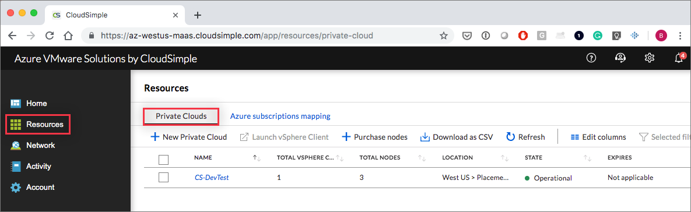
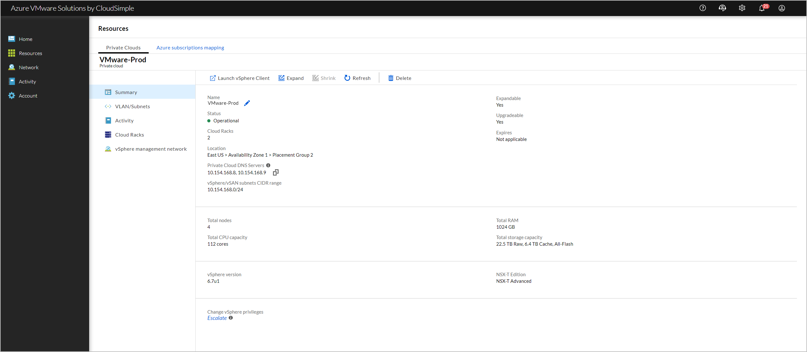
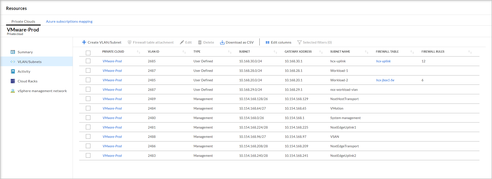
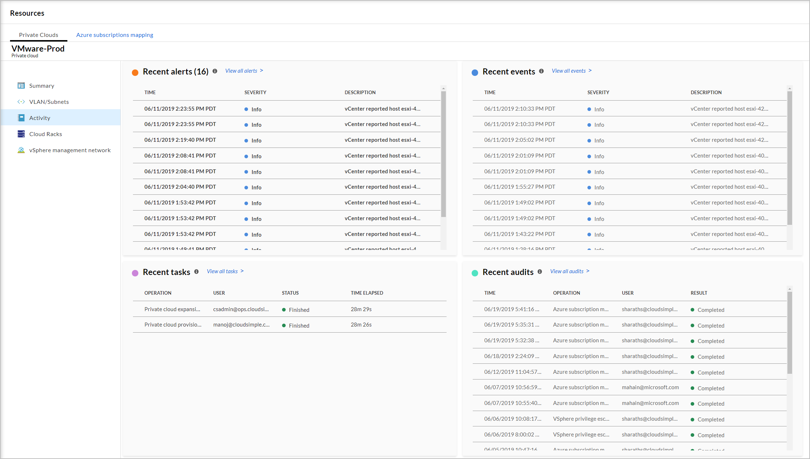
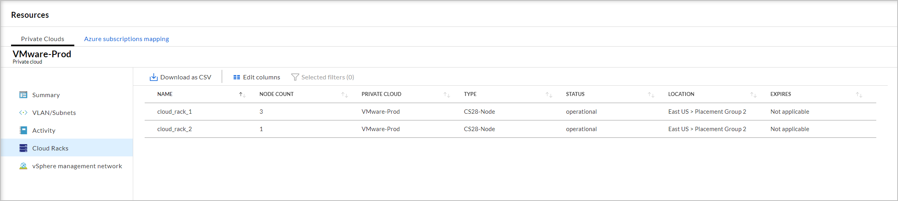
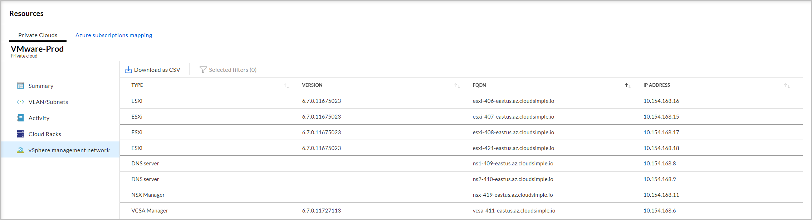

--- 
title: Manage Azure VMware Solution by CloudSimple Private Cloud
description: Describes the capabilities available to manage your CloudSimple Private Cloud resources and activity
author: sharaths-cs
ms.author: b-shsury 
ms.date: 06/10/2019 
ms.topic: article 
ms.service: azure-vmware-cloudsimple 
ms.reviewer: cynthn 
manager: dikamath 
---

# Manage Private Cloud resources and activity

Private clouds are managed from CloudSimple portal.  Check the status, available resources, activity on the private cloud, and other settings from the CloudSimple portal.

## Sign in to Azure

Sign in to the Azure portal at [https://portal.azure.com](https://portal.azure.com).

## Access the CloudSimple portal

Access the [CloudSimple portal](access-cloudsimple-portal.md).

## View the List of Private Clouds

The **Private Clouds** tab on the **Resources** page lists all Private Clouds in your subscription. Information includes the name, number of vSphere clusters, location, current state of the private cloud and, resource information.

Select a Private Cloud for additional information and actions.

## Private Cloud summary

View a comprehensive summary of the selected Private Cloud.  Summary page includes the DNS servers deployed on the Private Cloud.  You can set up DNS forwarding from on-premises DNS servers to your Private Cloud DNS servers.  For more information on DNS forwarding, see [Configure DNS for name resolution for Private Cloud vCenter from on-premises](https://docs.microsoft.com/azure/vmware-cloudsimple/on-premises-dns-setup/).

### Available actions

* [Launch vSphere client](https://docs.microsoft.com/azure/vmware-cloudsimple/vcenter-access). Access the vCenter for this Private Cloud.
* [Purchase nodes](create-nodes.md). Add nodes to this Private Cloud.
* [Expand](expand-private-cloud.md). Add nodes to this Private Cloud.
* **Refresh**. Update the information on this page.
* **Delete**. You can delete the Private Cloud at any time. **Before deleting, make sure that you have backed up all systems and data.** Deleting a Private Cloud deletes all the VMs, vCenter configuration, and data. Click **Delete** in the summary section for the selected Private Cloud. Following deletion, all the Private Cloud data is erased in a secure, highly compliant erasure process.
* [Change vSphere privileges](escalate-private-cloud-privileges.md).  Escalate your privileges on this Private Cloud.

## Private Cloud VLANS/subnets

View the list of defined VLANs/subnets for the selected Private Cloud.  The list includes the management VLANs/subnets created when the private cloud was created.

 

### Available actions

* [Add VLANS/Subnets](https://docs.microsoft.com/azure/vmware-cloudsimple/create-vlan-subnet/). Add a VLAN/subset to this Private Cloud.

Select a VLAN/Subnet for following actions
* [Attach firewall table](https://docs.microsoft.com/azure/vmware-cloudsimple/firewall/). Attach a firewall table to this Private Cloud.
* **Edit**
* **Delete** (only user-defined VLANs/Subnets)

## Private Cloud activity

View the following information for the selected Private Cloud.  The activity information is a filtered list of all activities for the selected Private Cloud.  This page shows up to 25 recent activities.

* Recent alerts
* Recent events
* Recent tasks
* Recent audit

## Cloud Racks

Cloud racks are the building blocks of your Private Cloud. Each rack provides a unit of capacity. CloudSimple automatically configures cloud racks based on your selections when creating or expanding a Private Cloud.  View the full list of cloud racks, including the Private Cloud that each is assigned to.

## vSphere Management Network

List of VMware management resources and virtual machines that are currently configured on the Private Cloud. Information includes the software version, fully qualified domain name (FQDN), and IP address of the resources.

## Next steps

* [Consume VMware VMs on Azure](quickstart-create-vmware-virtual-machine.md)
* Learn more about [Private Clouds](cloudsimple-private-cloud.md)