# Migrating data to Azure VMware Solution by using Azure Data Box

The Microsoft Azure Data Box cloud solution lets you send terabytes (TBs) of data to Azure in a quick, inexpensive, and reliable way. The secure data transfer is accelerated by shipping you a proprietary Data Box storage device. Each storage device has a maximum usable storage capacity of 80 TB and is transported to your datacenter by a regional carrier. The device has a rugged casing to protect and secure your data during transit.

By using Data Box, you can bulk-migrate your VMware data to your private cloud. Data from your on-premises VMware vSphere environment is copied to Data Box through the Network File System (NFS) protocol. Bulk data migration involves saving a point-in-time copy of virtual machines, configuration, and associated data to Data Box and then manually shipping it to Azure.

In this article, you learn about:

* Setting up Data Box.
* Copying data from the on-premises VMware environment to the Data Box by through NFS.
* Preparing for the return of Data Box.
* Preparing blob data for copying to Azure VMware Solution.
* Copying the data from Azure to your private cloud.

## Scenarios

Use Data Box in the following scenarios for bulk data migration:

* To migrate a large amount of data from on-premises to Azure VMware Solution. This method establishes a baseline and syncs differences over the network.
* To migrate a large number of virtual machines that are turned off (cold virtual machines).
* To migrate virtual machine data for setting up development and test environments.
* To migrate a large number of virtual machine templates, ISO files, and virtual machine disks.

## Before you begin

* Check the prerequisites and [order Data Box](../databox/data-box-deploy-ordered.md) through your Azure portal. During the order process, you must select a storage account that enables Blob storage. After you receive the Data Box device, connect it to your on-premises network and [set up the device](../databox/data-box-deploy-set-up.md) with an IP address that's reachable from your vSphere management network.

* Create a virtual network and a storage account in the same region where your Azure VMware Solution is provisioned.

* Create an [Azure virtual network connection](cloudsimple-azure-network-connection.md) from your private cloud to the virtual network where the storage account is created by following the steps in [Connect Azure virtual network to CloudSimple using ExpressRoute](virtual-network-connection.md).

## Set up Data Box for NFS

Connect to your Data Box local web UI by following the steps in the "Connect to your device" section of [Tutorial: Cable and connect to your Azure Data Box](../databox/data-box-deploy-set-up.md).  Configure Data Box to allow access to NFS clients:

1. In the local web UI, go to the **Connect and copy** page. Under **NFS settings**, select **NFS client access**. 

    

2. Enter the IP address of the VMware ESXi hosts and select **Add**. You can configure access for all the hosts in your vSphere cluster by repeating this step. Select **OK**.

    
> [!IMPORTANT]
> **Always create a folder for the files that you intend to copy under the share and then copy the files to that folder**. The folder created under block blob and page blob shares represents a container to which data is uploaded as blobs. You can't copy files directly to the *root* folder in the storage account.

Under block blob and page blob shares, first-level entities are containers, and second-level entities are blobs. Under shares for Azure Files, first-level entities are shares, and second-level entities are files.

The following table shows the UNC path to the shares on your Data Box and Azure Storage path URL where the data is uploaded. The final Azure Storage path URL can be derived from the UNC share path.
 
| Blobs and Files | Path and URL |
|---------------- | ------------ |
| Azure Block blobs | <li>UNC path to shares: `//<DeviceIPAddress>/<StorageAccountName_BlockBlob>/<ContainerName>/files/a.txt`</li><li>Azure Storage URL: `https://<StorageAccountName>.blob.core.windows.net/<ContainerName>/files/a.txt`</li> |  
| Azure Page blobs  | <li>UNC path to shares: `//<DeviceIPAddres>/<StorageAccountName_PageBlob>/<ContainerName>/files/a.txt`</li><li>Azure Storage URL: `https://<StorageAccountName>.blob.core.windows.net/<ContainerName>/files/a.txt`</li>   |  
| Azure Files       |<li>UNC path to shares: `//<DeviceIPAddres>/<StorageAccountName_AzFile>/<ShareName>/files/a.txt`</li><li>Azure Storage URL: `https://<StorageAccountName>.file.core.windows.net/<ShareName>/files/a.txt`</li>        |

> [!NOTE]
> Use Azure Block blobs for copying VMware data.

## Mount the NFS share as a datastore on your on-premises vCenter cluster and copy the data

The NFS share from your Data Box must be mounted as a datastore on your on-premises vCenter cluster or VMware ESXi host in order to copy the data to the NFS datastore:

1. Log in to your on-premises vCenter server.

2. Right-click **Datacenter**, select **Storage**, select **New Datastore**, and then select **Next**.

   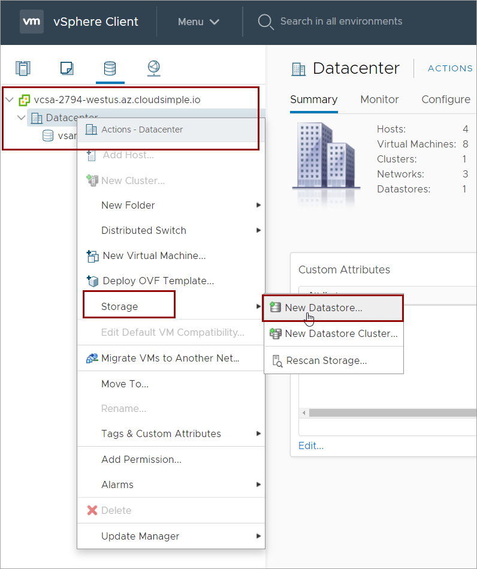

3. In step 1 of the Add Datastore wizard, select **NFS** under **Type**.

   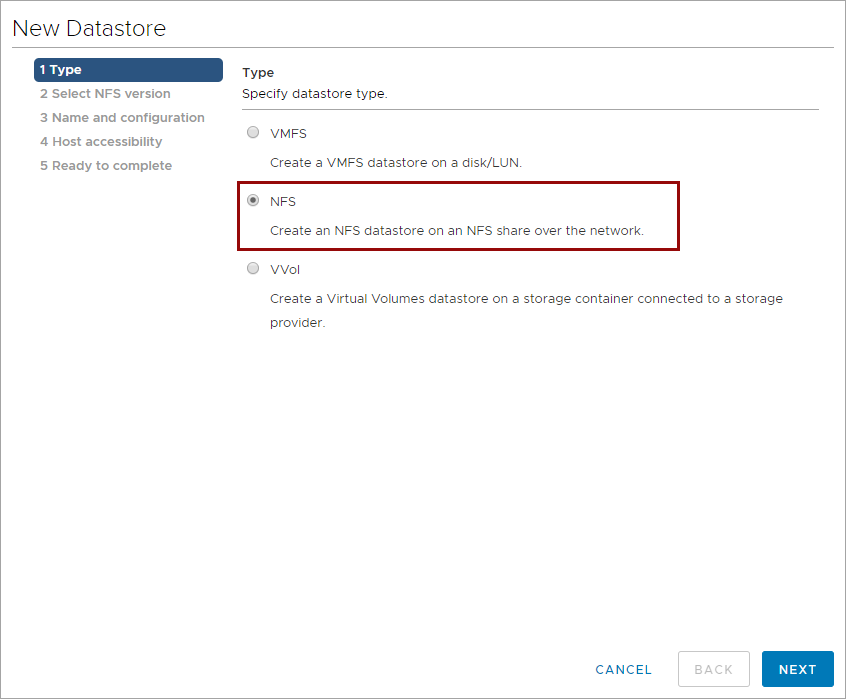

4. In step 2 of the wizard, select **NFS 3** as the NFS version and then select **Next**.

   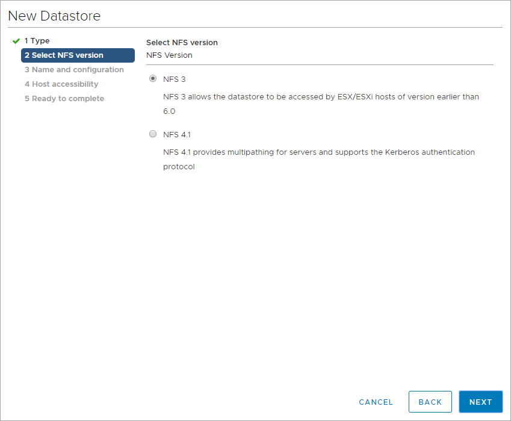

5. In step 3 of the wizard, specify the name for the datastore, the path, and the server. You can use the IP address of your Data Box for the server. The folder path will be in the `/<StorageAccountName_BlockBlob>/<ContainerName>/` format.

   

6. In step 4 of the wizard, select the ESXi hosts where you want the datastore to be mounted and then select **Next**.  In a cluster, select all the hosts to ensure migration of the virtual machines.

   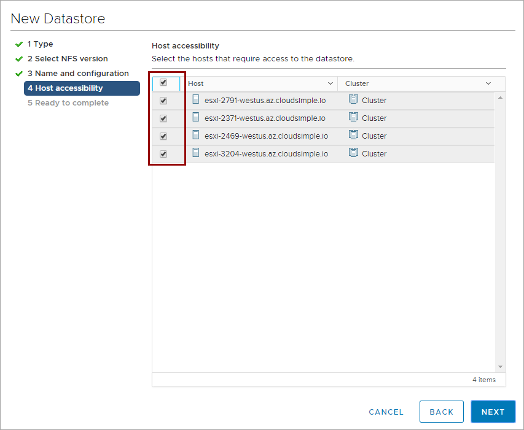

7. In step 5 of the wizard, review the summary and select **Finish**.

## Copy data to the Data Box NFS datastore

Virtual machines can be migrated or cloned to the new datastore.  Any unused virtual machines that you want to migrate can be migrated to the Data Box NFS datastore by using the **storage vMotion** option. Active virtual machines can be cloned to the Data Box NFS datastore.

* Identify and list the virtual machines that can be **moved**.
* Identify and list the virtual machines that must be **cloned**.

### Move a virtual machine to a Data Box datastore

1. Right-click the virtual machine that you want to move to the Data Box datastore and then select **Migrate**.

    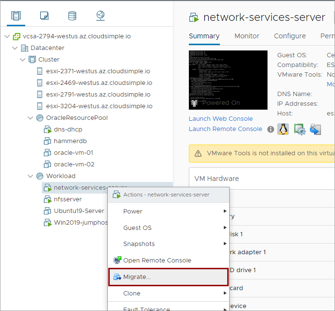

2. Select **Change storage only** for the migration type and then select **Next**.

    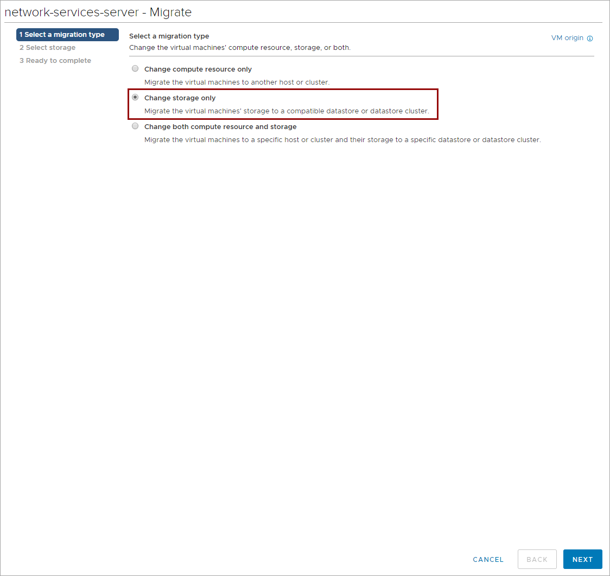

3. Select **Databox-Datastore** as the destination and then select **Next**.

    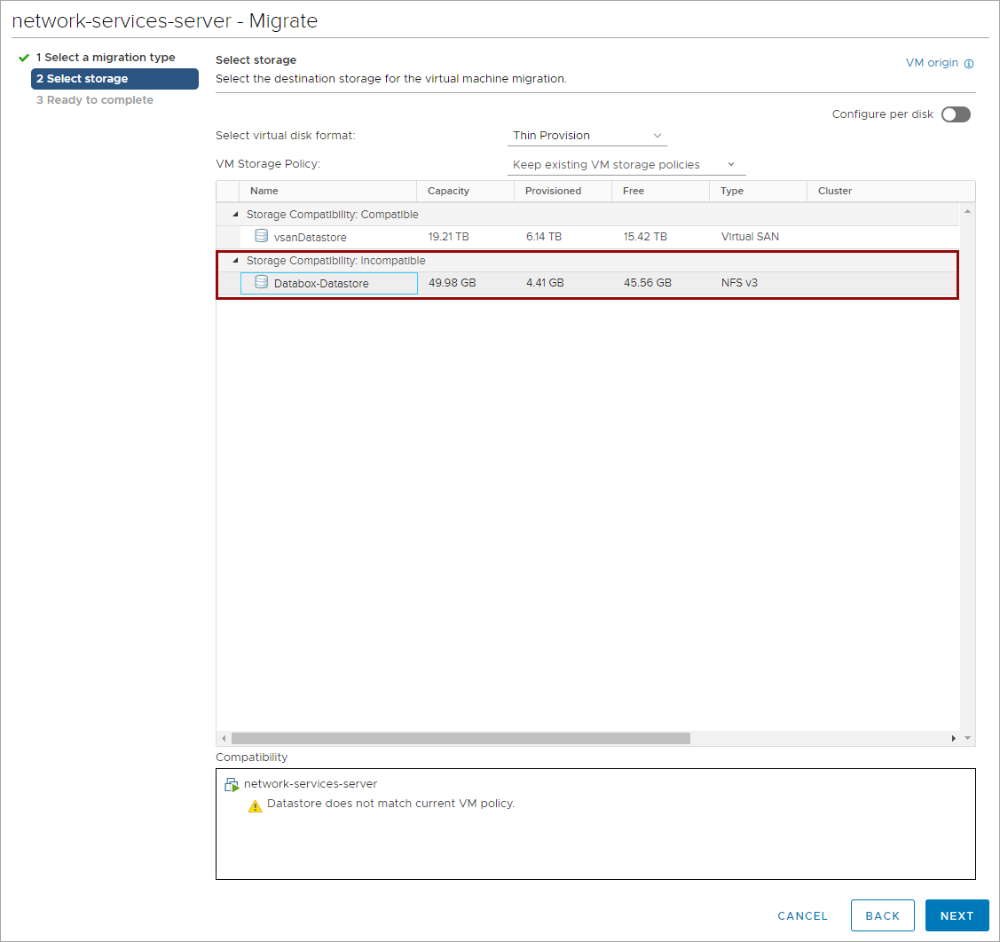

4. Review the information and select **Finish**.

5. Repeat steps 1 through 4 for additional virtual machines.

> [!TIP]
> You can select multiple virtual machines that are in the same power state (turned on or turned off) and migrate them in bulk.

The virtual machine will be migrated to the NFS datastore from Data Box. After all virtual machines are migrated, you can turn off (shut down) the active virtual machines in preparation for migration of data to Azure VMware Solution.

### Clone a virtual machine or a virtual machine template to the Data Box datastore

1. Right-click a virtual machine or a virtual machine template that you want to clone. Select **Clone** > **Clone to Virtual Machine**.

    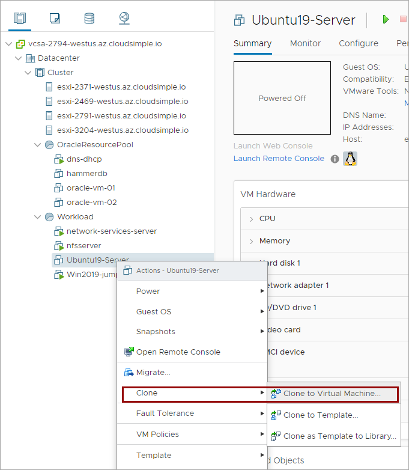

2. Select a name for the cloned virtual machine or the virtual machine template.

3. Select the folder where you want to put the cloned object and then select **Next**.

4. Select the cluster or the resource pool where you want to put the cloned object and then select **Next**.

5. Select **Databox-Datastore** as the storage location and then select **Next**.

    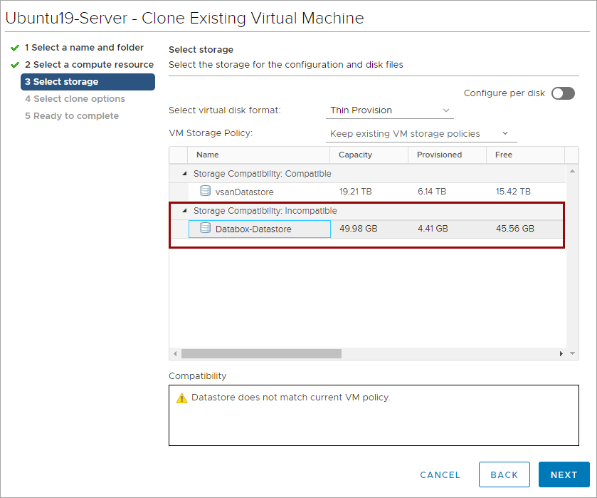

6. If you want to customize any options for the cloned object, select the customization options, and then select **Next**.

7. Review the configurations and select **Finish**.

8. Repeat steps 1 through 7 for additional virtual machines or virtual machine templates.

Virtual machines will be cloned and stored on the NFS datastore from Data Box. After the virtual machines are cloned, make sure they're shut down in preparation for migration of data to Azure VMware Solution.

### Copy ISO files to the Data Box datastore

1. From your on-premises vCenter web UI, go to **Storage**.  Select **Databox-Datastore** and then select **Files**. Create a new folder for storing ISO files.

    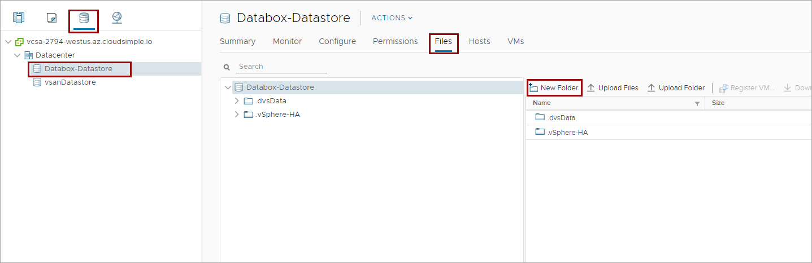

2. Provide a name for the folder where ISO files will be stored.

3. Double-click the newly created folder to open it.

4. Select **Upload Files** and then select the ISO files you want to upload.
    
    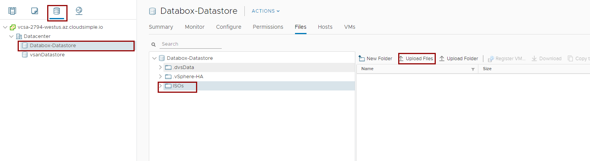

> [!TIP]
> If you already have ISO files in your on-premises datastore, you can select the files and **Copy to** to copy the files to the Data Box NFS datastore.


## Prepare Data Box for return

After all virtual machine data, virtual machine template data, and any ISO files are copied to the Data Box NFS datastore, you can disconnect the datastore from your vCenter. All virtual machines and virtual machine templates must be removed from inventory before you disconnect the datastore.

### Remove objects from inventory

1. From your on-premises vCenter web UI, go to **Storage**. Select **Databox-Datastore** and then select **VMs**.

    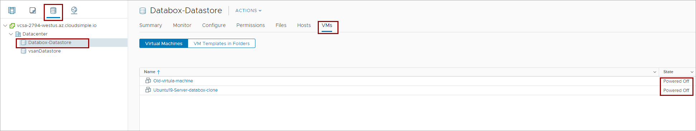

2. Make sure that all the virtual machines are shut down.

3. Select all virtual machines, right-click, and then select **Remove from inventory**.

    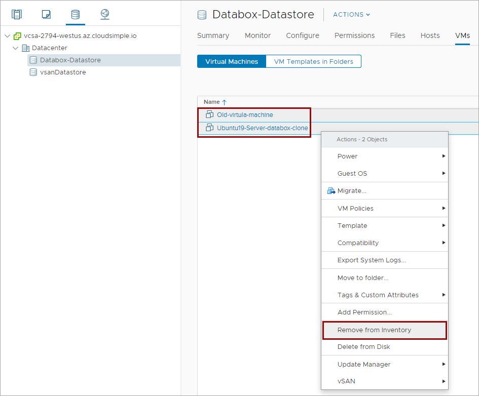

4. Select **VM Templates in Folders** and then repeat step 3.

### Remove the Data Box NFS datastore from vCenter

The Data Box NFS datastore must be disconnected from VMware ESXi hosts before preparing for return.

1. From your on-premises vCenter web UI, go to **Storage**.

2. Right-click **Databox-Datastore** and select **Unmount Datastore**.

    

3. Select all ESXi hosts where the datastore is mounted and select **OK**.

    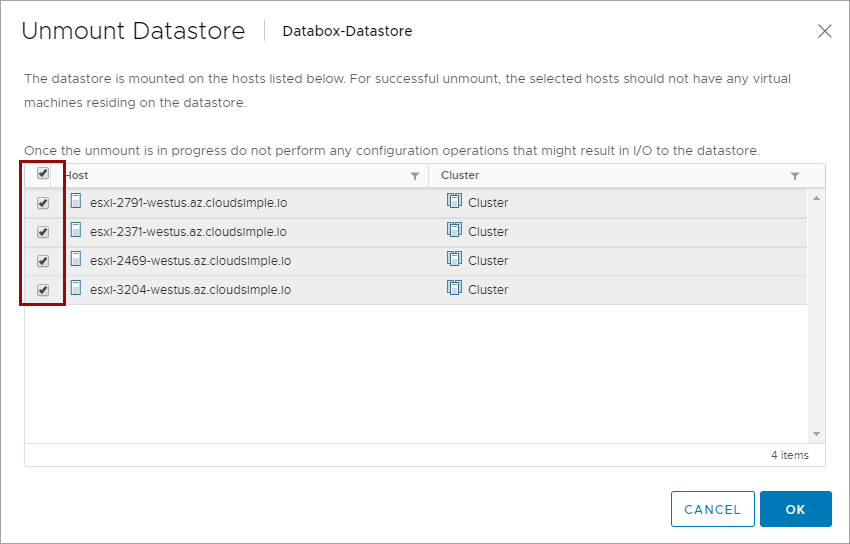

4. Review and accept any warnings and select **OK**.

### Prepare Data Box for return and then return it

Follow the steps outlined in the article [Return Azure Data Box and verify data upload to Azure](../databox/data-box-deploy-picked-up.md) to return the Data Box. Check the status of the data copy to your Azure storage account. After the status shows as completed, you can verify the data in your Azure storage account.

## Copy data from Azure storage to Azure VMware Solution

Data copied to your Data Box device will be available on your Azure storage account after the order status of your Data Box shows as completed. The data can now be copied to your Azure VMware Solution. Data in the storage account must be copied to the vSAN datastore of your private cloud by using the NFS protocol. 

First, copy Blob storage data to a managed disk on a Linux virtual machine in Azure by using **AzCopy**. Make the managed disk available through NFS, mount the NFS share as a datastore on your private cloud, and then copy the data. This method enables faster copy of the data to your private cloud.

### Copy data to your private cloud using a Linux virtual machine and managed disks, and then export as NFS share

1. Create a [Linux virtual machine](../virtual-machines/linux/quick-create-portal.md) in Azure in the same region where your storage account is created and has an Azure virtual network connection to your private cloud.

2. Create a managed disk whose storage capacity is greater than the amount of blob data, and [attach it to your Linux virtual machine](../virtual-machines/linux/attach-disk-portal.md).  If the amount of blob data is greater than the capacity of the largest managed disk available, the data must be copied in multiple steps or by using multiple managed disks.

3. Connect to the Linux virtual machine and mount the managed disk.

4. Install [AzCopy on your Linux virtual machine](../storage/common/storage-use-azcopy-v10.md).

5. Download the data from your Azure Blob storage onto the managed disk using AzCopy.  Command syntax: `azcopy copy "https://<storage-account-name>.blob.core.windows.net/<container-name>/*" "<local-directory-path>/"`.  Replace `<storage-account-name>` with your Azure storage account name and `<container-name>` with the container that holds the data copied through Data Box.

6. Install the NFS server on your Linux virtual machine:

    - On an Ubuntu/Debian distribution: `sudo apt install nfs-kernel-server`.
    - On an Enterprise Linux distribution: `sudo yum install nfs-utils`.

7. Change the permission of the folder on your managed disk where data from Azure Blob storage was copied.  Change the permissions for all the folders that you want to export as an NFS share.

    ```bash
    chmod -R 755 /<folder>/<subfolder>
    chown nfsnobody:nfsnobody /<folder>/<subfolder>
    ```

8. Assign permissions for client IP addresses to access the NFS share by editing the `/etc/exports` file.

    ```bash
    sudo vi /etc/exports
    ```
    
    Enter the following lines in the file for every ESXi host IP of your private cloud.  If you're creating shares for multiple folders, add all the folders.

    ```bash
    /<folder>/<subfolder> <ESXiNode1IP>(rw,sync,no_root_squash,no_subtree_check)
    /<folder>/<subfolder> <ESXiNode2IP>(rw,sync,no_root_squash,no_subtree_check)
    .
    .
    ```

9. Export the NFS shares by using the `sudo exportfs -a` command.

10. Restart NFS kernel server by using the `sudo systemctl restart nfs-kernel-server` command.


### Mount the Linux virtual machine NFS share as a datastore on a private cloud vCenter cluster and then copy data

The NFS share from your Linux virtual machine must be mounted as a datastore on your private cloud vCenter cluster. After it's mounted, data can be copied from the NFS datastore to the private cloud vSAN datastore.

1. Log in to your private cloud vCenter server.

2. Right-click **Datacenter**, select **Storage**, select **New Datastore**, and then select **Next**.

   

3. In step 1 of the Add Datastore wizard, select the **NFS** type.

   

4. In step 2 of the wizard, select **NFS 3** as the NFS version and then select **Next**.

   

5. In step 3 of the wizard, specify the name for the datastore, the path, and the server.  You can use the IP address of your Linux virtual machine for the server.  The folder path will be in the `/<folder>/<subfolder>/` format.

   

6. In step 4 of the wizard, select the ESXi hosts where you want the datastore to be mounted and then select **Next**.  In a cluster, select all the hosts to ensure migration of the virtual machines.

   

7. In step 5 of the wizard, review the summary and then select **Finish**.

### Add virtual machines and virtual machine templates from an NFS datastore to the inventory

1. From your private cloud vCenter web UI, go to **Storage**.  Select a Linux virtual machine NFS datastore and then select **Files**.

    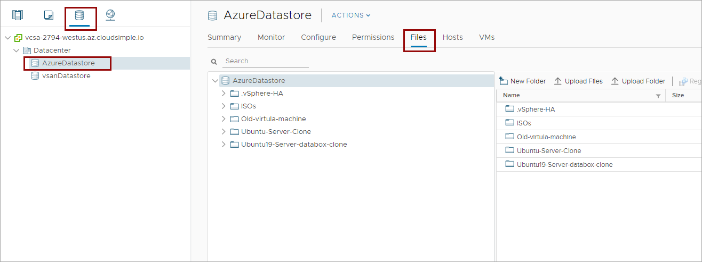

2. Select a folder that contains a virtual machine or a virtual machine template.  In the details pane, select a .vmx file for a virtual machine or a .vmtx file for a virtual machine template.

3. Select **Register VM** to register the virtual machine on your private cloud vCenter.

    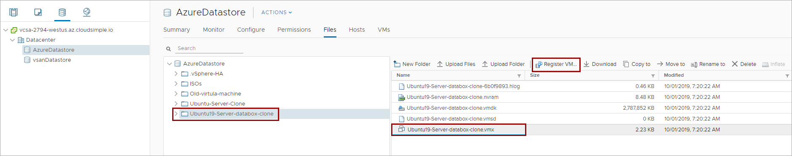

4. Select the datacenter, folder, and cluster/resource pool where you want the virtual machine to be registered.

4. Repeat steps 3 and 4 for all the virtual machines and virtual machine templates.

5. Go to the folder that contains the ISO files.  Select the ISO files and then select **Copy to** to copy the files to a folder on your vSAN datastore.

The virtual machines and virtual machine templates are now available on your private cloud vCenter. These virtual machines must be moved from the NFS datastore to the vSAN datastore before you turn them on. You can use the **storage vMotion** option and select the vSAN datastore as the target for the virtual machines.

The virtual machine templates must be cloned from your Linux virtual machine NFS datastore to your vSAN datastore.

### Clean up your Linux virtual machine

After all the data is copied to your private cloud, you can remove the NFS datastore from your private cloud:

1. Make sure that all virtual machines and templates are moved and cloned to your vSAN datastore.

2. Remove from inventory all virtual machine templates from the NFS datastore.

3. Unmount the Linux virtual machine datastore from your private cloud vCenter.

4. Delete the virtual machine and managed disk from Azure.

5. If you don't want to keep the data that was transferred by Data Box in your storage account, delete the Azure storage account.  
    


## Next steps

* Learn more about [Data Box](../databox/data-box-overview.md).
* Learn more about different options for [migrating workloads to your private cloud](migrate-workloads.md).
