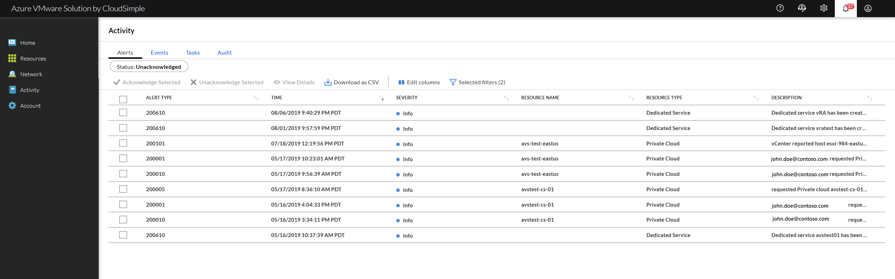

--- 
title: Monitor Private Cloud activity
titleSuffix: Azure VMware Solution by CloudSimple
description: Describes the information available on activity in the Azure VMware Solution by CloudSimple environment, including alerts, events, tasks, and audit.
author: sharaths-cs 
ms.author: b-shsury 
ms.date: 08/13/2019 
ms.topic: article 
ms.service: azure-vmware-cloudsimple 
ms.reviewer: cynthn 
manager: dikamath 
---

# Monitor VMware Solution by CloudSimple activity

CloudSimple activity logs provide an insight into operations done on CloudSimple portal.  The list includes alerts, events, tasks, and audit.  Use the activity logs to determine who, when and what operations were performed.  Activity logs do not include any read operations done by a user.

## Sign in to Azure

Sign in to the Azure portal at [https://portal.azure.com](https://portal.azure.com).

## Access the CloudSimple portal

Access the [CloudSimple portal](access-cloudsimple-portal.md).

## Activity information

To access the Activity pages, select **Activity** on the side menu.

To view details about any of the activities on the activity page, select the activity. A details panel opens on the right. Actions in the panel depend on the type of activity. Click **X** to close the panel.

Click on a column header to sort the display.  You can filter columns for specific values to view.  Download activity report by clicking on **Download as CSV** icon.

## Alerts

Alerts are notifications of any significant activity in your CloudSimple environment.  Alerts include events that affect billing or user access.

To acknowledge alerts and remove them from the list, select one or more from the list and click **Acknowledge**.

The following columns of information are available for alerts. Click on **Edit columns** and select columns you want to view.

| Column | Description |
------------ | ------------- |
| Alert Type | Category of alert.|
| Time | Time the alert occurred. |
| Severity | Significance of the alert.|
| Resource Name | Name assigned to the resource, such as the Private Cloud name. |
| Resource Type | Category of resource: Private Cloud, Cloud Rack. |
| Resource ID | Identifier of the resource. |
| Description | Description of what triggered the alert. |
| Acknowledged | Indication of whether the alert is acknowledged. |

## Events

Events show user and system activity on the CloudSimple portal. The Events page lists the activity associated with a specific resource and the severity of the impact.

The following columns of information are available for alerts. Click on **Edit columns** and select columns you want to view.

| Column | Description |
------------ | ------------- |
| Time | Date and time the event occurred. |
| Event Type | Numeric code that identifies the event. |
| Severity | Event severity.|
| Resource Name | Name assigned to the resource, such as the Private Cloud name. |
| Resource Type | Category of resource: Private Cloud, Cloud Rack. |
| Description | Description of what triggered the alert. |

## Tasks

Tasks are Private Cloud activities that are expected to take 30 seconds or more to complete. (Activities that are expected to take less than 30 seconds are reported only as events.) Open the Tasks pages to track the progress of tasks for your Private Cloud.

The following columns of information are available for alerts. Click on **Edit columns** and select columns you want to view.

| Column | Description |
------------ | ------------- |
| Task ID | Unique identifier for the task. |
| Operation | Action that the task performs. |
| User | User assigned to complete the task. |
| Resource Name | Name assigned to the resource. |
| Resource Type | Category of resource: Private Cloud, Cloud Rack. |
| Resource ID | Identifier of the resource. |
| Start | Start time for the task. |
| End | End time for the task. |
| Status | Current task status. |
| Time Elapsed | Time that the task took to complete (if completed) or is currently taking (if in progress). |
| Description | Task description. |

## Audit

Audit logs keep track of user activity. You can use audit logs to monitor user activity for all users.

The following columns of information are available for alerts. Click on **Edit columns** and select columns you want to view.

| Column | Description |
------------ | ------------- |
| Time | Time of the audit entry. |
| Operation | Action that the task performs. |
| User | User assigned to the task. |
| Resource Name | Name assigned to the resource. |
| Resource Type | Category of resource: Private Cloud, Cloud Rack. |
| Resource ID | Identifier of the resource. |
| Result | Result of the activity, such as **Success**. |
| Time Taken | Time to complete the task. |
| Description | Description of the action. |

## Next steps

* [Consume VMware VMs on Azure](quickstart-create-vmware-virtual-machine.md)
* Learn more about [Private Clouds](cloudsimple-private-cloud.md)
