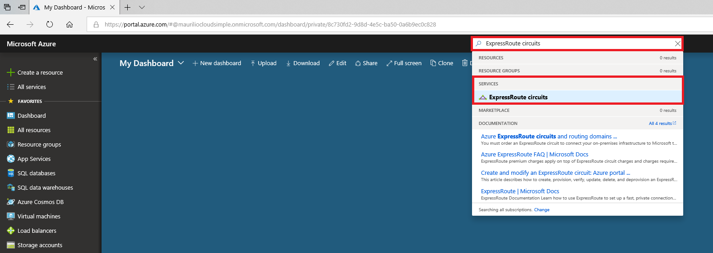
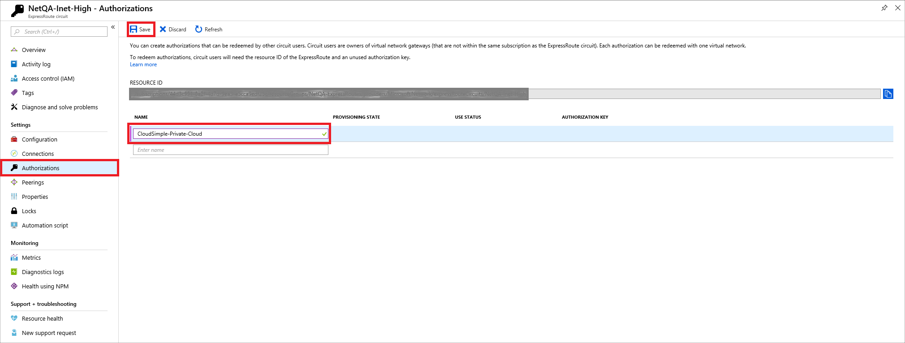
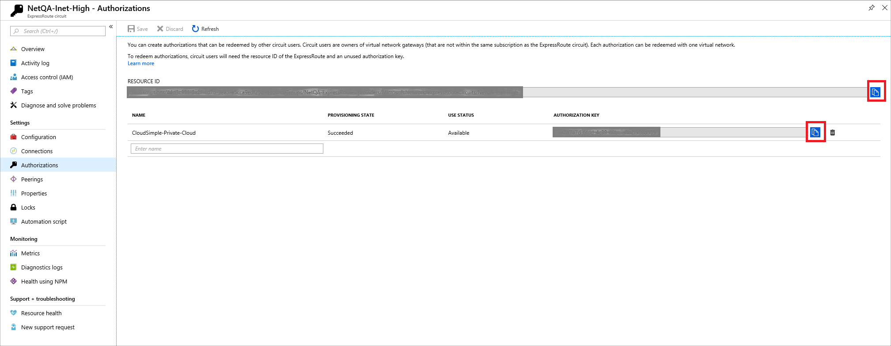

--- 
title: Azure VMware Solution by CloudSimple - On-premises connection using ExpressRoute 
description: Describes how to request an on-premises connection using ExpressRoute from CloudSimple region network 
author: sharaths-cs
ms.author: b-shsury 
ms.date: 08/14/2019 
ms.topic: article 
ms.service: azure-vmware-cloudsimple 
ms.reviewer: cynthn 
manager: dikamath 
---
# Connect from on-premises to CloudSimple using ExpressRoute

If you already have an Azure ExpressRoute connection from an external location (such as on-premises) to Azure, you can connect it to your CloudSimple environment. You can do so via an Azure feature that allows two ExpressRoute circuits to connect with each other. This method establishes a secure, private, high bandwidth, low latency connection between the two environments.

[](media/cloudsimple-global-reach-connection.png)

## Prerequisites

* An Azure ExpressRoute circuit is required before you can establish the connection between the circuit and the CloudSimple Private Cloud networks.
* A user is required with privileges to create authorization keys on an ExpressRoute circuit.

## Scenarios

Connecting your on-premises network to your Private Cloud network allows you to use the Private Cloud in various ways, including the following:

* Access your Private Cloud network without creating a Site-to-Site VPN connection.
* Use your on-premises Active Directory as an identity source on your Private Cloud.
* Migrate virtual machines running on-premises to your Private Cloud.
* Use your Private Cloud as part of a disaster recovery solution.
* Consume on-premises resources on your Private Cloud workload VMs.

## Connecting ExpressRoute Circuits

To establish the ExpressRoute connection, you must create an authorization on your ExpressRoute circuit and provide the authorization information to CloudSimple.

### Create ExpressRoute Authorization

1. Sign in to the Azure portal.

2. From the top search bar, search for **ExpressRoute circuit** and click **ExpressRoute circuits** under **Services**.
    [](media/azure-expressroute-transit-search.png)

3. Select the ExpressRoute circuit that you intend to connect to your CloudSimple network.

4. On the ExpressRoute page, click **Authorizations**, enter a name for the authorization, and click **Save**.
    [](media/azure-expressroute-transit-authorizations.png)

5. Copy the resource ID and authorization key by clicking the copy icon. Paste the ID and key into a text file.
    [](media/azure-expressroute-transit-authorization-copy.png)

    > [!IMPORTANT]
    > **Resource ID** must be copied from the UI and should be in the format ```/subscriptions/<subscription-ID>/resourceGroups/<resource-group-name>/providers/Microsoft.Network/expressRouteCircuits/<express-route-circuit-name>``` when you provide it to support.

6. File a ticket with <a href="https://portal.azure.com/#blade/Microsoft_Azure_Support/HelpAndSupportBlade/newsupportrequest" target="_blank">Support</a> for the connection to be created.
    * Issue type: **Technical**
    * Subscription: **Subscription where CloudSimple service is deployed**
    * Service: **VMware Solution by CloudSimple**
    * Problem type: **Service request**
    * Problem subtype: **Create ExpressRoute connection to on-premises**
    * Provide the resource ID and authorization key that you copied and saved in the details pane.
