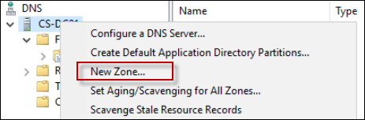
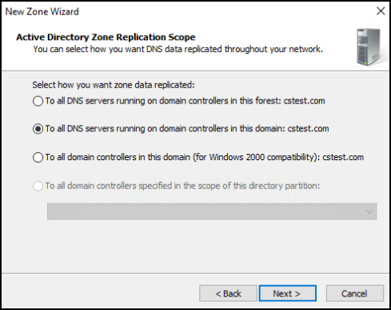
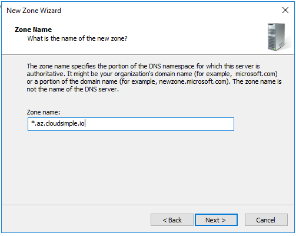
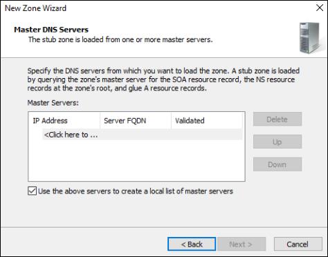
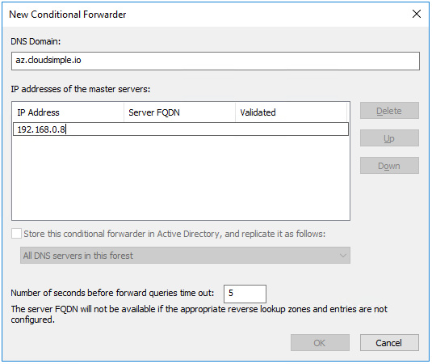

--- 
title: Azure VMware Solutions (AVS) - Configure DNS for AVS Private Cloud
description: Describes how to set up DNS name resolution for access to vCenter server on an AVS Private Cloud from on-premises workstations
author: sharaths-cs 
ms.author: b-shsury 
ms.date: 08/14/2019 
ms.topic: article 
ms.service: azure-vmware-cloudsimple 
ms.reviewer: cynthn 
manager: dikamath 
---
# Configure DNS for name resolution for AVS Private Cloud vCenter access from on-premises workstations

To access the vCenter server on an AVS Private Cloud from on-premises workstations, you must configure DNS address resolution so the vCenter server can be addressed by hostname as well as by IP address.

## Obtain the IP address of the DNS server for your AVS Private Cloud

1. Sign in to the [AVS portal](access-cloudsimple-portal.md).

2. Navigate to **Resources** > **AVS Private Clouds** and select the AVS Private Cloud you want to connect to.

3. On the **Summary** page of the AVS Private Cloud under **Basic Info**, copy the AVS Private Cloud DNS server IP address.

    


Use either of these options for the DNS configuration.

* [Create a zone on the DNS server for *.AVS.io](#create-a-zone-on-a-microsoft-windows-dns-server)
* [Create a conditional forwarder on your on-premises DNS server to resolve *.AVS.io](#create-a-conditional-forwarder)

## Create a zone on the DNS server for *.AVS.io

You can set up a zone up as a stub zone and point to the DNS servers on the Private
Cloud for name resolution. This section provides information on using a BIND DNS server or a Microsoft Windows DNS server.

### Create a zone on a BIND DNS server

The specific file and parameters to configure can vary based on your individual
DNS setup.

For example, for the default BIND server configuration, edit
/etc/named.conf file on your DNS server and add the following zone information.

```
zone "az.cloudsimple.io"
{
    type stub;
    masters { IP address of DNS servers; };
    file "slaves/cloudsimple.io.db";
};
```

### Create a zone on a Microsoft Windows DNS server

1. Right-click the DNS server and select **New Zone**. 
  
    
2. Select **Stub Zone** and click **Next**.

    
3. Select the appropriate option depending on your environment and click **Next**.

    
4. Select **Forward lookup zone** and click **Next**.

    
5. Enter the zone name and click **Next**.

    
6. Enter the IP addresses of the DNS servers for your AVS Private Cloud that you obtained
from the AVS portal.

    
7. Click **Next** as needed to complete the wizard setup.

## Create a conditional forwarder

A conditional forwarder forwards all DNS name resolution requests to the designated server. With this setup, any request to *.AVS.io is forwarded to the DNS servers located on the AVS Private Cloud. The following examples show how to set up
forwarders on different types of DNS servers.

### Create a conditional forwarder on a BIND DNS server

The specific file and parameters to configure can vary based on your individual DNS setup.

For example, for the default BIND server configuration, edit
/etc/named.conf file on your DNS server and add the following conditional forwarding
information.

```
zone "az.cloudsimple.io" {
    type forward;
    forwarders { IP address of DNS servers; };
};
```

### Create a conditional forwarder on a Microsoft Windows DNS server

1. Open the DNS Manager on the DNS server.
2. Right-click **Conditional Forwarders** and select the option to add a new conditional forwarder.

    
3. Enter the DNS domain and the IP address of the DNS servers in the AVS Private Cloud, and click **OK**.
