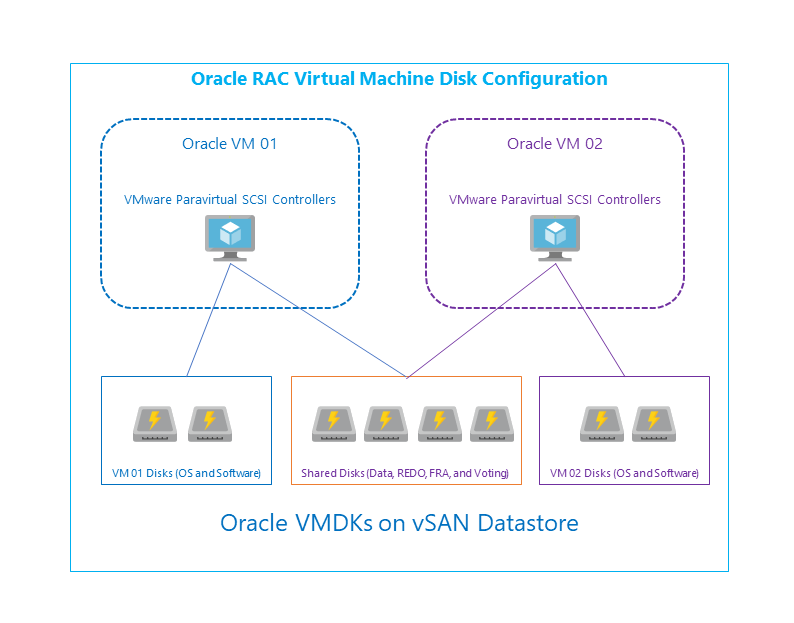
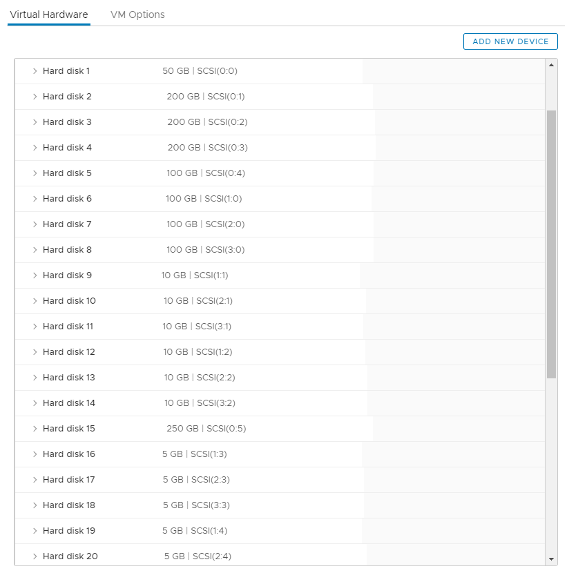
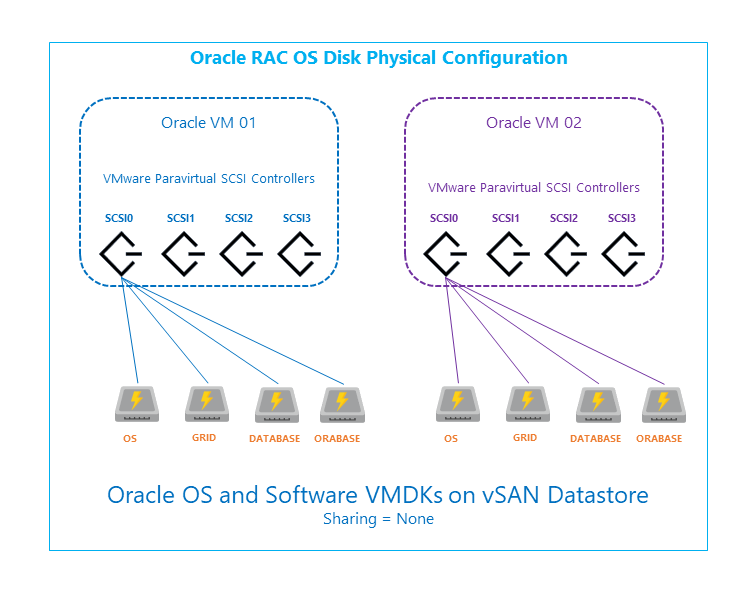
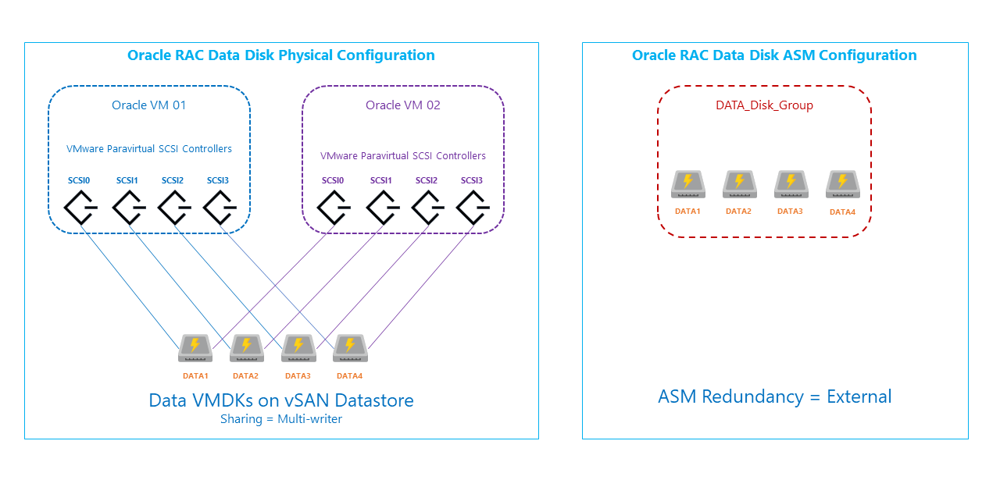
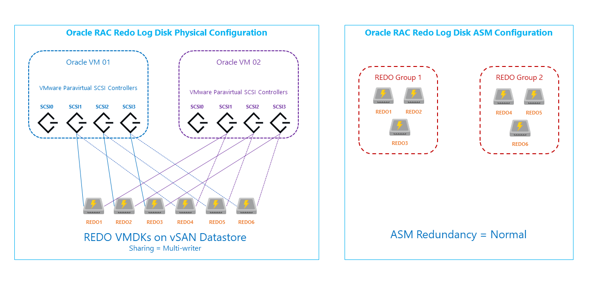
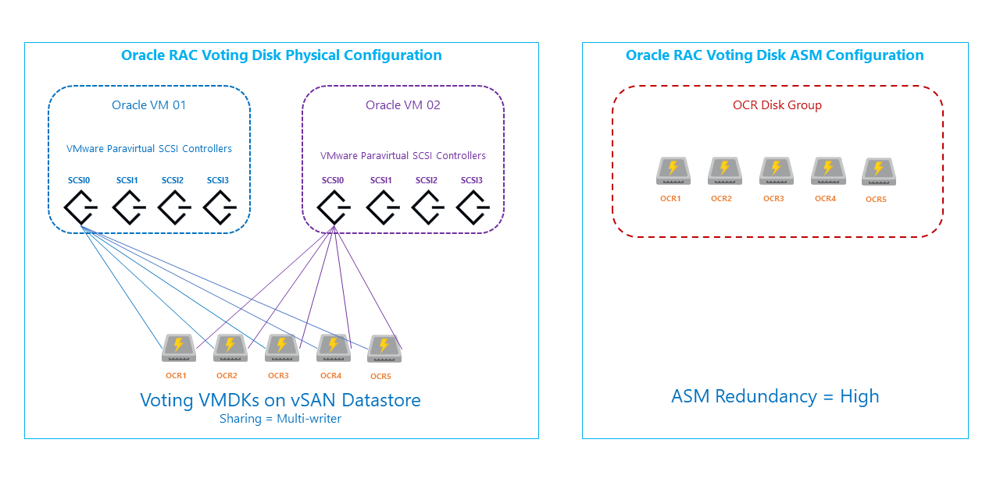
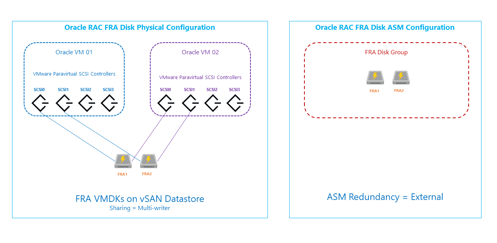
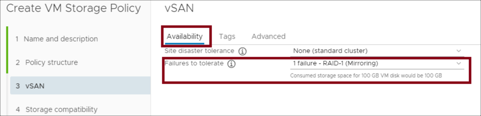
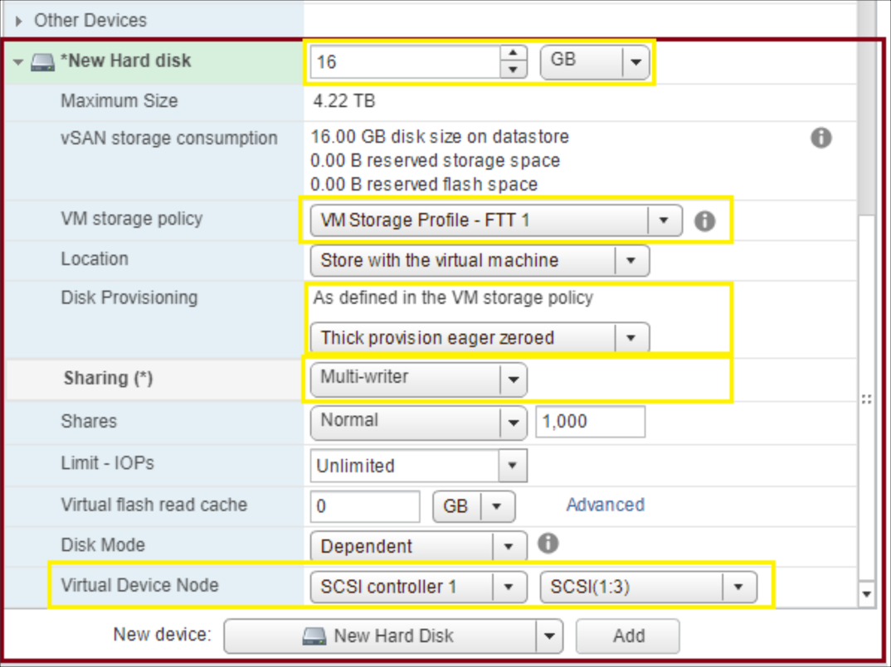
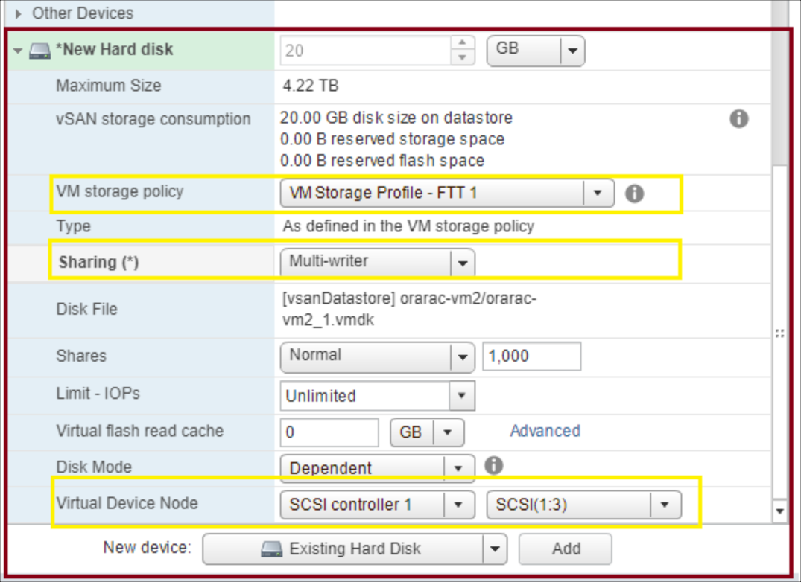

--- 
title: Azure VMware Solution by CloudSimple - Optimize your CloudSimple Private Cloud for Oracle RAC
description: Describes how to deploy a new cluster and optimize a VM for Oracle Real Application Clusters (RAC) installation and configuration
author: sharaths-cs
ms.author: b-shsury 
ms.date: 08/06/2019 
ms.topic: article 
ms.service: azure-vmware-cloudsimple 
ms.reviewer: cynthn 
manager: dikamath 
---

# Optimize your CloudSimple Private Cloud for installing Oracle RAC

You can deploy Oracle Real Application Clusters (RAC) in your CloudSimple Private Cloud environment. This guide describes how to deploy a new cluster and to optimize a VM for the Oracle RAC solution. After completing the steps in this topic, you can install and configure Oracle RAC.

## Storage Policy

Successful implementation of Oracle RAC requires an adequate number of nodes in the cluster.  In vSAN storage policy, failures to tolerate (FTT) is applied to data disks used for storing the database, log, and redo disks.  The required number of nodes to effectively tolerate failures is 2N+1 where N is the value of FTT.

Example: If the desired FTT is 2, then the total number of nodes in the cluster must be 2*2+1 = 5.

## Overview of deployment

The following sections describe how to set up your CloudSimple Private Cloud environment for Oracle RAC.

1. Best practices for disk configuration
2. Deploy CloudSimple Private Cloud vSphere Cluster
3. Set up Networking for Oracle RAC
4. Setup vSAN storage policies
5. Create Oracle VMs and create shared VM disks
6. Set up VM-to-host affinity rules

## Best practices for disk configuration

Oracle RAC virtual machines have multiple disks, which are used for specific function.  Shared disks are mounted on all virtual machines, which are used by Oracle RAC Cluster.  Operating system and software installation disks are mounted only on the individual virtual machines.  



Following example uses the disks defined in the table below.

| Disk                                      | Purpose                                       | Shared Disk |
|-------------------------------------------|-----------------------------------------------|-------------|
| OS                                        | Operating system disk                         | No          |
| GRID                                      | Install location for Oracle Grid software     | No          |
| DATABASE                                  | Install location for Oracle database software | No          |
| ORAHOME                                   | Base location for Oracle database binaries    | No          |
| DATA1, DATA2, DATA3, DATA4                | Disk where Oracle database files are stored   | Yes         |
| REDO1, REDO2, REDO3, REDO4, REDO5, REDO6  | Redo log disks                                | Yes         |
| OCR1, OCR2, OCR3, OCR4, OCR5              | Voting disks                                  | Yes         |
| FRA1, FRA2                                | Fast recovery area disks                      | Yes         |



### Virtual machine configuration

* Each virtual machine is configured with four SCSI controllers.
* SCSI controller type is set to VMware paravirtual.
* Multiple virtual disks (.vmdk) are created.
* Disks are mounted on different SCSI controllers.
* Multi writer sharing type is set for shared cluster disks.
* vSAN storage policy is defined for ensuring high availability of disks.

### Operating system and software disk configuration

Each Oracle virtual machine is configured with multiple disks for the host operating system, swap, software installation and other OS functions.  These disks are not shared between the virtual machines.  

* Three disks for each virtual machine are configured as virtual disks and mounted on Oracle RAC virtual machines.
    * OS Disk
    * Disk for storing Oracle Grid installs files
    * Disk for storing Oracle database install files
* Disks can be configured as **Thin Provisioned**.
* Each disk is mounted on the first SCSI controller (SCSI0).  
* Sharing is set to **No sharing**.
* Redundancy is defined on the storage using vSAN policies.  



### Data disk configuration

Data disks are primarily used for storing database files.  

* Four disks are configured as virtual disks and mounted on all Oracle RAC virtual machines.
* Each disk is mounted on a different SCSI controller.
* Each virtual disk is configured as **Thick Provision Eager Zeroed**.  
* Sharing is set to **Multi-writer**.  
* The disks must be configured as an Automatic Storage Management (ASM) disk group.  
* Redundancy is defined on the storage using vSAN policies.  
* ASM redundancy is set to **External** redundancy.



### Redo log disk configuration

Redo log files are used for storing a copy of the changes made to the database.  The log files are used when data needs to be recovered after any failures.

* Redo log disks must be configured as multiple disk groups.  
* Six disks are created and mounted on all Oracle RAC virtual machines.
* Disks are mounted on different SCSI controllers
* Each virtual disk is configured as **Thick Provision Eager Zeroed**.
* Sharing is set to **Multi-writer**.  
* The disks must be configured as two ASM disk groups.
* Each ASM disk group contains three disks, which are on different SCSI controllers.  
* ASM redundancy is set to **Normal** redundancy.
* Five redo log files are created on both ASM Redo log group

```
SQL > alter database add logfile thread 1 ('+ORCLRAC_REDO1','+ORCLRAC_REDO2') size 1G;
SQL > alter database add logfile thread 1 ('+ORCLRAC_REDO1','+ORCLRAC_REDO2') size 1G;
SQL > alter database add logfile thread 1 ('+ORCLRAC_REDO1','+ORCLRAC_REDO2') size 1G;
SQL > alter database add logfile thread 1 ('+ORCLRAC_REDO1','+ORCLRAC_REDO2') size 1G;
SQL > alter database add logfile thread 1 ('+ORCLRAC_REDO1','+ORCLRAC_REDO2') size 1G;
SQL > alter database add logfile thread 2 ('+ORCLRAC_REDO1','+ORCLRAC_REDO2') size 1G;
SQL > alter database add logfile thread 2 ('+ORCLRAC_REDO1','+ORCLRAC_REDO2') size 1G;
SQL > alter database add logfile thread 2 ('+ORCLRAC_REDO1','+ORCLRAC_REDO2') size 1G;
SQL > alter database add logfile thread 2 ('+ORCLRAC_REDO1','+ORCLRAC_REDO2') size 1G;
SQL > alter database add logfile thread 2 ('+ORCLRAC_REDO1','+ORCLRAC_REDO2') size 1G;
```



### Oracle voting disk configuration

Voting disks provide quorum disk functionality as an additional communication channel to avoid any split-brain situation.

* Five disks are created and mounted on all Oracle RAC virtual machines.
* Disks are mounted on one SCSI controller
* Each virtual disk is configured as **Thick Provision Eager Zeroed**.
* Sharing is set to **Multi-writer**.  
* The disks must be configured as an ASM disk group.  
* ASM redundancy is set to **High** redundancy.



### Oracle fast recovery area disk configuration (optional)

The fast recovery area (FRA) is file system managed by Oracle ASM disk group.  FRA provides a shared storage location for backup and recovery files. Oracle creates archived logs and flashback logs in the fast recovery area. Oracle Recovery Manager (RMAN) can optionally store its backup sets and image copies in the fast recovery area, and it uses it when restoring files during media recovery.

* Two disks are created and mounted on all Oracle RAC virtual machines.
* Disks are mounted on different SCSI controller
* Each virtual disk is configured as **Thick Provision Eager Zeroed**.
* Sharing is set to **Multi-writer**.  
* The disks must be configured as an ASM disk group.  
* ASM redundancy is set to **External** redundancy.



## Deploy CloudSimple Private Cloud vSphere cluster

To deploy a vSphere cluster on your Private Cloud, follow this process:

1. From the CloudSimple portal, [create a Private Cloud](create-private-cloud.md). CloudSimple creates a default vCenter user named 'cloudowner' in the newly created Private Cloud. For details on the default Private Cloud user and permission model, see [Learn the Private Cloud permission model](learn-private-cloud-permissions.md).  This step creates the primary management cluster for your Private Cloud.

2. From the CloudSimple portal, [expand the Private Cloud](expand-private-cloud.md) with a new cluster.  This cluster will be used to deploy Oracle RAC.  Select the number of nodes based on the desired fault tolerance (minimum three nodes).

## Set up networking for Oracle RAC

1. In your Private Cloud, [create two VLANs](create-vlan-subnet.md), one for the Oracle public network and one for the Oracle private network and assign appropriate subnet CIDRs.
2. After the VLANs are created, create the [distributed port groups on the Private Cloud vCenter](create-vlan-subnet.md#use-vlan-information-to-set-up-a-distributed-port-group-in-vsphere).
3. Set up a [DHCP and DNS server virtual machine](dns-dhcp-setup.md) on your management cluster for the Oracle environment.
4. [Configure DNS forwarding on the DNS server](on-premises-dns-setup.md#create-a-conditional-forwarder) installed in the Private Cloud.

## Set up vSAN storage policies

vSAN policies define the failures to tolerate and disk striping for the data stored on the VM disks.  The storage policy created must be applied on the VM disks while creating the VM.

1. [Sign in to the vSphere client](https://docs.microsoft.com/azure/vmware-cloudsimple/vcenter-access) of your Private Cloud.
2. From the top menu, select **Policies and Profiles**.
3. From the left menu, select **VM Storage Policies** and then select **Create a VM storage Policy**.
4. Enter a meaningful name for the policy and click **NEXT**.
5. In the **Policy structure** section, select **Enable rules for vSAN storage** and click **NEXT**.
6. In the **vSAN** > **Availability** section, select **None** for Site disaster tolerance. For Failures to tolerate, select the **RAID - Mirroring** option for the desired FTT.
    .
7. In the **Advanced** section, select the number of disk stripes per object. For Object space reservation, select **Thick Provisioned**. Select **Disable object checksum**. Click **NEXT**.
8. Follow the on-screen instructions to view the list of compatible vSAN datastores, review the settings, and finish the setup.

## Create Oracle VMs and create shared VM disks for Oracle

To create a VM for Oracle, clone an existing VM or create a new one.  This section describes how to create a new VM and then clone it to create a second one after installing the base operating system.  After the VMs are created, you can create an add disks to them.  Oracle cluster uses shared disks for storing, data, logs, and redo logs.

### Create VMs

1. In vCenter, click the **Hosts and Clusters** icon. Select the cluster that you created for Oracle.
2. Right-click the cluster and select **New Virtual Machine**.
3. Select **Create new virtual machine** and click **Next**.
4. Name the machine, select the Oracle VM's location, and click **Next**.
5. Select the cluster resource and click **Next**.
6. Select the vSAN datastore for the cluster and click **Next**.
7. Keep the default ESXi 6.5 compatibility selection and click **Next**.
8. Select the guest OS of the ISO for the VM that you are creating and click **Next**.
9. Select the hard disk size that is required for installing the OS.
10. To install the application on a different device, click **Add new device**.
11. Select network options and assign the distributed port group created for the public network.
12. To add additional network interfaces, click **Add new device** and select the distributed port group created for the private network.
13. For New DC/DVD Drive, select the datastore ISO file that contains the ISO for the preferred operating system installation. Select the file you previously uploaded to the ISOs and Templates folder and click **OK**.
14. Review the settings and click **OK** to create the new VM.
15. Power on the VM. Install the operating system and any updates required

After the operating system is installed, you can clone a second VM. Right-click the VM entry and select the and clone option.

### Create shared disks for VMs

Oracle uses shared disk to store the data, log, and redo log files.  You can create a shared disk on vCenter and mount it on both the VMs.  For higher performance, place the data disks on different SCSI controllers  Steps below show how to create a shared disk on vCenter and then attach it to a virtual machine. vCenter Flash client is used for modifying the VM properties.

#### Create disks on the first VM

1. In vCenter, right-click one of the Oracle VMs and select **Edit settings**.
2. In the new device section, select **SCSI controller** and click **Add**.
3. In the new device section, select **New Hard disk** and click **Add**.
4. Expand the properties of New Hard disk.
5. Specify the size of the hard disk.
6. Specify the VM storage policy to be the vSAN storage policy that you defined earlier.
7. Select the location as a folder on vSAN datastore. The location helps with browsing and attaching the disks to a second VM.
8. For disk provisioning, select **Thick provision eager zeroed**.
9. For sharing, specify **Multi-writer**.
10. For the virtual device node, select the new SCSI controller that was created in step 2.

    

Repeat steps 2 – 10 for all the new disks required for the Oracle data, logs, and redo log files.

#### Attach disks to second VM

1. In vCenter, right-click one of the Oracle VMs and select **Edit settings**.
2. In the new device section, select **SCSI controller** and click **Add**.
3. In the new device section, select **Existing Hard disk** and click **Add**.
4. Browse to the location where the disk was created for the first VM and select the VMDK file.
5. Specify the VM storage policy to be the vSAN storage policy that you defined earlier.
6. For disk provisioning, select **Thick provision eager zeroed**.
7. For sharing, specify **Multi-writer**.
8. For the virtual device node, select the new SCSI controller that was created in step 2.

    

Repeat steps 2 – 7 for all the new disks required for the Oracle data, logs, and redo log files.

## Set up VM host affinity rules

VM-to-host affinity rules ensure that the VM runs on the desired host.  You can define rules on vCenter to ensure the Oracle VM runs on the host with adequate resources and to meet any specific licensing requirements.

1. In the CloudSimple portal, [escalate the privileges](escalate-private-cloud-privileges.md) of the cloudowner user.
2. Log in to the vSphere client of your Private Cloud.
3. In the vSphere client, select the cluster where Oracle VMs are deployed and click **Configure**.
4. Under Configure, select **VM/Host Groups**.
5. Click **+**.
6. Add a VM group. Select **VM group** as the type. Enter the name of the group. Select the VMs and then click **OK** to create the group.
6. Add a host group. Select **Host Group** as the type. Enter the name of the group. Select the hosts where the VMs will run and then click **OK** to create the group.
7. To create a rule, click on **VM/Host rules**.
8. Click **+**.
9. Enter a name for the rule and check **Enable**.
10. For the rule type, select **Virtual Machines to Host**.
11. Select the VM group that contains the Oracle VMs.
12. Select **Must run on hosts in this group**.
13. Select the host group that you created.
14. Click **OK** to create the rule.

## References

* [About vSAN Policies](https://docs.vmware.com/en/VMware-vSphere/6.7/com.vmware.vsphere.virtualsan.doc/GUID-08911FD3-2462-4C1C-AE81-0D4DBC8F7990.html)
* [VMware Multi-Writer Attribute for Shared VMDKs](https://docs.vmware.com/en/VMware-Cloud-on-AWS/solutions/VMware-Cloud-on-AWS.df6735f8b729fee463802083d46fdc75/GUID-A7642A82B3D6C5F7806DB40A3F2766D9.html)
