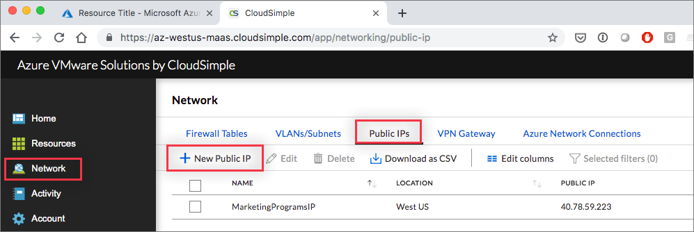
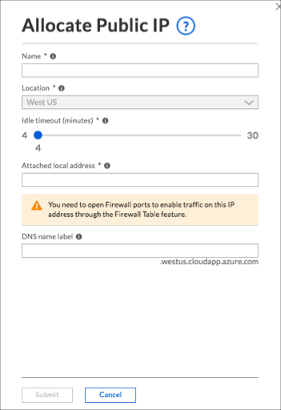

--- 
title: Azure VMware Solution by CloudSimple - Allocate public IP addresses
description: Describes how to allocate public IP addresses for virtual machines in the Private Cloud environment
author: shortpatti 
ms.author: v-patsho
ms.date: 08/15/2019 
ms.topic: article 
ms.service: azure-vmware-cloudsimple 
ms.reviewer: cynthn 
manager: dikamath 
---

# Allocate public IP addresses for Private Cloud environment

Open the Public IPs tab on the Network page to allocate public IP addresses for virtual machines in your Private Cloud environment.

1. [Access the CloudSimple portal](access-cloudsimple-portal.md) and select **Network** on the side menu.
2. Select **Public IPs**.
3. Click **New Public IP**.

    

4. Enter a name to identify the IP address entry.
5. Keep the default location.
6. Use the slider to change the idle timeout, if needed.
7. Enter the local IP address for which you want to assign a public IP address.
8. Enter an associated DNS name.
9. Click **Submit**.

The task of allocating the public IP address begins. You can check the status of the task on the **Activity > Tasks** page. When allocation is complete, the new entry is shown on the Public IPs page.
