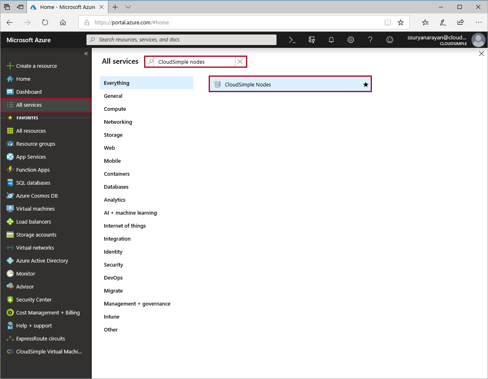
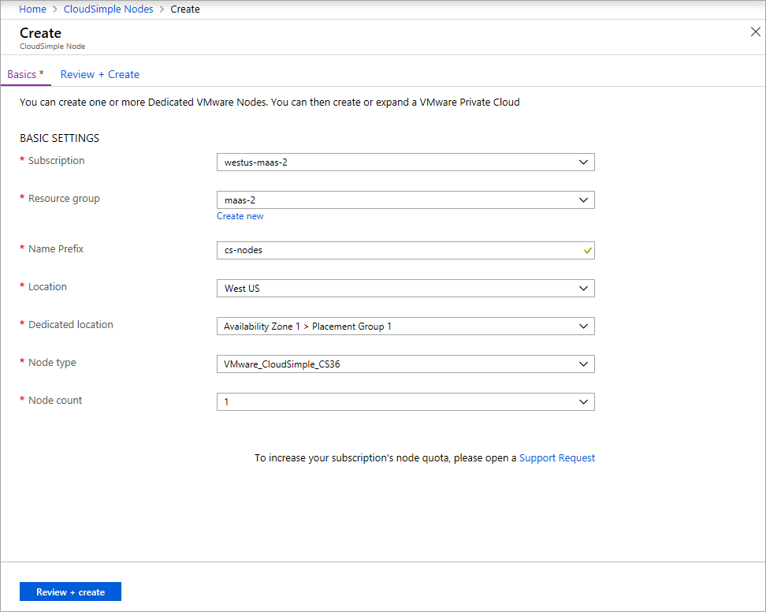

# Quickstart - Create Azure VMware Solution by CloudSimple service

To get started, create the Azure VMware Solution by CloudSimple in the Azure portal.

## VMware Solution by CloudSimple - Service overview

The CloudSimple service allows you to consume Azure VMware Solution by CloudSimple.  Creating the service allows you to provision nodes, reserve nodes, and create private clouds.  You add the CloudSimple service in each Azure region where the CloudSimple service is available.  The service defines the edge network of Azure VMware Solution by CloudSimple.  This edge network is used for services that include VPN, ExpressRoute, and Internet connectivity to your private clouds.

To add the CloudSimple service, you must create a gateway subnet. The gateway subnet is used when creating the edge network and requires a /28 CIDR block. The gateway subnet address space must be unique. It can't overlap with any of your on-premises network address spaces or Azure virtual network address space.

## Before you begin

Allocate a /28 CIDR block for gateway subnet.  A gateway subnet is required per CloudSimple service and is unique to the region in which it's created. The gateway subnet is used for Azure VMware Solution by CloudSimple edge network services and requires a /28 CIDR block. The gateway subnet address space must be unique. It must not overlap with any network that communicates with the CloudSimple environment.  The networks that communicate with CloudSimple include on-premises networks and Azure virtual networks.

Review [Networking Prerequisites](cloudsimple-network-checklist.md). 

## Sign in to Azure

Sign in to the Azure portal at [https://portal.azure.com](https://portal.azure.com).

## Create the service

1. Select **All services**.
2. Search for **CloudSimple Service**.

    

3. Select **CloudSimple Services**.
4. Click **Add** to create a new service.

    

5. Select the subscription where you want to create the CloudSimple service.
6. Select the resource group for the service. To add a new resource group, click **Create New**.
7. Enter name to identify the service.
8. Enter the CIDR for the service gateway. Specify a /28 subnet that doesn't overlap with any of your  on-premises subnets, Azure subnets, or planned CloudSimple subnets. You can't change the CIDR after the service is created.

    

9. Click **OK**.

The service is created and added to the list of services.

## Provision nodes

To set up pay-as-you go capacity for a CloudSimple Private Cloud environment, first provision nodes in the Azure portal.

1. Select **All services**.
2. Search for **CloudSimple Nodes**.

    

3. Select **CloudSimple Nodes**.
4. Click **Add** to create nodes.

    

5. Select the subscription where you want to provision CloudSimple nodes.
6. Select the resource group for the nodes. To add a new resource group, click **Create New**.
7. Enter the prefix to identify the nodes.
8. Select the location for the node resources.
9. Select the dedicated location to host the node resources.
10. Select the [node type](cloudsimple-node.md).
11. Select the number of nodes to provision.
12. Select **Review + Create**.
13. Review the settings. To modify any settings, click **Previous**.
14. Select **Create**.

## Next steps

* [Create Private Cloud and configure environment](quickstart-create-private-cloud.md)
* Learn more about [CloudSimple service](https://docs.microsoft.com/azure/vmware-cloudsimple/cloudsimple-service)
