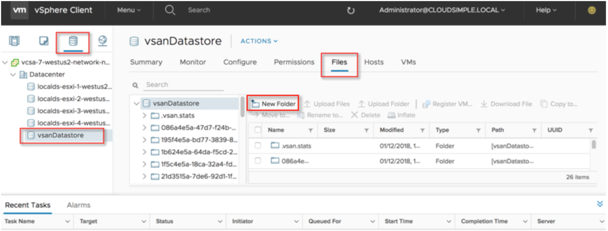
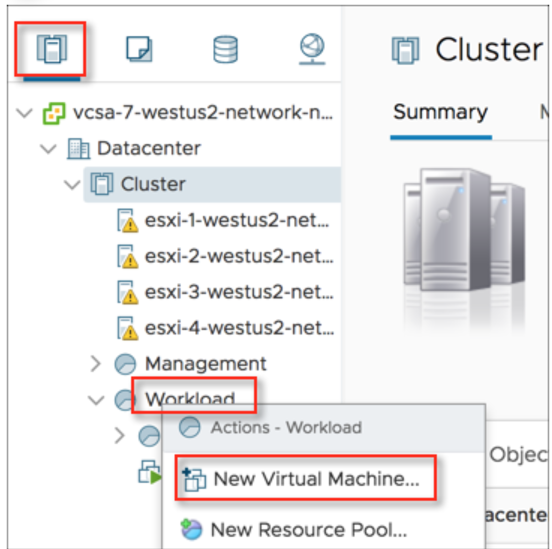
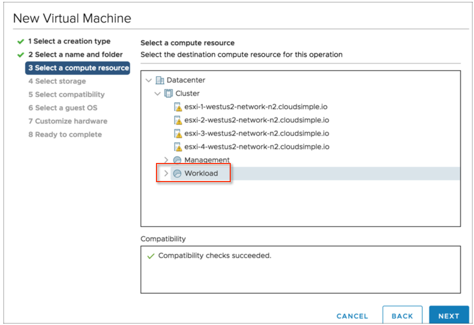
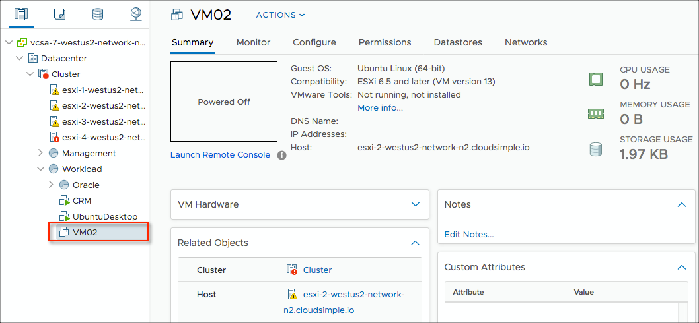
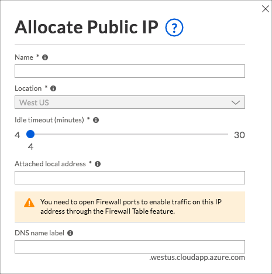

--- 
title: Quickstart - Create an Azure VMware VM on a Private Cloud - Azure VMware Solution by CloudSimple
description: Describes how to create an Azure VMware VM on a CloudSimple Private Cloud 
author: sharaths-cs
ms.author: b-shsury 
ms.date: 08/16/2019 
ms.topic: article 
ms.service: azure-vmware-cloudsimple 
ms.reviewer: cynthn 
manager: dikamath 
---

# Create VMware virtual machines on your Private Cloud

To create virtual machines on your Private Cloud, begin by accessing the CloudSimple portal from the Azure portal.

## Sign in to the Azure portal

Sign in to the Azure portal at [https://portal.azure.com](https://portal.azure.com).

## Access the CloudSimple portal

1. Select **All services**.
2. Search for **CloudSimple Services**.
3. Select the CloudSimple service on which you want to create your Private Cloud.
4. From the **Overview** page, click **Go to the CloudSimple portal** to open a new browser tab for CloudSimple portal.  If prompted, sign in with your Azure sign in credentials.  

    

## Launch vCenter web-ui

You can now launch vCenter to set up virtual machines and policies.

To access vCenter, start from the CloudSimple portal. On the Home page, under **Common Tasks**, click **Launch vSphere Client**.  Select the Private Cloud and then click **Launch vSphere Client** on the Private Cloud.

   

## Upload an ISO or vSphere template

  > [!WARNING]
  > For ISO upload, use the vSphere HTML5 client.  Using a Flash client may result in an error.

1. Obtain the ISO or vSphere template that you want to upload to vCenter to create a VM and have it available on your local system.
2. In vCenter, click the **Disk** icon and select **vsanDatastore**. Click **Files** and then click **New Folder**.
    

3. Create a folder entitled ‘ISOs and Templates’.

4. Navigate to the ISOs folder in ISOs and Templates, and click **Upload Files**. Follow the on-screen instructions to upload the ISO.

## Create a Virtual Machine in vCenter

1. In vCenter, click the **Hosts and Clusters** icon.

2. Right-click **Workload** and select **New Virtual Machine**.
    

3. Select **Create new virtual machine** and click **Next**.
    

4. Name the machine, select the **Workload VM's** location, and click **Next**.
    

5. Select the **Workload** compute resource and click **Next**.
    

6. Select **vsanDatastore** and click **Next**.
    

7. Keep the default ESXi 6.5 compatibility selection and click **Next**.
    

8. Select the guest OS of the ISO for the VM that you are creating and click **Next**.
    

9. Select hard disk and network options. For New CD/DVD Drive, select **Datastore ISO file**.  If you want to allow traffic from the Public IP address to this VM, select the network as **vm-1**.
    

10. A selection window opens. Select the file you previously uploaded to the ISOs and Templates folder and click **OK**.
    

11. Review the settings and click **OK** to create the VM.
    

The VM is now added to the Workload compute resources and is ready for use. 


The basic setup is now complete. You can start using your Private Cloud similar to how you would use your on-premises VM infrastructure.

The following sections contain optional information about setting up DNS and DHCP servers for Private Cloud workloads and modifying the default networking configuration.

## Add Users and identity sources to vCenter (Optional)

CloudSimple assigns a default vCenter user account with username `cloudowner@cloudsimple.local`. No additional account setup is required for you to get started.  CloudSimple normally assigns administrators the privileges they need to perform normal operations.  Set up your on-premises active directory or Azure AD  as an [additional identity source](set-vcenter-identity.md) on your Private Cloud.

## Create a DNS and DHCP server (Optional)

Applications and workloads running in a Private Cloud environment require name resolution and DHCP services for lookup and IP address assignment. A proper DHCP and DNS infrastructure is required to provide these services. You can configure a virtual machine in vCenter to provide these services in your Private Cloud environment.

Prerequisites

* A distributed port group with VLAN configured

* Route setup to on-premises or Internet-based DNS servers

* Virtual machine template or ISO to create a virtual machine

The following links provide guidance on setting up DHCP and DNS servers on Linux and Windows.

#### Linux-based DNS server setup

Linux offers various packages for setting up DNS servers.  Here is a link to instructions for setting up an open-source BIND DNS server.

[Example setup](https://www.digitalocean.com/community/tutorials/how-to-configure-bind-as-a-private-network-dns-server-on-centos-7)

#### Windows-based setup

These Microsoft topics describe how to set up a Windows server as a DNS server and as a DHCP server.

[Windows Server as DNS Server](https://docs.microsoft.com/windows-server/networking/dns/dns-top)

[Windows Server as DHCP Server](https://docs.microsoft.com/windows-server/networking/technologies/dhcp/dhcp-top)

## Customize networking configuration (Optional)

The Network pages in the CloudSimple portal allow you to specify the configuration for firewall tables and public IP addresses for VMs.

### Allocate public IPs

1. Navigate to **Network > Public IP** in the CloudSimple portal.
2. Click **Allocate Public IP**.
3. Enter a name to identify the IP address entry.
4. Keep the default location.
5. Use the slider to change the idle timeout if desired.
6. Enter the local IP address for which you want to assign a public IP address.
7. Enter an associated DNS name if desired.
8. Click **Done**.

    

The task of allocating the public IP address begins. You can check the status of the task on the **Activity > Tasks** page. When allocation is complete, the new entry is shown on the Public IPs page.

The VM to which this IP address must be mapped needs to be configured with the local address specified above. The procedure to configure an IP address is specific to the VM operating system. Consult the documentation for your VM operating system for the correct procedure.

#### Example

For example, here are the details for Ubuntu 16.04.

Add the static method to the inet address family configuration in the file /etc/network/interfaces. Change the address, netmask, and gateway values. For this example, we are using the eth0 interface, internal IP address 192.168.24.10, gateway address 192.168.24.1, and netmask 255.255.255.0. For your environment, the available subnet information is provided in the welcome email.

```
sudo vi /etc/network/interfaces
```

```
auto eth0
Iface eth0 inet static
iface eth0 inet static
address 192.168.24.10
netmask 255.255.255.0
gateway 192.168.24.1
dns-nameservers 8.8.8.8
dns-domain acme.com
dns-search acme.com
```
Manually disable the interface.

```
sudo ifdown eth0
```
Manually enable the interface again.

```
sudo ifup eth0
```

By default, all incoming traffic from the Internet is **denied**. If you would like to open any other port, create a [firewall table](firewall.md).

After configuring an internal IP address as the static IP address, verify that you can reach the Internet from within the VM.

```
ping 8.8.8.8
```
Also verify that you can reach the VM from the Internet using the public IP address.

Ensure that any iptable rules on the VM are not blocking port 80 inbound.
        
```
netstat -an | grep 80
```

Start an http server that listens on port 80.
       
```
python2.7 -m SimpleHTTPServer 80
```

or

```
python3 -m http.server 80
```
Start a browser on your desktop and point it to port 80 for the public IP address to browse the files on your VM.

### Default CloudSimple firewall rules for public IP

* VPN traffic: All traffic between (from/to) the VPN and all the workload networks and management network is allowed.
* Private cloud internal traffic: All east-west traffic between (from/to) workload networks and the management network (shown above) is allowed.
* Internet traffic:
  * All incoming traffic from the Internet is denied to workload networks and the management network.
  * All outgoing traffic to the Internet from workload networks or the management network is allowed.

You can also modify the way your traffic is secured, using the Firewall Rules feature. For more information, see [Set up firewall tables and rules](firewall.md).

## Install solutions (Optional)

You can install solutions on your CloudSimple Private Cloud to take full advantage of your Private Cloud vCenter environment. You can set up backup, disaster recovery, replication, and other functions to protect your virtual machines. Examples include VMware Site Recovery Manager (VMware SRM) and Veeam Backup & Replication.

To install a solution, you must request additional privileges for a limited period. See [Escalate privileges](escalate-private-cloud-privileges.md).

## Next steps

* [Consume VMware VMs on Azure](quickstart-create-vmware-virtual-machine.md)
* [Connect to on-premises network using Azure ExpressRoute](on-premises-connection.md)
* [Set up VPN gateways on CloudSimple network](vpn-gateway.md)
