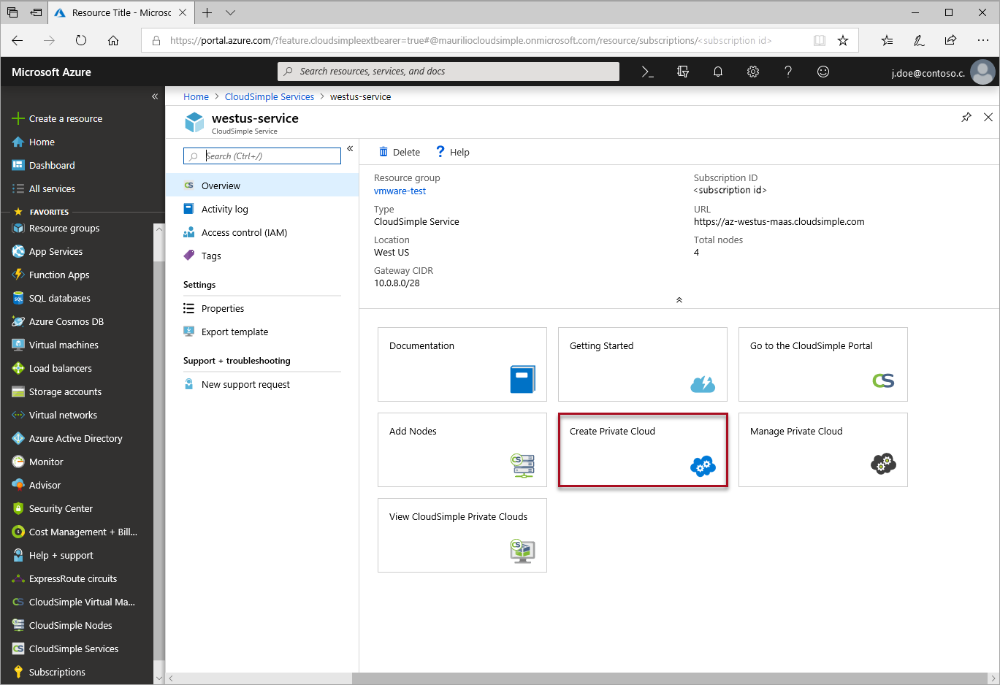
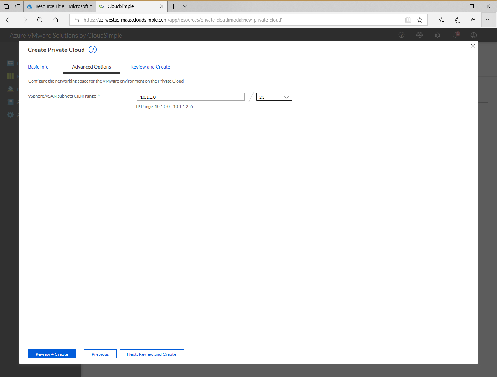
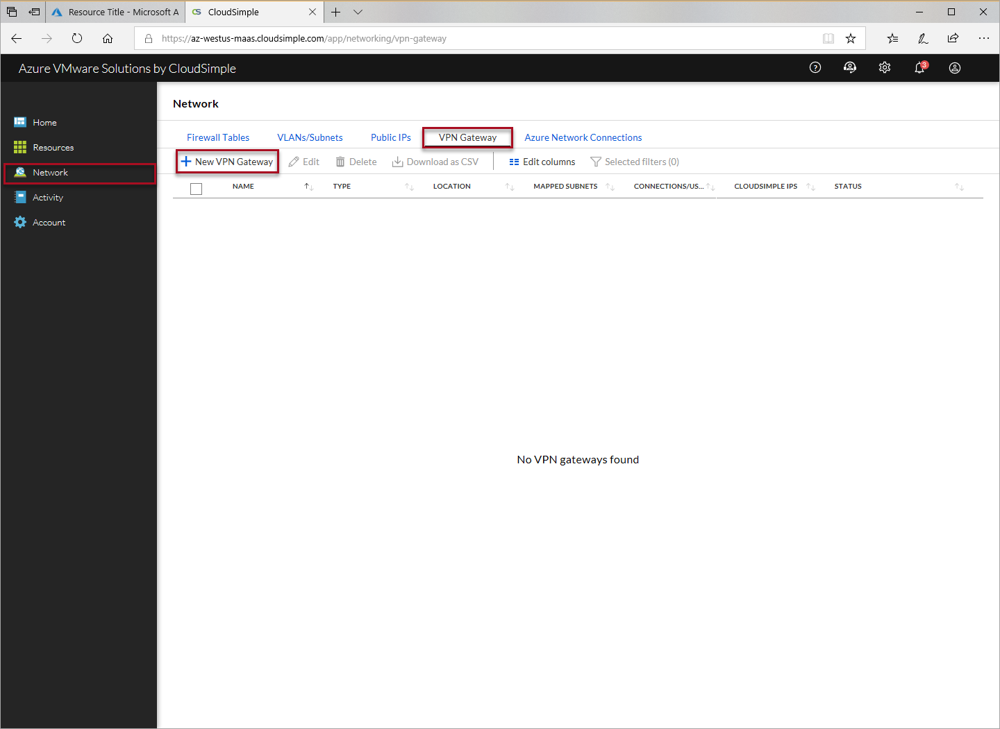
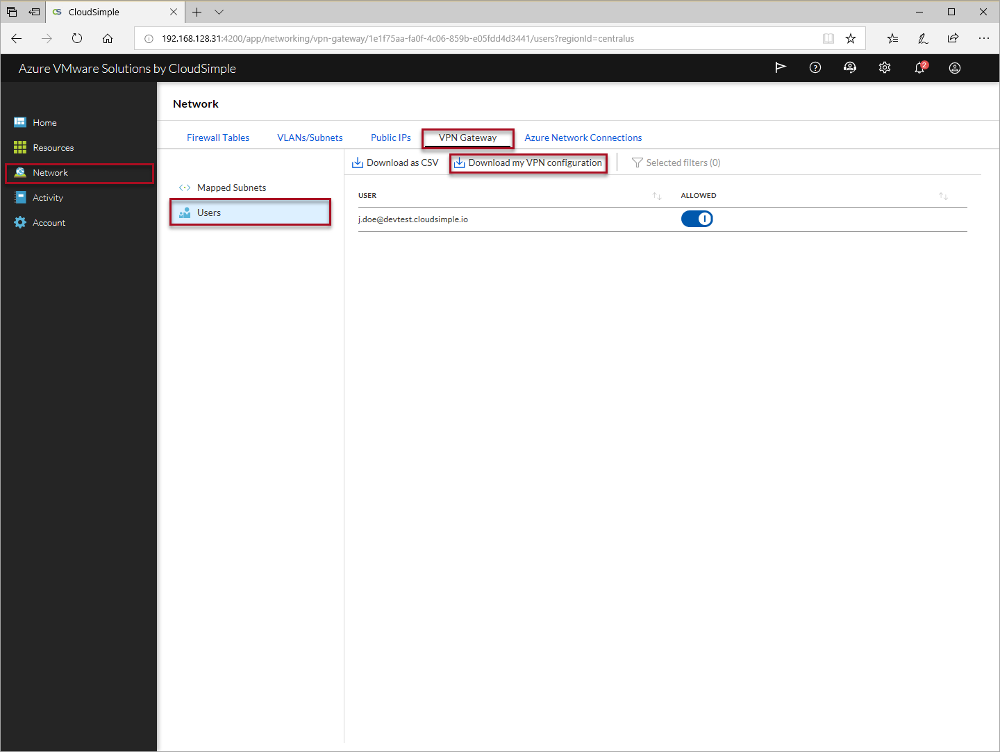
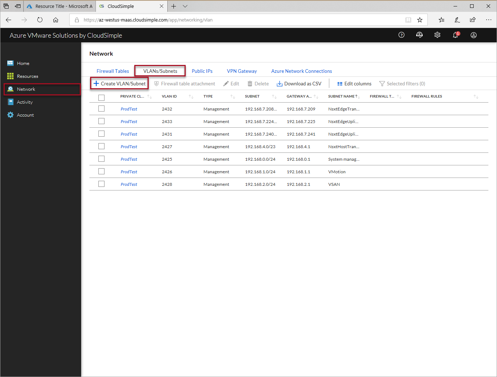
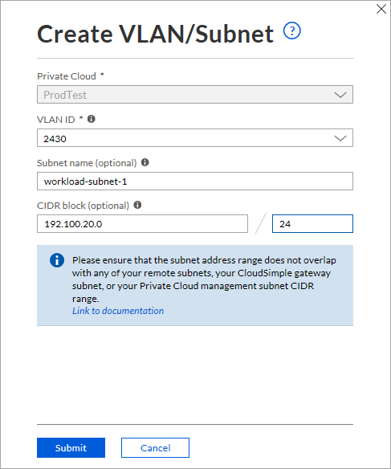
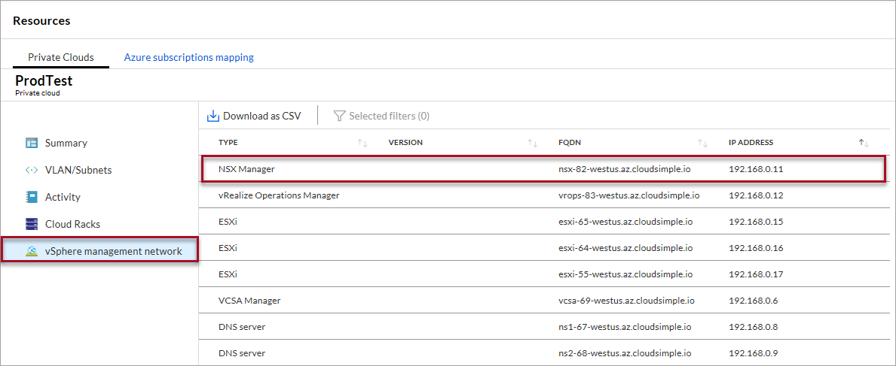

# Quickstart - Configure a private cloud environment

In this article, learn how to create a CloudSimple private cloud and set up your private cloud environment.

## Sign in to Azure
Sign in to the Azure portal at [https://portal.azure.com](https://portal.azure.com).

## Create a private cloud

1. Select **All services**.
2. Search for **CloudSimple Services**.
3. Select the CloudSimple service on which you want to create your Private Cloud.
4. From overview, click **Create Private Cloud** to open a new browser tab for CloudSimple portal.  If prompted, sign in with your Azure sign in credentials.  

    

5. In CloudSimple portal, provide a name for your Private Cloud
6. Select the **Location** of your Private Cloud
7. Select the **Node type** you provisioned on Azure.  You can choose the [CS28 or CS36 option](cloudsimple-node.md#vmware-solution-by-cloudsimple-nodes-sku). The latter option includes the maximum compute and memory capacity.
8. Specify the **Node count**.  Minimum three nodes are required to create a Private Cloud

    

9. Click **Next: Advanced options**.
10. Enter the CIDR range for vSphere/vSAN subnets. Make sure that the CIDR range doesn't overlap with any of your on-premises or other Azure subnets.

    

11. Select **Next: Review and create**.
12. Review the settings. If you need to change any settings, click **Previous**.
13. Click **Create**.

Private Cloud provisioning process will be started.  It may take upto two hours for the Private Cloud to be provisioned.

## Launch CloudSimple portal

You can access CloudSimple portal from Azure portal.  CloudSimple portal will be launched with your Azure sign in credentials using Single sign-on (SSO).  Accessing the CloudSimple portal requires you to authorize the **CloudSimple Service Authorization** application.  For more information on granting permissions, see [Consent to CloudSimple Service Authorization application](https://docs.azure.cloudsimple.com/access-cloudsimple-portal/#consent-to-cloudsimple-service-authorization-application)

1. Select **All services**.
2. Search for **CloudSimple Services**.
3. Select the CloudSimple service on which you want to create your Private Cloud.
4. From overview, click **Go to the CloudSimple portal** to open a new browser tab for CloudSimple portal.  If prompted, sign in with your Azure sign in credentials.  

    

## Create point-to-site VPN

A point-to-site VPN connection is the simplest way to connect to your Private Cloud from your computer. Use point-to-site VPN connection if you're connecting to the Private Cloud remotely.  For quick access to your Private Cloud, follow the steps below.  Access to CloudSimple region from your on-premises network can be done using [Site-to-Site VPN](https://docs.azure.cloudsimple.com/vpn-gateway/) or [Azure ExpressRoute](https://docs.azure.cloudsimple.com/on-premises-connection/).

### Create gateway

1. Launch CloudSimple portal and select **Network**.
2. Select **VPN Gateway**.
3. Click **New VPN Gateway**.

    

4. For **Gateway configuration**, specify the following settings and click **Next**.

    * Select **Point-to-Site VPN** as the gateway type.
    * Enter a name to identify the gateway.
    * Select the Azure location where your CloudSimple service is deployed.
    * Specify the client subnet for the point-to-site gateway.  DHCP addresses will be given from this subnet when you connect.

5. For **Connection/User**, specify the following settings and click **Next**.

    * To automatically allow all current and future users to access the Private Cloud through this point-to-site gateway, select **Automatically add all users**. When you select this option, all users in the User list are automatically selected. You can override the automatic option by deselecting individual users in the list.
    * To select only individual users, click the check boxes in the User list.

6. The VLANs/Subnets section allows you to specify management and user VLANs/subnets for the gateway and connections.

    * The **Automatically add** options set the global policy for this gateway. The settings apply to the current gateway. The settings can be overridden in the **Select** area.
    * Select **Add management VLANs/Subnets of Private Clouds**. 
    * To add all user-defined VLANs/subnets, click  **Add user-defined VLANs/Subnets**. 
    * The **Select** settings override the global settings under **Automatically add**. 

7. Click **Next** to review the settings. Click the Edit icons to make any changes.
8. Click **Create** to create the VPN gateway.

### Connect to CloudSimple using point-to-site VPN

VPN client is needed for connecting to CloudSimple from your computer.  Download [OpenVPN client](https://openvpn.net/community-downloads/) for Windows or [Viscosity](https://www.sparklabs.com/viscosity/download/) for macOS and OS X.

1. Launch CloudSimple portal and select **Network**.
2. Select **VPN Gateway**.
3. From the list of VPN gateways, click on the point-to-site VPN gateway.
4. Select **Users**.
5. Click on **Download my VPN configuration**

    

6. Import the configuration on your VPN client

    * Instructions for [importing configuration on Windows client](https://openvpn.net/vpn-server-resources/connecting-to-access-server-with-windows/#openvpn-open-source-openvpn-gui-program)
    * Instructions for [importing configuration on macOS or OS X](https://www.sparklabs.com/support/kb/article/getting-started-with-viscosity-mac/#creating-your-first-connection)

7. Connect to CloudSimple

## Create a VLAN for your workload VMs

After creating a private cloud, create a VLAN where you'll deploy your workload/application VMs.

1. In the CloudSimple Portal, select **Network**.
2. Click **VLAN/Subnets**.
3. Click **Create VLAN/Subnet**

    

4. Select the **Private Cloud** for the new VLAN/subnet.
5. Select a VLAN ID from the list.  
6. Enter a subnet name to identify the subnet.
7. Specify the subnet CIDR range and mask.  This range must not overlap with any existing subnets.
8. Click **Submit**.

    

The VLAN/subnet will be created.  You can now use this VLAN ID to create a distributed port group on your Private Cloud vCenter. 

## Connect your environment to an Azure virtual network

CloudSimple provides you with an ExpressRoute circuit for your private cloud. You can connect your virtual network on Azure to the ExpressRoute circuit. For full details on setting up the connection, follow the steps in [Azure Virtual Network Connection using ExpressRoute](https://docs.azure.cloudsimple.com/cloudsimple-azure-network-connection/)

## Sign in to vCenter

You can now sign in to vCenter to set up virtual machines and policies.

1. To access vCenter, start from the CloudSimple portal. On the Home page, under **Common Tasks**, click **Launch vSphere Client**.  Select the Private Cloud and then click **Launch vSphere Client** on the Private Cloud.

    

2. Select your preferred vSphere client to access vCenter and sign in with your username and password.  The defaults are:
    * User name: **CloudOwner@cloudsimple.local**
    * Password: **CloudSimple123!**  

The vCenter screens in the next procedures are from the vSphere (HTML5) client.

## Change your vCenter password

CloudSimple recommends that you change your password the first time you sign in to vCenter.  
The password you set must meet the following requirements:

* Maximum lifetime: Password must be changed every 365 days
* Restrict reuse: Users can't reuse any of the previous five passwords
* Length: 8 - 20 characters
* Special character: At least one special character
* Alphabetic characters: At least one uppercase character, A-Z, and at least one lowercase character, a-z
* Numbers: At least one numeric character, 0-9
* Maximum identical adjacent characters: Three

    Example: CC or CCC is acceptable as a part of the password, but CCCC isn't.

If you set a password that doesn't meet the requirements:

* if you use the vSphere Flash Client, it reports an error
* If you use the HTML5 client, it doesn't report an error. The client doesn't accept the change and the old password continues to work.

## Change NSX administrator password

NSX manager is deployed with a default password.  We recommend you change the password after you create your Private Cloud.

   * User name: **admin**
   * Password: **CloudSimple123!**

You can find the fully qualified domain name (FQDN) and IP address of NSX manager on CloudSimple portal.

1. Launch CloudSimple portal and select **Resources**.
2. Click on the Private Cloud, which you want to use.
3. Select **vSphere management network**
4. Use the FQDN or IP address of **NSX Manager** and connect using a web browser. 

    

To change the password, follow the instructions in [Manage a User's Password](https://docs.vmware.com/en/VMware-NSX-T-Data-Center/2.4/administration/GUID-DB31B304-66A5-4516-9E55-2712D12B4F27.html).

> [!WARNING]
> By default, the NSX administrator password expires after 90 days.

## Create a port group

To create a distributed port group in vSphere:

1. Follow the instructions in "Add a distributed port group," in the [vSphere Networking Guide](https://docs.vmware.com/en/VMware-vSphere/6.5/vsphere-esxi-vcenter-server-65-networking-guide.pdf).
2. When setting up the distributed port group, provide the VLAN ID created in [Create a VLAN for your Workload VMs](#create-a-vlan-for-your-workload-vms).

## Next steps

* [Consume VMware VMs on Azure](https://docs.azure.cloudsimple.com/quickstart-create-vmware-virtual-machine)
* [Consume VMware VMs on Azure](quickstart-create-vmware-virtual-machine.md)
* [Connect to on-premises network using Azure ExpressRoute](https://docs.azure.cloudsimple.com/on-premises-connection/)
* [Setup Site-to-Site VPN from on-premises](https://docs.azure.cloudsimple.com/vpn-gateway/)
