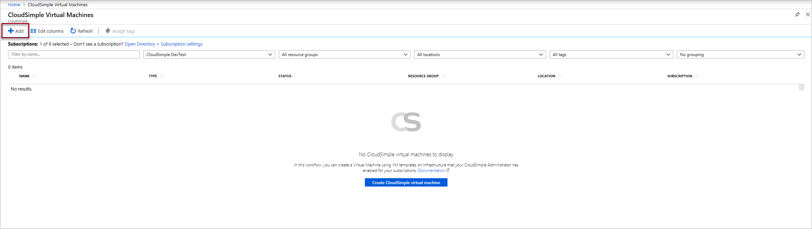
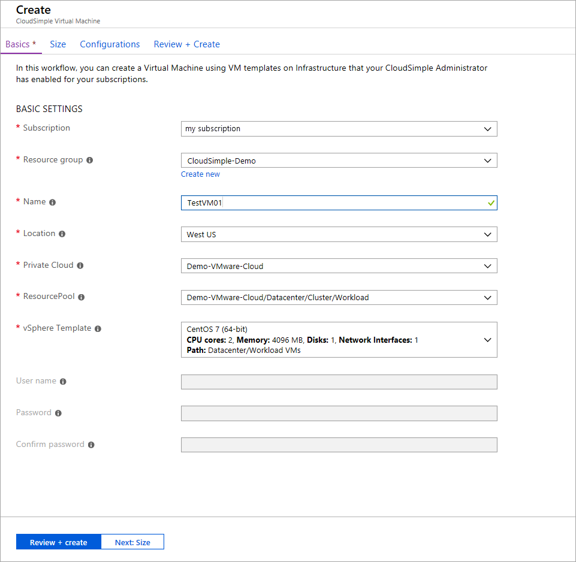
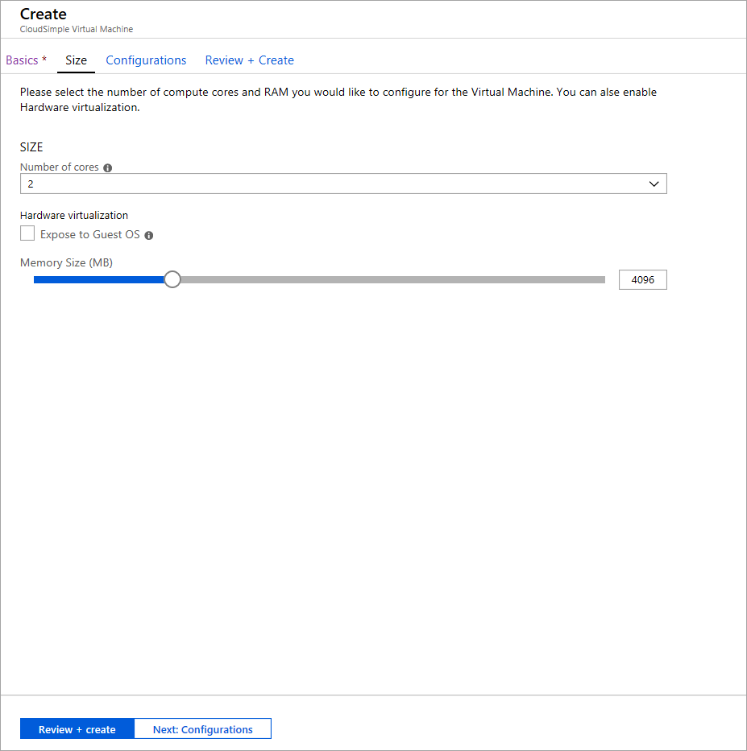
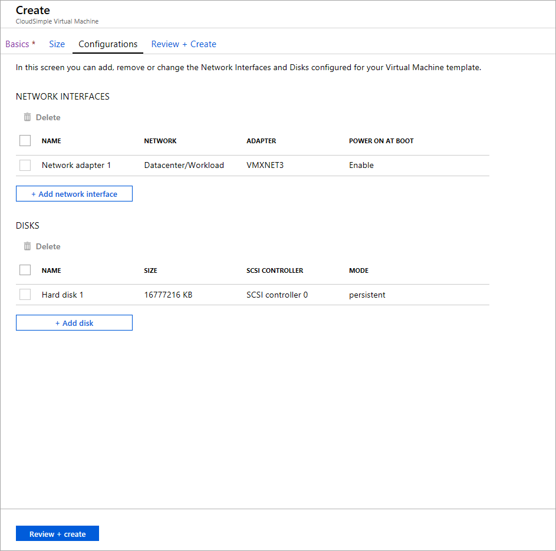
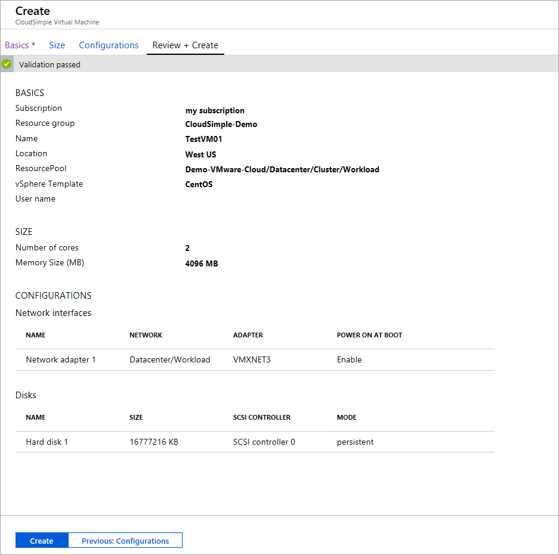

# Quickstart: Consume VMware VMs on Azure

To create a virtual machine in the Azure portal, you can use virtual machine templates available on your private cloud vCenter. A vCenter admin can create additional templates on the private cloud.

## Create a VM template

First, create a virtual machine on your private cloud by using the vCenter UI. To create a template, follow the instructions in the VMware article [Clone a Virtual Machine to a Template in the vSphere Web Client](https://docs.vmware.com/en/VMware-vSphere/6.7/com.vmware.vsphere.vm_admin.doc/GUID-FE6DE4DF-FAD0-4BB0-A1FD-AFE9A40F4BFE.html). Store the VM template on your private cloud vCenter.

## Create a virtual machine in the Azure portal

1. Select **All services**.

2. Search for **CloudSimple Virtual Machines**.

3. Select **Add**.

    

4. Enter the following information about the virtual machine and then select **Next: Size**.

    

    | Field | Description |
    | ------------ | ------------- |
    | **Subscription** | The Azure subscription associated with your private cloud.  |
    | **Resource group** | The resource group to which the VM will be assigned. You can select an existing group or create a new one. |
    | **Name** | A name to identify the VM.  |
    | **Location** | The Azure region in which the VM is hosted.  |
    | **Private Cloud** | The CloudSimple private cloud in which you want to create the VM. |
    | **ResourcePool** | A mapped resource pool for the VM. Select from the available resource pools. |
    | **vSphere Template** | The vSphere template for the VM.  |
    | **User name** | The user name of the VM admin (for Windows templates).|
    | **Password** |  The password of the VM admin (for Windows templates). |
    | **Confirm password** | The password provided in the previous field. |

5. Select the number of cores and the memory capacity for the VM. Select **Expose to Guest OS** if you want to expose the full CPU virtualization to the guest operating system. Applications that require hardware virtualization can run on virtual machines without binary translation or paravirtualization. For more information, see the VMware article <a href="https://docs.vmware.com/en/VMware-vSphere/6.5/com.vmware.vsphere.vm_admin.doc/GUID-2A98801C-68E8-47AF-99ED-00C63E4857F6.html" target="_blank">Expose VMware Hardware Assisted Virtualization</a>. When you're done, select **Next: Configurations**.

    

6. Configure network interfaces and disks as described in the following tables and then select **Review + create**.

    

    For network interfaces, select **Add network interface** and then configure the following settings:
    
    | Setting | Description |
    | ------------ | ------------- |
    | **Name** | Enter a name to identify the interface.  |
    | **Network** | Select from the list of configured distributed port groups in your private cloud vSphere.  |
    | **Adapter** | Select a vSphere adapter from the list of available types configured for the VM. For more information, see the VMware article <a href="https://kb.vmware.com/s/article/1001805" target="_blank">Choosing a network adapter for your virtual machine</a>. |
    | **Power on at Boot** | Choose whether to enable the NIC hardware when the VM is booted. The default is **Enable**. |

    For disks, select **Add disk** and then configure the following settings:

    | Setting | Description |
    | ------------ | ------------- |
    | **Name** | Enter a name to identify the disk.  |
    | **Size** | Select one of the available sizes.  |
    | **SCSI Controller** | Select a SCSI controller for the disk.  |
    | **Mode** | The mode specifies how the disk participates in snapshots. Choose one of these options:   **Independent persistent**: All changes written to the disk are written permanently.  **Independent non-persistent**: Changes written to the disk are discarded when you power off or reset the virtual machine. Independent non-persistent mode allows you to always restart the VM in the same state. For more information, see the <a href="https://docs.vmware.com/en/VMware-vSphere/6.5/com.vmware.vsphere.vm_admin.doc/GUID-8B6174E6-36A8-42DA-ACF7-0DA4D8C5B084.html" target="_blank">VMware documentation</a>.

7. After validation is finished, review the settings and select **Create**. To make changes, select the tabs at the top or select **Previous: Configurations**.

    

## Next steps

* [View list of CloudSimple virtual machines](https://docs.azure.cloudsimple.com/azure-create-vm/#view-list-of-cloudsimple-virtual-machines)
* [Manage CloudSimple virtual machines from Azure](https://docs.azure.cloudsimple.com/azure-manage-vm/)
