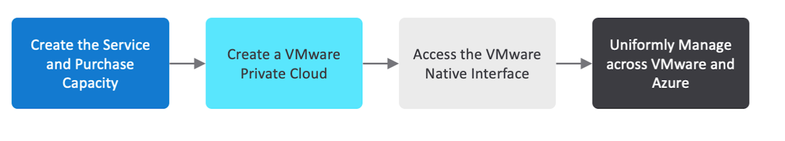

--- 
title: Quickstart at a glance 
description: Describes how to get started with Azure VMware Solution by CloudSimple  
author: sharaths-cs, sharaths-cs
ms.author: b-shsury 
ms.date: 4/2/19 
ms.topic: article 
ms.service: azure-vmware-cloudsimple 
ms.reviewer: cynthn 
manager: dikamath 
---
# Quickstart at a glance

To get started with Azure VMware Solution by CloudSimple, here are the steps:

For more information and instructions, see these topics:

* [Initialize and purchase capacity](quickstart-create-cloudsimple-service)
* [Configure a CloudSimple Private Cloud environment](quickstart-create-private-cloud)
* [Create VMware virtual machine on your Private Cloud](quickstart-create-private-cloud-vmware-virtual-machine)
* [Consume VMware VMs on Azure](quickstart-create-vmware-virtual-machine)