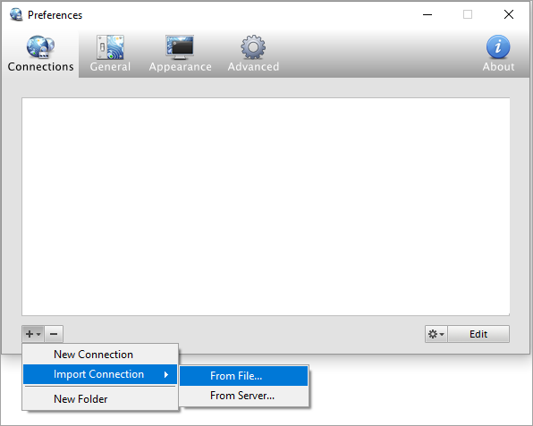
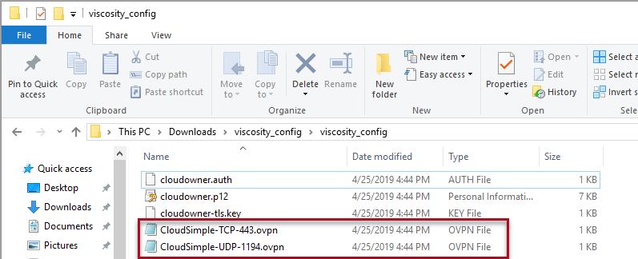
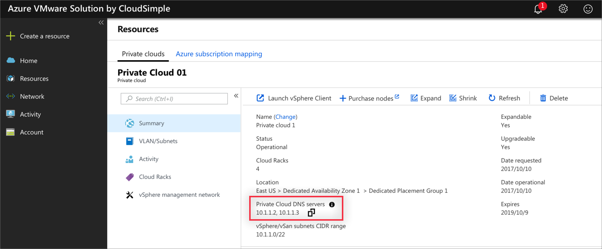
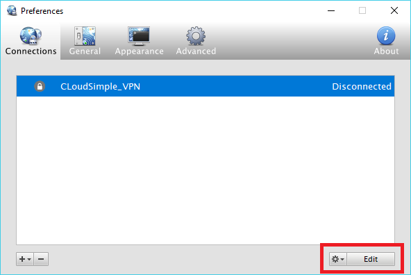
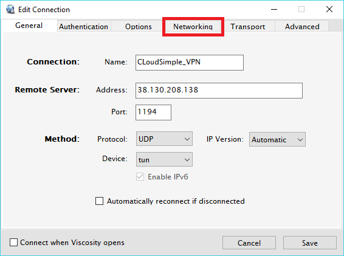
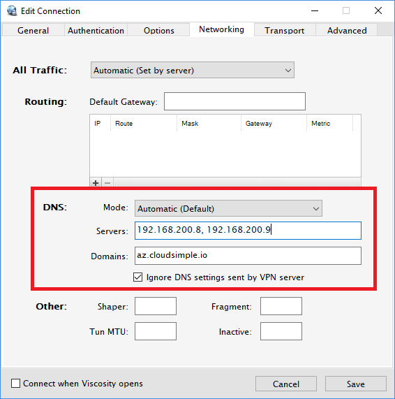

# Configure a VPN connection to your CloudSimple Private Cloud

VPN gateways allow you to connect to CloudSimple network from your on-premises network and from a client computer remotely.  In this article, you can find information on setting up VPN gateways from the CloudSimple portal.  A VPN connection between your on-premises network and your CloudSimple network provides access to the vCenter and workloads on your Private Cloud. CloudSimple supports both Point-to-Site VPN and Site-to-Site VPN gateways.

## VPN gateway types

* **Point-to-Site VPN** connection is the simplest way to connect to your Private Cloud from your computer. Use Point-to-Site VPN connectivity for connecting to the Private Cloud remotely.
* **Site-to-Site VPN** connection allows you to set up your Private Cloud workloads to access on-premises services. You can also use on-premises Active Directory as an identity source for authenticating to your Private Cloud vCenter.  Currently, **Policy-Based VPN** type is supported.

In a region, you can create one Site-to-Site VPN gateway and one Point-to-Site VPN gateway.

## Point-to-Site VPN

To create a Point-to-Site VPN gateway, see [Create Point-to-Site VPN gateway](vpn-gateway.md#create-point-to-site-vpn-gateway).

### Connect to CloudSimple using Point-to-Site VPN

VPN client is needed for connecting to CloudSimple from your computer.  Download [OpenVPN client](https://openvpn.net/community-downloads/) for Windows or [Viscosity](https://www.sparklabs.com/viscosity/download/) for macOS and OS X.

1. Launch CloudSimple portal and select **Network**.
2. Select **VPN Gateway**.
3. From the list of VPN gateways, click on the Point-to-Site VPN gateway.
4. Select **Users**.
5. Click on **Download my VPN configuration**

    

6. Import the configuration on your VPN client

    * Instructions for [importing configuration on Windows client](https://openvpn.net/vpn-server-resources/connecting-to-access-server-with-windows/#openvpn-open-source-openvpn-gui-program)
    * Instructions for [importing configuration on macOS or OS X](https://www.sparklabs.com/support/kb/article/getting-started-with-viscosity-mac/#creating-your-first-connection)

7. Connect to CloudSimple VPN gateway.

Example below shows importing connection using **Viscosity Client**.

#### Import connection on Viscosity client

1. Extract the contents of VPN configuration from downloaded .zip file.

2. Open Viscosity on your computer.

3. Click the **+** icon and select **Import connection** > **From File**.

    

4. Select the OpenVPN configuration file (.ovpn) for the protocol you want to use and click **Open**.

    

The connection now appears in the Viscosity menu.

#### Connect to the VPN

To connect to VPN using the Viscosity OpenVPN client, select the connection from the menu. The menu icon updates to indicate that the connection is established.


### Connecting to Multiple Private Clouds

A Point-to-Site VPN connection resolves the DNS names of the first Private Cloud that you create. When you want to access other Private Clouds, you must update the DNS server on your VPN client.

1. Launch [CloudSimple portal](access-cloudsimple-portal.md).

2. Navigate to **Resources** > **Private Clouds** and select the Private Cloud you want to connect to.

3. On the **Summary** page of the Private Cloud, copy the Private Cloud DNS server IP address under **Basic Info**.

    

4. Right-click the Viscosity icon in your computer's system tray and select **Preferences**.

    

5. Select the CloudSimple VPN connection.

    

6. Click **Edit** to change the connection properties.

    

7. Click the **Networking** tab and enter the Private Cloud DNS server IP addresses separated by a comma or space and the domain as ```cloudsimple.io```.  Select **Ignore DNS settings sent by VPN server**.

    

> [!IMPORTANT]
> To connect to your first Private Cloud, remove these settings and connect to the VPN server.

## Site-to-Site VPN

To create a Site-to-Site VPN gateway, see [Create Site-to-Site VPN gateway](vpn-gateway.md#set-up-a-site-to-site-vpn-gateway).  Site-to-Site VPN connection from your on-premises network to your Private Cloud provides these benefits.  

* Accessibility of your Private Cloud vCenter from any workstation in your on-premises network
* Use of your on-premises Active Directory as a vCenter identity source
* Convenient transfer of VM templates, ISOs, and other files from your on-premises resources to your Private Cloud vCenter
* Accessibility of workloads running on your Private Cloud from your on-premises network

To set up your on-premises VPN gateway in high-availability mode, see [Configure a high availability VPN connection](high-availability-vpn-connection.md).

> [!IMPORTANT]
>    1. Set TCP MSS Clamping at 1200 on your VPN device. Or if your VPN devices do not support MSS clamping, you can alternatively set the MTU on the tunnel interface to 1240 bytes instead.
> 2. After Site-to-Site VPN is set up, forward the DNS requests for *.cloudsimple.io to the Private Cloud DNS servers.  Follow the instructions in [On-Premises DNS Setup](on-premises-dns-setup.md).
