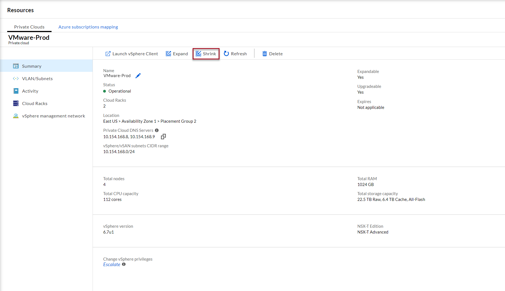
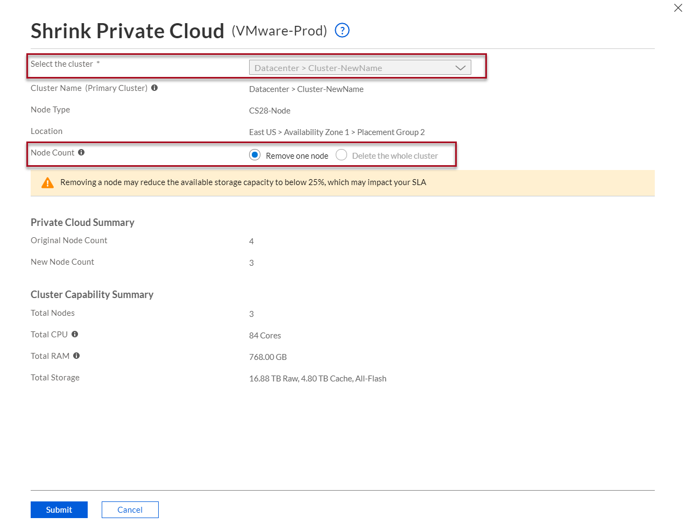

--- 
title: Shrink Azure VMware Solution by CloudSimple Private Cloud
description: Describes how to shrink a CloudSimple Private Cloud.
author: sharaths-cs 
ms.author: b-shsury 
ms.date: 07/01/2019 
ms.topic: article 
ms.service: azure-vmware-cloudsimple 
ms.reviewer: cynthn 
manager: dikamath 
---

# Shrink a CloudSimple Private Cloud

CloudSimple provides the flexibility to dynamically shrink a Private Cloud.  A Private Cloud consists of one or more vSphere clusters. Each cluster can have 3 to 16 nodes. When shrinking a Private Cloud, you remove a node from the existing cluster or delete an entire cluster. 

## Before you begin

Following conditions must be met for shrink of a Private Cloud.  Management cluster (first cluster) created when a Private Cloud was created cannot be deleted.

* A vSphere cluster must have three nodes.  A cluster with only three nodes cannot be shrunk.
* Total storage consumed should not exceed the total capacity after shrink of the cluster.
* Check if any Distributed Resource Scheduler (DRS) rules prevents vMotion of a virtual machine.  If rules are present, disable or delete the rules.  DRS rules include virtual machine to host affinity rules.

## Sign in to Azure

Sign in to the Azure portal at [https://portal.azure.com](https://portal.azure.com).

## Shrink a Private Cloud

1. [Access the CloudSimple portal](access-cloudsimple-portal.md).

2. Open the **Resources** page.

3. Click on the Private Cloud you want to shrink

4. On the summary page, click **Shrink**.

    

5. Select the cluster that you want to shrink or delete. 

    

6. Select **Remove one node** or **Delete the whole cluster**. 

7. Verify the cluster capacity

8. Click **Submit** to shrink the Private Cloud.

Shrink of the Private Cloud starts.  You can monitor the progress in tasks.  The shrink process can take a few hours depending on the data, which needs to be resynced on vSAN.

> [!NOTE]
> 1. If you shrink a private cloud by deleting the last or the only cluster in the datacenter, the datacenter will not be deleted.
> 2. If any DRS rule violation occurs, node will not be removed from the cluster and the task description shows that removing a node will violate DRS rules on the cluster.    

## Next steps

* [Consume VMware VMs on Azure](quickstart-create-vmware-virtual-machine.md)
* Learn more about [Private Clouds](cloudsimple-private-cloud.md)
