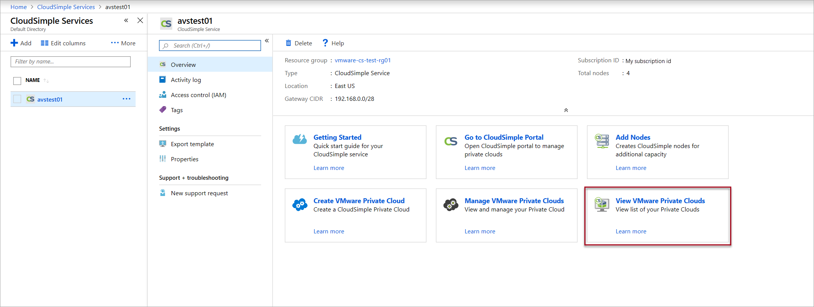
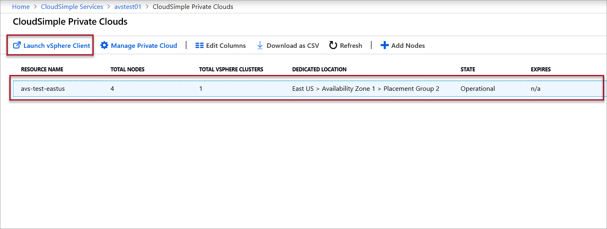
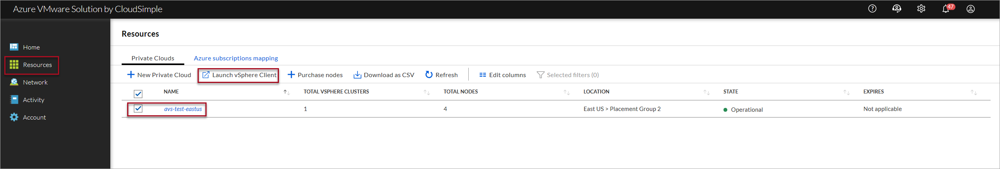
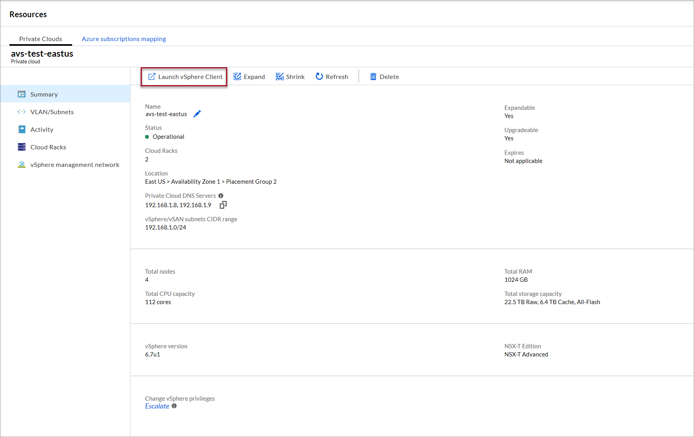

--- 
title: Azure VMware Solution by CloudSimple - Access vSphere client
description: Describes how to access vCenter of your Private Cloud.
author: Ajayan1008 
ms.author: v-hborys 
ms.date: 08/30/2019 
ms.topic: article 
ms.service: azure-vmware-cloudsimple 
ms.reviewer: cynthn 
manager: dikamath 
---

# Access your Private Cloud vCenter portal

You can launch your Private Cloud vCenter portal from Azure portal or CloudSimple portal.  vCenter portal allows you to manage VMware infrastructure on your Private Cloud.

## Before you begin

Network connection must be established and DNS name resolution must be enabled for accessing vCenter portal.  You can establish network connection to your Private Cloud using any of the options below.

* [Connect from on-premises to CloudSimple using ExpressRoute](on-premises-connection.md)
* [Configure a VPN connection to your CloudSimple Private Cloud](set-up-vpn.md)

To set up DNS name resolution of your Private Cloud VMware infrastructure components, see [Configure DNS for name resolution for Private Cloud vCenter access from on-premises workstations](on-premises-dns-setup.md)

## Sign in to Azure

Sign in to the Azure portal at [https://portal.azure.com](https://portal.azure.com).

## Access vCenter from Azure portal

You can launch vCenter portal of your Private Cloud from Azure portal.

1. Select **All services**.

2. Search for **CloudSimple Services**.

3. Select the CloudSimple service of your Private Cloud to which you want to connect.

4. On the **Overview** page, click **View VMware Private Clouds**

    

5. Select the Private Cloud from the list of Private Clouds and click **Launch vSphere Client**.

    

## Access vCenter from CloudSimple portal

You can launch vCenter portal of your Private Cloud from CloudSimple portal.

1. Access your [CloudSimple portal](access-cloudsimple-portal.md).

2. From the **Resources** select the Private Cloud, which you want to access and click on **Launch vSphere Client**.

    

3. You can also launch the vCenter portal from summary screen of your Private Cloud.

    

## Next steps

* [Create and manage VLANs/subnets for your Private Clouds](create-vlan-subnet.md)
* [CloudSimple Private Cloud permission model of VMware vCenter](learn-private-cloud-permissions.md)