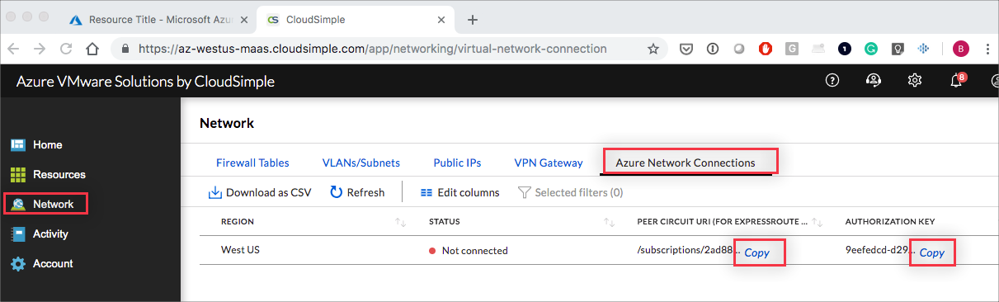

--- 
title: Connect Azure virtual network to CloudSimple using ExpressRoute
description: Describes how to obtain peering information for a connection between the Azure virtual network and your CloudSimple environment
author: sharaths-cs
ms.author: b-shsury 
ms.date: 08/14/2019 
ms.topic: article 
ms.service: azure-vmware-cloudsimple 
ms.reviewer: cynthn 
manager: dikamath 
---

# Connect Azure virtual network to CloudSimple using ExpressRoute

You can extend your Private Cloud network to your Azure virtual network and Azure resources. An ExpressRoute connection allows you to access resources running in your Azure subscription from your Private Cloud.

## Request authorization key

An authorization key is required for the ExpressRoute connection between your Private Cloud and the Azure virtual network. To obtain a key, file a ticket with <a href="https://portal.azure.com/#blade/Microsoft_Azure_Support/HelpAndSupportBlade/newsupportrequest" target="_blank">Support</a>.  Use the following information in the request:

* Issue type: **Technical**
* Subscription: **Select the subscription where CloudSimple service is deployed**
* Service: **VMware Solution by CloudSimple**
* Problem type: **Service request**
* Problem subtype: **Authorization key for Azure VNET connection**
* Subject: **Request for authorization key for Azure VNET connection**

## Obtain peering information for Azure virtual network to CloudSimple connection

To set up the connection, you must establish a link between Azure virtual network and your CloudSimple environment.  As part of the procedure, you must supply the peer circuit URI and authorization key. Obtain the URI and authorization key from [CloudSimple portal](access-cloudsimple-portal.md).  Select **Network** on the side menu, and then select **Azure Network Connection**. Or select **Account** on the side menu and then select **Azure network connection**.

Notice the copy icons for peer circuit URI and for the authorization key for each of the regions. For each Private Cloud you want to connect:

* Click **Copy** to copy the URI. Paste it into a file where it can be available to add to the Azure portal.  
* Click **Copy** to copy the authorization key and paste it into the file as well.

For details on setting up the Azure virtual network to CloudSimple link, see [Connect your CloudSimple Private Cloud environment to the Azure virtual network using ExpressRoute](azure-expressroute-connection.md).
