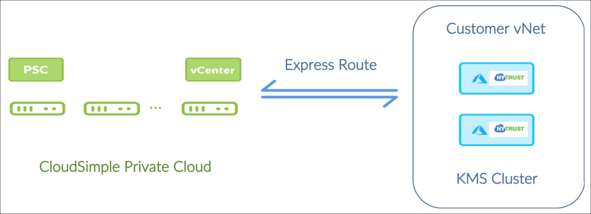
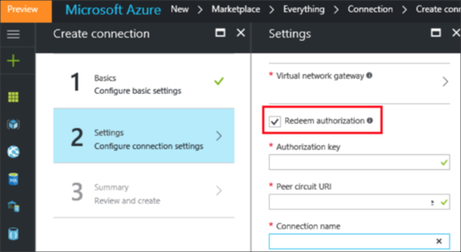
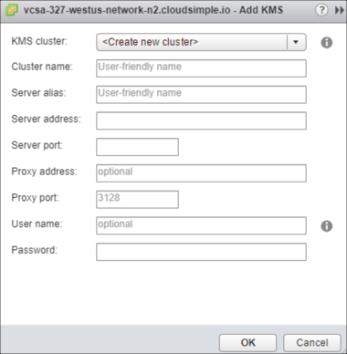
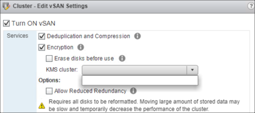

--- 
title: Azure VMware Solution by CloudSimple - Configure vSAN encryption for Private Cloud
description: Describes how to configure vSAN software encryption feature so your CloudSimple Private Cloud can work with a key management server running in your Azure virtual network.
author: shortpatti 
ms.author: v-patsho
ms.date: 08/19/2019 
ms.topic: article 
ms.service: azure-vmware-cloudsimple 
ms.reviewer: cynthn 
manager: dikamath 
---
# Configure vSAN encryption for CloudSimple Private Cloud

You can configure the vSAN software encryption feature so your CloudSimple Private Cloud can work with a key management server running in your Azure virtual network.

VMware requires use of an external KMIP 1.1 compliant third-party key management server (KMS) tool when using vSAN encryption. You can leverage any supported KMS that is certified by VMware and is available for Azure.

This guide describes how to use HyTrust KeyControl KMS running in an Azure virtual network. A similar approach can be used for any other certified third-party KMS solution for vSAN.

This KMS solution requires you to:

* Install, configure, and manage a VMware certified third-party KMS tool in your Azure virtual network.
* Provide your own licenses for the KMS tool.
* Configure and manage vSAN encryption in your Private Cloud using the third-party KMS tool running in your Azure virtual network.

## KMS deployment scenario

The KMS server cluster runs in your Azure virtual network and is IP reachable from the Private Cloud vCenter over the configured Azure ExpressRoute connection.

## How to deploy the solution

The deployment process has the following steps:

1. [Verify that prerequisites are met](#verify-prerequisites-are-met)
2. [CloudSimple portal: Obtain ExpressRoute Peering Information](#cloudsimple-portal-obtain-expressroute-peering-information)
3. [Azure portal: Connect your virtual network to the Private Cloud](#azure-portal-connect-your-virtual-network-to-your-private-cloud)
4. [Azure portal: Deploy a HyTrust KeyControl Cluster in your virtual network](#azure-portal-deploy-a-hytrust-keycontrol-cluster-in-the-azure-resource-manager-in-your-virtual-network)
5. [HyTrust WebUI: Configure KMIP server](#hytrust-webui-configure-the-kmip-server)
6. [vCenter UI: Configure vSAN encryption to use KMS cluster in your Azure virtual network](#vcenter-ui-configure-vsan-encryption-to-use-kms-cluster-in-your-azure-virtual-network)

### Verify prerequisites are met

Verify the following prior to deployment:

* The selected KMS vendor, tool, and version are on the vSAN compatibility list.
* The selected vendor supports a version of the tool to run in Azure.
* The Azure version of the KMS tool is KMIP 1.1 compliant.
* An Azure Resource Manager and a virtual network are already created.
* A CloudSimple Private Cloud is already created.

### CloudSimple portal: Obtain ExpressRoute peering information

To continue the setup, you need the authorization key and peer circuit URI for ExpressRoute plus access to your Azure Subscription. This information is available on the Virtual Network Connection page in the CloudSimple portal. For instructions, see [Set up a virtual network connection to the Private Cloud](virtual-network-connection.md). If you have any trouble obtaining the information, open a [support request](https://portal.azure.com/#blade/Microsoft_Azure_Support/HelpAndSupportBlade/newsupportrequest).

### Azure portal: Connect your virtual network to your Private Cloud

1. Create a virtual network gateway for your virtual network by following the instructions in [Configure a virtual network gateway for ExpressRoute using the Azure portal](../expressroute/expressroute-howto-add-gateway-portal-resource-manager.md).
2. Link your virtual network to the CloudSimple ExpressRoute circuit by following the instructions in [Connect a virtual network to an ExpressRoute circuit using the portal](../expressroute/expressroute-howto-linkvnet-portal-resource-manager.md).
3. Use the CloudSimple ExpressRoute circuit information received in your welcome email from CloudSimple to link your virtual network to the CloudSimple ExpressRoute circuit in Azure.
4. Enter the authorization key and peer circuit URI, give the connection a name, and click **OK**.

 

### Azure portal: Deploy a HyTrust KeyControl cluster in the Azure Resource Manager in your virtual network

To deploy a HyTrust KeyControl cluster in the Azure Resource Manager in your virtual network, perform the following tasks. See the [HyTrust documentation](https://docs.hytrust.com/DataControl/Admin_Guide-4.0/Default.htm#OLH-Files/Azure.htm%3FTocPath%3DHyTrust%2520DataControl%2520and%2520Microsoft%2520Azure%7C_____0) for details.

1. Create an Azure network security group (nsg-hytrust) with specified inbound rules by following the instructions in the HyTrust documentation.
2. Generate an SSH key pair in Azure.
3. Deploy the initial KeyControl node from the image in Azure Marketplace.  Use the public key of the key pair that was generated and select **nsg-hytrust** as the network security group for the KeyControl node.
4. Convert the private IP address of KeyControl to a static IP address.
5. SSH to the KeyControl VM using its public IP address and the private key of the previously mentioned key pair.
6. When prompted in the SSH shell, select `No` to set the node as the initial KeyControl node.
7. Add additional KeyControl nodes by repeating steps 3-5 of this procedure and selecting `Yes` when prompted about adding to an existing cluster.

### HyTrust WebUI: Configure the KMIP server

Go to https://*public-ip*, where *public-ip* is the public IP address of the KeyControl node VM. Follow these steps from the [HyTrust documentation](https://docs.hytrust.com/DataControl/Admin_Guide-4.0/Default.htm#OLH-Files/Azure.htm%3FTocPath%3DHyTrust%2520DataControl%2520and%2520Microsoft%2520Azure%7C_____0).

1. [Configuring a KMIP server](https://docs.hytrust.com/DataControl/4.2/Admin_Guide-4.2/index.htm#Books/VMware-vSphere-VSAN-Encryption/configuring-kmip-server.htm%3FTocPath%3DHyTrust%2520KeyControl%2520with%2520VSAN%25C2%25A0and%2520VMware%2520vSphere%2520VM%2520Encryption%7C_____2)
2. [Creating a Certificate Bundle for VMware Encryption](https://docs.hytrust.com/DataControl/4.2/Admin_Guide-4.2/index.htm#Books/VMware-vSphere-VSAN-Encryption/creating-user-for-vmcrypt.htm%3FTocPath%3DHyTrust%2520KeyControl%2520with%2520VSAN%25C2%25A0and%2520VMware%2520vSphere%2520VM%2520Encryption%7C_____3)

### vCenter UI: Configure vSAN encryption to use KMS cluster in your Azure virtual network

Follow the HyTrust instructions to [Create a KMS cluster in vCenter](https://docs.hytrust.com/DataControl/4.2/Admin_Guide-4.2/index.htm#Books/VMware-vSphere-VSAN-Encryption/creating-KMS-Cluster.htm%3FTocPath%3DHyTrust%2520KeyControl%2520with%2520VSAN%25C2%25A0and%2520VMware%2520vSphere%2520VM%2520Encryption%7C_____4).

In vCenter, go to **Cluster > Configure** and select **General** option for vSAN. Enable encryption and select the KMS cluster that was previously added to vCenter.

## References

### Azure

[Configure a virtual network gateway for ExpressRoute using the Azure portal](../expressroute/expressroute-howto-add-gateway-portal-resource-manager.md)

[Connect a virtual network to an ExpressRoute circuit using the portal](../expressroute/expressroute-howto-linkvnet-portal-resource-manager.md)

### HyTrust

[HyTrust DataControl and Microsoft Azure](https://docs.hytrust.com/DataControl/Admin_Guide-4.0/Default.htm#OLH-Files/Azure.htm%3FTocPath%3DHyTrust%2520DataControl%2520and%2520Microsoft%2520Azure%7C_____0)

[Configuring a KMPI Server](https://docs.hytrust.com/DataControl/4.2/Admin_Guide-4.2/index.htm#Books/VMware-vSphere-VSAN-Encryption/configuring-kmip-server.htm%3FTocPath%3DHyTrust%2520KeyControl%2520with%2520VSAN%25C2%25A0and%2520VMware%2520vSphere%2520VM%2520Encryption%7C_____2)

[Creating a Certificate Bundle for VMware Encryption](https://docs.hytrust.com/DataControl/4.2/Admin_Guide-4.2/index.htm#Books/VMware-vSphere-VSAN-Encryption/creating-user-for-vmcrypt.htm%3FTocPath%3DHyTrust%2520KeyControl%2520with%2520VSAN%25C2%25A0and%2520VMware%2520vSphere%2520VM%2520Encryption%7C_____3)

[Creating the KMS Cluster in vSphere](https://docs.hytrust.com/DataControl/4.2/Admin_Guide-4.2/index.htm#Books/VMware-vSphere-VSAN-Encryption/creating-KMS-Cluster.htm%3FTocPath%3DHyTrust%2520KeyControl%2520with%2520VSAN%25C2%25A0and%2520VMware%2520vSphere%2520VM%2520Encryption%7C_____4)
