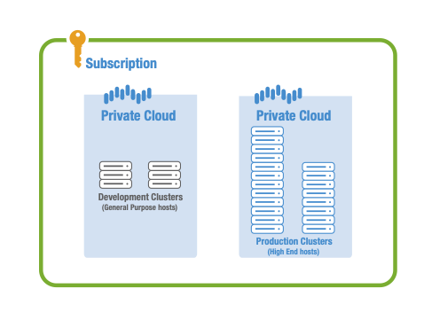

# VMware Solution on Azure by Virtustream Private Cloud and vSphere Cluster Concepts

The Azure VMware Solution by Virtustream (AVS by Virtustream) delivers VMware-based private clouds in Azure. The private clouds are built from clusters of dedicated bare-metal hosts and are deployed and managed through the Azure portal. Clusters in private clouds are provisioned with VMware vSphere, vCenter, vSAN and NSX software. The deployment of the hardware and software in AVSV private clouds is fully integrated and automated in Azure.

Figure 1 depicts the logical relationship between subscriptions, private clouds, cluster and hosts. In the diagram, there are two private clouds in a single Azure subscription. The private clouds represent a development and production environments, each with their own private cloud. In each of those private clouds their are two clusters, with cluster sizes in the development environment smaller than in the production environment. To illustrate lower potential needs of a development environment, lower capacity hosts are used in that environment. All of these concepts are desribed in the sections below.

Private cloud interconnectivity and networking concepts are described in detail in the [Interconnectivity and Networking Concepts article][concepts-networking].

## Private Clouds

AVS by Virtustream private clouds contain vSAN clusters that are built with dedicated, bare-metal hosts in Azure. Each private cloud can have multiple clusters, all controlled by the same vCenter server and NSX-T manager. You deploy and manage private clouds in the portal, from the CLI, or with PowerShell. As with other resources, private clouds are installed and managed from within an Azure subscription. 

Private clouds are scalable within a subscription, and for an initial period of time following general availability of the service, there is a limit of two private clouds per subscription.

## Clusters

Private clouds contain at least one vSAN cluster, with all clusters created, deleted, or scaled in the Azure portal or through the API. All clusters except trial clusters can be scaled from 3 to 16 hosts, with a default size of four hosts. The type of hosts used in a cluster must be the same type, and subsequent scaling will always add that host type. The hosts types are described in the next section.

Trial clusters are available for evaluation and they are limited to three hosts and a single trial cluster per private cloud. New clusters can be added to a private cloud that contains a trial cluster, but trial clusters can't be scaled or operated beyond an evaluation period.

While clusters are created, deleted, and scaled through the portal or API, vSphere and NSX-T Manager are used to manage most other aspects of cluster configuration or operation. All local storage of each host in a cluster is under control of vSAN.

## Hosts

Hyper-converged, bare-metal infrastructure nodes are used AVS by Virtustream private cloud clusters. There are two types of hosts and clusters are built using only one type of host. You select the type of hosts when creating a private cloud or adding a cluster to a private cloud.

The RAM, CPU and disk capacity differences between the host types is provided in the table below. Multiple types of hosts provide you with the flexibility to match hosts and cluster specifications to workload and business requirements.

| Host Type              |             CPU             |   RAM (GB)   |  vSAN NVMe cache Tier (TB, raw)  |  vSAN SSD capacity tier (TB, raw)  |
| :---                   |            :---:            |    :---:     |               :---:              |                :---:               |
| High-End (HE)          |  dual Intel 18 core 2.3GHz  |     576      |                3.2               |                15.20               |
| General Purpose (GP)   |  dual Intel 10 core 2.2GHz  |     192      |                3.2               |                 7.68               |

Hosts that are used to build or scale clusters are allocated from an isolated pool of hosts that have passed hardware tests and have had all data securely deleted from the flash disks. If a hosts needs to be removed from a cluster for any reason, it is removed, the disk are erased and the host is then tested and powered off. When a host is added to a new or existing cluster, it is powered on, ESXi is installed, and the host is then added to a cluster.

## VMware software versions

The current software versions of the VMware software used in AVS by Virtustream private cloud clusters are:

| Software              |    Version   |
| :---                  |     :---:    |
| VCSA / vSphere / ESXi |    6.7 U2    | 
| ESXi                  |    6.7 U2    | 
| vSAN                  |    6.7 U2    |
| NSX-T                 |      2.3     |

For any new cluster in a private cloud, the version of software will match what is currently running in the private cloud -- consistency across the private cloud. For any new private cloud in a customer subscription, the latest version of the software stack is installed -- potential inconsistency across private clouds in a subscription.

The general upgrade policies and processes for the AVS by Virtustream platform software is described in the [Upgrade Concepts section][concepts-upgrades].

## Host maintenance and lifecycle management

Host maintenance and lifecycle management are a key aspect of the AVS by Virtustream service, and they are performed without impact on the capacity or performance of private cloud clusters. This is achieved by first adding a host to a cluster and then performing a rolling upgrade or a maintenance action. Examples of automated host maintenance includes firmware upgrades or hardware repair or replacement.

## Backup and restoration

Private cloud vCenter and NSX-T configurations are backed up hourly, including NSX-T manager and controllers. The retention time for backups is three days, with restoration from backups performed through a Service Request, submitted in the Portal.

## Next steps

> [!div class="nextstepaction"]
> [You now have an understanding of private clouds, clusters, and hosts, and you can about networking and interconnectivity concepts next ][concepts-networking]

<!-- LINKS - internal -->
[concepts-networking]: ./concepts-networking.md

<!-- LINKS - external-->
[VCSA versions]: https://kb.vmware.com/s/article/2143838
[ESXi versions]: https://kb.vmware.com/s/article/2143832
[vSAN versions]: https://kb.vmware.com/s/article/2150753

