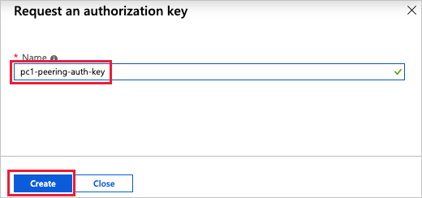

# Tutorial: Access an Azure VMware Solution by Virtustream private cloud

In this tutorial, you request and use an authorization key and resource IDs to create ExpressRoute connections and peer circuits with Global Reach. You then use the new connections to access vCenter in a private cloud from a VNet created in the [create VNet resources tutorial](tutorials-create-vnet-resources.md). Using this tutorial, you learn how to:

> [!div class="checklist"]
> * Request an ExpressRoute authorization key
> * Use the authorization key and resource IDs for ExpressRoute peering
> * Access a private cloud vCenter from a VNet in Azure

## Prerequisites

Prerequisites:
- A private cloud 
- A VNet with an ExpressRoute gateway 

## Request an ExpressRoute authorization key and resource ID

From the overview of your private cloud in the Azure portal, select **Connectivity > ExpressRoute > + Request an authorization key**.

Enter a name for the key and select **Create**.

You now have an authorization key that you can use with an ExpressRoute ID or a private peering ID. You use the ExpressRoute ID to connect a VNet to an ER circuit, and you use the private peering ID to peer two ExpressRoute circuits with Global Reach.

## Use the authorization key and resource ID to connect an ExpressRoute gateway

Select the ExpressRoute gateway in the VNet you created in the [create VNet resources tutorial](tutorials-create-vnet-resources.md). Select **Connection > + Add**, and enter the required details in the form and select **OK**. You will use the **ExpressRoute ID** from the private cloud **Connectivity > ExpressRoute > ExpressRoute ID** and the **Authorization key**.

You now have an ExpressRoute connection to the private cloud from an ExpressRoute gateway in your VNet.

## Connect to vCenter from the Windows VM in your VNet

Sign in to the Azure portal and follow [these instructions][connect-login-azure-vm] to connect to the Windows VM you created in the [create VNet resources tutorial](tutorials-create-vnet-resources.md).

In the Azure portal, select your private cloud and then in the **Overview** view, select **Identity > Default**. The URLs and login credentials for private cloud vCenter and NSX-T manager are displayed.

In the Windows VM, open a browser and navigate to the vCenter and NSX-T Manger URLs in two tabs. In the vCenter tab, enter the "cloudadmin@vmcp.local" user credentials from the previous step.

In the second tab of the browser, sign in to NSX-T manager.

## Create Global Reach peering between on-premises and a private cloud ER circuits

You use the procedures in this section to peer an ExpressRoute circuit from on-premises to the ER circuit of the private cloud. See the [networking concepts article](concepts-networking.md) for more details on this option.

To establish ExpressRoute Global Reach, you will use the **Authorization key** and the **Private peering ID**. This information is available from the private cloud **Overview > Connectivity > ExpressRoute > ExpressRoute**.

You'll use the instruction in [configure ExpressRoute Global Reach by using the Azure CLI][enable Global Reach] documentation to enable the peering. In those instructions, you'll work from the perspective of "Circuit 1".

You now have an on-premises to private cloud ExpressRoute Global Reach connection. You can connect from on-premises to vCenter and NSX Manager in your private cloud over the ExpressRoute Global Reach connection.

## Next steps

[Create an NSX-T T1 router and logical switch in your private cloud.](tutorials-create-t1-ls.md)

<!-- LINKS - external-->
[resource provider]: https://docs.microsoft.com/azure/azure-resource-manager/resource-manager-supported-services
[enable Global Reach]: https://docs.microsoft.com/azure/expressroute/expressroute-howto-set-global-reach-cli#enable-connectivity-between-expressroute-circuits-in-different-azure-subscriptions
[connect-login-azure-vm]: https://docs.microsoft.com/azure/virtual-machines/windows/connect-logon

<!-- LINKS - internal -->
